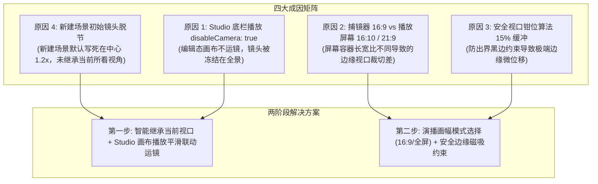

# FocusFlow 摄像机捕镜器与播放视口范围对齐技术规格书

> **文档版本**: 1.0.0  
> **状态**: 实施中 (Step 1 落地中)  
> **所属模块**: `@focusflow/studio` & `@focusflow/player`

---

## 1. 现状问题背景

在 FocusFlow Studio 设计阶段，创作者在画布上可以通过青色取景框（**捕镜器 / `CameraFrustumFrame`**）标定当前场景的摄像机运镜范围（`zoom`, `x`, `y`）。但在实际播放时（无论是底栏播放还是受众演播模式），创作者观察到**播放时看到的场景画面范围与设计阶段捕镜器的框选范围存在明显不一致**。

经过底层几何变换公式、状态机链路以及渲染容器架构的系统排查，我们定位到引发该差异的 **4 大核心技术成因**。

---

## 2. 四大核心成因深度剖析



### 原因 1：Studio 编辑态播放未启用摄像机运镜（`disableCamera: true`）
- **底层机理**：
  在 Studio 工作台中，底层 `FocusFlowPlayer` 容器被显式设置了 `disableCamera: true`。其初衷是为了保护创作者在 `InfiniteCanvas`（无限画布）上的自由缩放和标定操作，防止播放时摄像机 3D 变换强行篡改 DOM 矩阵。
- **视觉割裂**：
  创作者在底栏点击「▶ 播放」时，取景框图层自动隐藏，但**画布整体镜头一动不动**，画面停留在创作者当前手动放置的视角上，导致创作者误以为场景 3 的镜头参数未生效。真正的镜头推拉仅发生在顶部「🎬 演播 (AudienceModal)」模式中。

### 原因 2：捕镜器固定 16:9 vs 受众窗口多比例屏幕裁切
- **底层机理**：
  - 捕镜器的宽高计算公式为：
    $$\text{frameWidth} = \frac{\text{naturalWidth}}{\text{zoom}}, \quad \text{frameHeight} = \frac{\text{naturalHeight}}{\text{zoom}}$$
    底图分辨率为 $5120 \times 2880$（标准 16:9），因此**捕镜器的青色框永远是严格的 16:9 矩形**；
  - 但在播放态（全屏演播），观众的屏幕常见为 **16:10**（如 MacBook 常见的 1512×982、1440×900）或 **21:9 超宽带鱼屏**；
  - 播放器内核的外层剪切容器（`.focusflow-stage`）以屏幕分辨率进行 `overflow: hidden` 裁切。当 `scale(zoom)` 放大时，上下或左右方向会比 16:9 的捕镜器多暴露或少暴露 **10% ~ 15% 的画面视野**。

### 原因 3：安全视口约束算法（Safe Viewport Bounds Clamping）的 15% 缓冲
- **底层机理**：
  播放内核为了防止镜头大幅位移导致底图完全滑出视野变成大片纯黑背景，设置了安全视口钳位：
  $$|\text{Tx}|, |\text{Ty}| \le \frac{Z - 1}{2Z} \times 100\% \times 1.15$$
  如果场景 3 的镜头中心设置在底图极限边缘，播放态会自动受到 1.15 缓冲系数的钳位拉回，导致实际播放聚焦中心与极端边缘的取景框中心产生微小位移。

### 原因 4：新建场景默认参数写死为全局中心，与创作者当前视野脱节
- **底层机理**：
  创作者在时间轴点击 `+` 新建场景 3 时，`addScene()` 默认写死了：
  $$\text{camera}: \{ \text{zoom}: 1.2, \ x: 0, \ y: 0 \}$$
  如果创作者在画布上放大精细查看某个微服务节点时随手新建场景，新场景并未自动记录创作者眼前所见，而是悄悄重置回了底图中央。创作者必须额外找到顶部「捕获当前视口」按钮手动点击，否则镜头就会与心理预期严重脱节。

---

## 3. 落地演进路线图

### 第一步：优先落地（原因 4 + 原因 1）

#### 3.1 解决原因 4：新建场景智能继承当前视口（Smart Viewport Inheritance）
1. **逆解变换公式**：
   在用户点击「添加场景 / 插入场景」时，从 `InfiniteCanvas` 实时提取当前缩放与平移变换矩阵（`transform`）及容器几何（`containerRect`）：
   ```typescript
   const currentCamera = captureCanvasToCamera(
     canvasTransformRef.current,
     containerRectRef.current,
     dsl.meta.viewport.width,
     dsl.meta.viewport.height,
     1.2
   );
   addScene(currentCamera);
   ```
2. **效果**：创作者眼前看的是什么局部，新创建的场景 3 镜头就**百分之百定格在什么局部**，捕镜器直接呈现在视野中央。

#### 3.2 解决原因 1：Studio 画布播放时平滑协同运镜（In-Studio Canvas Kinematics）
1. **平滑飞越算法 (`flyToCamera`)**：
   通过数学反推算法，将场景镜头参数 `camera = { zoom, x, y }` 精准反解为 `InfiniteCanvas` 的物理变换坐标：
   $$\text{baseScale} = \min\left(\frac{\text{containerW}}{\text{natW}}, \frac{\text{containerH}}{\text{natH}}\right)$$
   $$\text{targetScale} = \text{baseScale} \times \text{zoom}$$
   $$\text{targetX} = \frac{\text{containerW}}{2} - \left(\frac{\text{natW}}{2} + \frac{x}{100} \times \text{natW}\right) \times \text{targetScale}$$
   $$\text{targetY} = \frac{\text{containerH}}{2} - \left(\frac{\text{natH}}{2} + \frac{y}{100} \times \text{natH}\right) \times \text{targetScale}$$
2. **动静分离渲染**：
   - 当 `isPlaying === true` 时，`InfiniteCanvas` 启用 GPU 平滑缓动过渡（`cubic-bezier(0.4, 0.0, 0.2, 1.0)`），镜头自动跟随机位运镜平移推拉；
   - 当 `isPlaying === false` 时，恢复零延迟物理响应（无 CSS transition 滞后），确保鼠标手势、按键平移与标定绘制 60fps 丝滑响应。

---

### 第二步：后续演进（原因 2 + 原因 3）

1. **解决原因 2：标准画幅模式与演示安全区（Action Safe Area）**：
   - 在右侧摄像机属性栏增加【演播画幅】选项（`16:9 标准投影` vs `全屏自适应`）；
   - 在捕镜器内部叠加微弱的 90% 演示安全虚线框，引导创作者避免将核心图元贴死在边缘。
2. **解决原因 3：安全视口边缘智能磁吸（Snap to Safe Margin）**：
   - 捕镜器在拖拽与四角拉伸至极限边缘时，触发吸附制导，禁止取景框超出安全底图可视域。
