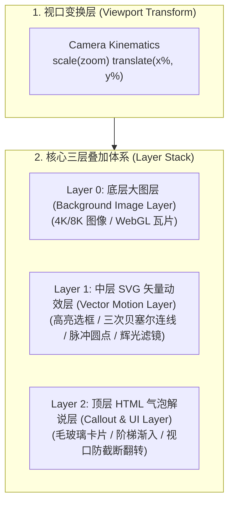
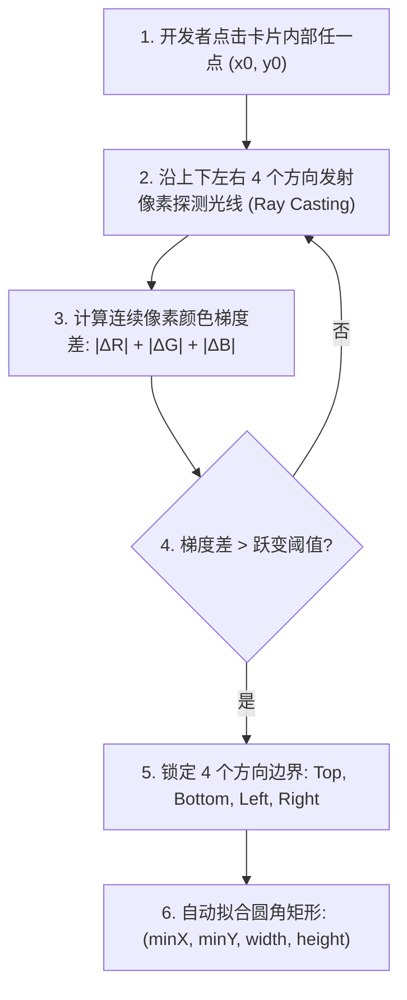

# FocusFlow - 页面与矢量动效核心引擎技术规格说明书
## Visual & Motion Graphics Engine Specification (Technical Deep Dive)

> **关联文档**：[PRODUCT_DESIGN.md](file:///Users/xt/WebstormProjects/focusflow/design/PRODUCT_DESIGN.md)  
> **适用对象**：前端核心渲染引擎开发、动效算法工程师、图形学开发者  
> **文档版本**：v1.1.0

---

## 目录 (Table of Contents)
- [1. 图层分层体系与双重坐标映射](#1-图层分层体系与双重坐标映射)
  - [1.1 逻辑画布坐标空间](#11-逻辑画布坐标空间)
  - [1.2 核心视觉三层叠加架构](#12-核心视觉三层叠加架构)
- [2. 动效坐标的提取与确定机制 (核心新增)](#2-动效坐标的提取与确定机制-coordinate-acquisition-engine)
  - [2.1 坐标提取的核心痛点与工程挑战](#21-坐标提取的核心痛点与工程挑战)
  - [2.2 模式一：内置开发者标定与取坐标模式 (Dev / Calibration Mode)](#22-模式一内置开发者标定与取坐标模式-dev--calibration-mode)
  - [2.3 模式二：像素梯度与边缘智能吸附算法 (Pixel Edge Detection)](#23-模式二像素梯度与边缘智能吸附算法-pixel-edge-detection)
  - [2.4 模式三：多模态 AI 视觉与 OCR 自动边界提取](#24-模式三多模态-ai-视觉与-ocr-自动边界提取)
- [3. 镜头运动学与安全取景算法](#3-镜头运动学与安全取景算法)
  - [3.1 GPU 3D 变换矩阵](#31-gpu-3d-变换矩阵)
  - [3.2 安全视口边界钳位算法](#32-安全视口边界钳位算法)
- [4. 高亮选框图元与自动几何测长](#4-高亮选框图元与自动几何测长)
  - [4.1 圆角矩形周长推导公式](#41-圆角矩形周长推导公式)
  - [4.2 描边生长动画调度管线](#42-描边生长动画调度管线)
  - [4.3 霓虹辉光 (Neon Glow) 滤镜体系](#43-霓虹辉光-neon-glow-滤镜体系)
- [5. 智能拓扑流向与贝塞尔路由引擎](#5-智能拓扑流向与贝塞尔路由引擎)
  - [5.1 8 向标准吸附锚点系统](#51-8-向标准吸附锚点系统)
  - [5.2 三次贝塞尔曲线自动推导算法](#52-三次贝塞尔曲线自动推导算法)
  - [5.3 三大流光动效管线实现](#53-三大流光动效管线实现)
- [6. 解说气泡与徽章动画编排系统](#6-解说气泡与徽章动画编排系统)
  - [6.1 阶梯式延迟调度算法](#61-阶梯式延迟调度算法)
  - [6.2 视口边缘防截断翻转算法](#62-视口边缘防截断翻转算法)
- [7. 引擎核心实现任务清单 (WBS)](#7-引擎核心实现任务清单-wbs)

---

## 1. 图层分层体系与双重坐标映射



### 1.1 逻辑画布坐标空间
* **逻辑画布空间（Canvas Coordinate Space，宽 $W_c \times$ 高 $H_c$）**：
  * 基于原始底图物理分辨率（例如 `5120 × 2880`）建立绝对正交坐标系，原点 $(0, 0)$ 位于左上角。
  * **所有高亮选框 `<rect>`、贝塞尔控制点 `<path>`、吸附锚点 `<circle>` 均以 Canvas 逻辑像素为唯一基准**，与屏幕物理分辨率彻底解耦。

### 1.2 核心视觉三层叠加架构
* **Layer 0：底图层（`#archImg`）**：`` 或 WebGL 纹理容器，设置 `transform-origin: center center`。
* **Layer 1：SVG 矢量覆盖层（`#svgOverlay`）**：
  * `viewBox="0 0 5120 2880"` 保持与底图绝对 1:1 对齐，`preserveAspectRatio="xMidYMid meet"`。
  * 容器设置 `position: absolute; inset: 0; pointer-events: none;`。
* **Layer 2：HTML 解说气泡层（`.callout`）**：
  * 基于百分比或绝对坐标定位，配合 CSS `backdrop-filter: blur(8px)` 实现毛玻璃悬浮效果。

---

## 2. 动效坐标的提取与确定机制 (Coordinate Acquisition Engine)

在动效渲染之前，**如何从一张未知的静态图片中，快速、精准地获取目标卡片、图标或徽章的坐标 $(x, y, w, h)$ 以及镜头的最佳取景参数 $(zoom, x, y)$**？

FocusFlow 设计了三套递进式的坐标获取与标定体系：

```
+-----------------------------------------------------------------------------------------------+
|                             FocusFlow 坐标提取与确定体系                                        |
+----------------------+------------------------------------------------------------------------+
| 提取方式              | 适用阶段与技术方案                                                      |
+----------------------+------------------------------------------------------------------------+
| 模式一：内置标定模式  | [Phase 1 MVP] 播放器内置 ?debug=1 调试层，鼠标实时拖拽框选，一键复制 JSON |
| 模式二：边缘梯度吸附  | [Phase 1/2] 像素梯度差分算法 (Sobel/Ray Casting)，单次点击自动吸附卡片边界|
| 模式三：AI 视觉提取  | [Phase 3] 接入 Vision LLM / OCR，全自动解析模块边界框与语义 Label        |
+----------------------+------------------------------------------------------------------------+
```

### 2.1 模式一：内置开发者标定与取坐标模式 (Dev / Calibration Mode)
在 Phase 1 (MVP) 中，播放器引擎直接内置轻量级 **开发者标定工具层 (Dev Overlay)**。

#### 1. 触发方式
* 在 URL 后追加 `?debug=1` 或在播放器界面按下快捷键 `Ctrl + Shift + D`。

#### 2. 核心标定能力
* **实时十字准星（Crosshair）与像素放大镜**：
  * 鼠标在画面移动时，动态将屏幕坐标 $(X_{screen}, Y_{screen})$ 反向逆投影为逻辑画布坐标 $(X_{canvas}, Y_{canvas})$：
    $$\begin{pmatrix} X_{canvas} \\ Y_{canvas} \end{pmatrix} = \mathbf{M}_{camera}^{-1} \begin{pmatrix} X_{screen} \\ Y_{screen} \end{pmatrix}$$
  * 准星旁实时跟随当前精确像素坐标：`X: 1664, Y: 780`。
* **交互式拖拽拉框（Drag-to-Box）**：
  * 按住鼠标左键拖拽出一个矩形，松开时自动生成带 SVG 虚线框的预览。
  * 悬浮工具栏直接输出标准 JSON 代码块，并提供 **“一键复制”** 按钮：
    ```json
    {
      "id": "box-custom",
      "type": "rect",
      "x": 1664,
      "y": 780,
      "width": 886,
      "height": 200,
      "rx": 16
    }
    ```
* **一键镜头参数捕获（Camera Viewport Capture）**：
  * 开发者在调试模式下用滚轮缩放、拖拽平移至理想镜头后，点击底部 **“Capture Viewport”** 按钮，系统自动根据当前包围盒计算最佳 `zoom` 与 `translate(x%, y%)` 参数。

---

### 2.2 模式二：像素梯度与边缘智能吸附算法 (Pixel Edge Detection)
为了摆脱人工像素级微调，引擎提供基于 Canvas 像素分析的**单点点击自动边界吸附**：



#### 算法实现原理：
1. 将底图载入离屏 Canvas：`ctx.drawImage(img, 0, 0)`。
2. 从点击起点 $(x_0, y_0)$ 开始，向四周逐像素采样颜色 $C(x, y) = (R, G, B)$。
3. 当相邻像素差值满足：
   $$|\Delta C| = |R_{i} - R_{i-1}| + |G_{i} - G_{i-1}| + |B_{i} - B_{i-1}| > \text{Threshold} \quad (\text{默认 } 25 \sim 40)$$
   判定为卡片边框交界点。
4. 取 4 条射线的交点即为卡片的包围盒 $[x_{min}, y_{min}, x_{max}, y_{max}]$。

---

### 2.3 模式三：多模态 AI 视觉与 OCR 自动边界提取 (AI Layout Extraction)
在 Phase 3 阶段，通过大模型视觉 API 实现全自动提取：
1. 用户上传架构大图，后端发送至多模态视觉模型（Vision LLM / Grounding DINO）。
2. Prompt 指令要求识别所有带有边框的服务卡片、数据库、网关与文本。
3. 模型直接返回结构化边界框序列：
   ```json
   [
     { "label": "API Gateway", "box_2d": [628, 1664, 800, 3455] },
     { "label": "PostgreSQL 16", "box_2d": [628, 3636, 960, 4933] }
   ]
   ```
4. 归一化坐标经比例放大，直接填充入 FocusFlow DSL 规范中。

---

## 3. 镜头运动学与安全取景算法

### 3.1 GPU 3D 变换矩阵
从当前场景 $S_{from} = (\text{zoom}_1, x_1, y_1)$ 过渡到目标场景 $S_{to} = (\text{zoom}_2, x_2, y_2)$，通过 GPU 硬件加速合成层执行：
```css
.image-wrap {
  transform-origin: center center;
  transition: transform 1.2s cubic-bezier(0.4, 0.0, 0.2, 1.0);
  will-change: transform;
}
```
运行时动态赋值：`wrap.style.transform = `scale(${s.zoom}) translate(${s.x}%, ${s.y}%)``。

### 3.2 安全视口边界钳位算法 (Safe Camera Bounds)
当用户在场景配置中指定放大倍率 $Z$ 时，防止平移参数 $(T_x, T_y)$ 将画面推移出界导致可视区留白：
$$|T_x| \le \frac{Z - 1}{2Z} \times 100\%, \quad |T_y| \le \frac{Z - 1}{2Z} \times 100\%$$
引擎在加载场景 DSL 时会自动对 $T_x, T_y$ 进行钳位校验（Clamping），保障任何屏幕下均无出界问题。

---

## 4. 高亮选框图元与自动几何测长

### 4.1 圆角矩形周长推导公式
对于矩形参数 $(x, y, w, h, r_x)$，其闭合周长 $P$ 为：
$$P = 2 \times (w + h) - (8 - 2\pi) \times r_x \approx 2 \times (w + h) - 1.7168 \times r_x$$

### 4.2 描边生长动画调度管线
* **重置态（Reset）**：
  ```javascript
  element.style.transition = 'none';
  element.style.strokeDasharray = `${L}`;
  element.style.strokeDashoffset = `${L}`;
  element.style.opacity = '0';
  ```
* **触发态（Trigger - 双 RAF 调度）**：
  ```javascript
  requestAnimationFrame(() => {
    requestAnimationFrame(() => {
      element.style.transition = `stroke-dashoffset ${duration}s cubic-bezier(0.4, 0, 0.2, 1) ${delay}s, opacity 0.3s ease ${delay}s`;
      element.style.opacity = '0.95';
      element.style.strokeDashoffset = '0';
    });
  });
  ```

### 4.3 霓虹辉光 (Neon Glow) 滤镜体系
在 SVG `<defs>` 中内置硬件加速的高斯模糊辉光矩阵：
```xml
<filter id="focusflow-glow" x="-20%" y="-20%" width="140%" height="140%">
  <feGaussianBlur stdDeviation="8" result="blur" />
  <feMerge>
    <feMergeNode in="blur" />
    <feMergeNode in="blur" />
    <feMergeNode in="SourceGraphic" />
  </feMerge>
</filter>
```

---

## 5. 智能拓扑流向与贝塞尔路由引擎

### 5.1 8 向标准吸附锚点系统
对于任意卡片包围盒 $R = (x, y, w, h)$，引擎自动生成 8 个标准连接锚点：
* `left-center`: $(x, y + h/2)$
* `right-center`: $(x + w, y + h/2)$
* `top-center`: $(x + w/2, y)$
* `bottom-center`: $(x + w/2, y + h)$
* `left-top`: $(x, y + h/4)$，`left-bottom`: $(x, y + 3h/4)$
* `right-top`: $(x + w, y + h/4)$，`right-bottom`: $(x + w, y + 3h/4)$

### 5.2 三次贝塞尔曲线自动推导算法
当用户在 DSL 中声明连接两个锚点 $P_{start} = (x_1, y_1)$（方向向右）与 $P_{end} = (x_2, y_2)$（方向向左）时，引擎自动推导控制点 $CP_1, CP_2$：
$$\Delta x = |x_2 - x_1| \times \text{Tension} \quad (\text{默认张力系数 Tension} = 0.55)$$
$$CP_1 = (x_1 + \Delta x, y_1), \quad CP_2 = (x_2 - \Delta x, y_2)$$
自动生成路径描述符：
$$d = \text{"M } x_1 \text{ } y_1 \text{ C } (x_1 + \Delta x) \text{ } y_1 \text{, } (x_2 - \Delta x) \text{ } y_2 \text{, } x_2 \text{ } y_2\text{"}$$

### 5.3 三大流光动效管线实现
1. **模式 A：单次绘制流向（Draw-in Flow）**：跟随步骤通过 `strokeDashoffset: L -> 0` 单次描绘数据通路。
2. **模式 B：持续循环流动跑马灯（Continuous Streaming Dash）**：
   ```css
   @keyframes flowDash {
     to { stroke-dashoffset: -40; }
   }
   .stream-active {
     stroke-dasharray: 12, 8;
     animation: flowDash 1.2s linear infinite;
   }
   ```
3. **模式 C：光斑/粒子巡航（Comet Traveling Particle）**：
   沿 `<path>` 路径运动的高亮光点，端点附带呼吸光圈（`<circle>` 脉冲放大动画）。

---

## 6. 解说气泡与徽章动画编排系统

### 6.1 阶梯式延迟调度算法
$$T_{\text{delay}}(i) = T_{\text{base}} + i \times \Delta t \quad (T_{\text{base}} = 0.4\text{s}, \Delta t = 0.25\text{s})$$

### 6.2 视口边缘防截断翻转算法
当气泡挂载位置靠右（`left > 75%`）时，自动调整 `transform-origin: right center` 向左侧展开，防止气泡溢出屏幕右边界。

---

## 7. 引擎核心实现任务清单 (WBS)

- [ ] **Step 1: `FocusFlowPlayer` 基础渲染类与 DSL 加载器**
- [ ] **Step 2: 开发者标定模式 (`?debug=1` 十字准星与拖拽拉框取坐标)**
- [ ] **Step 3: 几何计算器 `GeometryCalculator` (自动测长 + 周长推导 + 边缘吸附)**
- [ ] **Step 4: 路由推导器 `BezierRouter` (8向锚点 + 控制点推算)**
- [ ] **Step 5: 动效管理器 `MotionScheduler` (双 RAF 调度 + 阶梯气泡)**
- [ ] **Step 6: 响应式与防抖控制器 `ViewportController`**
