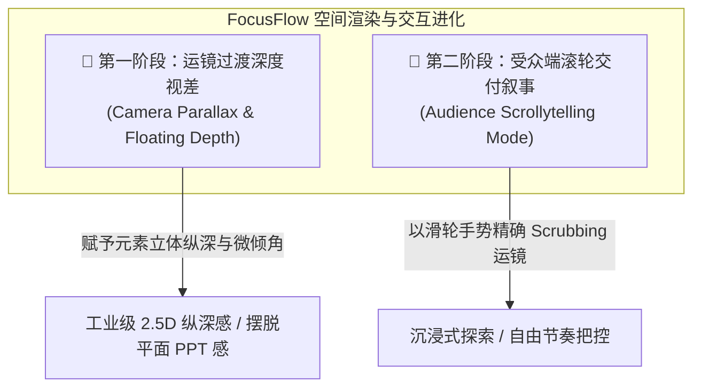
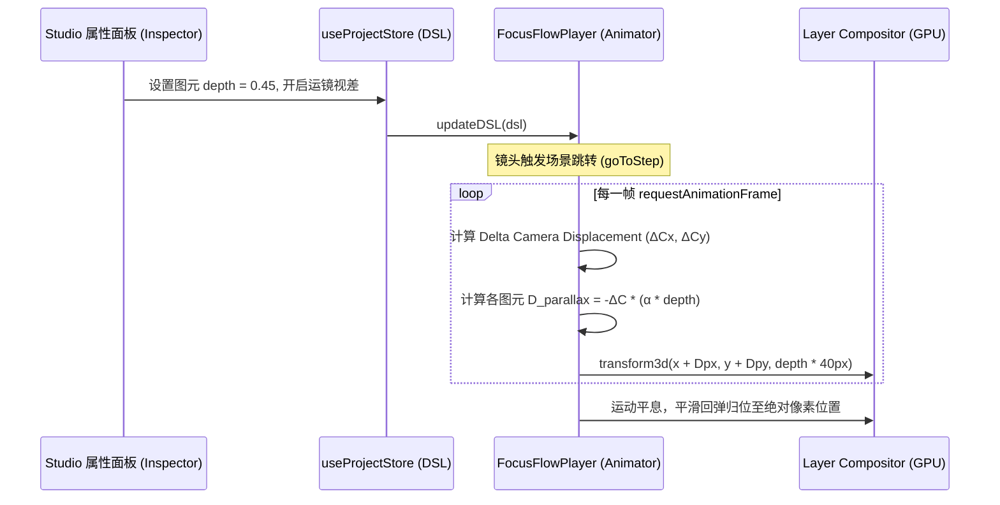
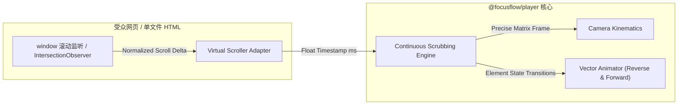

# FocusFlow - 视差深度与滚轮交互叙事技术规格说明书
## Parallax Depth & Scrollytelling Engine Specification

> **关联规范**：[MOTION_ENGINE_SPEC.md](file:///Users/xt/WebstormProjects/focusflow/design/MOTION_ENGINE_SPEC.md) · [STUDIO_SPEC.md](file:///Users/xt/WebstormProjects/focusflow/design/STUDIO_SPEC.md) · [PRODUCT_DESIGN.md](file:///Users/xt/WebstormProjects/focusflow/design/PRODUCT_DESIGN.md)  
> **文档定位**：未来高阶视觉演进储备规范（Future Architecture & Motion Evolution Blueprint）  
> **实施状态**：**规划储备阶段（Deferred Implementation / Ready for Future Sprints）**  
> **文档版本**：v1.0.0

---

## 目录 (Table of Contents)

- [1. 核心愿景与设计哲学](#1-核心愿景与设计哲学)
- [2. 第一板块：运镜过渡中的多图层深度差异与悬浮立体感](#2-第一板块运镜过渡中的多图层深度差异与悬浮立体感)
  - [2.1 视觉表现与空间美学](#21-视觉表现与空间美学)
  - [2.2 虚拟深度数学模型与 2.5D 投影公式](#22-虚拟深度数学模型与-25d-投影公式)
  - [2.3 动态俯仰倾角算法 (Camera Pan Tilt/Pitch)](#23-动态俯仰倾角算法-camera-pan-tiltpitch)
  - [2.4 FocusFlow DSL 协议扩展设计](#24-focusflow-dsl-协议扩展设计)
  - [2.5 工作台 (Studio) 与播放器 (Player) 实现路径](#25-工作台-studio-与播放器-player-实现路径)
- [3. 第二板块：受众端滚轮交付叙事 (Scrollytelling 交互体系)](#3-第二板块受众端滚轮交付叙事-scrollytelling-交互体系)
  - [3.1 交互范式革新：从“被动播放”到“主动探索”](#31-交互范式革新从被动播放到主动探索)
  - [3.2 虚拟滚动轨道与时间轴映射拓扑](#32-虚拟滚动轨道与时间轴映射拓扑)
  - [3.3 阻尼弹簧惯性与分幕磁吸对齐算法](#33-阻尼弹簧惯性与分幕磁吸对齐算法)
  - [3.4 音频旁白与滚轮驱动的协同治理](#34-音频旁白与滚轮驱动的协同治理)
  - [3.5 独立播放器与 Web 嵌入交付实现路径](#35-独立播放器与-web-嵌入交付实现路径)
- [4. 渲染性能门禁与 GPU 硬件加速保障](#4-渲染性能门禁与-gpu-硬件加速保障)
- [5. 阶段性研发实施路径规划 (Roadmap)](#5-阶段性研发实施路径规划-roadmap)

---

## 1. 核心愿景与设计哲学

FocusFlow 现有的运动学体系通过**无限平移（Pan）与平滑推拉（Zoom）**，实现了在大图架构中穿梭的导演级运镜。但传统平面二维渲染（2D Flat Canvas）所有图元处于同一 $Z$-平面，在运镜剧烈移动时容易呈现出类似“PPT 整体平移”的平面单调感。

本规范确立两大核心进阶演进方向：
1. **多图层深度差异悬浮立体感（首要演进，Priority 1）**：
   在工作台 Studio 与播放器 Player 的分幕运镜过渡中，通过赋予不同图层虚拟深度（Depth），让背景底图、选框连线、解说气泡、悬浮卡片产生**“近快远慢、错落悬浮、带微倾角”**的 2.5D 空间感，瞬间拉升演示品质至 Apple 级工业水准。
2. **受众端滚轮交付叙事（次要演进，Priority 2）**：
   在演播模式或独立单文件交付物中，允许受众通过鼠标滚轮或触控板手势**丝滑擦除（Scrubbing）**运镜与叙事节点，实现如同探索交互式纪录片般的主动掌控体验。



---

## 2. 第一板块：运镜过渡中的多图层深度差异与悬浮立体感

### 2.1 视觉表现与空间美学

在镜头从场景 A（例如“全局微服务架构”）平滑过渡到场景 B（例如“订单事务中心”）的插值周期内：
* **底图层（Backplane）**：作为深远背景（$Z < 0$），位移最稳定、幅度稍小，提供扎实的空间依托；
* **标定矢量层（Canvas Vector Elements）**：紧贴底图表面（$Z = 0$），高亮选框与贝塞尔连线与底图像素保持 1:1 绝对贴合；
* **悬浮解说与图文卡片（Foreground Floating Elements）**：悬浮在画面近景（$Z > 0$），在运镜位移时产生**“超前位移（Parallax Lead）”**与**“微弹簧恢复”**，伴随极细腻的阴影扩展（Elevation Shadow Expansion）；
* **运镜动态倾角（Dynamic Camera Tilt）**：在镜头快速侧向移动时，上层元素伴随微幅 3D 偏航角（Yaw）或俯仰角（Pitch），在刹车停稳时平滑回归正交投影，带来如实体机械摄影机运镜般的惯性质感。

```
                     受众视点 (Camera Eye)
                           \   |   /
                            \  |  /
                             \ | /
[近景悬浮层] ──────────────◆ 浮动 Callout / 高密度图片 (超前微动 + 投射软阴影, Z=+0.4)
                               │
[基准矢量层] ──────────────◆ 智能选框 / 贝塞尔流光线 (1:1 绝对吸附, Z=0)
                               │
[底图基板层] ──────────────◆ 4K/8K 架构图原画 (微滞后位移, Z=-0.2)
```

---

### 2.2 虚拟深度数学模型与 2.5D 投影公式

在 FocusFlow 中，镜头在时间 $t \in [0, 1]$ 期间的运动由贝塞尔缓动函数 $E(t)$ 控制，相机在画布坐标系中的即时位置与缩放为：
$$
\vec{C}(t) = (C_x(t),\, C_y(t)), \quad S(t) = \text{Zoom}(t)
$$
相邻两帧之间的镜头瞬时位移速度向量为：
$$
\Delta \vec{C} = \vec{C}(t) - \vec{C}(t - \Delta t)
$$

为每个图元引入无量纲**虚拟深度系数** $z_i \in [-1.0, +1.0]$：
* $z_i = 0$：基准平面（底图表面，无视差位移偏差）；
* $z_i > 0$：前景悬浮物（$z_i = 0.5$ 表示浮出底图 50px 等效高度）；
* $z_i < 0$：背景深凹层。

#### 1. 视差位移增量公式
对于深度为 $z_i$ 的图元，其在视口投影坐标下的额外视差位移向量 $\vec{D}_{\text{parallax}}$ 为：
$$
\vec{D}_{\text{parallax}}(z_i, t) = - \Delta \vec{C} \cdot \left( \alpha \cdot z_i \right)
$$
其中：
* $\alpha$ 为全局视差强度系数（建议默认值 $\alpha = 0.35$）；
* 符号为负表示：镜头向右运镜（$\Delta C_x > 0$），悬浮于近处的图元在受众眼中向左运动更快，产生正确的近快视差。

#### 2. 深度阴影动态扩张（Elevation Shadow）
前景图元悬浮时，其 CSS 投影伴随运镜产生透视偏移与模糊扩散：
$$
\text{offset}_x = z_i \cdot 12\text{px} - \left( \frac{\Delta C_x}{S} \right) \cdot 0.1
$$
$$
\text{blur} = 16\text{px} + z_i \cdot 24\text{px}
$$
$$
\text{opacity} = 0.25 + z_i \cdot 0.15
$$

---

### 2.3 动态俯仰倾角算法 (Camera Pan Tilt/Pitch)

当镜头以较高初速度向某一方向平移时，模拟镜头物理惯性阻尼引入微 3D 旋转矩阵：
$$
\text{Rot}_Y = \text{clamp}\left( -\frac{\Delta C_x}{\text{Speed}_{\text{max}}} \times \theta_{\text{max}},\, -\theta_{\text{max}},\, \theta_{\text{max}} \right)
$$
$$
\text{Rot}_X = \text{clamp}\left( \frac{\Delta C_y}{\text{Speed}_{\text{max}}} \times \theta_{\text{max}},\, -\theta_{\text{max}},\, \theta_{\text{max}} \right)
$$
* 最大倾角安全阈值 $\theta_{\text{max}} = 3.5^\circ$（既有科技悬浮感，又绝不造成眩晕或文字识别障碍）；
* 使用 `perspective: 1200px` 在父容器施加正交透视，利用 GPU 硬件变换：
  ```css
  transform: perspective(1200px) rotateX(RotX deg) rotateY(RotY deg) translate3d(Dx px, Dy px, Dz px);
  ```

---

### 2.4 FocusFlow DSL 协议扩展设计

在 `@focusflow/dsl` 规范中，保持对老版本 DSL 100% 向后兼容，扩展可选字段：

```typescript
// 1. 全局或场景级视差控制参数
export interface ParallaxCameraConfig {
  /** 是否启用 2.5D 运镜视差 (默认 false 保持平面) */
  enabled?: boolean;
  /** 全局视差强度倍率 0.0 ~ 1.0 (默认 0.35) */
  intensity?: number;
  /** 是否启用运镜惯性微倾角 (默认 false) */
  enableDynamicTilt?: boolean;
  /** 最大倾角限制 (度数，默认 3.5) */
  maxTiltDegrees?: number;
}

// 2. 图元级虚拟深度属性扩展
export interface ElementVisualDepth {
  /** 
   * 虚拟深度层级：
   *  -0.5 (深凹背景) 
   *   0.0 (底图表面，默认)
   *  +0.3 (微悬浮气泡)
   *  +0.7 (高悬浮重点卡片)
   */
  depth?: number;
  /** 是否独立阻尼弹簧跟随 (带回弹惯性) */
  dampedSpring?: boolean;
}
```

---

### 2.5 工作台 (Studio) 与播放器 (Player) 实现路径



1. **工作台标定呈现**：
   - 在右侧属性面板（`RightInspector`）中新增【立体深度 (3D Depth)】滑块（$-0.5 \sim +1.0$）；
   - 画布中选中带深度的图元时，以极细腻的双重微虚线边框指示其离地高度；
2. **播放器动效调度**：
   - 改造 `packages/player/src/core/animator.js`：在 RAF 镜头变换插值管线中，建立分层变换节点字典；
   - 镜头位移时，矢量与 DOM 节点采用独立 CSS `transform: translate3d(...)`，保证 0 重排（Zero Reflow）。

---

## 3. 第二板块：受众端滚轮交付叙事 (Scrollytelling 交互体系)

### 3.1 交互范式革新：从“被动播放”到“主动探索”

传统模式下，受众点击“播放”按钮像观看视频一样被动等待；
而在 **Scrollytelling（滚轮交付叙事模式）** 下：
* **滚轮即播放头（Scroll is the Playhead）**：受众向下滚动滚轮，运镜、高亮、气泡按照时间比例向前推进；反向滚动滚轮，画面丝滑倒放；
* **极度适合长文解说嵌入**：在独立 HTML、Notion、技术博客中，页面主体被固定（Sticky Viewport），用户的常规竖向滚动行为被无缝映射为 FocusFlow 的镜头多幕切换。

---

### 3.2 虚拟滚动轨道与时间轴映射拓扑

为了将离散的滚轮事件平滑映射为连续的时间轴位移，在受众页面挂载一个**不可见的虚拟长滚动轨道（Virtual Scroll Track）**：

```
[受众全屏视口 (100vh Sticky Viewport)] 
  └── FocusFlow 播放器实时渲染画面
[不可见虚拟高度容器 (Height = SceneCount * 120vh)]
  ├── 幕 1 触发区间: 0.00 ~ 0.33
  ├── 幕 2 触发区间: 0.33 ~ 0.66
  └── 幕 3 触发区间: 0.66 ~ 1.00
```

1. **总滚动高度归一化**：
   $$
   H_{\text{total}} = N_{\text{scenes}} \times (\text{ViewportHeight} \times \beta)
   $$
   其中 $\beta \approx 1.2 \sim 1.5$ 保证每一幕有足够舒适的滚动摩擦阻尼。
2. **滚动百分比转换**：
   $$
   \text{Progress}_{\text{global}} = \frac{\text{window.scrollY}}{H_{\text{total}} - \text{ViewportHeight}} \in [0.0, 1.0]
   $$
3. **即时分幕定位推导**：
   根据全局时间轴总时长 $T_{\text{total}}$，计算当前物理时间点 $t_{\text{target}} = \text{Progress}_{\text{global}} \times T_{\text{total}}$，精确定位处于第 $k$ 幕及其幕内插值百分比 $\tau \in [0, 1]$。

---

### 3.3 阻尼弹簧惯性与分幕磁吸对齐算法

直接按鼠标滚轮单帧步进容易产生段落感或生硬停顿，必须引入 **RK4（四阶龙格-库塔）弹簧物理系统** 或 **指数衰减平滑插值（Lerp）**：

$$
P_{\text{rendered}}(t) = P_{\text{rendered}}(t - \Delta t) + \left( P_{\text{target}} - P_{\text{rendered}}(t - \Delta t) \right) \times \left( 1 - e^{-\lambda \cdot \Delta t} \right)
$$
* **磁力吸附（Magnetic Scene Snapping）**：
  当受众停止滚动超过 180ms 时，如果当前停留在场景切换边缘（例如 $0.29$ 接近场景 1 的终点 $0.33$），系统激活轻柔磁力吸附，平滑将播放头吸附对齐到关键关键帧节点，确保核心文字完整展示。

---

### 3.4 音频旁白与滚轮驱动的协同治理

> [!WARNING]
> **技术痛点**：视频镜头可以任意微频倒放或停顿，但已录制或合成的音频波形（TTS / 麦克风录音）无法优雅地逆向或超微速播放（会出现刺耳的声音变调与杂音）。

**协同解决方案**：
1. **静音拖拽 + 停顿发声（Scrub-Mute, Snap-Play）**：
   - 在受众持续滚动拖拽期间，音轨自动执行 50ms 快速淡出静音，仅驱动画面运镜与图元流光；
   - 一旦受众在某一场景停驻（磁吸就绪），该幕的 TTS 或语音旁白自动以清晰自然语速从头播报；
2. **环境音/流光背景音微音量常驻（Ambient Layer）**：
   - 背景轻音乐通过 Web Audio API GainNode 控制，音量与滚动速度正相关，带来极佳的物理操作反馈。

---

### 3.5 独立播放器与 Web 嵌入交付实现路径



* **新增入口模块**：在 `@focusflow/player` 中规划并暴露 `FocusFlowScrollyteller` 类：
  ```javascript
  import { FocusFlowScrollyteller } from '@focusflow/player';

  const story = new FocusFlowScrollyteller({
    container: document.getElementById('story-viewport'),
    dsl: projectDSL,
    snapThreshold: 0.05,
    damping: 12,
  });
  ```
* **单文件导出兼容**：在 `standalonePackager.ts` 中增加【导出交互叙事页 (Scrollytelling Page)】选项，导出的 HTML 默认内嵌粘性滚动画布。

---

## 4. 渲染性能门禁与 GPU 硬件加速保障

为了确保复杂的 2.5D 深度视差与高频滚轮刷新在普通设备上依然达到满帧运行，制定以下严格工程规范：

1. **图层合成器分层策略（Compositor Layer Isolation）**：
   - 底图容器与各浮动图元必须开启独立 GPU 显存图层：
     ```css
     will-change: transform;
     transform: translate3d(0, 0, 0);
     backface-visibility: hidden;
     ```
2. **亚像素渲染防抖（Subpixel Anti-Aliasing）**：
   - 避免浮点数像素计算引起文字边缘虚化或边缘抖动，对视差位移坐标执行双重 RAF 批处理与 `round(val * 100) / 100` 保留两位有效位。
3. **低功耗与移动端降级策略**：
   - 监听 `window.matchMedia('(prefers-reduced-motion: reduce)')`：若系统开启了减弱动态效果，自动将视差强度置为 0，回退到平稳 2D 切换；
   - 移动端默认关闭 3D Tilt 倾角，仅保留主轴平移视差。

---

## 5. 阶段性研发实施路径规划 (Roadmap)

```
阶段一：运镜多图层深度视差 (Priority 1 - Future Sprint A)
  ├── 1. DSL Schema 扩展：支持元素与图层 depth 属性及场景全局视差强度
  ├── 2. @focusflow/player 动画驱动器重构：集成瞬时位移计算与 2.5D 矩阵差值
  ├── 3. Studio 属性面板升级：提供直观的图层高度与阴影控制滑块
  └── 4. 真实架构图样张效果打磨与 120Hz 高刷屏性能调优

阶段二：受众端滚轮交付叙事 (Priority 2 - Future Sprint B)
  ├── 1. @focusflow/player 核心拓展：实现连续无级双向擦除引擎 (Scrubber)
  ├── 2. 虚拟滚动轨道与磁吸算法集成 (Virtual Scroll Track & Magnetic Snap)
  ├── 3. 音画协同调度：实现滚动静音与驻留淡入发声机制
  └── 4. Studio 导出中心集成：支持“一键导出沉浸式 Scrollytelling 独立网页”
```

> **归档备忘**：本规范作为 FocusFlow 视觉工业级升维的权威架构指南，待核心云端协同或业务排期进入相应版本周期时，可直接依据本规范拆解具体 JIRA/GitHub Issue 任务并平滑推进落地。
