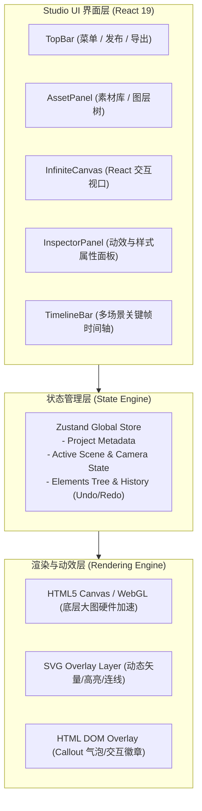
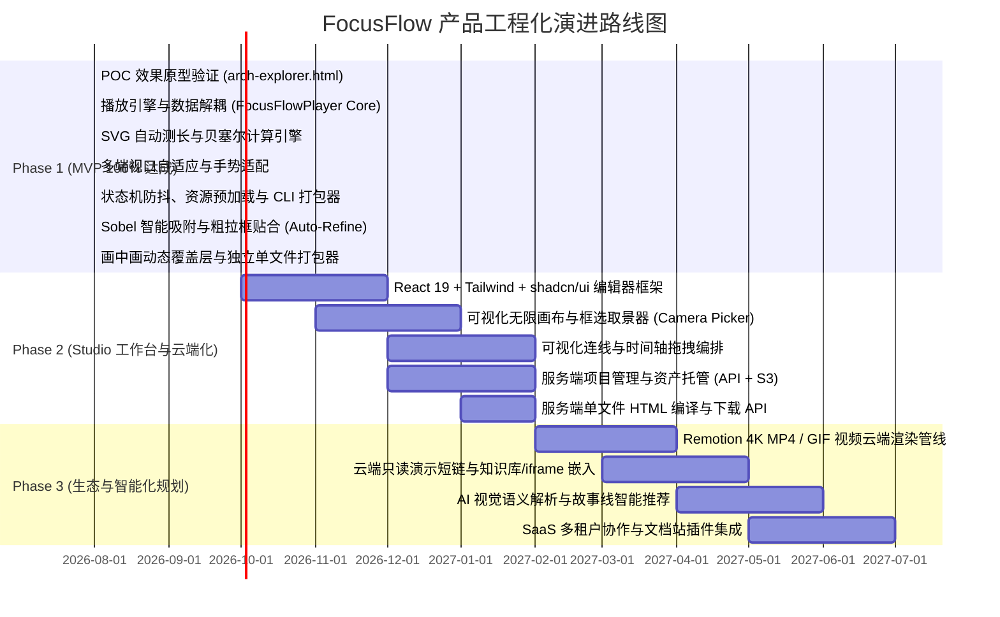

# FocusFlow (聚焦流) - 交互式架构图与视觉故事板生成引擎
## 工业级产品设计方案与技术规格说明书 (PRD & System Architecture)

> **文档版本**：`v1.3.0`  
> **最新更新**：`2026-08-29` (Phase 1 验收收官 & Phase 2/3 服务端演进路线图对齐)  
> **文档状态**：🚀 **Phase 1 (MVP) 100% 达成 · 进入 Phase 2 (Studio 工作台与云端化) 规划期**  
> **关联技术专刊**：
> - 📄 [MVP_SPEC.md (Phase 1 播放引擎与 HUD 规格)](file:///Users/xt/WebstormProjects/focusflow/design/MVP_SPEC.md)
> - 🎨 [STUDIO_SPEC.md (Phase 2 可视化创作工作室与全栈规格)](file:///Users/xt/WebstormProjects/focusflow/design/STUDIO_SPEC.md)
> - 🏗️ [MONOREPO_SPEC.md (Monorepo 工程化架构与改造规格)](file:///Users/xt/WebstormProjects/focusflow/design/MONOREPO_SPEC.md)
> - 📐 [MOTION_ENGINE_SPEC.md (动效数学与渲染规格)](file:///Users/xt/WebstormProjects/focusflow/design/MOTION_ENGINE_SPEC.md)
> - 🔍 [EDGE_SNAPPER_ALGORITHM.md (智能吸附算法专刊)](file:///Users/xt/WebstormProjects/focusflow/docs/EDGE_SNAPPER_ALGORITHM.md)

---

## 📑 文档快速导航 (Table of Contents)

* [1. 产品概述与现状评估 (Executive Summary)](#1-产品概述与现状评估-executive-summary--status-assessment)
  * [1.1 产品定位](#11-产品定位)
  * [1.2 核心痛点与价值主张](#12-核心痛点)
  * [1.3 POC 原型 vs 工程化 MVP 对比表](#14-现状客观评估poc-原型-vs-真正工程化-mvp)
* [2. 用户画像与典型场景 (Target Personas & Use Cases)](#2-用户画像与典型场景-target-personas--use-cases)
* [3. 核心产品架构：创作端 与 消费端 (Two-Tier Architecture)](#3-核心产品架构创作端-与-消费端-two-tier-product-architecture)
  * [3.1 创作端：在线 Web 制作工作室 (Studio)](#31-创作端在线-web-制作工作室-focusflow-studio)
  * [3.2 消费端：多形态交付与播放引擎 (Player)](#32-消费端多形态交付与播放引擎-focusflow-player)
* [4. 技术栈选型分析：为什么 React 是最佳选择？ (Why React?)](#4-技术栈选型分析为什么-react-是最佳选择-why-react)
* [5. Phase 1 (MVP 阶段) 核心工程化设计与任务分解](#5-phase-1-mvp-阶段-核心工程化设计与任务分解)
  * [5.1 引擎与数据彻底解耦](#51-模块一引擎与数据彻底解耦-engine--dsl-decoupling)
  * [5.2 页面与矢量动效核心规范 (详见独立技术专刊)](#52-模块二页面与矢量动效核心规范-visual--motion-spec)
  * [5.3 多端响应式与视口边界保护](#53-模块三多端响应式与视口边界保护-responsive-viewport-engine)
  * [5.4 生命周期与状态机防抖](#54-模块四生命周期与状态机防抖-lifecycle--robust-state-machine)
  * [5.5 单文件 CLI 编译与打包器](#55-模块五轻量化-cli-编译与打包器-cli-bundler)
* [6. 核心功能矩阵 (Feature Matrix)](#6-核心功能矩阵-feature-matrix)
* [8. 产品版本规划与演进路线 (Roadmap & WBS)](#8-产品版本规划与演进路线-roadmap--work-breakdown)
  * [8.1 Phase 1: MVP 核心阶段具体待办清单](#81-phase-1-mvp-核心阶段具体待办清单-wbs--100-验收达成)
  * [8.2 Phase 2: 可视化创作端建设](#82-phase-2-可视化创作端建设-2--4-个月)
  * [8.3 服务端 (SaaS / Full-Stack) 演进的 4 大核心能力模块](#83-服务端-saas--full-stack-演进的-4-大核心能力模块)
  * [8.4 Phase 3: AI 赋能与生态集成](#84-phase-3-ai-赋能与生态集成-5--8-个月)
* [9. 总结与商业化愿景](#9-总结)

---

## 1. 产品概述与现状评估 (Executive Summary & Status Assessment)

### 1.1 产品定位
**FocusFlow** 是一款面向技术架构师、工程师、产品专家及教育者的**交互式视觉叙事（Interactive Visual Storytelling）与架构演进展示 SaaS 平台**。

它能够将任意一张高分辨率静态架构图、拓扑图、设计稿（如 4K/8K 复杂大图），转化为**带电影级镜头运镜（Pan/Zoom）、模块智能高亮（Smart Framing）、流光路径动画（Data Stream Animation）与分步交互式解说（Interactive Step Walkthrough）**的轻量级 Web 互动展示物。

### 1.2 核心痛点
* **传统 PPT/PDF 静态图信息过载**：复杂全景图（5000px+）字小信息密，汇报或展示时无法让听众聚焦当前核心模块。
* **专业动效工具门槛极高**：使用 After Effects、Premiere 等视频制作工具成本高、渲染慢、无法支持网页端点选/键盘交互翻页。
* **手写 HTML/SVG 代码成本高**：开发人员手工测量坐标、计算 `viewBox` 缩放矩阵、手写 `stroke-dashoffset` CSS 代码繁琐且极难复用与维护。

### 1.3 产品价值主张
> **“从一张静态高清大图，到顶级科技发布会级别的交互式演进讲解，只需 3 分钟。”**

* **极致体验**：60fps 硬件加速镜头平滑推拉，精准毫秒级贝塞尔曲线运镜。
* **零代码可视化编排**：框选即生成坐标，点击即连接动态流线，所见即所得。
* **多形态零依赖分发**：一键导出单文件 HTML、React/Vue Web 组件、全屏演示链接、可嵌入 iframe 及 4K MP4/GIF。

### 1.4 现状客观评估：POC 原型 vs 真正工程化 MVP
> **重要认知对齐**：当前实现的 `arch-explorer.html` 验证了视觉效果和交互模式的高度可行性，属于 **单点原型验证（POC - Proof of Concept）**。要将其沉淀为**通用、高可用、可复用**的产品，必须在 **Phase 1: MVP 阶段** 完成核心播放引擎的抽象与工程化解耦。

```
+---------------------------------------------------------------------------------------------------------+
|                                    POC 原型  VS  工程化 MVP 差距对比                                      |
+----------------------+------------------------------------+---------------------------------------------+
| 评估维度              | 当前 POC 状态 (arch-explorer.html) | Phase 1 工程化 MVP 目标状态 (FocusFlow Player)|
+----------------------+------------------------------------+---------------------------------------------+
| 1. 代码耦合度        | 业务数据、SVG坐标、DOM结构强硬编码 | 引擎与数据 100% 解耦，纯 JSON DSL 驱动动态生成 |
| 2. 动效几何计算      | 手工测量填入 stroke-dasharray      | 引擎自动调用 getTotalLength() / 几何周长推导 |
| 3. 连线拓扑路由      | 手工拼写 SVG 贝塞尔控制点坐标      | 声明起点终点锚点，引擎自动推导平滑三次贝塞尔曲线|
| 4. 多端响应式适配    | 固定 1400px 视口，小屏/大屏易溢出  | 弹性 Viewport 算法，全屏/宽屏/移动端自适应   |
| 5. 资源与生命周期    | 无加载状态，大图未加载时线条悬空   | 预加载管理 (Preloader)、骨架屏、状态机防抖   |
| 6. 易用性与复用方式  | 每次换图都需要手工修改 HTML 源码   | 提供 CLI 编译工具 / npm 组件包，配置即运行   |
+----------------------+------------------------------------+---------------------------------------------+
```

---

## 2. 用户画像与典型场景 (Target Personas & Use Cases)

| 用户角色 | 典型使用场景 | 核心诉求 |
| :--- | :--- | :--- |
| **技术架构师 / 资深工程师** | 向上汇报高并发架构、系统拓扑、技术方案评审（RFC）、Upwork/个人作品集展示 | 突出技术链路，展示数据流向（如交易/夜审/落库流程），高逼格科技感 |
| **SRE / DevOps 运维专家** | 故障复盘（Postmortem）、链路拓扑排查、灾备演练讲解 | 快速还原请求在各微服务、网关、数据库间的故障传播路径与时序 |
| **技术布道师 / 课程讲师** | 复杂知识点分解教学（如 Kubernetes 原理、Linux 内核调度、分布式一致性） | 镜头引导学生视线，避免“大海捞针”，增强知识传递效率 |
| **B2B SaaS 售前与产品经理** | 核心产品方案演示、客户现场讲标、交互式 Product Tour | 免去无聊的静态图，用动态镜头语言打动政企与商业客户 |

---

## 3. 核心产品架构：创作端 与 消费端 (Two-Tier Product Architecture)

FocusFlow 划分为两大核心子系统：**面向创作者的 Web 制作工作室（创作端）** 与 **面向受众的多形态展示运行时（消费端）**。

```mermaid
flowchart LR
    subgraph CreatorSide ["🎨 创作端 (FocusFlow Web Studio)"]
        direction TB
        A1["资产导入区<br/>4K/8K PNG, SVG, Figma"]
        A2["可视化无限画布<br/>Infinite Pan/Zoom Canvas"]
        A3["AI 视觉与包围盒提取<br/>Card & Text OCR Detection"]
        A4["关键帧时间轴编排<br/>Scene & Camera Timeline"]
        A5["动效与流光样式检查器<br/>Glow, Dash, Speed Inspector"]
    end

    subgraph DSLBridge ["📦 核心桥梁 (DSL)"]
        JSON["FocusFlow JSON DSL<br/>(镜头、图层、时序标准化协议)"]
    end

    subgraph ConsumerSide ["🚀 消费端 (FocusFlow Player & Delivery)"]
        direction TB
        C1["独立单文件 HTML 5<br/>(零依赖 / 离线秒开)"]
        C2["React / Vue 嵌入组件<br/>(开发文档站 / 博客嵌入)"]
        C3["Iframe / Web Component<br/>(Notion / Confluence / Wiki)"]
        C4["4K 视频 / GIF 导出<br/>(Remotion 无头渲染)"]
        C5["演讲者演示模式<br/>(双屏联动 / 演讲备注 / 远程同步)"]
    end

    CreatorSide --> DSLBridge
    DSLBridge --> ConsumerSide
```



### 3.1 创作端：在线 Web 制作工作室 (FocusFlow Studio)
创作者直接在浏览器中使用的可视化创作环境（SaaS Web 应用）：
1. **无限交互画布（Infinite Visual Canvas）**：支持滚轮平滑缩放、空格抓手平移、多图层自由叠放。
2. **AI 视觉辅助框选（AI-Powered Auto Bounding）**：自动探测底图中的模块卡片、标题和边界，单击生成 `<rect>` 锚点。
3. **镜头运镜与场景时间轴（Scene & Camera Timeline）**：底部时间轴管理场景步骤，直接拉出镜头框自动计算缩放比例。
4. **可视化连线与流光配置器（Smart Flow Builder）**：点击两卡片锚点生成三次贝塞尔曲线，可视化选择霓虹流光动效。
5. **实时所见即所得预览（Real-time Preview Engine）**：即时预览镜头过渡、缓动曲线与动画节奏。

### 3.2 消费端：多形态交付与播放引擎 (FocusFlow Player)
1. **独立单文件 HTML（Zero-Dependency Standalone HTML）**：打包为体积 < 50KB 的单一 `.html` 文件，双击即开，离线可用。
2. **前端框架组件（React / Vue Component）**：提供 `<FocusFlowPlayer dsl={schema} />` 组件，嵌入各类开发文档站。
3. **通用嵌入代码（Iframe / Web Component）**：一键复制嵌入 Notion、Confluence、Wiki 等知识库。
4. **演示演讲者模式（Presenter Mode）**：全屏快捷键演示，支持主副屏演讲者提词（Speaker Notes）。
5. **视频与动图渲染（4K MP4 / WebM / GIF）**：云端 Remotion 无损渲染 60fps 视频。

---

## 4. 技术栈选型分析：为什么 React 是最佳选择？ (Why React?)

本产品的 **Web 创作端网站** 和 **Web 播放器核心** 计划采用 **React 19 / TypeScript** 进行构建：

```
+-------------------------------------------------------------------------------------------------------+
|                                      React 技术栈选型收益矩阵                                          |
+------------------------------+------------------------------------------------------------------------+
| 核心需求                      | React 生态解决方案与优势                                                 |
+------------------------------+------------------------------------------------------------------------+
| 1. 复杂画布与拖拽交互        | @use-gesture, dnd-kit, react-zoom-pan-pinch 拥有业界最成熟的生态支持    |
| 2. 高性能关键帧状态管理      | Zustand / Jotai 细粒度原子化响应，避免大画布无意义全局 Re-render        |
| 3. 现代化 UI 与设计体系      | Tailwind CSS + shadcn/ui (Radix UI)，快速构建极简高质感深色/浅色 Studio |
| 4. 视频导出同构渲染          | Remotion 原生基于 React 组件生成视频，创作端与视频渲染端代码 100% 复用  |
| 5. 跨端与多框架消费分发      | React 组件可直接通过 Custom Elements 打包为 Web Component 供 Vue/原生使用|
+------------------------------+------------------------------------------------------------------------+
```

### 4.1 前端核心分层架构



### 4.2 从 MVP 原生内核到 React 生态的平滑演进路径
在 Phase 1 (MVP) 研发的核心动效算法（坐标逆投影、三次贝塞尔推导、像素梯度边缘吸附、几何测长）属于**纯 TypeScript/JS 底层渲染内核**。后续引入 React 19 时，底层算法 100% 零修改复用，仅在上层增加 React Hooks 包装与 Studio 可视化界面。

> 详见工程目录演进方案：👉 **[《MVP 研发执行规格与工程目录平滑演进》(MVP_SPEC.md#2-工程目录结构与平滑演进路线-directory-structure--progressive-evolution)](file:///Users/xt/WebstormProjects/focusflow/design/MVP_SPEC.md)**

---

## 5. Phase 1 (MVP 阶段) 核心工程化设计与任务分解

为了将 POC 升级为真正开箱即用的工程化播放器，Phase 1 聚焦攻克以下 5 大核心工程模块：

### 5.1 模块一：引擎与数据彻底解耦 (Engine & DSL Decoupling)
* **目标**：核心播放器封装为独立的渲染引擎类（`FocusFlowPlayer`），支持挂载到任意 DOM 容器，通过纯 JSON 数据驱动渲染。
* **技术实现**：
  ```javascript
  const player = new FocusFlowPlayer({
    container: '#app',
    dsl: schemaJson, // 详见第 7 节 DSL 格式
    options: { autoPlayInterval: 4000, enableKeyboard: true }
  });
  ```

### 5.2 模块二：页面与矢量动效核心规范 (Visual & Motion Spec)
> 💡 **特别说明**：为保证主 PRD 的清晰与易读性，有关**动效数学推导、双重坐标映射、三次贝塞尔路由以及内置 HUD 标定工具**的落地代码规范，已拆分为两篇独立的专题技术规格文档：  
> * 👉 **[《Phase 1 (MVP) 研发执行规格与极简标定开发指南》(MVP_SPEC.md)](file:///Users/xt/WebstormProjects/focusflow/design/MVP_SPEC.md)**
> * 👉 **[《页面与矢量动效核心引擎技术规格说明书》(MOTION_ENGINE_SPEC.md)](file:///Users/xt/WebstormProjects/focusflow/design/MOTION_ENGINE_SPEC.md)**

* **三大视觉叠加层**：Layer 0 底图层 + Layer 1 SVG 矢量动效层 + Layer 2 HTML 毛玻璃气泡层。
* **内置 HUD 标定模式**：`?debug=1` 十字准星逆投影、拖拽拉框、单点点击边缘智能吸附、一键复制 JSON DSL。
* **GPU 镜头运动学**：`scale(zoom) translate(x%, y%)` 结合安全视口边界钳位算法。
* **SVG 几何与动画自动化**：圆角矩形精准周长推导与双重 RAF 动画调度。
* **拓扑数据流向引擎**：8 向标准吸附锚点与三次贝塞尔自动控制点推导算法。

### 5.3 模块三：多端响应式与视口边界保护 (Responsive Viewport Engine)
* **长宽比自适应**：根据浏览器视口（`window.innerWidth/Height`）动态计算 Base Fit Scale。
* **安全取景边界（Safe Camera Bounds）**：限制平移最大偏移量 $|T_x|, |T_y| \le \frac{Z-1}{2Z} \times 100\%$，防止画面被推移出界。
* **移动端触控交互**：支持移动端单指左右滑动（Swipe）翻页，双指捏合（Pinch）缩放。

### 5.4 模块四：生命周期与状态机防抖 (Lifecycle & Robust State Machine)
* **大图预加载机制（Asset Preloader）**：4K 底图未解码完成前展示骨架屏，防止线条悬空绘制。
* **动画竞态与防抖（Transition Debouncing）**：连续点击按键时立即平滑重置上一帧，杜绝样式竞争闪烁。
* **全屏模式集成（Fullscreen API）**：一键切换原生全屏展示。

### 5.5 模块五：轻量化 CLI 编译与打包器 (CLI Bundler)
* **零配置打包**：提供简易 Node CLI 脚本：
  ```bash
  npx focusflow-build --config ./topology.json --output ./dist/index.html
  ```
  一键将图片与通用引擎编译为独立的单文件离线 HTML。

---

## 6. 核心功能矩阵 (Feature Matrix)

### 6.1 智能资产导入与视觉感知 (Smart Ingestion)
* **超高分辨率支持**：无损支持 4K/8K（10000px+）位图解析。
* **AI 自动区域探测**：边缘检测与 OCR 自动识别卡片与文字。
* **智能色彩抽取**：自动从底图提取 Accent / Warn / Green 色系生成 Design Tokens。

### 6.2 可视化画布与镜头运镜器 (Visual Canvas & Camera)
* **画布交互**：滚轮缩放（10%~800%）、空格抓手平移。
* **多场景时间轴**：场景步骤增删改查与排序。
* **缓动曲线库**：内置 Smooth Cubic、Spring Physics、Linear 等运镜曲线。

### 6.3 矢量动效图层工作室 (Vector & Flow Motion)
* **智能选框图层**：圆角矩形描边生长动画（`stroke-dashoffset`）与发光（Glow）。
* **智能连线流向**：吸附锚点、三次贝塞尔平滑流线、持续跑马灯与光斑粒子。
* **富文本 Callout 气泡**：语义 Badge、副标题 Markdown、阶梯式弹入。

### 6.4 播放控制与演示模式 (Player Runtime & UX)
* **全局控制条**：场景指示器、进度条、自动轮播（`▶`/`⏸`）。
* **全能导航**：`←`/`→`/`Space`/`Home`/`End` 键盘导航，移动端滑动翻页。

---

## 7. 标准化数据模型设计 (JSON Schema DSL)

```json
{
  "$schema": "https://focusflow.io/schema/v1.json",
  "meta": {
    "title": "LuxeHMS Architecture Explorer",
    "viewport": { "width": 5120, "height": 2880 },
    "theme": {
      "bg": "#0a0e17",
      "accent": "#38bdf8",
      "warn": "#f472b6",
      "green": "#34d399",
      "amber": "#fbbf24"
    }
  },
  "asset": {
    "url": "01-system_architecture_dark.png"
  },
  "elements": {
    "boxes": [
      {
        "id": "box-postgres",
        "type": "rect",
        "x": 3636, "y": 628, "width": 1297, "height": 332, "rx": 18,
        "style": { "stroke": "var(--green)", "strokeWidth": 6, "glow": true }
      },
      {
        "id": "box-folio",
        "type": "rect",
        "x": 1664, "y": 980, "width": 883, "height": 240, "rx": 18,
        "style": { "stroke": "var(--accent)", "strokeWidth": 6, "glow": true }
      },
      {
        "id": "box-auth-casl",
        "type": "rect",
        "x": 1664, "y": 780, "width": 886, "height": 200, "rx": 16,
        "style": { "stroke": "var(--warn)", "strokeWidth": 6, "glow": true }
      }
    ],
    "paths": [
      {
        "id": "line-folio-pg",
        "from": "box-folio.right",
        "to": "box-postgres.left-top",
        "style": { "stroke": "var(--accent)", "strokeWidth": 5, "mode": "stream" }
      },
      {
        "id": "line-cron-pg",
        "from": "box-cron.right",
        "to": "box-postgres.left-bottom",
        "style": { "stroke": "var(--amber)", "strokeWidth": 5, "mode": "stream" }
      }
    ]
  },
  "scenes": [
    {
      "id": "scene-0",
      "title": "Overview",
      "camera": { "zoom": 1.0, "x": 0, "y": 0, "duration": 1.0 },
      "activeElements": { "boxes": [], "paths": [], "dots": [], "callouts": [] }
    },
    {
      "id": "scene-1",
      "title": "Data & Scheduling",
      "camera": { "zoom": 1.75, "x": -14, "y": 8, "duration": 1.2 },
      "activeElements": {
        "boxes": ["box-folio", "box-cron", "box-postgres"],
        "paths": ["line-folio-pg", "line-cron-pg"],
        "dots": ["dot-folio-out", "dot-cron-out", "dot-pg-in-folio", "dot-pg-in-cron"],
        "callouts": [
          {
            "id": "co-folio",
            "position": { "left": "33%", "top": "33%" },
            "theme": "blue",
            "title": "Folio & Cashier",
            "desc": "Double-entry ledger · Shift balance · Real-time sync"
          },
          {
            "id": "co-cron",
            "position": { "left": "33%", "top": "54%" },
            "theme": "amber",
            "title": "Cron Scheduler Daemon",
            "desc": "5-Stage Night Audit Engine · Automated Posting · Date Rollover"
          },
          {
            "id": "co-data",
            "position": { "left": "72%", "top": "22%" },
            "theme": "green",
            "title": "PostgreSQL 16",
            "desc": "Primary Transactional DB · Folios · ACID Consistency"
          }
        ]
      }
    },
    {
      "id": "scene-2",
      "title": "Auth & Core Libs",
      "camera": { "zoom": 1.75, "x": 23, "y": 10, "duration": 1.2 },
      "activeElements": {
        "boxes": ["box-auth-casl", "box-core-internal", "box-badge-lib-core"],
        "paths": [],
        "dots": [],
        "callouts": [
          {
            "id": "co-auth-casl",
            "position": { "left": "33%", "top": "26%" },
            "theme": "pink",
            "title": "Auth & CASL RBAC",
            "desc": "Subject-action matrix · Audit logs"
          },
          {
            "id": "co-core-internal",
            "position": { "left": "4%", "top": "44%" },
            "theme": "blue",
            "title": "Core Internal Libraries",
            "desc": "Type-safe shared contracts · Monorepo"
          },
          {
            "id": "co-badge-lib-core",
            "position": { "left": "17%", "top": "52%" },
            "theme": "green",
            "title": "lib-core (CASL RBAC & Auth)",
            "desc": "Shared RBAC policies & token validation"
          }
        ]
      }
    },
    {
      "id": "scene-3",
      "title": "Full Topology",
      "camera": { "zoom": 1.0, "x": 0, "y": 0, "duration": 1.0 },
      "activeElements": { "boxes": [], "paths": [], "dots": [], "callouts": [] }
    }
  ]
}
```

---

## 8. 产品版本规划与演进路线 (Roadmap & Work Breakdown)



### 8.1 Phase 1: MVP 核心阶段具体待办清单 (WBS · 100% 验收达成)
- [x] **Step 1: POC 视觉与交互模式验证** (已完成 `arch-explorer.html` 单点验证)
- [x] **Step 2: 纯 JS 驱动的核心播放器类封装 (`FocusFlowPlayer`)** (数据 100% 解耦，多层级分层渲染)
- [x] **Step 3: 几何自动测长与贝塞尔三次曲线路由计算引擎** (8向锚点自适应，三次贝塞尔自动控制点推导)
- [x] **Step 4: 视口响应式、安全边界钳位与全屏模式** (GPU 硬件加速运镜，安全边界保护)
- [x] **Step 5: 资源预加载（Preloader）与动画状态机防抖** (Double-RAF 防竞争，时钟定时轮播)
- [x] **Step 6: 单文件编译 CLI 与离线打包器 (`build-standalone` & `create-project`)** (自动 Base64 内联与脚手架)
- [x] **Step 7: 开发者 HUD 标定工具层** (Sobel 梯度积分吸附、粗拉框智能像素贴合 Auto-Refine、一键捕获镜头与气泡)
- [x] **Step 8: 动态覆盖图层与局部下钻动效** (Layer 0.5 画中画弹性弹入与平滑淡出退场)
- [x] **Step 9: 控制栏精细化定制与等宽场景指示器** (`meta.controls`、等宽 `01/05` 计数器、Tab 横向自适应滚动)

### 8.2 Phase 2: 可视化创作端建设 (2 ~ 4 个月)
* **可视化无限画布**：支持鼠标滚轮平滑缩放平移，可视化拖拽选取高亮框。
* **镜头取景器（Camera Picker）**：在画布上框选目标区域，自动推算 `zoom` 与 `translate(x, y)` 参数。
* **点对点连线生成器**：点击两个模块锚点自动生成贝塞尔曲线与流动动效。
* **一键导出**：一键生成 Phase 1 格式的独立 HTML 文件或下载 JSON DSL。

### 8.3 服务端 (SaaS / Full-Stack) 演进的 4 大核心能力模块

要将 FocusFlow 从“本地客户端工具”升级为“企业级在线云平台/SaaS”，服务端需平滑接入以下 **4 大核心能力模块**：

```
                       【Phase 2/3 服务端系统架构全景】

               ┌──────────────────────────────────────────────┐
               │    FocusFlow Cloud (Web 在线平台 / SaaS)     │
               └──────────────────────┬───────────────────────┘
                                      │
       ┌──────────────────────────────┼──────────────────────────────┐
       ▼                              ▼                              ▼
【1. 服务端项目管理】         【2. 服务端一键打包下载】     【3. 视频云渲染导出】
 • REST / GraphQL API         • POST /api/export/html       • Puppeteer / Remotion
 • 资产云存储 (S3 / OSS)      • 服务端调用 packager         • 4K 60fps MP4 渲染
 • 数据库存储 DSL JSON        • 浏览器直接下载 .html        • 高清动态 GIF 生成
                                      │
                                      ▼
                           【4. 云端免部署在线分享】
                            • 公开只读短链 (focusflow.io/s/xxx)
                            • 知识库/Notion/飞书 <iframe> 嵌入
```

1. **服务端项目管理与资产托管 (Project Management & Cloud Storage)**：
   * RESTful/GraphQL API + S3/OSS 云存储 + 数据库 DSL 存储；
   * 用户在 Web 控制台上传底图，服务端自动探测 Viewport 宽高并初始化标准 DSL；
   * 支持多租户权限体系（Owner / Editor / Viewer）与版本历史回滚（Version History）。
2. **服务端无状态编译与 HTML 单文件下载 API (Headless HTML Exporter)**：
   * 将现有的 `scripts/build-standalone.js` 封装为无状态 Node.js 编译服务；
   * 提供 `GET /api/projects/:id/export/html`，创作者点击右上角“导出 HTML”，浏览器直接弹出独立单文件下载。
3. **服务端 4K 视频 / GIF 云端渲染管线 (Server-side Video Rendering Pipeline)**：
   * 基于 Remotion / Puppeteer 无头浏览器驱动 `FocusFlowPlayer` 画面，实现确定性时钟逐帧步进截帧；
   * 结合 `ffmpeg` 服务端转码合成 60fps 4K MP4 视频与高清 GIF 供一键下载。
4. **云端免部署只读分享短链与知识库嵌入 (Cloud Hosting & Embeds)**：
   * 生成唯一演示短链（如 `https://focusflow.io/s/luxehms-arch`），全平台免安装即开即看；
   * 提供 `<iframe>` 嵌入代码，支持嵌入到 Notion、飞书文档、语雀、Docusaurus 等企业知识库中。

### 8.4 Phase 3: AI 赋能与生态集成 (5 ~ 8 个月)
* **AI 架构解析**：上传架构图后，视觉模型自动识别服务模块并推荐 3~5 个最佳讲解场景。
* **生态组件与 SDK**：发布 `@focusflow/player` npm 包，支持 React、Vue、Svelte、Web Component 原生引入。
* **桌面端与离线交付**：Electron / Tauri 桌面端包装，支持离线演讲模式。

---

## 9. 总结

FocusFlow 通过将**宏观产品设计**与**微观动效技术实现**分层解耦：
1. 主设计方案 [PRODUCT_DESIGN.md](file:///Users/xt/WebstormProjects/focusflow/design/PRODUCT_DESIGN.md) 专注商业价值、产品功能全景与演进 Roadmap；
2. 动效技术专刊 [MOTION_ENGINE_SPEC.md](file:///Users/xt/WebstormProjects/focusflow/design/MOTION_ENGINE_SPEC.md) 指导前端工程师实现严谨的数学几何与图形渲染；
为构建业界顶级的交互式视觉叙事引擎奠定了清晰稳健的工程蓝图。
