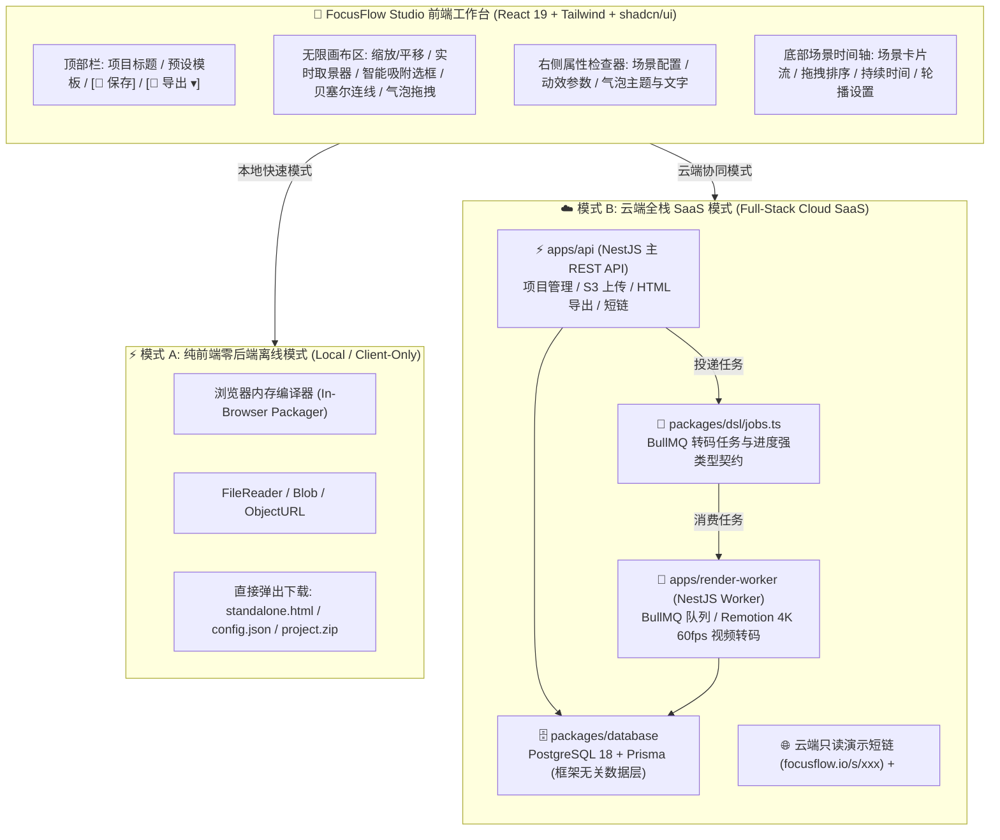

# FocusFlow - Phase 2 (Studio) 可视化创作工作台与全栈工程化设计规格说明书
## FocusFlow Studio & Full-Stack Cloud Architecture Specification

> **文档版本**：`v1.0.0`  
> **制定日期**：`2026-08-29`  
> **文档状态**：🚀 **Phase 2 (Studio 工作台与云端化) 核心工程规格 · 规划执行中**  
> **关联技术专刊**：
> - 📄 [PRODUCT_DESIGN.md (主产品方案与 PRD)](file:///Users/xt/WebstormProjects/focusflow/design/PRODUCT_DESIGN.md)
> - 🏗️ [MONOREPO_SPEC.md (Monorepo 工程化架构与改造规格)](file:///Users/xt/WebstormProjects/focusflow/design/MONOREPO_SPEC.md)
> - 📐 [MVP_SPEC.md (Phase 1 播放引擎与 HUD 执行规格)](file:///Users/xt/WebstormProjects/focusflow/design/MVP_SPEC.md)
> - 📐 [MOTION_ENGINE_SPEC.md (动效数学与渲染规格)](file:///Users/xt/WebstormProjects/focusflow/design/MOTION_ENGINE_SPEC.md)
> - 🔍 [EDGE_SNAPPER_ALGORITHM.md (智能边缘吸附与 Auto-Refine 算法专刊)](file:///Users/xt/WebstormProjects/focusflow/docs/EDGE_SNAPPER_ALGORITHM.md)
> 
> **适用对象**：前端架构师、全栈工程师、UI/UX 设计师、后端开发  
> **文档定位**：Phase 2 可视化创作工作室（FocusFlow Studio）从前端画布、时间轴到服务端项目管理、离线打包与视频渲染的端到端技术落地方案

---

## 目录 (Table of Contents)

- [1. Phase 2 核心定位与业务使命](#1-phase-2-核心定位与业务使命)
- [2. 系统整体架构：双模式运行体系 (Client-Only vs Cloud SaaS)](#2-系统整体架构双模式运行体系-client-only-vs-cloud-saas)
  - [2.1 模式 A (Client-Only) 纯前端零后端离线闭环机制与战略价值](#21-模式-a-client-only-纯前端零后端离线闭环机制与战略价值)
  - [2.2 模式 A 与 模式 B (云端全栈 SaaS) 清晰边界与全方位对比矩阵](#22-模式-a-与-模式-b-云端全栈-saas-清晰边界与全方位对比矩阵)
  - [2.3 双模式同构平滑演进与体验无缝切换](#23-双模式同构平滑演进与体验无缝切换)
- [3. 创作端 3 步闭环核心功能系统深度设计](#3-创作端-3-步闭环核心功能系统深度设计)
  - [3.1 环节一：项目创建与资产导入系统 (Project Ingestion)](#31-环节一项目创建与资产导入系统-project-ingestion)
  - [3.2 环节二：可视化无限画布与 4 大编辑工具 (Infinite Canvas & Tools)](#32-环节二可视化无限画布与-4-大编辑工具-infinite-canvas--tools)
  - [3.3 环节二 (续)：场景关键帧时间轴编排系统 (Scene & Sequence Timeline)](#33-环节二-续场景关键帧时间轴编排系统-scene--sequence-timeline)
  - [3.4 环节三：实时生成、预览与多形态导出下载 (Compilation, Preview & Exporter)](#34-环节三实时生成预览与多形态导出下载-compilation-preview--exporter)
- [4. 前端架构与技术栈选型规范 (Frontend Architecture)](#4-前端架构与技术栈选型规范-frontend-architecture)
- [5. 服务端全栈架构、REST API 与数据模型规范 (Full-Stack SaaS Backend)](#5-服务端全栈架构rest-api-与数据模型规范-full-stack-saas-backend)
- [6. Phase 2 研发任务分解与层级跟踪清单 (Hierarchical Task Checklist / WBS)](#6-phase-2-研发任务分解与层级跟踪清单-hierarchical-task-checklist--wbs)
- [7. Phase 2 验收测试标准 (Acceptance Criteria)](#7-phase-2-验收测试标准-acceptance-criteria)

---

## 1. Phase 2 核心定位与业务使命

### 1.1 阶段演进定位
在 **Phase 1 (MVP)** 阶段，FocusFlow 成功完成了**核心渲染引擎、动效数学、离线单文件打包与 HUD 快捷键标定工具**的建设，验证了极致的播放性能（60fps GPU 硬件加速、~35KB 极轻量体积）。但 Phase 1 仍要求创作者具备一定的代码与 JSON 编辑能力。

**Phase 2 的核心使命是：**
> **“从面向开发者的本地调试工具，全面跃迁为面向架构师、产品专家、讲师的现代化、零门槛 Web 可视化创作工作室（FocusFlow Studio）。”**

### 1.2 核心价值与 3 步闭环
创作者无需编写任何一行代码，只需 3 步即可完成顶级架构演进汇报：
```
       ┌────────────────────────┐      ┌──────────────────────────┐      ┌────────────────────────┐
       │   1. 拖入高分辨率架构图 │ ──>  │   2. 可视化框选与镜头编排 │ ──>  │ 3. 一键导出单文件/视频 │
       └────────────────────────┘      └──────────────────────────┘      └────────────────────────┘
                 [输入]                            [加工]                            [输出]
```

---

## 2. 系统整体架构：双模式运行体系 (Client-Only vs Cloud SaaS)

为兼顾“极客开发者的零成本私密离线使用”与“商业团队的在线云端协同与视频渲染”，Phase 2 采用**双模式同构架构**：



---

### 2.1 模式 A (Client-Only) 纯前端零后端离线闭环机制与战略价值

模式 A 像 **Excalidraw、Photopea 或 CyberChef** 一样，**100% 完全不需要任何后端服务、数据库或 Redis 依赖**，整个应用完全作为一个纯静态站点（Static Web App）自治运行于浏览器沙箱中：

```
                    【模式 A：纯前端 100% 离线自治闭环流水线】

 1. 底图拖拽导入 ──> 浏览器原生 FileReader / URL.createObjectURL(file) 读取进内存
 2. 尺寸自动侦测 ──> 浏览器 new Image() 瞬间读取天然物理基准分辨率 (如 5120x2880)
 3. 像素边缘吸附 ──> Canvas API + Web Worker 在本地执行 Sobel 算子图像边缘探测
 4. 工程状态暂存 ──> 浏览器 IndexedDB / localStorage 本地持久化 (页面刷新永不丢失)
 5. 单文件 HTML  ──> standalonePackager.ts 纯前端将底图 Base64 与 Player 内联为单文件
 6. ZIP 工程打包 ──> jszip 在浏览器内存中直接生成标准 .zip 二进制压缩包
 7. 文件保存下载 ──> 触发浏览器原生 Blob + <a download="focusflow.html"> 直接落盘
```

#### 模式 A 的两大战略杀手级价值：
1. **解决企业最高等级的“架构图安全与保密”痛点（100% 数据私密）**：
   * 大厂架构师、金融与安全专家绘制的系统拓扑通常包含内部敏感主机名、拓扑 IP、密钥分发链路等高密数据；
   * 模式 A 允许创作者在**完全断网、内网机、保密开发环境或离线无网络状态**下自由创作，**不向外网发送任何一个字节，彻底消除数据泄露与合规顾虑**！
2. **极致的零获客门槛与零服务器托管成本**：
   * **零门槛体验**：用户无需注册、无需登录、零等待，打开网页即可直接拖图制作；
   * **极低分发成本**：纯静态产物可直接托管于 GitHub Pages、Vercel Edge 或 Cloudflare CDN，全球分发成本几乎为 $0。

---

### 2.2 模式 A 与 模式 B (云端全栈 SaaS) 清晰边界与全方位对比矩阵

```
+------------------------+------------------------------------+------------------------------------+
| 评估维度                | ⚡ 模式 A: 纯前端零后端 (Client-Only)| ☁️ 模式 B: 云端全栈 SaaS (Cloud)    |
+------------------------+------------------------------------+------------------------------------+
| 1. 后端与数据库依赖    | 🏆 0 依赖 (无需 API / DB / Redis)  | 依赖 NestJS + PostgreSQL 18 + Redis|
| 2. 数据保密性与离线    | 🏆 100% 离线自治 (数据绝不上云)    | 数据加密持久化于云端数据库         |
| 3. 工程持久化与管理    | 浏览器 IndexedDB / 本地文件导入导出| 云端多设备自动同步与完整版本快照   |
| 4. 独立 HTML 导出      | 🏆 纯前端 Base64 内联瞬间下载      | 云端流式导出与 CDN 加速分发        |
| 5. 4K 60fps 视频渲染   | 本地 WebM 录制 (受限于用户本机性能)| 🏆 专用 render-worker + FFmpeg 转码|
| 6. 团队协同与权限控制  | 不支持 (单机独立创作)              | 🏆 CASL (Owner/Editor/Viewer 协同) |
| 7. 在线分享与嵌入      | 手动发送导出的 standalone.html     | 🏆 一键生成短链与 <iframe> 知识库嵌入|
| 8. 适用目标群体        | 极客开发者、内网保密项目、单机快速演练| 企业研发团队、跨国架构评审、SaaS 会员|
+------------------------+------------------------------------+------------------------------------+
```

---

### 2.3 双模式同构平滑演进与体验无缝切换

FocusFlow Studio 前端采用**适配器架构（Storage & Export Adapter Pattern）**：
* 当未登录或处于离线模式时，工作台自动挂载 `LocalStorageAdapter` 与 `ClientCompilerAdapter`，一切功能全部在本地浏览器内存中极速运转；
* 当用户点击“登录云端同步”时，工作台无缝切换为 `CloudApiAdapter`，将本地 DSL 与底图一键上传持久化至云端，实现**“离线即开即用，云端无缝升维”**的顶级用户体验！

---

## 3. 创作端 3 步闭环核心功能系统深度设计

### 3.1 环节一：项目创建与资产导入系统 (Project Ingestion)

#### 1. 拖拽极速创建 (Drag-to-Create)
* **交互体验**：打开 Studio 首页，直接将任意一张高分辨率 PNG、SVG、JPEG 拖入工作台；
* **分辨率自动侦测**：前端通过 `Image.decode()` 或二进制 ArrayBuffer 快速提取底图的天然物理分辨率（如 $5120\times 2880$），自动将其初始化为 `meta.viewport.width` 与 `meta.viewport.height`；
* **初始 DSL 生成**：自动生成 Scene 0（全局全景开场场景），立即进入编辑态。

#### 2. 工程重开与导入 (Re-Open & Import)
* 支持直接拖入历史导出的 `config.json` 或 `project.zip`，瞬间恢复所有场景、图层、气泡与镜头位置；
* 支持多图片管理（如新增画中画覆盖图 `images` 资产）。

#### 3. 预置行业模板库 (Template Gallery)
* 内置 5 套开箱即用的标准架构图模板（微服务电商、高可用容灾、云原生 K8s、AI 训练集群、金融支付风控），供创作者一键体验与克隆修改。

---

### 3.2 环节二：可视化无限画布与 4 大编辑工具 (Infinite Canvas & Tools)

```
 ┌─────────────────────────────────────────────────────────────────────────────────┐
 │ 🔍 [100% ▾] [✋ 抓手] [🔲 选框] [⚡ 连线] [💬 气泡] [🖼️ 覆盖图] │ 👁️ 预览  💾 保存  🚀 导出 ▾│
 ├────────────────────────────────────────────────────────┬────────────────────────┤
 │                                                        │ 🛠️ 属性检查器 (Inspector)│
 │                                                        ├────────────────────────┤
 │                                                        │ 📐 镜头与视口 (Camera)  │
 │                   🎨 可视化无限画布                    │ • 缩放比例: 1.75x      │
 │                                                        │ • 偏移: X:-14%, Y:8%   │
 │              ┌ - - - - - - - - - - - ┐                 ├────────────────────────┤
 │              ┆  [取景安全边界视口框] ┆                 │ 🔲 选中图元 (Box/Line) │
 │              ┆    ┌──────────────┐   ┆                 │ • ID: box-postgres     │
 │              ┆    │ PostgreSQL16 │   ┆                 │ • 描边: #34d399 (6px)  │
 │              ┆    └──────────────┘   ┆                 │ • 发光: [✓] 霓虹光晕   │
 │              └ - - - - - - - - - - - ┘                 ├────────────────────────┤
 │                                                        │ 💬 解说气泡 (Callout)  │
 │                                                        │ • 标题: PostgreSQL 16  │
 │                                                        │ • 主题: [ 🟢 Green ▾ ] │
 ├────────────────────────────────────────────────────────┴────────────────────────┤
 │ 🎬 场景序列时间轴: [01 全局总览] ➔ [02 核心数据链路] ➔ [03 鉴权下钻] ➔ [+] 新增场景 │
 └─────────────────────────────────────────────────────────────────────────────────┘
```

#### 工具 1：镜头取景器 (Camera Viewport Frame)
* **交互体验**：在画布上任意缩放和平移底图，画面中央实时呈现当前场景的“受众实际可视安全窗口（Frustum）”；
* **一键同步**：点击“捕获当前镜头”或调整右侧滑块，自动计算出精确的 `{ zoom, x, y, duration }`。

#### 工具 2：智能选框工具 (Smart Box Tool)
* **三重模式无缝融合**：
  * **模式 A（随手粗拉 + 自动贴合）**：随手拉框，松手瞬间调用 $\pm 24\text{px}$ 窄带 Sobel 精修算法，自动咬合外框；
  * **模式 B（纯手动精确拉框）**：按住 `⌘ / Option`（或关闭吸附开关）拖拽，100% 精确表达创作者自定义留白与局部框选；
  * **模式 C（单点智能吸附）**：Option/Alt+单击卡片空白处，50ms 内自动识别卡片包围盒；
* **圆角与描边可视化调整**：在右侧面板直接调节 `rx` 圆角、`stroke` 颜色、`strokeWidth` 及发光模式。

#### 工具 3：拓扑流光连线生成器 (Bezier Route Tool)
* **磁吸锚点连接**：点击源卡片的 8 向锚点（如 `box-folio.right`），鼠标拖出连线吸附至目标卡片锚点（如 `box-postgres.left-top`）；
* **自动三次贝塞尔曲线推导**：引擎实时绘制高科技流光动效预览；
* **模式切换**：支持一键切换 `stream`（跑马灯流动）或 `draw`（单次描边生长）。

#### 工具 4：毛玻璃气泡所见即所得编辑器 (Callout Visual Editor)
* **直接拖拽定位**：直接在画布上拖拽气泡至最佳展示位置，自动换算为自适应百分比坐标（如 `left: "33%", top: "33%"`）；
* **富文本与主题徽章**：可视化选择 5 大预设配色主题（Blue / Green / Amber / Pink / Cyan），实时预览阶梯弹入动效。

---

### 3.3 环节二 (续)：场景关键帧时间轴编排系统 (Scene & Sequence Timeline)

* **场景卡片流（Scene Sequence Track）**：
  * 底部直观展示当前项目的全部场景步骤缩略卡片（`Scene 1 ➔ Scene 2 ➔ Scene 3`）；
  * 支持鼠标拖拽卡片自由调整讲解先后顺序；
  * 支持一键“复制场景”、“删除场景”与“插入过渡帧”；
* **图元可见性开关矩阵（Active Elements Matrix）**：
  * 选中某个场景时，画布与右侧面板列出所有已有 Boxes、Paths、Dots、Images；
  * 创作者只需通过开关勾选，即可决定该元素在当前场景中是“激活展示”还是“平滑隐藏”。

---

### 3.4 环节三：实时生成、预览与多形态导出下载 (Compilation, Preview & Exporter)

```
                                【多形态一键导出矩阵】

                                   [🚀 点击导出]
                                         │
        ┌────────────────────────────────┼────────────────────────────────┐
        ▼                                ▼                                ▼
【📦 独立离线单文件 HTML】        【📄 DSL 配置文件与源码包】       【🎥 4K 60fps MP4 / GIF】
 • 0 依赖，全 Base64 内联         • config.json + 资产包           • 服务端 Remotion / Puppeteer
 • 双击秒开，本地/内网完美演示   • 供开发者二次定制与 Git 托管    • 视频平台 / PPT 嵌入首选
```

#### 导出 1：独立离线单文件 HTML 下载 (`.html`)
* **原理**：前端调用内置的 Standalone Packager 引擎，将 DSL、CSS 样式、IIFE JS 运行库及底图（转为 Data URI）打包成单一 `.html` 文件；
* **体验**：浏览器点击一键弹出下载，文件大小通常仅 2~5MB，双击离线即开，无需任何环境。

#### 导出 2：标准 DSL 源码与工程包 (`config.json` / `project.zip`)
* 导出标准 FocusFlow DSL JSON 结构与图片素材压缩包，方便工程化版本控制。

#### 导出 3：服务端 4K 60fps MP4 / 高清 GIF 视频渲染导出
* **渲染管线**：服务端无头浏览器步进截帧 + FFmpeg 硬件加速转码；
* **体验**：提供标准 1080P、2K 及 4K Ultra HD MP4 视频文件下载，可直接插入 Keynote、PPT 或发布到 B站/YouTube。

#### 导出 4：云端只读演示短链与知识库 `<iframe>` 嵌入
* 一键生成 `https://focusflow.io/s/[slug]` 短链；
* 提供自适应 `<iframe>` 代码，支持嵌入 Notion、飞书文档、语雀、Docusaurus。

---

## 4. 前端架构与技术栈选型规范 (Frontend Architecture)

### 4.1 技术栈选型
| 模块 | 选型技术 | 核心考量依据 |
| :--- | :--- | :--- |
| **UI 核心框架** | **React 19 + TypeScript** | 声明式状态机、与复杂树形/时间轴组件高度契合、生态最完善 |
| **样式与组件库** | **Tailwind CSS + shadcn/ui** | 极具现代科技感的暗黑设计风格、高定制性、零冗余运行时开销 |
| **全局状态管理** | **Zustand** | 极简无样板代码、支持切片（Slices）、与 Phase 1 Player 状态机天然同构 |
| **图标与视觉系统** | **Lucide React** | 统一现代矢量图标集 |
| **工程构建工具** | **Vite 8** | 毫秒级 HMR 热更新、极速生产打包与模块热替换 |

### 4.2 前端目录规划与当前项目目录的架构关系 (Repository & Monorepo Architecture)

#### 1. 核心定位与解耦关系
当前 FocusFlow 根工程（`focusflow/`）与 Phase 2 的 `focusflow-studio` 采用**“内核引擎（Core Engine）与上层工作台（Editor Shell）解耦”**的现代化 Monorepo / 多包协作架构：

```
                    【FocusFlow 现代化多包协同工程全景】

 ┌────────────────────────────────────────────────────────────────────────┐
 │                    FocusFlow Workspace (Monorepo)                      │
 ├───────────────────────────────────┬────────────────────────────────────┤
 │ 📦 packages/player-core (当前 src/)│ 🎨 apps/studio (focusflow-studio/)  │
 │ • 纯原生 JS / 零外部依赖运行时    │ • React 19 + Tailwind + shadcn/ui   │
 │ • 60fps GPU 镜头运动学与安全边界  │ • 可视化无限画布与 4 大编辑工具     │
 │ • SVG 几何测长与三次贝塞尔流光    │ • 关键帧场景时间轴与气泡实时编辑器  │
 │ • 离线独立单文件打包器模板        │ • 导入 @focusflow/player-core 实例  │
 ├───────────────────────────────────┴────────────────────────────────────┤
 │ 📦 packages/dsl-schema (类型与契约): 共享 FocusFlow DSL TypeScript 声明 │
 └────────────────────────────────────────────────────────────────────────┘
```

* **`packages/player-core`（即当前的 `src/` 核心目录）**：
  * **角色**：底层的**纯运行时播放器内核（Runtime Renderer）**；
  * **特性**：保持 100% 零外部大型框架依赖（~35KB 极简体积），专注于 60fps 动效渲染、镜头矩阵变换与单文件独立运行。
* **`apps/studio`（即 `focusflow-studio/` 工作台目录）**：
  * **角色**：上层的**可视化交互制作工具（Authoring Studio）**；
  * **协作方式**：直接依赖并实例化 `packages/player-core` 作为画布中央的“实时渲染视口（Live Viewport）”，通过 Zustand 状态变更实时驱动播放器，实现 100% 所见即所得的双向绑定！

#### 2. Studio 前端工程内部目录结构 (`apps/studio/` 或 `focusflow-studio/`)
```text
apps/studio/
├── public/templates/            # 预置官方架构图模板
├── src/
│   ├── routes/                  # 🚦 TanStack Router 强类型文件路由
│   │   ├── __root.tsx           # 根路由布局 (QueryClientProvider & Toaster)
│   │   ├── index.tsx            # / (项目大厅与模板中心)
│   │   ├── project.new.tsx      # /project/new (底图拖拽创建向导)
│   │   ├── project.$projectId.tsx # /project/:projectId (三栏可视化工作台)
│   │   └── share.$slug.tsx      # /share/:slug (云端只读分享视图)
│   ├── api/                     # 🌐 Orval 自动化生成的类型安全客户端 SDK
│   │   ├── generated/           # 自动生成的 React Query Hooks (useGetProjectById, useUpdateProject)
│   │   ├── model/               # 自动生成的 TypeScript DTO 契约模型
│   │   └── custom-fetch.ts      # 全局 Fetch 拦截器与 BaseURL 注入
│   ├── components/              # Studio 专属 UI 组件库
│   │   ├── canvas/              # 可视化无限画布与图层控制器
│   │   │   ├── InfiniteCanvas.tsx   # 缩放平移手势画布
│   │   │   ├── CameraFrame.tsx      # 镜头取景安全边界框
│   │   │   ├── BoxLayer.tsx         # 智能选框绘制图层
│   │   │   └── PathLayer.tsx        # 贝塞尔连线吸附图层
│   │   ├── timeline/            # 底部场景时间轴
│   │   │   ├── TimelineTrack.tsx    # 场景序列轨道
│   │   │   └── SceneCard.tsx        # 单场景缩略卡片
│   │   ├── inspector/           # 右侧属性检查器
│   │   │   ├── CameraInspector.tsx  # 镜头参数与转场时间
│   │   │   ├── BoxInspector.tsx     # 选框样式/颜色/圆角
│   │   │   └── CalloutInspector.tsx # 气泡文字/主题徽章
│   │   ├── topbar/              # 顶部导航栏与导出菜单
│   │   │   └── Topbar.tsx
│   │   └── modals/              # 弹窗 (全屏预览、模板选择等)
│   ├── stores/                  # Zustand 状态切片
│   │   ├── useProjectStore.ts   # 项目 DSL 与场景序列状态
│   │   ├── useCanvasStore.ts    # 画布平移、缩放与当前工具
│   │   └── useHistoryStore.ts   # 撤销/重做 (Undo/Redo 栈)
│   ├── compiler/                # 浏览器端纯前端打包编译器
│   │   └── standalonePackager.ts # 动态内联 Base64 生成单文件 HTML
│   ├── App.tsx
│   └── main.tsx
├── orval.config.ts              # ⚙️ Orval 自动化 OpenAPI 代码生成配置文件
├── package.json
└── vite.config.ts               # Vite 8 配置文件 (集成 @tanstack/router-plugin)
```

---

## 5. 服务端全栈架构、REST API 与数据模型规范 (Full-Stack SaaS Backend)

### 5.1 与 PRODUCT_DESIGN.md 8.3 节的关联性与边界划分 (Correlation & Boundaries)

为了确保产品 PRD 与技术架构 SPEC 的严谨统一，两份文档的分工与边界定义如下：

```
+---------------------------------------------------------------------------------------------------------+
|                                  PRD 商业产品方案  vs  SPEC 技术规格落地                                  |
+----------------------+------------------------------------+---------------------------------------------+
| 评估维度              | PRODUCT_DESIGN.md (第 8.3 节)       | STUDIO_SPEC.md (第 5 节)                    |
+----------------------+------------------------------------+---------------------------------------------+
| 1. 文档定位与视角    | 宏观产品定位、商业价值与用户使用场景| 微观工程实现、API 契约、数据模型与转码管线   |
| 2. 核心回答问题      | “我们要给用户提供哪 4 大核心能力？”| “我们如何用技术架构、数据库与代码实现这 4 大能力？”|
| 3. 颗粒度与交付物    | 模块功能列表、交互流程、商业分享模式| Prisma Schema、REST API 端点签名、错误码定义|
+----------------------+------------------------------------+---------------------------------------------+
```

#### 4 大核心能力的一对一技术映射表：
1. **PRD 模块 1【服务端项目管理与资产托管】** ➔ 映射至 **SPEC §5.2 数据模型 (`Project` & `ProjectVersion` 表)** 与 **SPEC §5.3 项目 CRUD API (`POST /api/projects`, `PUT /api/projects/:id`)**；
2. **PRD 模块 2【服务端单文件 HTML 一键编译下载】** ➔ 映射至 **SPEC §5.3 流式下载控制器 (`GET /api/projects/:id/export/html`)** 与无状态内联打包算法；
3. **PRD 模块 3【服务端 4K 视频 / GIF 云端渲染管线】** ➔ 映射至 **SPEC §5.3 异步转码任务系统 (`POST /api/projects/:id/render/video`)** 与 Remotion / Puppeteer Worker 集群；
4. **PRD 模块 4【云端免部署只读分享与嵌入】** ➔ 映射至 **SPEC §5.3 短链路由 (`GET /s/:slug`)** 与 CSP / `<iframe>` 响应头配置。

---

### 5.2 服务端全栈多服务架构与选型 (Multi-App Backend Architecture)

为了杜绝 4K 视频转码重度消耗 CPU/GPU 导致主 Web API 卡死，服务端采用 **“主 API 服务与转码工作节点物理隔离”** 的多应用架构：

1. **主 RESTful API 服务 (`apps/api`)**：
   * **定位**：轻量 I/O 密集型服务，响应延迟 $<50\text{ms}$；
   * **技术栈**：NestJS + Swagger 接口文档 + DTO `class-validator` 强参数校验；
   * **职责**：项目 CRUD、PostgreSQL 18 数据持久化、S3/OSS 资产直传、独立 HTML 导出与只读短链路由。
2. **4K 视频转码工作节点 (`apps/render-worker`)**：
   * **定位**：重度计算密集型后台 Worker；
   * **技术栈**：NestJS + BullMQ / Redis Queue + Remotion / Puppeteer + FFmpeg 硬件加速；
   * **职责**：消费转码队列任务，无头浏览器逐帧截帧与视频合成，支持独立水平扩缩容。
3. **框架无关数据层 (`packages/database`)**：
   * **数据库**：**PostgreSQL 18** + Prisma ORM；
   * **零 NestJS 依赖**：保持纯粹数据模型定义，仅导出原生 `PrismaClient`，可供 API、Worker 以及离线 CLI 脚本灵活调用。
4. **消息队列强类型契约 (`packages/dsl/src/jobs.ts`)**：
   * 在 `@focusflow/dsl` 统一维护 `RenderVideoJobPayload` 与进度事件接口，确保生产者与消费者 100% 类型一致。

### 5.3 核心数据模型 (`packages/database/prisma/schema.prisma`)
```prisma
model Project {
  id          String   @id @default(uuid())
  title       String
  description String?
  slug        String   @unique
  viewportW   Int      @default(5120)
  viewportH   Int      @default(2880)
  bgImageUrl  String
  dslJson     Json     // 完整 FocusFlow DSL 数据结构
  isPublic    Boolean  @default(false)
  ownerId     String
  createdAt   DateTime @default(now())
  updatedAt   DateTime @updatedAt
  versions    ProjectVersion[]
}

model ProjectVersion {
  id        String   @id @default(uuid())
  projectId String
  project   Project  @relation(fields: [projectId], references: [id], onDelete: Cascade)
  versionNo Int
  dslJson   Json
  createdAt DateTime @default(now())
}
```

### 5.4 核心 RESTful API 契约
| 方法 | 端点 | 功能说明 | 核心入参 / 返回 |
| :--- | :--- | :--- | :--- |
| `POST` | `/api/projects` | 创建新项目并上传底图 | `multipart/form-data (image, title)` ➔ `{ id, slug, dslJson }` |
| `GET` | `/api/projects/:id` | 获取项目完整 DSL 与资产 | ➔ `{ id, title, dslJson, bgImageUrl }` |
| `PUT` | `/api/projects/:id` | 实时保存项目 DSL | `{ dslJson }` ➔ `{ success: true, updatedAt }` |
| `GET` | `/api/projects/:id/export/html` | 服务端一键下载单文件 HTML | ➔ `Content-Disposition: attachment; filename="*.html"` |
| `POST` | `/api/projects/:id/render/video` | 提交 4K 视频渲染任务 | `{ resolution: "4K"|"1080P", fps: 60 }` ➔ `{ taskId }` |
| `GET` | `/api/tasks/:taskId` | 查询视频渲染进度与下载链接 | ➔ `{ status: "processing"|"done", downloadUrl }` |
| `GET` | `/s/:slug` | 云端只读演示页面入口 | 返回渲染后的只读 FocusFlow Player 播放器 |

---

## 6. Phase 2 研发任务分解与层级跟踪清单 (Hierarchical Task Checklist / WBS)

### 🎨 Stage 1: Studio 前端工程基建与无限画布容器 (Studio Foundation & Canvas)
- [ ] **1.1 项目脚手架与 UI 组件库搭建**
  - [ ] 1.1.1 初始化 React 19 + TypeScript + Vite 8 工程，集成 Tailwind CSS 与 shadcn/ui
  - [ ] 1.1.2 搭建暗黑科技感三栏工作台布局（TopBar, LeftToolbox, CenterCanvas, RightInspector, BottomTimeline）
- [ ] **1.2 可视化无限画布核心 (`InfiniteCanvas`)**
  - [ ] 1.2.1 实现鼠标滚轮缩放（Zoom-to-Cursor）与平滑平移（Pan/Grab）
  - [ ] 1.2.2 实现主底图自适应居中与物理像素视口坐标系统映射

---

### 📥 Stage 2: 资产导入、项目创建与模板系统 (Project Ingestion & Templates)
- [ ] **2.1 极速创建项目与底图解析**
  - [ ] 2.1.1 实现拖拽图片直接创建项目，前端自动解析分辨率并初始化 DSL
  - [ ] 2.1.2 实现 `config.json` 与历史工程 ZIP 导入回显
- [ ] **2.2 预置行业模板库集成**
  - [ ] 2.2.1 内置 5 大精选场景架构图模板，支持一键克隆体验

---

### 🛠️ Stage 3: 可视化取景与图元标定编辑工具 (Visual Tools & Framing)
- [ ] **3.1 镜头取景器 (Camera Viewport Frame)**
  - [ ] 3.1.1 在画布上可视化呈现当前场景的安全可视窗口，支持拖拽推拉
  - [ ] 3.1.2 一键捕获当前画布视角为场景镜头参数
- [ ] **3.2 智能选框可视化绘制 (Smart Box Tool)**
  - [ ] 3.2.1 深度集成 Phase 1 的 Sobel $\pm 24\text{px}$ 窄带智能自动贴合算法
  - [ ] 3.2.2 支持 `⌘/Option` 纯手动绘制直通与圆角、描边、发光属性实时调整
- [ ] **3.3 拓扑流光连线与 8 向锚点吸附 (Bezier Route Tool)**
  - [ ] 3.3.1 实现卡片 8 向锚点可视化捕捉与三次贝塞尔流光连线拖拽生成
- [ ] **3.4 毛玻璃气泡所见即所得编辑器 (Callout Visual Editor)**
  - [ ] 3.4.1 支持在画布上直接拖拽放置气泡，实时配置富文本与主题徽章

---

### 🎬 Stage 4: 场景时间轴编排与多选图层管理 (Sequence Timeline & Layer Matrix)
- [ ] **4.1 场景卡片流时间轴 (`TimelineTrack`)**
  - [ ] 4.1.1 实现场景缩略卡片列表展示、拖拽排序、复制与删除
  - [ ] 4.1.2 支持单场景持续时间（Duration）与自动轮播时序配置
- [ ] **4.2 图层可见性矩阵管理**
  - [ ] 4.2.1 提供当前场景激活图元（Boxes, Paths, Dots, Images）的可视化勾选面板

---

### 📦 Stage 5: 纯前端零后端单文件编译与下载引擎 (Browser-side Compiler)
- [ ] **5.1 浏览器端离线打包器 (`standalonePackager.ts`)**
  - [ ] 5.1.1 纯前端将底图与覆盖图转为 Base64 Data URI
  - [ ] 5.1.2 动态内联 CSS 样式与 IIFE 运行时，使用 `Blob` 实现 0 延迟一键下载 `.html`
- [ ] **5.2 实时受众全屏预览模式**
  - [ ] 5.2.1 在工作台内提供一键全屏真实受众视角试播与翻页测试

---

### ☁️ Stage 6: 服务端 SaaS 平台、云端短链与视频渲染管线 (Full-Stack Cloud SaaS)
- [ ] **6.1 服务端 API 与项目云端存储**
  - [ ] 6.1.1 使用 NestJS + PostgreSQL 18 + Prisma 构建项目管理 RESTful API
  - [ ] 6.1.2 集成 S3/OSS 对象存储，实现大图直传与 CDN 加速
- [ ] **6.2 云端免部署只读分享与嵌入**
  - [ ] 6.2.1 动态生成 `https://focusflow.io/s/:slug` 沉浸式只读演示页
  - [ ] 6.2.2 提供 Notion/飞书/语雀 `<iframe>` 嵌入标签
- [ ] **6.3 服务端 Remotion / Puppeteer 4K 视频渲染集群**
  - [ ] 6.3.1 搭建无头浏览器逐帧截帧与 FFmpeg 合成流水线，支持 4K 60fps MP4 / GIF 导出

---

## 7. Phase 2 验收测试标准 (Acceptance Criteria)

| 验收项 | 验收指标与测试标准 | 预期结果 |
| :--- | :--- | :--- |
| **1. 拖拽创建项目** | 将一张 4K/8K 架构图直接拖入 Studio 工作台 | 1 秒内完成分辨率探测，自动初始化画布与 Scene 0 镜头 |
| **2. 可视化取景与运镜** | 缩放画布至目标区域，点击“捕获镜头” | 自动换算精确的 `zoom/x/y`，在时间轴切换时精准还原运镜 |
| **3. 智能选框绘制** | 在目标卡片外随手粗拉框 | 松手瞬间触发 $\pm 24\text{px}$ Sobel 精修，自动咬合外边框 |
| **4. 纯手动直通拉框** | 按住 `⌘/Option` 拖拽选框 | 100% 精确保留手动画框坐标，零算法干预 |
| **5. 贝塞尔连线吸附** | 从卡片 A 锚点拖出线条连接至卡片 B 锚点 | 自动推导平滑三次贝塞尔曲线，并实时呈现跑马灯流光预览 |
| **6. 气泡所见即所得** | 拖拽气泡在画布任意位置并修改标题和描述 | 属性实时更新，并在演示预览时阶梯弹性弹入 |
| **7. 纯前端离线下载** | 在无网络/纯前端模式下点击“导出单文件 HTML” | 浏览器瞬间弹出独立 `.html` 下载，离线双击完美运行 |
| **8. 时间轴拖拽排序** | 在底部时间轴拖拽调整 Scene 1 和 Scene 2 的顺序 | 场景顺序立即更新，播放状态机按新顺序流转 |
| **9. 云端短链只读分享** | 打开 `https://focusflow.io/s/[slug]` | 任何设备免登录直接全屏交互式观看演示 |
| **10. 4K 视频云端渲染** | 提交 4K MP4 导出任务 | 服务端异步完成 60fps 高清转码并提供 MP4 文件下载 |
