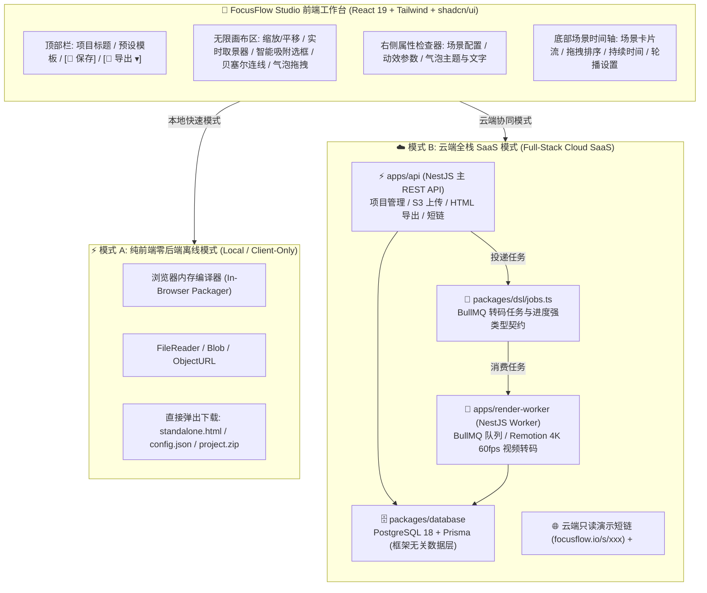

# FocusFlow - Phase 2 (Studio) 可视化创作工作台与全栈工程化设计规格说明书
## FocusFlow Studio & Full-Stack Cloud Architecture Specification

> **文档版本**：`v1.0.0`  
> **制定日期**：`2026-08-29`  
> **文档状态**：🚀 **Phase 2 (Studio 工作台与云端化) 核心工程规格 · 规划执行中**  
> **关联技术专刊**：
> - 📄 [PRODUCT_DESIGN.md (主产品方案与 PRD)](file:///Users/xt/WebstormProjects/focusflow/design/PRODUCT_DESIGN.md)
> - 🏗️ [MONOREPO_SPEC.md (Monorepo 工程化架构与改造规格)](file:///Users/xt/WebstormProjects/focusflow/design/MONOREPO_SPEC.md)
> - 📐 [MVP_SPEC.md (Phase 1 播放引擎与 HUD 执行规格)](file:///Users/xt/WebstormProjects/focusflow/design/MVP_SPEC.md)
> - 📐 [MOTION_ENGINE_SPEC.md (动效数学与渲染规格)](file:///Users/xt/WebstormProjects/focusflow/design/MOTION_ENGINE_SPEC.md)
> - 📷 [CAMERA_FRUSTUM_SPEC.md (运镜摄像机与取景框数学原理与交互设计规范)](file:///Users/xt/WebstormProjects/focusflow/design/CAMERA_FRUSTUM_SPEC.md)
> - 🔍 [EDGE_SNAPPER_ALGORITHM.md (智能边缘吸附与 Auto-Refine 算法专刊)](file:///Users/xt/WebstormProjects/focusflow/docs/EDGE_SNAPPER_ALGORITHM.md)
> 
> **适用对象**：前端架构师、全栈工程师、UI/UX 设计师、后端开发  
> **文档定位**：Phase 2 可视化创作工作室（FocusFlow Studio）从前端画布、时间轴到服务端项目管理、离线打包与视频渲染的端到端技术落地方案

---

## 目录 (Table of Contents)

- [1. Phase 2 核心定位与业务使命](#1-phase-2-核心定位与业务使命)
  - [1.1 阶段演进定位](#11-阶段演进定位)
  - [1.2 核心价值与 3 步闭环](#12-核心价值与-3-步闭环)
- [2. 系统整体架构：双模式运行体系 (Client-Only vs Cloud SaaS)](#2-系统整体架构双模式运行体系-client-only-vs-cloud-saas)
  - [2.1 模式 A (Client-Only) 纯前端零后端离线闭环机制与战略价值](#21-模式-a-client-only-纯前端零后端离线闭环机制与战略价值)
  - [2.2 模式 A 与 模式 B (云端全栈 SaaS) 清晰边界与全方位对比矩阵](#22-模式-a-与-模式-b-云端全栈-saas-清晰边界与全方位对比矩阵)
  - [2.3 双模式同构平滑演进与体验无缝切换](#23-双模式同构平滑演进与体验无缝切换)
- [3. 创作端 3 步闭环核心功能系统深度设计](#3-创作端-3-步闭环核心功能系统深度设计)
  - [3.1 环节一：项目创建与资产导入系统 (Project Ingestion)](#31-环节一项目创建与资产导入系统-project-ingestion)
  - [3.2 环节二：可视化无限画布与 4 大编辑工具 (Infinite Canvas & Tools)](#32-环节二可视化无限画布与-4-大编辑工具-infinite-canvas--tools)
    - [3.2.4 标定助手与独立播放控制栏职责解耦规范 (Calibration Assistant & Player Controls Decoupling)](#标定助手与独立播放控制栏职责解耦规范-calibration-assistant--player-controls-decoupling)
    - [3.2.5 运镜摄像机与安全取景框数学原理与交互规范 (Camera Kinematics & Frustum Specification)](#325-运镜摄像机-camera-与安全取景框-frustum-数学原理与交互规范)
  - [3.3 环节二 (续)：场景关键帧时间轴编排系统 (Scene & Sequence Timeline)](#33-环节二-续场景关键帧时间轴编排系统-scene--sequence-timeline)
  - [3.4 环节三：实时生成、预览与多形态导出下载 (Compilation, Preview & Exporter)](#34-环节三实时生成预览与多形态导出下载-compilation-preview--exporter)
- [4. 前端架构与技术栈选型规范 (Frontend Architecture)](#4-前端架构与技术栈选型规范-frontend-architecture)
  - [4.1 技术栈选型](#41-技术栈选型)
  - [4.2 前端目录规划与多包协作架构](#42-前端目录规划与当前项目目录的架构关系-repository--monorepo-architecture)
  - [4.3 科技双主题系统与纯 Token 语义类架构 (Theme System & Semantic Tokens Architecture)](#43-科技双主题系统与纯-token-语义类架构-theme-system--semantic-tokens-architecture)
  - [4.4 专业工作台字阶与按键系统规范 (Professional Workbench Typography & Button System)](#44-专业工作台字阶与按键系统规范-professional-workbench-typography--button-system)
  - [4.5 全局快捷键引擎与交互规范 (Global Studio Keyboard Engine)](#45-全局快捷键引擎与交互规范-global-studio-keyboard-engine)
- [5. 服务端全栈架构、REST API 与数据模型规范 (Full-Stack SaaS Backend)](#5-服务端全栈架构rest-api-与数据模型规范-full-stack-saas-backend)
  - [5.1 与 PRODUCT_DESIGN.md 8.3 节的关联性与边界划分 (Correlation & Boundaries)](#51-与-product_designmd-83-节的关联性与边界划分-correlation--boundaries)
  - [5.2 服务端全栈多服务架构与选型 (Multi-App Backend Architecture)](#52-服务端全栈多服务架构与选型-multi-app-backend-architecture)
  - [5.3 核心数据模型 (Prisma Schema)](#53-核心数据模型-packagesdatabaseprismaschemaprisma)
  - [5.4 核心 RESTful API 契约](#54-核心-restful-api-契约)
- [6. Phase 2 研发任务分解与层级跟踪清单 (Hierarchical Task Checklist / WBS)](#6-phase-2-研发任务分解与层级跟踪清单-hierarchical-task-checklist--wbs)
- [7. Phase 2 验收测试标准 (Acceptance Criteria)](#7-phase-2-验收测试标准-acceptance-criteria)

---

## 1. Phase 2 核心定位与业务使命

### 1.1 阶段演进定位
在 **Phase 1 (MVP)** 阶段，FocusFlow 成功完成了**核心渲染引擎、动效数学、离线单文件打包与 HUD 快捷键标定工具**的建设，验证了极致的播放性能（60fps GPU 硬件加速、~35KB 极轻量体积）。但 Phase 1 仍要求创作者具备一定的代码与 JSON 编辑能力。

**Phase 2 的核心使命是：**
> **“从面向开发者的本地调试工具，全面跃迁为面向架构师、产品专家、讲师的现代化、零门槛 Web 可视化创作工作室（FocusFlow Studio）。”**

### 1.2 核心价值与 3 步闭环
创作者无需编写任何一行代码，只需 3 步即可完成顶级架构演进汇报：
```
       ┌────────────────────────┐      ┌──────────────────────────┐      ┌────────────────────────┐
       │   1. 拖入高分辨率架构图 │ ──>  │   2. 可视化框选与镜头编排 │ ──>  │ 3. 一键导出单文件/视频 │
       └────────────────────────┘      └──────────────────────────┘      └────────────────────────┘
                 [输入]                            [加工]                            [输出]
```

---

## 2. 系统整体架构：双模式运行体系 (Client-Only vs Cloud SaaS)

为兼顾“极客开发者的零成本私密离线使用”与“商业团队的在线云端协同与视频渲染”，Phase 2 采用**双模式同构架构**：



---

### 2.1 模式 A (Client-Only) 纯前端零后端离线闭环机制与战略价值

模式 A 像 **Excalidraw、Photopea 或 CyberChef** 一样，**100% 完全不需要任何后端服务、数据库或 Redis 依赖**，整个应用完全作为一个纯静态站点（Static Web App）自治运行于浏览器沙箱中：

```
                    【模式 A：纯前端 100% 离线自治闭环流水线】

 1. 底图拖拽导入 ──> 浏览器原生 FileReader / URL.createObjectURL(file) 读取进内存
 2. 尺寸自动侦测 ──> 浏览器 new Image() 瞬间读取天然物理基准分辨率 (如 5120x2880)
 3. 像素边缘吸附 ──> Canvas API + Web Worker 在本地执行 Sobel 算子图像边缘探测
 4. 工程状态暂存 ──> 浏览器 IndexedDB / localStorage 本地持久化 (页面刷新永不丢失)
 5. 单文件 HTML  ──> standalonePackager.ts 纯前端将底图 Base64 与 Player 内联为单文件
 6. ZIP 工程打包 ──> jszip 在浏览器内存中直接生成标准 .zip 二进制压缩包
 7. 文件保存下载 ──> 触发浏览器原生 Blob + <a download="focusflow.html"> 直接落盘
```

#### 模式 A 的两大战略杀手级价值：
1. **解决企业最高等级的“架构图安全与保密”痛点（100% 数据私密）**：
   * 大厂架构师、金融与安全专家绘制的系统拓扑通常包含内部敏感主机名、拓扑 IP、密钥分发链路等高密数据；
   * 模式 A 允许创作者在**完全断网、内网机、保密开发环境或离线无网络状态**下自由创作，**不向外网发送任何一个字节，彻底消除数据泄露与合规顾虑**！
2. **极致的零获客门槛与零服务器托管成本**：
   * **零门槛体验**：用户无需注册、无需登录、零等待，打开网页即可直接拖图制作；
   * **极低分发成本**：纯静态产物可直接托管于 GitHub Pages、Vercel Edge 或 Cloudflare CDN，全球分发成本几乎为 $0。

#### 模式 A 的两种纯本地/单机视频导出方案 (零后端服务依赖)：
若处于离线/单机模式 A 的创作者需要导出视频，无需连接任何后端服务，可通过以下两种纯本地方案完成：
1. **方案 1：纯浏览器客户端录制 (Client-side `MediaRecorder`)**：
   * 浏览器利用原生 HTML5 Canvas Capture 与 `MediaRecorder` API，直接在用户电脑内存与显卡中实时录制动效，导出 `.webm` 或轻量 `.mp4` 文件直接下载；
2. **方案 2：开发者本地 CLI 脚本工具 (Local Node.js + FFmpeg CLI)**：
   * 开发者在本地终端运行 `node scripts/build-standalone.js`，直接调用本机已安装的 FFmpeg 执行离线批量渲染合成。

---

### 2.2 模式 A 与 模式 B (云端全栈 SaaS) 清晰边界与全方位对比矩阵

```
+------------------------+------------------------------------+------------------------------------+
| 评估维度                | ⚡ 模式 A: 纯前端零后端 (Client-Only)| ☁️ 模式 B: 云端全栈 SaaS (Cloud)    |
+------------------------+------------------------------------+------------------------------------+
| 1. 后端与数据库依赖    | 🏆 0 依赖 (无需 API / DB / Redis)  | 依赖 NestJS + PostgreSQL 18 + Redis|
| 2. render-worker 依赖  | 🏆 0 依赖 (完全不使用 render-worker)| 🏆 专属依赖 (BullMQ 异步队列驱动)  |
| 3. 数据保密性与离线    | 🏆 100% 离线自治 (数据绝不上云)    | 数据加密持久化于云端数据库         |
| 4. 工程持久化与管理    | 浏览器 IndexedDB / 本地文件导入导出| 云端多设备自动同步与完整版本快照   |
| 5. 独立 HTML 导出      | 🏆 纯前端 Base64 内联瞬间下载      | 云端流式导出与 CDN 加速分发        |
| 6. 4K 60fps 视频渲染   | 纯本地方案: MediaRecorder / 本地CLI| 🏆 专属服务: render-worker 云端集群|
| 7. 团队协同与权限控制  | 不支持 (单机独立创作)              | 🏆 CASL (Owner/Editor/Viewer 协同) |
| 8. 在线分享与嵌入      | 手动发送导出的 standalone.html     | 🏆 一键生成短链与 <iframe> 知识库嵌入|
| 9. 适用目标群体        | 极客开发者、内网保密项目、单机快速演练| 企业研发团队、跨国架构评审、SaaS 会员|
+------------------------+------------------------------------+------------------------------------+
```

#### 💡 `render-worker` 的核心定位：【模式 B 云端 SaaS 专属服务】
* **重度算力卸载**：4K 60fps 逐帧截帧与 H.265/ProRes 硬件转码属于极重 CPU/GPU 负载。若在用户端浏览器强行执行会导致低配设备发热卡死；
* **异步解耦体验**：在模式 B 中，云端 `render-worker` 独立部署于高性能 GPU 计算集群，用户提交渲染任务后即可关闭网页，转码完成后自动发送通知或生成 CDN 直链。模式 A 完全不与该服务发生任何交互。

---

### 2.3 双模式同构平滑演进与体验无缝切换

FocusFlow Studio 前端采用**适配器架构（Storage & Export Adapter Pattern）**：
* 当未登录或处于离线模式时，工作台自动挂载 `LocalStorageAdapter` 与 `ClientCompilerAdapter`，一切功能全部在本地浏览器内存中极速运转；
* 当用户点击“登录云端同步”时，工作台无缝切换为 `CloudApiAdapter`，将本地 DSL 与底图一键上传持久化至云端，实现**“离线即开即用，云端无缝升维”**的顶级用户体验！

---

## 3. 创作端 3 步闭环核心功能系统深度设计

### 3.1 环节一：项目创建与资产导入系统 (Project Ingestion)

#### 1. 拖拽极速创建 (Drag-to-Create)
* **交互体验**：打开 Studio 首页，直接将任意一张高分辨率 PNG、SVG、JPEG 拖入工作台；
* **分辨率自动侦测**：前端通过 `Image.decode()` 或二进制 ArrayBuffer 快速提取底图的天然物理分辨率（如 $5120\times 2880$），自动将其初始化为 `meta.viewport.width` 与 `meta.viewport.height`；
* **初始 DSL 生成**：自动生成 Scene 0（全局全景开场场景），立即进入编辑态。

#### 2. 工程重开与导入 (Re-Open & Import)
* 支持直接拖入历史导出的 `config.json` 或 `project.zip`，瞬间恢复所有场景、图层、气泡与镜头位置；
* 支持多图片管理（如新增画中画覆盖图 `images` 资产）。

#### 3. 预置行业模板库 (Template Gallery)
* 内置 5 套开箱即用的标准架构图模板（微服务电商、高可用容灾、云原生 K8s、AI 训练集群、金融支付风控），供创作者一键体验与克隆修改。

---

### 3.2 环节二：可视化无限画布与 4 大编辑工具 (Infinite Canvas & Tools)

```
 ┌─────────────────────────────────────────────────────────────────────────────────┐
 │ 🔍 [100% ▾] [✋ 抓手] [🔲 选框] [⚡ 连线] [💬 气泡] [🖼️ 覆盖图] │ 👁️ 预览  💾 保存  🚀 导出 ▾│
 ├────────────────────────────────────────────────────────┬────────────────────────┤
 │                                                        │ 🛠️ 属性检查器 (Inspector)│
 │                                                        ├────────────────────────┤
 │                                                        │ 📐 镜头与视口 (Camera)  │
 │                   🎨 可视化无限画布                    │ • 缩放比例: 1.75x      │
 │                                                        │ • 偏移: X:-14%, Y:8%   │
 │              ┌ - - - - - - - - - - - ┐                 ├────────────────────────┤
 │              ┆  [取景安全边界视口框] ┆                 │ 🔲 选中图元 (Box/Line) │
 │              ┆    ┌──────────────┐   ┆                 │ • ID: box-postgres     │
 │              ┆    │ PostgreSQL16 │   ┆                 │ • 描边: #34d399 (6px)  │
 │              ┆    └──────────────┘   ┆                 │ • 发光: [✓] 霓虹光晕   │
 │              └ - - - - - - - - - - - ┘                 ├────────────────────────┤
 │                                                        │ 💬 解说气泡 (Callout)  │
 │                                                        │ • 标题: PostgreSQL 16  │
 │                                                        │ • 主题: [ 🟢 Green ▾ ] │
 ├────────────────────────────────────────────────────────┴────────────────────────┤
 │ 🎬 场景序列时间轴: [01 全局总览] ➔ [02 核心数据链路] ➔ [03 鉴权下钻] ➔ [+] 新增场景 │
 └─────────────────────────────────────────────────────────────────────────────────┘
```

#### 工具 1：镜头取景器 (Camera Viewport Frame)
* **交互体验**：在画布上任意缩放和平移底图，画面中央实时呈现当前场景的“受众实际可视安全窗口（Frustum）”；
* **一键同步**：点击“捕获当前镜头”或调整右侧滑块，自动计算出精确的 `{ zoom, x, y, duration }`。

#### 工具 2：智能选框工具 (Smart Box Tool)
* **三重模式无缝融合**：
  * **模式 A（随手粗拉 + 自动贴合）**：随手拉框，松手瞬间调用 $\pm 24\text{px}$ 窄带 Sobel 精修算法，自动咬合外框；
  * **模式 B（纯手动精确拉框）**：按住 `⌘ / Option`（或关闭吸附开关）拖拽，100% 精确表达创作者自定义留白与局部框选；
  * **模式 C（单点智能吸附）**：Option/Alt+单击卡片空白处，50ms 内自动识别卡片包围盒；
* **圆角与描边可视化调整**：在右侧面板直接调节 `rx` 圆角、`stroke` 颜色、`strokeWidth` 及发光模式。

#### 工具 3：拓扑流光连线生成器 (Bezier Route Tool)
* **磁吸锚点连接**：点击源卡片的 8 向锚点（如 `box-folio.right`），鼠标拖出连线吸附至目标卡片锚点（如 `box-postgres.left-top`）；
* **自动三次贝塞尔曲线推导**：引擎实时绘制高科技流光动效预览；
* **模式切换**：支持一键切换 `stream`（跑马灯流动）或 `draw`（单次描边生长）。

#### 工具 4：毛玻璃气泡所见即所得编辑器 (Callout Visual Editor)
* **直接拖拽定位**：直接在画布上拖拽气泡至最佳展示位置，自动换算为自适应百分比坐标（如 `left: "33%", top: "33%"`）；
* **富文本与主题徽章**：可视化选择 5 大预设配色主题（Blue / Green / Amber / Pink / Cyan），实时预览阶梯弹入动效。

#### 画布空间与像素标尺绝对对齐规范 (1:1 Physical Canvas Sizing & Coordinate Integrity)

FocusFlow Studio 的中央无限画布（`InfiniteCanvas`）与视口缩放控制胶囊（`ZoomControls`）在底层渲染与空间几何上，遵循 **“绝对物理像素空间（Absolute Physical Pixel Space）”** 原则：

1. **真实物理尺寸 100% 对齐底图原生分辨率**：
   - 当创作者导入一张架构图时，图像解析器（`imageDecoder.ts`）通过浏览器原生 `Image.decode()` 提取该文件的真实自然分辨率（`img.naturalWidth × img.naturalHeight`），并写入 `dsl.meta.viewport = { width: naturalWidth, height: naturalHeight }`。
   - `InfiniteCanvas` 的 GPU 几何变换视口层（Transform Content Layer）在 DOM 中的内联样式尺寸被严格固定为：
     `<div style={{ width: `${contentWidth}px`, height: `${contentHeight}px` }}>`。
   - **底层事实**：**ZoomControls 所控制的画布在底层逻辑中的真实物理大小，100% 等于当前工程上传底图的原生像素尺寸（naturalWidth × naturalHeight）**。

2. **ZoomControls 缩放倍率的物理定义**：
   - `ZoomControls` 通过 GPU 硬件加速的 CSS3 矩阵 `transform: translate3d(x, y, 0) scale(S)` 改变创作者在屏幕上的工作视野，而不改变画布的物理内宽高；
   - **`100%`**：严格代表 **1:1 点对点物理像素对齐**（即创作者屏幕上的 1 个 CSS 像素 = 底图文件中的 1 个真实物理像素）；
   - **`50%` / `200%`**：分别将整张 4K/5K 画布在视口中缩小至 0.5x 纵览全局，或放大至 2.0x 进行 1px 级的精细图元锚点对齐。

3. **标定图元与连线坐标零漂移保证 (Zero Coordinate Drift)**：
   - 所有选框（Box）、三次贝塞尔连线（Path）、定位脉冲圆点（Dot）的坐标系统均直接建立在该 1:1 物理像素空间上（例如 `x: 1200, y: 800, width: 320, height: 180`）；
   - 创作者无论在画布上缩放到任何比例进行操作，写入 DSL 的坐标值永远 100% 锚定在原图的原生像素绝对坐标上，确保在导出独立 HTML、4K 视频或全屏演播时绝对没有坐标偏移或分辨率失真。

#### 标定助手与独立播放控制栏职责解耦规范 (Calibration Assistant & Player Controls Decoupling)

为彻底解决 Phase 1 (MVP) 遗留的功能耦合，提升 Studio 创作体验与导出播放纯净度，FocusFlow 确立了严格的职责解耦边界：

1. **底图载入时自动校准画布 Viewport 机制 (Auto-Calibration of Viewport on Ingestion)**：
   - 在创作者上传底图或切换演示模板时，`imageDecoder.ts` / `ingestNewAsset` 自动异步调用浏览器原生 `Image.decode()`，瞬间读取图像物理自然分辨率（`naturalWidth × naturalHeight`）；
   - 动态更新当前工程 DSL `meta.viewport = { width: naturalWidth, height: naturalHeight }`，使 Studio 无限画布的物理尺寸与底图 100% 严丝合缝匹配，彻底杜绝黑边或变形。

2. **独立播放控制栏纯净化 (Standalone Player Controls Streamlining)**：
   - 从底图播放引擎（`@focusflow/player`）的浮动控制栏（`.focusflow-controls`）中**彻底移除 MVP 阶段硬编码的 `🎯 标定助手` 按钮及分隔线**；
   - 播放条职责严格回归到“演播控制”本身（播放/暂停、当前幕/总幕数指示器、场景标签切换）；
   - 支持通过 `showControls: false` 与 Studio 顶部控制栏及导出模态框实现无缝关联配置。

3. **右侧属性检查器常驻「🎯 标定助手 (Precision Calibration HUD)」**：
   - 将创作者在标定与排版过程中高频使用的度量工具，固定集成于 `RightInspector.tsx` 底部折叠面板中：
     - **底图原生基准分辨率徽章**：实时显示当前底图的物理像素尺寸（如 `1920 × 1459 px`）；
     - **实时双模物理度量读数**：随着鼠标在画布上滑行，实时高频刷新当前光标所在的绝对物理像素坐标 `(X, Y)` 与相对宽高百分比 `(L%, T%)`；
     - **✨ 智能边缘贴合开关 (`isSmartSnapEnabled`)**：控制框选与单点吸附时是否调用 Sobel 窄带极值对齐算法；
     - **🎯 激光十字准星开关 (`isCrosshairEnabled`)**：开启后在画布呈现跟随光标的 X/Y 全屏发光对齐线与坐标微徽章；
     - **📋 一键复制坐标 JSON**：将当前物理像素与百分比位置导出为标准 JSON，便于创作者与开发者快速复用。

#### 3.2.5 运镜摄像机 (Camera) 与安全取景框 (Frustum) 数学原理与交互规范
> 详细数学推导、安全边界算法与多模交互设计请参阅独立技术专刊：[CAMERA_FRUSTUM_SPEC.md](file:///Users/xt/WebstormProjects/focusflow/design/CAMERA_FRUSTUM_SPEC.md)

1. **4 大核心几何与运动学理论规则**：
   - **规则 1（纵横比锁定）**：取景框严格锁定底图原生物理纵横比 $\frac{W_{\text{frame}}}{H_{\text{frame}}} \equiv \frac{W_{\text{nat}}}{H_{\text{nat}}}$，消除任何屏幕比例差异带来的拉伸失真；
   - **规则 2（防穿帮镜头底限）**：限制 $\text{Zoom} \ge 1.0\text{x}$，避免全屏演播时镜头拉远导致底图四周露出黑边穿帮；
   - **规则 3（防露白安全视口钳位）**：实施 $|T_x|, |T_y| \le \frac{Z-1}{2Z} \times 100\% \times 1.15$ 安全边界约束，杜绝视角超出底图可视范围；
   - **规则 4（相对铺满映射与物理中心反解）**：以 $\text{baseScale} = \min(W_{\text{cont}}/W_{\text{nat}}, H_{\text{cont}}/H_{\text{nat}})$ 为 1.0x 基准，自适应反解屏幕中心绝对坐标。
2. **多模态协同交互微调体系**：
   - **一键捕获**：宏观平移缩放至目标区域后一键捕获；
   - **画布直接拖拽**：在选择模式下按住青色取景框直接拖动对齐，受安全边界实时吸附；
   - **四角手柄缩放**：四角交互手柄等比例推拉镜头放大倍率（$1.0\text{x} \sim 3.5\text{x}$）；
   - **检查器数值精调与复位**：水平偏移 (X) 与 垂直偏移 (Y) 精确数值滑块控制 + 一键居中复位；
   - **键盘方向键微控**：选中取景框后使用键盘 `↑ ↓ ← →` 0.5% 步长（Shift: 2.0%）像素级对齐。

#### 3.2.6 右侧属性检查器双 Tab 架构与多态图元属性规范 (Right Inspector Dual-Tab & Polymorphic Element System)

为彻底解决 Studio 功能演进带来的右侧面板空间拥挤与上下文混乱问题，属性检查器升级为**双 Tab 分层上下文 + 多态图元专属卡片（Polymorphic Element Inspector）**架构：

```
┌─────────────────────────────────────────────────────────┐
│                 右侧属性检查器 (Right Inspector)         │
├────────────────────────────┬────────────────────────────┤
│     🎬 场景运镜 (Scene)     │    🎨 图元属性 (Inspector)  │
└────────────────────────────┴────────────────────────────┘
```

##### 1. Tab 1: 🎬 场景运镜 (Scene & Camera)
专注于当前分幕的宏观排版与全局度量辅助：
* **分幕运镜导演（Camera Lens & Director）**：
  * 运镜倍率（Zoom：`1.0x ~ 3.5x` 滑块与实时倍率读数）；
  * 水平偏移（X：% 偏离中心读数与滑块）；
  * 垂直偏移（Y：% 偏离中心读数与滑块）；
  * **一键捕获当前视野（Capture Current View）**：将创作者在画布上缩放平移的视角直接反解固化为当前幕摄像机镜头；
  * **一键居中复位**：快速将镜头重置为全景总览（1.0x, 0%, 0%）。
* **标定助手（Precision Calibration HUD）**：
  * 底图物理分辨率读数（如 `1920 × 1459 px`）；
  * 实时双模物理度量读数（鼠标滑行时的绝对像素坐标 `X, Y` 与相对百分比 `L%, T%`）；
  * ✨ 智能边缘贴合开关（Sobel 窄带梯度磁吸）；
  * 🎯 激光十字准星开关（全屏发光对齐线）；
  * 📋 一键复制坐标 JSON。

##### 2. Tab 2: 🎨 图元属性 (Element Properties & Layer Inspector)
专注于微观图元的层级管理与可视化精细调节：
* **图层层级列表（Layer Hierarchy List）**：
  * 快速搜索过滤图元名称与 ID；
  * 类型专属图标（Box ⬜、Path 🔗、Dot ⊙、Callout 💬、Image 🖼️）；
  * 当前幕可见性切换（👁️ / 👁️‍🗨️）；
  * 一键选中与 🗑️ 删除图元。
* **多态专属可视化控制卡片（Polymorphic Element Cards）**：
  * **未选中图元时**：展示当前图层列表与操作指引；
  * **选中 Box（方框）时**：
    * 几何坐标与尺寸（X, Y, W, H 读数与微调）；
    * 圆角半径（Radius / rx）；
    * 描边粗细（Stroke Width 滑块：`1px ~ 14px`）；
    * 视觉主题色（预设色板 + 自定义 HEX 拾色器）；
    * 霓虹发光滤镜开关（Glow Toggle）；
  * **选中 Path（贝塞尔连线）时**：
    * 动画流动模式（`🌊 流光粒子 stream` / `✍️ 生长绘制 draw` / `💓 呼吸律动 pulse`）；
    * 流光速度倍率（Flow Speed 滑块：`0.5x ~ 5.0x`，Stream 模式下激活）；
    * 线条粗细（Stroke Width 滑块：`1px ~ 14px`）；
    * 视觉主题色（预设色板 + 自定义 HEX 拾色器）；
    * 霓虹发光滤镜开关（Glow Toggle）；
    * 端点拓扑路由（起点 Box.锚点 ➔ 终点 Box.锚点）；
  * **选中 Dot（脉冲锚点）时**：
    * 圆心坐标（CX, CY 读数与微调）；
    * 圆点半径大小（Radius `r` 滑块：`4px ~ 24px`）；
    * 动态呼吸脉冲（Pulse Toggle：`0.85x ~ 1.25x` 周期缩放律动）；
    * 填充主题色（预设色板 + 自定义 HEX 拾色器）；
    * 霓虹发光滤镜开关（Glow Toggle）；
  * **选中 Callout（解说气泡）时（后续支持）**：
    * 卡片标题（Title）与正文描述（Desc）实时编辑；
    * 玻璃拟态主题色胶囊（Blue / Amber / Rose / Emerald）；
    * 目标 Box 绑定下拉选择与偏移微调；
  * **选中 Image（动态插图）时（后续支持）**：
    * 图像预览与更换 URL；
    * 尺寸与圆角配置；
    * 入场动效模式（Zoom-fade / Slide-up / Fade）。

##### 3. 上下文感知自动切换机制 (Context-Aware Auto-Switching)
* **智能切入**：创作者在画布上单击任意 Box、或在图层列表中选中任一图元时，右侧属性检查器**自动平滑切换至【🎨 图元属性】Tab**，并展开对应的专属控制卡片；
* **清晰解耦**：创作者关注分幕排版时点击【🎬 场景运镜】Tab，即可专注调整当前场景镜头与标定，不受繁杂的图元属性干扰。

---

### 3.3 环节二 (续)：场景关键帧时间轴编排系统 (Scene & Sequence Timeline)

* **场景卡片流（Scene Sequence Track）**：
  * 底部直观展示当前项目的全部场景步骤缩略卡片（`Scene 1 ➔ Scene 2 ➔ Scene 3`）；
  * 支持鼠标拖拽卡片自由调整讲解先后顺序；
  * 支持一键“复制场景”、“删除场景”与“插入过渡帧”；
* **图元可见性开关矩阵（Active Elements Matrix）**：
  * 选中某个场景时，画布与右侧面板列出所有已有 Boxes、Paths、Dots、Images；
---

### 3.3.2 音频时间轴对齐系统设计与技术方案 (Audio Timeline Synchronization System)

#### 1. 核心业务价值与痛点场景
在架构演进宣讲、高管述职汇报与技术慕课录制中，创作者通常需要录制旁白语音（Voiceover）或插入背景音效（BGM）。
* **传统痛点**：创作者必须预估每张幻灯片/运镜需要几秒几毫秒，手工逐个调整各场景的 `duration: 3500ms`，一旦录音稍有语速变化，运镜与语音立即产生严重错位，反复试听微调成本极高。
* **目标体验**：“声音讲到哪里，镜头就自动运镜到哪里”。创作者直接导入音频文件，在音频波形图上可视化拖拽标记点，场景切换点自动向语音节点磁吸对齐；单文件/视频导出时自带音画合流。

#### 2. 系统拓扑与数据流架构
```
┌────────────────────────────────────────────────────────────────────────┐
│             🎵 Audio Timeline Synchronization Dataflow                 │
├────────────────────────────────────────────────────────────────────────┤
│                                                                        │
│   [🎙️ 音频文件导入: MP3 / WAV / M4A / AAC]                               │
│                     │                                                  │
│                     ▼                                                  │
│   [Web Audio API (AudioContext) 离线解码 ➔ Float32Array PCM 采样数据]   │
│                     │                                                  │
│         ┌───────────┴───────────────────────────┐                      │
│         ▼                                       ▼                      │
│  [峰值降采样与波形渲染引擎]              [语音活动检测 VAD / 静音分析]      │
│  (Canvas 2D 双通道波形渲染)             (检测自然停顿点，智能生成建议标记)  │
│         │                                       │                      │
│         └───────────┬───────────────────────────┘                      │
│                     ▼                                                  │
│   [音频波形轨道 (AudioWaveformTrack) 交互层]                            │
│   • 实时播放指针 (Playhead) & 视口横向缩放 (Zoom: 1s ~ 60s/屏)          │
│   • 场景锚点标记 (Scene Transition Markers: S1 ➔ S2 ➔ S3)              │
│   • 磁吸引擎 (Snap Engine: ±50ms 阈值自动吸附到音频停顿间隙)           │
│                     │                                                  │
│                     ▼                                                  │
│   [自动双向重算 DSL 场景时序 (Auto-Recalculate Scene Durations)]         │
│   • Scene[i].duration = Marker[i+1].time - Marker[i].time              │
│   • Scene[i].transition = 镜头位移动画平滑插入                          │
│                     │                                                  │
│                     ▼                                                  │
│   [多形态合流导出 (Audio-Video Multiplexing)]                          │
│   • 模式 A (客户端): MediaStreamDestination + MediaRecorder 合流 WebM  │
│   • 模式 B (云端): Worker Remotion / FFmpeg 多音轨无损压制 4K MP4       │
│                                                                        │
└────────────────────────────────────────────────────────────────────────┘
```

#### 3. DSL 契约定义扩展 (`packages/dsl/src/schema.ts`)
```typescript
export interface AudioTrackConfig {
  id: string;
  url: string; // 本地 ObjectURL、Base64 或云端托管 URL
  type: 'voiceover' | 'bgm'; // 旁白解说语音 vs 背景音乐
  volume: number; // 0.0 ~ 1.0
  offsetMs: number; // 音频起始播放时间偏移量 (ms)
  markers?: Array<{
    id: string;
    timeMs: number;
    sceneIndex: number;
    label?: string;
  }>;
}

export interface FocusFlowDSL {
  // ... 原有字段
  audio?: {
    tracks: AudioTrackConfig[];
    autoSnapToVoice?: boolean; // 是否启用语音停顿自动磁吸
  };
}
```

#### 4. 关键技术实现模块规划
1. **音频解码与分块波形缓存 (`audioDecoder.ts`)**：
   * 基于浏览器原生 `AudioContext.decodeAudioData` 解码 PCM，提取音频振幅波峰包络数组（Peak Envelope）；
   * 使用 Web Worker 进行并行降采样，避免大音频解码阻塞主线程。
2. **底部时间轴波形组件 (`AudioWaveformTrack.tsx`)**：
   * 挂载于 `BottomTimeline.tsx` 的场景卡片下方，支持横向拖动、滚轮缩放时间标尺；
   * 场景分割线垂直穿透到波形轨道，创作者拖动场景卡片边缘时，自动在波形上以激光竖线高亮并吸附至最近的音频静音点（RMS 能量低于临界值）。
3. **播放控制与音画绝对帧同步 (`useAudioSync.ts`)**：
   * 解决音频时钟与 `requestAnimationFrame` 画面渲染时钟的物理偏差（AudioContext Clock vs rAF Drift）；
   * 统一以 `audioContext.currentTime` 为全局主时钟（Master Clock），画面渲染帧严格订阅音频时钟。

---

### 3.4 环节三：实时生成、预览与多形态导出下载 (Compilation, Preview & Exporter)

```
                                【多形态一键导出矩阵】

                                   [🚀 点击导出]
                                         │
        ┌────────────────────────────────┼────────────────────────────────┐
        ▼                                ▼                                ▼
【📦 独立离线单文件 HTML】        【📄 DSL 配置文件与源码包】       【🎥 4K 60fps MP4 / GIF】
 • 0 依赖，全 Base64 内联         • config.json + 资产包           • 服务端 Remotion / Puppeteer
 • 双击秒开，本地/内网完美演示   • 供开发者二次定制与 Git 托管    • 视频平台 / PPT 嵌入首选
```

#### 导出 1：独立离线单文件 HTML 下载 (`.html`)
* **原理**：前端调用内置的 Standalone Packager 引擎，将 DSL、CSS 样式、IIFE JS 运行库及底图（转为 Data URI）打包成单一 `.html` 文件；
* **体验**：浏览器点击一键弹出下载，文件大小通常仅 2~5MB，双击离线即开，无需任何环境。

#### 导出 2：标准 DSL 源码与工程包 (`config.json` / `project.zip`)
* 导出标准 FocusFlow DSL JSON 结构与图片素材压缩包，方便工程化版本控制。

#### 导出 3：视频渲染导出 (MP4 / GIF)

针对不同运行环境与算力规模，提供三级阶梯式视频生成与自动化录制方案：

1. **模式 A-1：纯浏览器客户端实时录制 (Client-side `MediaRecorder`)**：
   * **原理**：基于 HTML5 Canvas Capture 与 `MediaRecorder` API，直接在用户浏览器显卡中实时捕获动效帧流，一键导出 60FPS WebM 视频；
   * **优势**：0 后端与 Node 环境依赖，完全在客户端本地完成，隐私 100% 自治。
2. **模式 A-2：AI Agent / CLI 自动化无头录制管线 (Headless Playwright & CDP Pipeline)**：
   * **原理**：面向 AI Agent、CI/CD 自动化流水线及本地终端开发者。通过无头 Chromium（Playwright / Chrome DevTools Protocol）无界面加载单文件 HTML 或 Studio 视口，监听播放器就绪后由脚本注入触发 `player.play()`，开启原生全帧捕获；
   * **音画与转码**：演播完成时精准捕获 `onEnded` 生命周期事件自动断流，调用本机 `fluent-ffmpeg` 硬件加速转码封装为工业标准 `H.264` MP4，全程无需人工干预；
   * **核心优势**：单机极速，耗时严格等于演播总时长，完美契合 AI Agent 自动化生成闭环（详见 `design/AI_AGENT_INTEGRATION_SPEC.md`）。
3. **模式 B：云端集群 4K 60fps 广播级离线渲染 (Render-Worker + BullMQ + Remotion + FFmpeg)**：
   * **异步转码管线**：Studio 提交任务 ➔ BullMQ 队列 ➔ 云端 `render-worker` 节点基于确定性时间轴逐帧（1/60s）步进截取 4K 离线无掉帧快照 ➔ FFmpeg 硬件加速高码率转码；
   * **体验**：提供标准 1080P、2K 及 4K Ultra HD MP4 视频下载，完全不消耗用户或 Agent 本机计算资源，适用于企业级广播级大片输出。

#### 导出 4：云端只读演示短链与知识库 `<iframe>` 嵌入
* 一键生成 `https://focusflow.io/s/[slug]` 短链；
* 提供自适应 `<iframe>` 代码，支持嵌入 Notion、飞书文档、语雀、Docusaurus。

---

## 4. 前端架构与技术栈选型规范 (Frontend Architecture)

### 4.1 技术栈选型
| 模块 | 选型技术 | 核心考量依据 |
| :--- | :--- | :--- |
| **UI 核心框架** | **React 19 + TypeScript** | 声明式状态机、与复杂树形/时间轴组件高度契合、生态最完善 |
| **样式与组件库** | **Tailwind CSS + shadcn/ui** | 极具现代科技感的暗黑设计风格、高定制性、零冗余运行时开销 |
| **全局状态管理** | **Zustand** | 极简无样板代码、支持切片（Slices）、与 Phase 1 Player 状态机天然同构 |
| **图标与视觉系统** | **Lucide React** | 统一现代矢量图标集 |
| **工程构建工具** | **Vite 8** | 毫秒级 HMR 热更新、极速生产打包与模块热替换 |

### 4.2 前端目录规划与当前项目目录的架构关系 (Repository & Monorepo Architecture)

#### 1. 核心定位与解耦关系
当前 FocusFlow 根工程（`focusflow/`）与 Phase 2 的 `focusflow-studio` 采用**“内核引擎（Core Engine）与上层工作台（Editor Shell）解耦”**的现代化 Monorepo / 多包协作架构：

```
                    【FocusFlow 现代化多包协同工程全景】

 ┌────────────────────────────────────────────────────────────────────────┐
 │                    FocusFlow Workspace (Monorepo)                      │
 ├───────────────────────────────────┬────────────────────────────────────┤
 │ 📦 packages/player-core (当前 src/)│ 🎨 apps/studio (focusflow-studio/)  │
 │ • 纯原生 JS / 零外部依赖运行时    │ • React 19 + Tailwind + shadcn/ui   │
 │ • 60fps GPU 镜头运动学与安全边界  │ • 可视化无限画布与 4 大编辑工具     │
 │ • SVG 几何测长与三次贝塞尔流光    │ • 关键帧场景时间轴与气泡实时编辑器  │
 │ • 离线独立单文件打包器模板        │ • 导入 @focusflow/player-core 实例  │
 ├───────────────────────────────────┴────────────────────────────────────┤
 │ 📦 packages/dsl-schema (类型与契约): 共享 FocusFlow DSL TypeScript 声明 │
 └────────────────────────────────────────────────────────────────────────┘
```

* **`packages/player-core`（即当前的 `src/` 核心目录）**：
  * **角色**：底层的**纯运行时播放器内核（Runtime Renderer）**；
  * **特性**：保持 100% 零外部大型框架依赖（~35KB 极简体积），专注于 60fps 动效渲染、镜头矩阵变换与单文件独立运行。
* **`apps/studio`（即 `focusflow-studio/` 工作台目录）**：
  * **角色**：上层的**可视化交互制作工具（Authoring Studio）**；
  * **协作方式**：直接依赖并实例化 `packages/player-core` 作为画布中央的“实时渲染视口（Live Viewport）”，通过 Zustand 状态变更实时驱动播放器，实现 100% 所见即所得的双向绑定！

#### 2. Studio 前端工程内部目录结构 (`apps/studio/` 或 `focusflow-studio/`)
```text
apps/studio/
├── public/templates/            # 预置官方架构图模板
├── src/
│   ├── routes/                  # 🚦 TanStack Router 强类型文件路由
│   │   ├── __root.tsx           # 根路由布局 (QueryClientProvider & Toaster)
│   │   ├── index.tsx            # / (项目大厅与模板中心)
│   │   ├── project.new.tsx      # /project/new (底图拖拽创建向导)
│   │   ├── project.$projectId.tsx # /project/:projectId (三栏可视化工作台)
│   │   └── share.$slug.tsx      # /share/:slug (云端只读分享视图)
│   ├── api/                     # 🌐 Orval 自动化生成的类型安全客户端 SDK
│   │   ├── generated/           # 自动生成的 React Query Hooks (useGetProjectById, useUpdateProject)
│   │   ├── model/               # 自动生成的 TypeScript DTO 契约模型
│   │   └── custom-fetch.ts      # 全局 Fetch 拦截器与 BaseURL 注入
│   ├── components/              # Studio 专属 UI 组件库
│   │   ├── canvas/              # 可视化无限画布与图层控制器
│   │   │   ├── InfiniteCanvas.tsx   # 缩放平移手势画布
│   │   │   ├── CameraFrame.tsx      # 镜头取景安全边界框
│   │   │   ├── BoxLayer.tsx         # 智能选框绘制图层
│   │   │   └── PathLayer.tsx        # 贝塞尔连线吸附图层
│   │   ├── timeline/            # 底部场景时间轴
│   │   │   ├── TimelineTrack.tsx    # 场景序列轨道
│   │   │   └── SceneCard.tsx        # 单场景缩略卡片
│   │   ├── inspector/           # 右侧属性检查器
│   │   │   ├── CameraInspector.tsx  # 镜头参数与转场时间
│   │   │   ├── BoxInspector.tsx     # 选框样式/颜色/圆角
│   │   │   └── CalloutInspector.tsx # 气泡文字/主题徽章
│   │   ├── topbar/              # 顶部导航栏与导出菜单
│   │   │   └── Topbar.tsx
│   │   └── modals/              # 弹窗 (全屏预览、模板选择等)
│   ├── stores/                  # Zustand 状态切片
│   │   ├── useProjectStore.ts   # 项目 DSL 与场景序列状态
│   │   ├── useCanvasStore.ts    # 画布平移、缩放与当前工具
│   │   └── useHistoryStore.ts   # 撤销/重做 (Undo/Redo 栈)
│   ├── compiler/                # 浏览器端纯前端打包编译器
│   │   └── standalonePackager.ts # 动态内联 Base64 生成单文件 HTML
│   ├── App.tsx
│   └── main.tsx
├── orval.config.ts              # ⚙️ Orval 自动化 OpenAPI 代码生成配置文件
├── package.json
└── vite.config.ts               # Vite 8 配置文件 (集成 @tanstack/router-plugin)
```

### 4.3 科技双主题系统与纯 Token 语义类架构 (Theme System & Semantic Tokens Architecture)

FocusFlow Studio 采用工业级 **CSS 变量分层映射 + Tailwind 纯 Token 语义类** 设计系统，实现全站零 `dark:` 前缀硬编码、高内聚且自适应换肤的主题体系：

#### 1. 完整分层架构与数据流向
```
                    ┌────────────────────────────────────────────────────────┐
                    │  1. 底层物理与语义变量表 (src/styles/tokens.css)         │
                    │     :root (Light): --ff-bg-app, --ff-text-primary, ... │
                    │     .dark (Dark):  --ff-bg-app, --ff-text-primary, ... │
                    └──────────────────────────┬─────────────────────────────┘
                                               │ @import './styles/tokens.css'
                                               ▼
                    ┌────────────────────────────────────────────────────────┐
                    │  2. 标准设计系统语义映射层 (src/index.css)              │
                    │     :root / .dark:                                     │
                    │       --background: var(--ff-bg-app);                  │
                    │       --panel:      var(--ff-bg-panel);                │
                    │       --canvas:     var(--ff-bg-canvas);               │
                    │       --card:       var(--ff-bg-card);                 │
                    │       --primary:    var(--ff-accent);                  │
                    │       --border:     var(--ff-border);                  │
                    └──────────────────────────┬─────────────────────────────┘
                                               │
                                               ▼
                    ┌────────────────────────────────────────────────────────┐
                    │  3. Tailwind 语义化 Token (packages/config-tailwind)   │
                    │     bg-background, bg-panel, bg-canvas, bg-card,       │
                    │     text-foreground, border-border, bg-primary, ...    │
                    └──────────────────────────┬─────────────────────────────┘
                                               │
                                               ▼
                    ┌────────────────────────────────────────────────────────┐
                    │  4. UI 组件纯语义消费 (Components / Layouts / Modals)   │
                    │     <header className="bg-panel/90 border-border" />   │
                    │     <main className="bg-canvas" />                     │
                    │     <Button className="bg-primary text-primary-fg" />  │
                    └────────────────────────────────────────────────────────┘
```

#### 2. 核心语义 Token 定义与消费规范表
| Semantic Token | Tailwind 类名 | 极简明亮 (Light) | 科技暗黑 (Dark) | 对应 UI 区域与场景 |
| :--- | :--- | :--- | :--- | :--- |
| `--background` | `bg-background` / `text-background` | `#f8fafc` (灰白) | `#06090e` (深黑) | Studio 最外层工作台全屏容器底色 |
| `--panel` | `bg-panel` | `#ffffff` (纯白毛玻璃) | `#0b0f19` (暗黑毛玻璃) | 顶部栏 (TopBar)、工具箱 (Toolbox)、检查器、时间轴 |
| `--canvas` | `bg-canvas` | `#e2e8f0` (中灰蓝) | `#04060a` (极深黑) | 无限画布 (InfiniteCanvas) 视口背景 |
| `--card` | `bg-card` / `text-card-foreground` | `#ffffff` | `#111827` | 模板卡片、工程列表、所有模态弹窗 (Modals) 卡片 |
| `--foreground` | `text-foreground` | `#0f172a` (深岩灰) | `#f8fafc` (浅白) | 全局主标题、主要文字内容 |
| `--muted-foreground` | `text-muted-foreground` | `#94a3b8` (次灰) | `#64748b` (暗灰) | 副标题、占位符文字、次要说明、未激活图标 |
| `--primary` | `bg-primary` / `text-primary` | `#0284c7` (海天蓝) | `#38bdf8` (蓝青发光) | 主按键、当前激活图元、选中场景卡片高亮、流光描边 |
| `--primary-foreground` | `text-primary-foreground` | `#ffffff` | `#06090e` | 主强调按键内部的高对比度文字 |
| `--border` | `border-border` | `#e2e8f0` | `#1e293b` | 全局面版边框、分割线、输入框外框 |
| `--muted` | `bg-muted` / `hover:bg-muted` | `#f1f5f9` | `#1e293b` | 按钮悬停背景态、禁用轨道、次要背景胶囊 |
| `--popover` | `bg-popover` / `text-popover-foreground` | `#ffffff` | `#0b0f19` | 悬浮气泡提示 (Tooltip)、下拉弹出菜单 |

#### 3. TopBar 单键循环三态切换器 (3-State Cyclic Switcher)
Studio 顶部导航栏提供单键循环三态主题控制器：
- **状态流转**：`🌙 Dark (暗黑)` ➔ `☀️ Light (明亮)` ➔ `💻 System (跟随系统)` ➔ `🌙 Dark`
- **动态图标指示**：
  - 处于 Dark 态：呈现 `Moon` 图标（主题蓝青高亮）
  - 处于 Light 态：呈现 `Sun` 图标（暖日黄 `#f59e0b` 高亮）
  - 处于 System 态：呈现 `Laptop` 图标（天空蓝 `#0284c7` 高亮）
- **持久化机制**：基于 `next-themes` 自动将用户选中的状态写入 `localStorage.getItem('theme')`，并在页面初始化瞬间通过 inline script 注入 `html.dark` 类名，实现 0 闪烁（No FOUC）体验。

---

### 4.4 专业工作台字阶与按键系统规范 (Professional Workbench Typography & Button System)

FocusFlow Studio 作为一款高信息密度的专业架构图演播制作工具，在排版字阶（Typography Scale）与按键交互（Button System）上严格遵循现代生产力软件（如 Figma、Linear、VS Code、After Effects）的人机工效学（HCI）与设计规范：

#### 1. 人机工效学设计依据 (HCI Theoretical Foundations)
1. **画布视口空间最大化（Canvas Real Estate Optimization）**：
   - 架构演播工作台的核心工作区域是中央无限画布（Infinite Canvas）。
   - 顶部栏（TopBar）、左侧工具箱（Toolbox）、右侧属性检查器（Inspector）与底部时间轴（Timeline）均属于辅助控制容器。
   - 采用高紧凑度的 `12px (text-xs)` 作为基础控件字号，能将周边面板的物理占用面积最小化，确保创作者拥有最大的架构图审视与标定视野。
2. **专业认知负荷与扫视流速（Cognitive Load & Scan Velocity）**：
   - 紧凑的字阶和图标比例，使得专业用户在单次眼跳停顿（Eye Fixation）中能够捕获更多的上下文元数据（例如时间轴中一并看清场景序号、标题、时长秒数与图元总数），大幅提升高频创作的操作流速。
3. **清晰的视觉层级划分（Visual Hierarchy Stratification）**：
   - 建立严格的四级字阶梯队（16px / 14px / 12px / 10-11px），避免所有文字大小相近造成的视觉重心模糊。

#### 2. 工作台字阶标准规范表 (Typographic Scale Table)

| 字阶角色 | 字号大小 | 行高 / 粗细 | Tailwind 类名 | 典型应用场景与 UI 元素 |
| :--- | :--- | :--- | :--- | :--- |
| **Hero Title** | `16px` | `line-height: 24px`<br/>`font-semibold` | `text-base font-semibold` | 模态弹窗 Header 大标题 (模板中心/工程管理/导出中心) |
| **Section Title** | `14px` | `line-height: 20px`<br/>`font-semibold` | `text-sm font-semibold` | TopBar 当前项目标题、检查器主面板大标题 |
| **Control Text** | `12px` | `line-height: 16px`<br/>`font-medium` | `text-xs font-medium` | TopBar 按钮文案、检查器 Label、时间轴卡片标题、输入框文字 |
| **Meta & Counter** | `12px` | `line-height: 16px`<br/>`font-mono` | `text-xs font-mono` | 时间轴场景秒数 (`1.2s`)、镜头缩放比 (`1.0x`)、当前视口分辨率 |
| **Micro Badge & Key** | `10~11px` | `line-height: 14px`<br/>`font-semibold` | `text-[10px] / text-[11px]` | 快捷键键帽提示 (`⌘Z`)、离线自治微徽章、图元编号指示点 |

#### 3. 按键体系与尺寸规范表 (Button Scale & Variant Specification)

按键组件 (`apps/studio/src/components/ui/Button.tsx`) 提供 4 种标准尺寸与 6 种语义变体：

##### (1) 尺寸分级规范 (Size Scale)
| 尺寸 | 高度 / 内边距 | 字号与间距 | 图标尺寸 | 适用 UI 区域与场景 |
| :--- | :--- | :--- | :--- | :--- |
| `sm` | `h-7 (28px)`<br/>`px-2.5` | `text-xs (12px)`<br/>`gap-1.5` | `w-3.5 h-3.5` | TopBar 常用功能按钮 (模板中心/工程列表/导入底图/演播/保存)、检查器次级操作 |
| `md` | `h-8.5 (34px)`<br/>`px-3.5` | `text-xs (12px)`<br/>`gap-2` | `w-4 h-4` | 模态弹窗常规表单按钮、普通对话框操作 |
| `lg` | `h-10 (40px)`<br/>`px-4` | `text-sm (14px)`<br/>`gap-2.5` | `w-4.5 h-4.5` | 模态弹窗主要确认提交按键、全屏模式主动作 |
| `icon`| `h-8 w-8 (32px)`<br/>`p-0` | `-` | `w-4 h-4` | 工具箱工具项、时间轴播放控制 (Prev / Next / Play) |

##### (2) 语义变体规范 (Variant System)
| 变体名称 | 核心样式与 Token 类名 | 视觉特征与层级定位 | 典型应用场景 |
| :--- | :--- | :--- | :--- |
| `cyan` | `bg-primary text-primary-foreground font-semibold hover:opacity-90 active:opacity-100 shadow-md shadow-primary/20` | 高饱和亮色实心，全屏第一视觉焦点 | TopBar “导出独立 HTML”、时间轴“播放”主按键 |
| `outline` | `bg-transparent text-foreground hover:bg-muted border border-border` | 透明底 + 精细外边框，悬停浮现微底 | TopBar 常用操作（模板/列表/底图/演播）、检查器捕获视角 |
| `secondary` | `bg-secondary text-secondary-foreground hover:bg-muted border border-border` | 次要面层底色，低调稳重 | 弹窗取消按键、次级选项卡 |
| `ghost` | `bg-transparent text-muted-foreground hover:bg-muted hover:text-foreground` | 零边框幽灵按键，融入背景 | 撤销/重做、关闭 (X)、时间轴翻页箭头 |
| `destructive` | `bg-destructive/10 text-destructive hover:bg-destructive/20 border border-destructive/30` | 警示红底与柔和红边 | 删除工程、清空所有图元 |

---

### 4.5 全局快捷键引擎与交互规范 (Global Studio Keyboard Engine)

为了向专业创作者提供类似桌面端 IDE / 专业图形软件（如 Figma、Blender、VS Code）的丝滑沉浸式键盘流操作体验，FocusFlow Studio 内置了统一的 **全局快捷键调度引擎（`useStudioKeyboard`）**。

#### 1. 架构与防冲突调度机制 (Architecture & Context-Aware Dispatcher)

```
                     ┌──────────────────────────────────────────────────────────┐
                     │          全局键盘事件监听器 (window.addEventListener)       │
                     └────────────────────────────┬─────────────────────────────┘
                                                  │
                                                  ▼
                        ┌─────────────────────────────────────────────────┐
                        │ 是否处于输入聚焦态 (isInput: INPUT / TEXTAREA)? │
                        └─────────┬─────────────────────────────┬─────────┘
                                  │ 是                          │ 否
                                  ▼                             ▼
                    ┌────────────────────────────┐    ┌──────────────────────────────────┐
                    │ 放行普通键盘输入行为，       │    │ 1. 拦截浏览器默认行为 (preventDefault)│
                    │ 仅响应全局 ⌘Z / ⌘S 关键操作 │    │ 2. 调度 Studio 功能状态机        │
                    └────────────────────────────┘    └──────────────────────────────────┘
```

- **全平台多键位同构（Cross-Platform Modifier Mapping）**：
  - 自动归一化检测 `e.metaKey || e.ctrlKey`，使 Mac 用户（`⌘ Command`）与 Windows/Linux 用户（`Ctrl`）拥有完全一致的肌肉记忆。
- **智能防冲突保护（Context-Aware Input Guard）**：
  - 当光标位于项目标题、场景名称或搜索框等可编辑元素时，放行普通字符输入，仅在全局画布与操作区拦截系统默认行为（如阻止浏览器的 `Ctrl+S` 保存网页或 `Ctrl+E` 搜索栏跳转）。

#### 2. 全局快捷键映射矩阵表 (Keyboard Shortcut Matrix)

| 快捷键 (Mac / Win) | 功能分类 | 对应调度行为 | 状态机驱动与组件联动 |
| :--- | :--- | :--- | :--- |
| **`⌘E` / `Ctrl+E`** | **工程导出** | 一键呼出「导出演播工程 (Export Center)」模态框 | `setIsExportModalOpen(true)` ➔ 打开导出选项卡 |
| **`⌘S` / `Ctrl+S`** | **持久化保存** | 一键手动将当前工程与 DSL 存入本地 IndexedDB | `saveProject()` ➔ 写入 IndexedDB ➔ 重置 Dirty 标记 |
| **`F5` / `⌥P` (Alt+P)** | **全屏演播** | 立即进入「受众全屏沉浸式演播模式」 | `setIsAudienceModalOpen(true)` ➔ 挂载全屏播放器 |
| **`⌘Z` / `Ctrl+Z`** | **历史回溯** | 撤销上一步操作 (Undo) | `undo()` ➔ Past 历史栈出栈 ➔ 画布实时响应 |
| **`⇧⌘Z` / `Ctrl+Y`** | **历史回溯** | 重做下一步操作 (Redo) | `redo()` ➔ Future 历史栈出栈 ➔ 画布实时响应 |
| **`1` 或 `V`** | **标定工具** | 激活「选择 / 抓手工具 (Select & Pan)」 | `setActiveTool('select')` ➔ 开启视口平移模式 |
| **`2` 或 `R`** | **标定工具** | 激活「智能选框工具 (Sobel Box Snapping)」 | `setActiveTool('box')` ➔ 开启矩形吸附绘制 |
| **`3` 或 `L`** | **标定工具** | 激活「三次贝塞尔拓扑流光连线 (Bezier Path)」 | `setActiveTool('path')` ➔ 开启 8 向磁吸连线 |
| **`4` 或 `D`** | **标定工具** | 激活「雷达脉冲定位圆点 (Pulse Dot)」 | `setActiveTool('dot')` ➔ 开启坐标点放置 |
| **`5` 或 `C`** | **标定工具** | 激活「毛玻璃解说气泡 (Callout & Badge)」 | `setActiveTool('callout')` ➔ 开启气泡定位放置 |

---

## 5. 服务端全栈架构、REST API 与数据模型规范 (Full-Stack SaaS Backend)

### 5.1 与 PRODUCT_DESIGN.md 8.3 节的关联性与边界划分 (Correlation & Boundaries)

为了确保产品 PRD 与技术架构 SPEC 的严谨统一，两份文档的分工与边界定义如下：

```
+---------------------------------------------------------------------------------------------------------+
|                                  PRD 商业产品方案  vs  SPEC 技术规格落地                                  |
+----------------------+------------------------------------+---------------------------------------------+
| 评估维度              | PRODUCT_DESIGN.md (第 8.3 节)       | STUDIO_SPEC.md (第 5 节)                    |
+----------------------+------------------------------------+---------------------------------------------+
| 1. 文档定位与视角    | 宏观产品定位、商业价值与用户使用场景| 微观工程实现、API 契约、数据模型与转码管线   |
| 2. 核心回答问题      | “我们要给用户提供哪 4 大核心能力？”| “我们如何用技术架构、数据库与代码实现这 4 大能力？”|
| 3. 颗粒度与交付物    | 模块功能列表、交互流程、商业分享模式| Prisma Schema、REST API 端点签名、错误码定义|
+----------------------+------------------------------------+---------------------------------------------+
```

#### 4 大核心能力的一对一技术映射表：
1. **PRD 模块 1【服务端项目管理与资产托管】** ➔ 映射至 **SPEC §5.2 数据模型 (`Project` & `ProjectVersion` 表)** 与 **SPEC §5.3 项目 CRUD API (`POST /api/projects`, `PUT /api/projects/:id`)**；
2. **PRD 模块 2【服务端单文件 HTML 一键编译下载】** ➔ 映射至 **SPEC §5.3 流式下载控制器 (`GET /api/projects/:id/export/html`)** 与无状态内联打包算法；
3. **PRD 模块 3【服务端 4K 视频 / GIF 云端渲染管线】** ➔ 映射至 **SPEC §5.3 异步转码任务系统 (`POST /api/projects/:id/render/video`)** 与 Remotion / Puppeteer Worker 集群；
4. **PRD 模块 4【云端免部署只读分享与嵌入】** ➔ 映射至 **SPEC §5.3 短链路由 (`GET /s/:slug`)** 与 CSP / `<iframe>` 响应头配置。

---

### 5.2 服务端全栈多服务架构与选型 (Multi-App Backend Architecture)

为了杜绝 4K 视频转码重度消耗 CPU/GPU 导致主 Web API 卡死，服务端采用 **“主 API 服务与转码工作节点物理隔离”** 的多应用架构：

1. **主 RESTful API 服务 (`apps/api`)**：
   * **定位**：轻量 I/O 密集型服务，响应延迟 $<50\text{ms}$；
   * **技术栈**：NestJS + Swagger 接口文档 + DTO `class-validator` 强参数校验；
   * **职责**：项目 CRUD、PostgreSQL 18 数据持久化、S3/OSS 资产直传、独立 HTML 导出与只读短链路由。
2. **4K 视频转码工作节点 (`apps/render-worker`)**：
   * **定位**：重度计算密集型后台 Worker；
   * **技术栈**：NestJS + BullMQ / Redis Queue + Remotion / Puppeteer + FFmpeg 硬件加速；
   * **职责**：消费转码队列任务，无头浏览器逐帧截帧与视频合成，支持独立水平扩缩容。
3. **框架无关数据层 (`packages/database`)**：
   * **数据库**：**PostgreSQL 18** + Prisma ORM；
   * **零 NestJS 依赖**：保持纯粹数据模型定义，仅导出原生 `PrismaClient`，可供 API、Worker 以及离线 CLI 脚本灵活调用。
4. **消息队列强类型契约 (`packages/dsl/src/jobs.ts`)**：
   * 在 `@focusflow/dsl` 统一维护 `RenderVideoJobPayload` 与进度事件接口，确保生产者与消费者 100% 类型一致。

### 5.3 核心数据模型 (`packages/database/prisma/schema.prisma`)
```prisma
model Project {
  id          String   @id @default(uuid())
  title       String
  description String?
  slug        String   @unique
  viewportW   Int      @default(5120)
  viewportH   Int      @default(2880)
  bgImageUrl  String
  dslJson     Json     // 完整 FocusFlow DSL 数据结构
  isPublic    Boolean  @default(false)
  ownerId     String
  createdAt   DateTime @default(now())
  updatedAt   DateTime @updatedAt
  versions    ProjectVersion[]
}

model ProjectVersion {
  id        String   @id @default(uuid())
  projectId String
  project   Project  @relation(fields: [projectId], references: [id], onDelete: Cascade)
  versionNo Int
  dslJson   Json
  createdAt DateTime @default(now())
}
```

### 5.4 核心 RESTful API 契约
| 方法 | 端点 | 功能说明 | 核心入参 / 返回 |
| :--- | :--- | :--- | :--- |
| `POST` | `/api/projects` | 创建新项目并上传底图 | `multipart/form-data (image, title)` ➔ `{ id, slug, dslJson }` |
| `GET` | `/api/projects/:id` | 获取项目完整 DSL 与资产 | ➔ `{ id, title, dslJson, bgImageUrl }` |
| `PUT` | `/api/projects/:id` | 实时保存项目 DSL | `{ dslJson }` ➔ `{ success: true, updatedAt }` |
| `GET` | `/api/projects/:id/export/html` | 服务端一键下载单文件 HTML | ➔ `Content-Disposition: attachment; filename="*.html"` |
| `POST` | `/api/projects/:id/render/video` | 提交 4K 视频渲染任务 | `{ resolution: "4K"|"1080P", fps: 60 }` ➔ `{ taskId }` |
| `GET` | `/api/tasks/:taskId` | 查询视频渲染进度与下载链接 | ➔ `{ status: "processing"|"done", downloadUrl }` |
| `GET` | `/s/:slug` | 云端只读演示页面入口 | 返回渲染后的只读 FocusFlow Player 播放器 |

---

## 6. Phase 2 研发任务分解与层级跟踪清单 (Hierarchical Task Checklist / WBS)

```
                    【Phase 2 WBS 研发任务层级分解总览】

 ┌────────────────────────────────────────────────────────────────────────┐
 │ ⚡ 第一板块：模式 A（纯前端 100% 离线自治工作台 · 可独立先行发布）     │
 ├────────────────────────────────────────────────────────────────────────┤
 │  • Stage 1: Studio 前端工程基建、Dark/Light 双主题与 react-i18next     │
 │  • Stage 2: 资产导入、IndexedDB 本地持久化与 5 大模板中心              │
 │  • Stage 3: 可视化取景器与 4 大图元标定编辑工具 (Sobel 自动吸附)       │
 │  • Stage 4: 场景关键帧时间轴编排、撤销重做栈与图层矩阵                 │
 │  • Stage 5: 纯前端离线打包 (HTML/ZIP) 与 MediaRecorder 本地视频录制   │
 └────────────────────────────────────────────────────────────────────────┘
                                    │ (模式 A 交付后平滑升维)
                                    ▼
 ┌────────────────────────────────────────────────────────────────────────┐
 │ ☁️ 第二板块：模式 B（云端全栈 SaaS、团队协同与 4K 视频集群）           │
 ├────────────────────────────────────────────────────────────────────────┤
 │  • Stage 6: 数据库层与 Redis 7 基础设施 (PostgreSQL 18 + Prisma)       │
 │  • Stage 7: 主 API 服务、JWT 双 Token 认证与 CASL 细粒度权限           │
 │  • Stage 8: OpenAPI 文档与 Orval 前端 React Query SDK 自动化代码生成   │
 │  • Stage 9: apps/render-worker 异步计算集群 (BullMQ + Remotion+FFmpeg) │
 │  • Stage 10: 云端只读短链分发与 Notion/飞书 iframe 嵌入体系            │
 │  • Stage 11: 前后端全链路联调、E2E 集成测试与双模式平滑切换验证        │
 └────────────────────────────────────────────────────────────────────────┘
```

---

### ⚡ 第一板块：模式 A（纯前端 100% 离线自治工作台研发任务）

#### 🎨 Stage 1: Studio 前端工程基建、双主题与多语言体系 (Foundation, Themes & i18n)
- [x] **1.1 项目脚手架与 UI 组件库搭建**
  - [x] 1.1.1 初始化 React 19 + TypeScript + Vite 8 工程，集成 Tailwind CSS 与原子 UI 组件库（Button, Input, Slider, Badge, Tooltip）
  - [x] 1.1.2 搭建暗黑科技感五栏工作台响应式布局（TopBar, LeftToolbox, CenterCanvas, RightInspector, BottomTimeline）
  - [x] 1.1.3 编写 `WorkbenchLayout.tsx` 沉浸式弹性视口容器
- [x] **1.2 Dark / Light 科技双主题系统与 Semantic Tokens 纯语义类重构**
  - [x] 1.2.1 配置 CSS 语义化颜色变量表（`tokens.css`）与 `next-themes` 主题切换器，建立三层设计系统 Token 映射体系
  - [x] 1.2.2 顶部栏集成 `☀️ Light / 🌙 Dark / 💻 System` 单键循环三态切换器与 localStorage 本地持久化
  - [x] 1.2.3 全站五栏工作台、画布、侧边栏、时间轴、各弹窗与原子 UI 全量重构为纯语义类（`bg-background`, `bg-panel`, `bg-canvas`, `border-border`, `bg-primary` 等），彻底消除 `dark:` 前缀硬编码
- [x] **1.3 强类型多语言国际化体系 (i18n)**
  - [x] 1.3.1 集成 `i18next` + `react-i18next`，按模块拆分中英双语词条模块（`common.ts`, `toolbar.ts`, `inspector.ts`, `timeline.ts`）
  - [x] 1.3.2 配置 `src/i18n.d.ts` 声明合并，实现 TS 编译期 100% 强类型 Key 智能联想补全
- [x] **1.4 可视化无限画布核心容器 (`InfiniteCanvas`)**
  - [x] 1.4.1 实现以光标为中心的平滑几何缩放（Zoom-to-Cursor 数学矩阵算法）与抓手平移（Pan/Grab）
  - [x] 1.4.2 实现视口自适应居中（Shift+1）与 1:1 物理像素对齐（Shift+0）快捷键
- [x] **1.5 全局状态与 E2E 自动化测试质量验证**
  - [x] 1.5.1 Zustand 状态切片架构（`useEditorStore`, `useProjectStore`）双向绑定
  - [x] 1.5.2 Playwright 端到端全流程测试套件编写（独立异步 helper 函数规范）并 100% 编译通过

---

#### 📥 Stage 2: 资产导入、IndexedDB 本地持久化与模板中心 (Ingestion, Local DB & Templates)
- [x] **2.1 极速创建项目与底图解析**
  - [x] 2.1.1 编写 `imageDecoder.ts` 与 `ImageUploadModal.tsx`，利用原生 `Image.decode()` 提取真实天然物理分辨率
  - [x] 2.1.2 自动生成 Scene 0 全景开场场景并初始化 FocusFlow DSL 语法树
- [x] **2.2 本地 IndexedDB 离线持久化与工程管理器**
  - [x] 2.2.1 引入 `idb-keyval` 封装 `storage.ts` 与 `useStorageStore.ts`，实现 500ms 防抖自动存盘与二进制 Blob 持久化
  - [x] 2.2.2 编写 `ProjectManagerModal.tsx`，支持本地工程列表搜索、双击重命名、复制副本、导出 JSON 与物理删除
- [x] **2.3 6 大工业级高精架构模板中心**
  - [x] 2.3.1 内置 6 套工业级预置架构 DSL（LuxeHMS 酒店 PMS 房态调度经典升级版、微服务集群、DDD 模型、K8s 云原生、分布式事务、AI RAG 链路）
  - [x] 2.3.2 编写 `TemplatesModal.tsx` 支持分类过滤与一键克隆应用
- [x] **2.4 全面多语言国际化与 E2E 自动化测试质量验证**
  - [x] 2.4.1 扩充 `upload`, `projects`, `templates` 中英双语模块与 TS 强类型合并
  - [x] 2.4.2 编写 Playwright E2E 全流程测试套件（`stage2-ingestion-storage.spec.ts`）并 100% 验证通过

---

#### 🛠️ Stage 3: 可视化取景与 4 大图元标定编辑工具 (Visual Tools & Framing)
- [x] **3.1 镜头取景器与视口视角捕获 (Camera Viewport Frame & Framing Engine)**
  - [x] 3.1.1 编写 `cameraMath.ts` 与 `CameraFrustumFrame.tsx`，在画布上可视化呈现当前场景的安全可视取景窗口（Frustum）
  - [x] 3.1.2 在属性面板提供“一键捕获当前画布视角”按键，自动计算反解精准 `{ zoom, x, y, duration }`
- [x] **3.2 智能选框可视化绘制与 Sobel 边缘吸附 (Smart Box Tool & Sobel Snapping)**
  - [x] 3.2.1 编写 `edgeSnapper.ts`，实现离屏 $3\times 3$ Sobel 梯度卷积与 $\pm 24\text{px}$ 窄带能量极大值投影算法
  - [x] 3.2.2 编写 `BoxDrawingOverlay.tsx`，支持实时拉框吸附与 `Option` 纯手动绘制直通
- [x] **3.3 拓扑流光连线与 8 向锚点吸附 (Bezier Route Tool & 8-Anchor Snapping)**
  - [x] 3.3.1 编写 `bezierMath.ts` 与 `PathDrawingOverlay.tsx`，实现卡片 8 向锚点可视化捕捉与三次贝塞尔流光连线生成
  - [x] 3.3.2 动态计算法向量与控制点曲率，自动生成平滑流光连线
- [x] **3.4 脉冲定位圆点与解说气泡组件 (Pulse Dot & Callout Badges)**
  - [x] 3.4.1 编写 `DotDrawingOverlay.tsx` 单击放置脉冲圆点与涟漪动效
  - [x] 3.4.2 编写 `CalloutOverlay.tsx` 支持智能选框挂载/绝对定位与发光主题色
  - [x] 3.4.3 编写 `CanvasOverlay.tsx` 统一调度 5 大标定图层状态机与十字准星跟随层
- [x] **3.5 标定助手与独立播放控制栏职责解耦 (Precision Calibration HUD & Player Decoupling)**
  - [x] 3.5.1 从 `@focusflow/player` 浮动控制栏中移除 MVP 阶段硬编码的标定助手按钮，回归纯粹演播控制
  - [x] 3.5.2 在 `RightInspector.tsx` 底部常驻集成「🎯 标定助手」控制卡片（底图自然分辨率、实时物理/百分比坐标度量、Sobel 吸附开关、激光十字准星开关与 JSON 复制）
  - [x] 3.5.3 在 `useEditorStore.ts` 中打通 `isSmartSnapEnabled`、`isCrosshairEnabled` 与 `cursorCoords` 状态联动
- [x] **3.6 质量门禁与 Playwright E2E 自动化测试**
  - [x] 3.6.1 编写 `stage3-visual-tools.spec.ts` 端到端全流程测试套件（含 TC306 标定助手与十字准星交互测试）并 100% 验证通过

---

#### 🎬 Stage 4: 场景关键帧时间轴编排与图层矩阵 (Sequence Timeline & Layer Matrix)
- [x] **4.1 场景卡片流时间轴 (`TimelineTrack`)**
  - [x] 4.1.1 升级 `BottomTimeline.tsx` 实现原生拖拽排序、复制、删除与双击就地重命名
  - [x] 4.1.2 支持单场景驻留时间（Duration）与总时长动态累加呈现
- [x] **4.2 历史时间旅行栈 (Undo / Redo)**
  - [x] 4.2.1 自研轻量不可变历史栈（`past`, `present`, `future`，上限 50 步），实现 `⌘Z` 撤销与 `⌘⇧Z` 重做
  - [x] 4.2.2 编写 `useHistoryKeyboard.ts` 全局监听快捷键，TopBar 双向绑定
- [x] **4.3 图层可见性矩阵管理与状态继承**
  - [x] 4.3.1 升级 `RightInspector.tsx` 支持全量图元显隐勾选、搜索过滤、快速删除与类型彩色图标
  - [x] 4.3.2 实现 `inheritPreviousSceneElements` 一键继承上一幕所有已点亮图元
- [x] **4.4 国际化与质量门禁 E2E 自动化测试**
  - [x] 4.4.1 扩充 `timeline.ts`, `inspector.ts` 中英双语词条
  - [x] 4.4.2 编写 `stage4-timeline-history.spec.ts` 端到端全流程测试套件并 100% 验证通过

---

#### 📦 Stage 5: 纯前端离线编译、单文件打包与本地视频录制 (Client Compiler, Packager & MediaRecorder)
- [x] **5.1 浏览器端单文件打包器 (`standalonePackager.ts`)**
  - [x] 5.1.1 纯前端将底图与覆盖图转为 Base64 Data URI
  - [x] 5.1.2 动态内联 CSS 样式与 `@focusflow/player` IIFE 运行时，使用 `Blob` 实现 0 延迟一键下载独立 `.html`
- [x] **5.2 纯前端 ZIP 工程压缩导出 (`zipExporter.ts`)**
  - [x] 5.2.1 集成 `jszip`，在浏览器内存中直接生成包含底图、覆盖图与 `config.json` 的标准压缩包
- [x] **5.3 纯前端客户端视频录制 (`canvasRecorder.ts`)**
  - [x] 5.3.1 基于 HTML5 `MediaRecorder` API 实现纯本地 60FPS 实时截帧录制，导出 WebM
- [x] **5.4 实时受众全屏预览模式 (`AudienceModal.tsx`)**
  - [x] 5.4.1 在工作台内提供一键全屏真实受众视角试播与翻页演示测试，支持键盘快捷键
- [x] **5.5 质量门禁与 Playwright E2E 自动化测试**
  - [x] 5.5.1 编写 `stage5-export-compiler.spec.ts` 端到端全流程测试套件并 100% 验证通过

#### 🎵 Stage 5.6: 音频时间轴对齐与多媒体音画同步 (Audio Timeline Sync & Voiceover Alignment · 规划中)
- [ ] **5.6.1 浏览器端音频解码与波形采样计算 (`audioDecoder.ts`)**
  - [ ] 基于 Web Audio API `AudioContext.decodeAudioData` 实现多格式音频解码（MP3 / WAV / M4A / AAC）
  - [ ] 提取双通道波峰包络数组（Peak Envelope），Web Worker 离屏降采样防卡顿
- [ ] **5.6.2 可视化音频波形轨道 (`AudioWaveformTrack.tsx`)**
  - [ ] 底部时间轴集成波形画布，支持时间标尺、全局播放头（Playhead）与平移缩放
  - [ ] 场景切换分界竖线穿透联动，显示各场景对应音频时间戳
- [ ] **5.6.3 场景标记点磁吸与自动时长对齐 (Snap-to-Marker & Voice VAD)**
  - [ ] 拖拽场景卡片边缘时 ±50ms 自动磁吸至音频波形标记点或静音低能量间隙
  - [ ] 双向重算 DSL 各场景 `duration`，实现“语速变化运镜自适应”
- [ ] **5.6.4 音画合流打包与视频录制导出 (Audio-Video Multiplexing)**
  - [ ] 客户端单文件导出时将音频内联为 Data URI 并通过 Web Audio 播放
  - [ ] `canvasRecorder.ts` 接入 `AudioContext.createMediaStreamDestination()` 实现音画合流 WebM 录制导出

#### 🎬 Stage 5.7: 自动化无头视频录制与 Agent CLI 管线 (Automated Headless Video Pipeline & Agent CLI · 规划中)
- [ ] **5.7.1 Playwright / CDP 无头录制脚本 (`scripts/render-video.mjs`)**
  - [ ] 编写无头 Chromium 录制脚本，支持传入 `standalone.html` 或 `config.json` 路径与目标输出 `.mp4` 文件路径
  - [ ] 支持通过 CLI 动态指定渲染视口（1080P / 2K / 4K）与捕获帧率（30FPS / 60FPS）
- [ ] **5.7.2 演播生命周期信号桥接与自动落盘机制**
  - [ ] 完善 `@focusflow/player` 全局 `window.FocusFlowInstance.on('ended', callback)` 播放结束广播事件
  - [ ] 无头录制脚本精准捕获 `ended` 信号后自动切断帧捕获并安全落盘，杜绝末尾冗余录制或超时悬挂
- [ ] **5.7.3 FFmpeg 硬件加速转码与音画无损封装**
  - [ ] 集成 `fluent-ffmpeg` 并探测调用本机 GPU 硬件加速编码器（macOS VideoToolbox / Linux NVENC）进行高速转码
  - [ ] 将录制的原始视频流与 Stage 5.6 音频轨进行合流，输出标准工业兼容的 `H.264 + AAC` MP4 容器
- [ ] **5.7.4 Agent 自动化管线测试与质量门禁**
  - [ ] 编写 CI/E2E 自动化测试，验证“DSL ➔ 单文件 HTML ➔ Headless 录制 ➔ MP4 文件”全链路 100% 自动化闭环

---

### ☁️ 第二板块：模式 B（云端全栈 SaaS、团队协同与 4K 视频集群研发任务）

#### 🗄️ Stage 6: 数据库层与 Redis 7 基础设施 (PostgreSQL 18 + Prisma + Redis 7)
- [ ] **6.1 `packages/database` 纯粹数据层构建**
  - [ ] 6.1.1 编写 `schema.prisma` 模型定义（Project, ProjectVersion, Asset, RenderJob, User），配置 PostgreSQL 18 JSONB 字段
  - [ ] 6.1.2 执行 Prisma 首次迁移生成客户端代码
- [ ] **6.2 Prisma 事务、并发锁与自动审计日志**
  - [ ] 6.2.1 实现 Prisma Client 自动写入审计日志扩展（`audit.extension.ts`），记录每次 DSL 变更 Diff
- [ ] **6.3 Docker Compose 本地基础设施编排**
  - [ ] 6.3.1 编写根目录 `docker-compose.yml`，一键拉起 PostgreSQL 18 与 Redis 7 容器服务

---

#### ⚡ Stage 7: 主 API 服务、JWT 认证与 CASL 细粒度权限 (NestJS API, Auth & CASL)
- [ ] **7.1 NestJS RESTful API 基础架构**
  - [ ] 7.1.1 搭建 `apps/api` 工程，配置全局 `ValidationPipe`、Swagger OpenAPI 交互式文档与全局异常过滤器
  - [ ] 7.1.2 实现 `ProjectsService` 与项目 CRUD、版本快照保存逻辑
- [ ] **7.2 JWT 双 Token 身份认证体系 (AuthN)**
  - [ ] 7.2.1 实现登录注册、短效 Access Token (15min) 与 HttpOnly Cookie Refresh Token (7天) 静默刷新
  - [ ] 7.2.2 配置全局 `JwtAuthGuard` 守卫与 `@Public()` 装饰器白名单机制
- [ ] **7.3 CASL 前后端同构细粒度授权 (AuthZ / ABAC)**
  - [ ] 7.3.1 编写 `CaslAbilityFactory`，定义 Owner, Editor, Viewer 与免费用户 4K 渲染限制规则
  - [ ] 7.3.2 深度集成 `@casl/prisma`，实现项目列表安全查询（`accessibleBy` 自动注入 SQL WHERE）
  - [ ] 7.3.3 前端 Studio 引入 `@casl/react`，使用 `<Can>` 声明式控制按钮显隐与禁用态
- [ ] **7.4 静态资产直传与 CDN 托管**
  - [ ] 7.4.1 集成 S3 / 阿里云 OSS / 腾讯云 COS 对象存储直传凭证签发与元数据探测

---

#### 🌐 Stage 8: OpenAPI 规范与 Orval 强类型前端 SDK 自动生成 (Orval + React Query Integration)
- [ ] **8.1 OpenAPI 3.0 规范导出与 Orval 编译器配置**
  - [ ] 8.1.1 配置 NestJS 自动化导出 `apps/api/openapi.json` 规范文件
  - [ ] 8.1.2 配置 `apps/studio/orval.config.ts`，指定 `tags-split` 与原生 `fetch` 客户端
- [ ] **8.2 强类型 SDK 生成与 React Query 接入**
  - [ ] 8.2.1 配置 `pnpm generate:api` 命令，一键生成 React Query v5 Hooks 与 DTO Interface
  - [ ] 8.2.2 在 Studio 前端属性面板全面替换为自动生成的 `useUpdateProject` 等 Hooks，实现属性修改的乐观更新

---

#### 🎥 Stage 9: 4K 60fps 视频异步渲染计算集群 (Render-Worker + BullMQ + Remotion + FFmpeg)
- [ ] **9.1 消息队列强类型契约与分发 (`packages/dsl/jobs.ts`)**
  - [ ] 9.1.1 完善 `RenderVideoJobPayload` 契约，在 `apps/api` 中实现任务入队投递接口
- [ ] **9.2 渲染工作节点工程构建 (`apps/render-worker`)**
  - [ ] 9.2.1 搭建 NestJS Worker 守护进程，配置 `@nestjs/bullmq` 消费者与单节点并发限流（Concurrency = 2）
- [ ] **9.3 无头 Chromium 逐帧步进截帧与 FFmpeg 硬件加速合成**
  - [ ] 9.3.1 深度复用 `@focusflow/player` 内核，驱动无头浏览器执行精确时间步进（Deterministic Stepping）
  - [ ] 9.3.2 搭建 FFmpeg 硬件加速流水线（NVENC / VideoToolbox），支持 4K 60fps ProRes / H.265 / 高清 GIF 导出
- [ ] **9.4 实时进度广播与 WebSocket 推送**
  - [ ] 9.4.1 Worker 逐帧截帧时通过 Redis Pub/Sub 发布进度，主 API 订阅并通过 WebSocket 实时推送给 Studio 进度条

---

#### 🔗 Stage 10: 云端只读短链分发与知识库嵌入系统 (Share & Embed)
- [ ] **10.1 沉浸式只读短链路由 (`/s/:slug`)**
  - [ ] 10.1.1 实现极速只读演示页面，根据短链 Slug 秒级拉取 DSL 并挂载 Player 播放器
- [ ] **10.2 知识库 `<iframe>` 嵌入标签生成**
  - [ ] 10.2.1 提供自适应 HTML `<iframe>` 嵌入代码，支持无缝嵌入 Notion、飞书文档、语雀与 Docusaurus
  - [ ] 10.2.2 配置合规安全响应头（Content-Security-Policy & X-Frame-Options）

---

#### 🔄 Stage 11: 前后端全链路联调、E2E 集成测试与双模式切换验证 (Integration, E2E Testing & Verification)
- [ ] **11.1 身份认证与 Token 生命周期全链路联调**
  - [ ] 11.1.1 联调登录、注册、Logout 流程，验证 Access Token (Bearer) 注入与 HttpOnly Cookie 自动携带
  - [ ] 11.1.2 联调 401 Token 过期拦截器，验证无感静默调用 `/api/auth/refresh` 并在续期成功后无缝重试原请求
- [ ] **11.2 模式 A ➔ 模式 B 草稿“一键上云”与双向同步联调**
  - [ ] 11.2.1 联调本地草稿向云端持久化的迁移通道（`LocalStorageAdapter` ➔ `CloudApiAdapter`），一键将本地底图与 DSL 资产转存至 PostgreSQL 18
  - [ ] 11.2.2 验证云端项目保存、版本快照回滚与并发编辑冲突策略
- [ ] **11.3 S3/OSS 大文件直传与画布资产加载联调**
  - [ ] 11.3.1 联调前端直传 4K 底图与覆盖图至 S3/OSS，测试直传进度条与断点续传
  - [ ] 11.3.2 验证 CDN 加速直链返回后 Studio 画布与 Player 视口的像素级秒开加载
- [ ] **11.4 4K 视频云端异步渲染全链路闭环联调**
  - [ ] 11.4.1 联调 Studio 提交转码任务 ➔ API 写入 BullMQ ➔ `apps/render-worker` 消费执行无头 Chromium 逐帧截帧与 FFmpeg 硬件加速合成
  - [ ] 11.4.2 验证 Redis Pub/Sub 广播转码进度 ➔ WebSocket 直推 Studio 进度条 ➔ 渲染完成自动弹出 CDN 4K MP4 下载
- [ ] **11.5 CASL 团队协同与权限防越权联调**
  - [ ] 11.5.1 验证 Owner, Editor, Viewer 三种角色的前端 UI 控制（按钮显隐/禁用）与后端 Guard 拦截的 100% 一致性
  - [ ] 11.5.2 验证免费用户发起 4K 渲染时前端提示升级与后端 Guard 拦截闭环
- [ ] **11.6 自动化 E2E 全链路集成测试套件**
  - [ ] 11.6.1 编写 Playwright E2E 测试脚本（覆盖“从拖图创建 ➔ 选框编辑 ➔ 时间轴排序 ➔ 保存云端 ➔ 导出单文件/视频”全流程）
  - [ ] 11.6.2 集成至 CI/CD 自动化流水线，作为合并代码的核心质量红线守门员

---

## 7. Phase 2 验收测试标准 (Acceptance Criteria)

| 验收项 | 验收指标与测试标准 | 预期结果 |
| :--- | :--- | :--- |
| **1. 拖拽创建项目** | 将一张 4K/8K 架构图直接拖入 Studio 工作台 | 1 秒内完成分辨率探测，自动初始化画布与 Scene 0 镜头 |
| **2. 可视化取景与运镜** | 缩放画布至目标区域，点击“捕获镜头” | 自动换算精确的 `zoom/x/y`，在时间轴切换时精准还原运镜 |
| **3. 智能选框绘制** | 在目标卡片外随手粗拉框 | 松手瞬间触发 $\pm 24\text{px}$ Sobel 精修，自动咬合外边框 |
| **4. 纯手动直通拉框** | 按住 `⌘/Option` 拖拽选框 | 100% 精确保留手动画框坐标，零算法干预 |
| **5. 贝塞尔连线吸附** | 从卡片 A 锚点拖出线条连接至卡片 B 锚点 | 自动推导平滑三次贝塞尔曲线，并实时呈现跑马灯流光预览 |
| **6. 气泡所见即所得** | 拖拽气泡在画布任意位置并修改标题和描述 | 属性实时更新，并在演示预览时阶梯弹性弹入 |
| **7. 纯前端离线下载** | 在无网络/纯前端模式下点击“导出单文件 HTML” | 浏览器瞬间弹出独立 `.html` 下载，离线双击完美运行 |
| **8. 时间轴拖拽排序** | 在底部时间轴拖拽调整 Scene 1 和 Scene 2 的顺序 | 场景顺序立即更新，播放状态机按新顺序流转 |
| **9. 云端短链只读分享** | 打开 `https://focusflow.io/s/[slug]` | 任何设备免登录直接全屏交互式观看演示 |
| **10. 4K 视频云端渲染** | 提交 4K MP4 导出任务 | 服务端异步完成 60fps 高清转码并提供 MP4 文件下载 |
