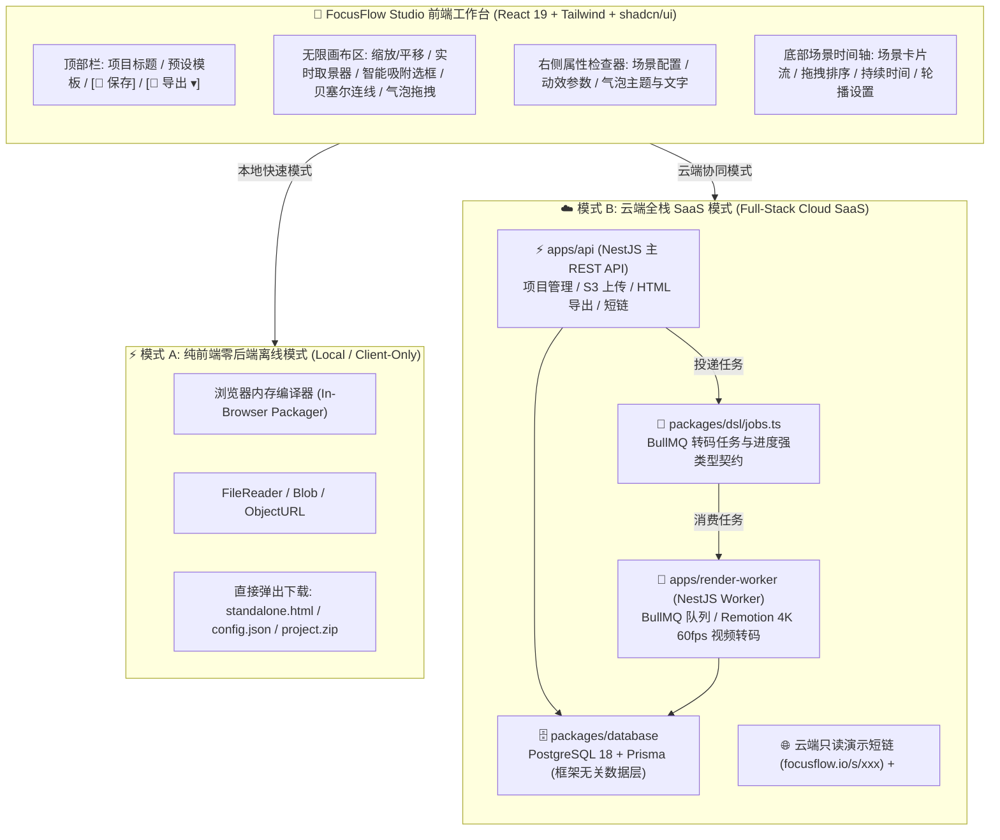

# FocusFlow - Phase 2 (Studio) 可视化创作工作台与全栈工程化设计规格说明书
## FocusFlow Studio & Full-Stack Cloud Architecture Specification

> **文档版本**：`v1.0.0`  
> **制定日期**：`2026-08-29`  
> **文档状态**：🚀 **Phase 2 (Studio 工作台与云端化) 核心工程规格 · 规划执行中**  
> **关联技术专刊**：
> - 📄 [PRODUCT_DESIGN.md (主产品方案与 PRD)](file:///Users/xt/WebstormProjects/focusflow/design/PRODUCT_DESIGN.md)
> - 🏗️ [MONOREPO_SPEC.md (Monorepo 工程化架构与改造规格)](file:///Users/xt/WebstormProjects/focusflow/design/MONOREPO_SPEC.md)
> - 📐 [MVP_SPEC.md (Phase 1 播放引擎与 HUD 执行规格)](file:///Users/xt/WebstormProjects/focusflow/design/MVP_SPEC.md)
> - 📐 [MOTION_ENGINE_SPEC.md (动效数学与渲染规格)](file:///Users/xt/WebstormProjects/focusflow/design/MOTION_ENGINE_SPEC.md)
> - 📷 [CAMERA_FRUSTUM_SPEC.md (运镜摄像机与取景框数学原理与交互设计规范)](file:///Users/xt/WebstormProjects/focusflow/design/CAMERA_FRUSTUM_SPEC.md)
> - 🔍 [EDGE_SNAPPER_ALGORITHM.md (智能边缘吸附与 Auto-Refine 算法专刊)](file:///Users/xt/WebstormProjects/focusflow/docs/EDGE_SNAPPER_ALGORITHM.md)
> 
> **适用对象**：前端架构师、全栈工程师、UI/UX 设计师、后端开发  
> **文档定位**：Phase 2 可视化创作工作室（FocusFlow Studio）从前端画布、时间轴到服务端项目管理、离线打包与视频渲染的端到端技术落地方案

---

## 目录 (Table of Contents)

- [1. Phase 2 核心定位与业务使命](#1-phase-2-核心定位与业务使命)
  - [1.1 阶段演进定位](#11-阶段演进定位)
  - [1.2 核心价值与 3 步闭环](#12-核心价值与-3-步闭环)
- [2. 系统整体架构：双模式运行体系 (Client-Only vs Cloud SaaS)](#2-系统整体架构双模式运行体系-client-only-vs-cloud-saas)
  - [2.1 模式 A (Client-Only) 纯前端零后端离线闭环机制与战略价值](#21-模式-a-client-only-纯前端零后端离线闭环机制与战略价值)
  - [2.2 模式 A 与 模式 B (云端全栈 SaaS) 清晰边界与全方位对比矩阵](#22-模式-a-与-模式-b-云端全栈-saas-清晰边界与全方位对比矩阵)
  - [2.3 双模式同构平滑演进与体验无缝切换](#23-双模式同构平滑演进与体验无缝切换)
- [3. 创作端 3 步闭环核心功能系统深度设计](#3-创作端-3-步闭环核心功能系统深度设计)
  - [3.1 环节一：项目创建与资产导入系统 (Project Ingestion)](#31-环节一项目创建与资产导入系统-project-ingestion)
  - [3.2 环节二：可视化无限画布与 4 大编辑工具 (Infinite Canvas & Tools)](#32-环节二可视化无限画布与-4-大编辑工具-infinite-canvas--tools)
    - [3.2.4 标定助手与独立播放控制栏职责解耦规范 (Calibration Assistant & Player Controls Decoupling)](#标定助手与独立播放控制栏职责解耦规范-calibration-assistant--player-controls-decoupling)
    - [3.2.5 运镜摄像机与安全取景框数学原理与交互规范 (Camera Kinematics & Frustum Specification)](#325-运镜摄像机-camera-与安全取景框-frustum-数学原理与交互规范)
  - [3.3 环节二 (续)：场景关键帧时间轴编排系统 (Scene & Sequence Timeline)](#33-环节二-续场景关键帧时间轴编排系统-scene--sequence-timeline)
    - [3.3.1 场景卡片流与图元激活矩阵交互规范 (Scene Sequence & Visibility Matrix)](#331-场景卡片流与图元激活矩阵交互规范-scene-sequence--visibility-matrix)
    - [3.3.2 音频时间轴对齐与多媒体音画同步系统设计 (Audio Timeline Synchronization System)](#332-音频时间轴对齐与多媒体音画同步系统设计-audio-timeline-synchronization-system)
  - [3.4 环节三：实时生成、预览与多形态导出下载 (Compilation, Preview & Exporter)](#34-环节三实时生成预览与多形态导出下载-compilation-preview--exporter)
    - [3.4.1 导出 1：独立离线单文件 HTML 打包 (Standalone Packager)](#341-导出-1独立离线单文件-html-下载-html)
    - [3.4.2 导出 2：标准 DSL 源码与工程包 (Project Exporter)](#342-导出-2标准-dsl-源码与工程包-configjson--projectzip)
    - [3.4.3 导出 3：视频渲染导出与 AI Agent / CLI 自动化无头管线 (Headless Video Pipeline & Agent CLI)](#343-导出-3视频渲染导出与-ai-agent--cli-自动化无头管线-headless-video-pipeline--agent-cli)
    - [3.4.4 导出 4：云端只读演示短链与知识库嵌入 (Cloud Share & Embed)](#344-导出-4云端只读演示短链与知识库-iframe-嵌入)
- [4. 前端架构与技术栈选型规范 (Frontend Architecture)](#4-前端架构与技术栈选型规范-frontend-architecture)
  - [4.1 技术栈选型](#41-技术栈选型)
  - [4.2 前端目录规划与多包协作架构](#42-前端目录规划与当前项目目录的架构关系-repository--monorepo-architecture)
  - [4.3 科技双主题系统与纯 Token 语义类架构 (Theme System & Semantic Tokens Architecture)](#43-科技双主题系统与纯-token-语义类架构-theme-system--semantic-tokens-architecture)
  - [4.4 专业工作台字阶与按键系统规范 (Professional Workbench Typography & Button System)](#44-专业工作台字阶与按键系统规范-professional-workbench-typography--button-system)
  - [4.5 全局快捷键引擎与交互规范 (Global Studio Keyboard Engine)](#45-全局快捷键引擎与交互规范-global-studio-keyboard-engine)
- [5. 服务端全栈架构、REST API 与数据模型规范 (Full-Stack SaaS Backend)](#5-服务端全栈架构rest-api-与数据模型规范-full-stack-saas-backend)
  - [5.1 与 PRODUCT_DESIGN.md 8.3 节的关联性与边界划分 (Correlation & Boundaries)](#51-与-product_designmd-83-节的关联性与边界划分-correlation--boundaries)
  - [5.2 服务端全栈多服务架构与选型 (Multi-App Backend Architecture)](#52-服务端全栈多服务架构与选型-multi-app-backend-architecture)
  - [5.3 核心数据模型 (Prisma Schema)](#53-核心数据模型-packagesdatabaseprismaschemaprisma)
  - [5.4 核心 RESTful API 契约](#54-核心-restful-api-契约)
- [6. Phase 2 研发任务分解与层级跟踪清单 (Hierarchical Task Checklist / WBS)](#6-phase-2-研发任务分解与层级跟踪清单-hierarchical-task-checklist--wbs)
- [7. Phase 2 验收测试标准 (Acceptance Criteria)](#7-phase-2-验收测试标准-acceptance-criteria)

---

## 1. Phase 2 核心定位与业务使命

### 1.1 阶段演进定位
在 **Phase 1 (MVP)** 阶段，FocusFlow 成功完成了**核心渲染引擎、动效数学、离线单文件打包与 HUD 快捷键标定工具**的建设，验证了极致的播放性能（60fps GPU 硬件加速、~35KB 极轻量体积）。但 Phase 1 仍要求创作者具备一定的代码与 JSON 编辑能力。

**Phase 2 的核心使命是：**
> **“从面向开发者的本地调试工具，全面跃迁为面向架构师、产品专家、讲师的现代化、零门槛 Web 可视化创作工作室（FocusFlow Studio）。”**

### 1.2 核心价值与 3 步闭环
创作者无需编写任何一行代码，只需 3 步即可完成顶级架构演进汇报：
```
       ┌────────────────────────┐      ┌──────────────────────────┐      ┌────────────────────────┐
       │   1. 拖入高分辨率架构图 │ ──>  │   2. 可视化框选与镜头编排 │ ──>  │ 3. 一键导出单文件/视频 │
       └────────────────────────┘      └──────────────────────────┘      └────────────────────────┘
                 [输入]                            [加工]                            [输出]
```

---

## 2. 系统整体架构：双模式运行体系 (Client-Only vs Cloud SaaS)

为兼顾“极客开发者的零成本私密离线使用”与“商业团队的在线云端协同与视频渲染”，Phase 2 采用**双模式同构架构**：



---

### 2.1 模式 A (Client-Only) 纯前端零后端离线闭环机制与战略价值

模式 A 像 **Excalidraw、Photopea 或 CyberChef** 一样，**100% 完全不需要任何后端服务、数据库或 Redis 依赖**，整个应用完全作为一个纯静态站点（Static Web App）自治运行于浏览器沙箱中：

```
                    【模式 A：纯前端 100% 离线自治闭环流水线】

 1. 底图拖拽导入 ──> 浏览器原生 FileReader / URL.createObjectURL(file) 读取进内存
 2. 尺寸自动侦测 ──> 浏览器 new Image() 瞬间读取天然物理基准分辨率 (如 5120x2880)
 3. 像素边缘吸附 ──> Canvas API + Web Worker 在本地执行 Sobel 算子图像边缘探测
 4. 工程状态暂存 ──> 浏览器 IndexedDB / localStorage 本地持久化 (页面刷新永不丢失)
 5. 单文件 HTML  ──> standalonePackager.ts 纯前端将底图 Base64 与 Player 内联为单文件
 6. ZIP 工程打包 ──> jszip 在浏览器内存中直接生成标准 .zip 二进制压缩包
 7. 文件保存下载 ──> 触发浏览器原生 Blob + <a download="focusflow.html"> 直接落盘
```

#### 模式 A 的两大战略杀手级价值：
1. **解决企业最高等级的“架构图安全与保密”痛点（100% 数据私密）**：
   * 大厂架构师、金融与安全专家绘制的系统拓扑通常包含内部敏感主机名、拓扑 IP、密钥分发链路等高密数据；
   * 模式 A 允许创作者在**完全断网、内网机、保密开发环境或离线无网络状态**下自由创作，**不向外网发送任何一个字节，彻底消除数据泄露与合规顾虑**！
2. **极致的零获客门槛与零服务器托管成本**：
   * **零门槛体验**：用户无需注册、无需登录、零等待，打开网页即可直接拖图制作；
   * **极低分发成本**：纯静态产物可直接托管于 GitHub Pages、Vercel Edge 或 Cloudflare CDN，全球分发成本几乎为 $0。

#### 模式 A 的两种纯本地/单机视频导出方案 (零后端服务依赖)：
若处于离线/单机模式 A 的创作者需要导出视频，无需连接任何后端服务，可通过以下两种纯本地方案完成：
1. **方案 1：纯浏览器客户端录制 (Client-side `MediaRecorder`)**：
   * 浏览器利用原生 HTML5 Canvas Capture 与 `MediaRecorder` API，直接在用户电脑内存与显卡中实时录制动效，导出 `.webm` 或轻量 `.mp4` 文件直接下载；
2. **方案 2：开发者本地 CLI 脚本工具 (Local Node.js + FFmpeg CLI)**：
   * 开发者在本地终端运行 `node scripts/build-standalone.js`，直接调用本机已安装的 FFmpeg 执行离线批量渲染合成。

---

### 2.2 模式 A 与 模式 B (云端全栈 SaaS) 清晰边界与全方位对比矩阵

```
+------------------------+------------------------------------+------------------------------------+
| 评估维度                | ⚡ 模式 A: 纯前端零后端 (Client-Only)| ☁️ 模式 B: 云端全栈 SaaS (Cloud)    |
+------------------------+------------------------------------+------------------------------------+
| 1. 后端与数据库依赖    | 🏆 0 依赖 (无需 API / DB / Redis)  | 依赖 NestJS + PostgreSQL 18 + Redis|
| 2. render-worker 依赖  | 🏆 0 依赖 (完全不使用 render-worker)| 🏆 专属依赖 (BullMQ 异步队列驱动)  |
| 3. 数据保密性与离线    | 🏆 100% 离线自治 (数据绝不上云)    | 数据加密持久化于云端数据库         |
| 4. 工程持久化与管理    | 浏览器 IndexedDB / 本地文件导入导出| 云端多设备自动同步与完整版本快照   |
| 5. 独立 HTML 导出      | 🏆 纯前端 Base64 内联瞬间下载      | 云端流式导出与 CDN 加速分发        |
| 6. 4K 60fps 视频渲染   | 纯本地方案: MediaRecorder / 本地CLI| 🏆 专属服务: render-worker 云端集群|
| 7. 团队协同与权限控制  | 不支持 (单机独立创作)              | 🏆 CASL (Owner/Editor/Viewer 协同) |
| 8. 在线分享与嵌入      | 手动发送导出的 standalone.html     | 🏆 一键生成短链与 <iframe> 知识库嵌入|
| 9. 适用目标群体        | 极客开发者、内网保密项目、单机快速演练| 企业研发团队、跨国架构评审、SaaS 会员|
+------------------------+------------------------------------+------------------------------------+
```

#### 💡 `render-worker` 的核心定位：【模式 B 云端 SaaS 专属服务】
* **重度算力卸载**：4K 60fps 逐帧截帧与 H.265/ProRes 硬件转码属于极重 CPU/GPU 负载。若在用户端浏览器强行执行会导致低配设备发热卡死；
* **异步解耦体验**：在模式 B 中，云端 `render-worker` 独立部署于高性能 GPU 计算集群，用户提交渲染任务后即可关闭网页，转码完成后自动发送通知或生成 CDN 直链。模式 A 完全不与该服务发生任何交互。

---

### 2.3 双模式同构平滑演进与体验无缝切换

FocusFlow Studio 前端采用**适配器架构（Storage & Export Adapter Pattern）**：
* 当未登录或处于离线模式时，工作台自动挂载 `LocalStorageAdapter` 与 `ClientCompilerAdapter`，一切功能全部在本地浏览器内存中极速运转；
* 当用户点击“登录云端同步”时，工作台无缝切换为 `CloudApiAdapter`，将本地 DSL 与底图一键上传持久化至云端，实现**“离线即开即用，云端无缝升维”**的顶级用户体验！

---

## 3. 创作端 3 步闭环核心功能系统深度设计

### 3.1 环节一：项目创建与资产导入系统 (Project Ingestion)

#### 1. 拖拽极速创建 (Drag-to-Create)
* **交互体验**：打开 Studio 首页，直接将任意一张高分辨率 PNG、SVG、JPEG 拖入工作台；
* **分辨率自动侦测**：前端通过 `Image.decode()` 或二进制 ArrayBuffer 快速提取底图的天然物理分辨率（如 $5120\times 2880$），自动将其初始化为 `meta.viewport.width` 与 `meta.viewport.height`；
* **初始 DSL 生成**：自动生成 Scene 0（全局全景开场场景），立即进入编辑态。

#### 2. 工程重开与导入 (Re-Open & Import)
* 支持直接拖入历史导出的 `config.json` 或 `project.zip`，瞬间恢复所有场景、图层、气泡与镜头位置；
* 支持多图片管理（如新增画中画覆盖图 `images` 资产）。

#### 3. 预置行业模板库 (Template Gallery)
* 内置 5 套开箱即用的标准架构图模板（微服务电商、高可用容灾、云原生 K8s、AI 训练集群、金融支付风控），供创作者一键体验与克隆修改。

---

### 3.2 环节二：可视化无限画布与 4 大编辑工具 (Infinite Canvas & Tools)

```
 ┌─────────────────────────────────────────────────────────────────────────────────┐
 │ 🔍 [100% ▾] [✋ 抓手] [🔲 选框] [⚡ 连线] [💬 气泡] [🖼️ 覆盖图] │ 👁️ 预览  💾 保存  🚀 导出 ▾│
 ├────────────────────────────────────────────────────────┬────────────────────────┤
 │                                                        │ 🛠️ 属性检查器 (Inspector)│
 │                                                        ├────────────────────────┤
 │                                                        │ 📐 镜头与视口 (Camera)  │
 │                   🎨 可视化无限画布                    │ • 缩放比例: 1.75x      │
 │                                                        │ • 偏移: X:-14%, Y:8%   │
 │              ┌ - - - - - - - - - - - ┐                 ├────────────────────────┤
 │              ┆  [取景安全边界视口框] ┆                 │ 🔲 选中图元 (Box/Line) │
 │              ┆    ┌──────────────┐   ┆                 │ • ID: box-postgres     │
 │              ┆    │ PostgreSQL16 │   ┆                 │ • 描边: #34d399 (6px)  │
 │              ┆    └──────────────┘   ┆                 │ • 发光: [✓] 霓虹光晕   │
 │              └ - - - - - - - - - - - ┘                 ├────────────────────────┤
 │                                                        │ 💬 解说气泡 (Callout)  │
 │                                                        │ • 标题: PostgreSQL 16  │
 │                                                        │ • 主题: [ 🟢 Green ▾ ] │
 ├────────────────────────────────────────────────────────┴────────────────────────┤
 │ 🎬 场景序列时间轴: [01 全局总览] ➔ [02 核心数据链路] ➔ [03 鉴权下钻] ➔ [+] 新增场景 │
 └─────────────────────────────────────────────────────────────────────────────────┘
```

#### 工具 1：镜头取景器 (Camera Viewport Frame)
* **交互体验**：在画布上任意缩放和平移底图，画面中央实时呈现当前场景的“受众实际可视安全窗口（Frustum）”；
* **一键同步**：点击“捕获当前镜头”或调整右侧滑块，自动计算出精确的 `{ zoom, x, y, duration }`。

#### 工具 2：智能选框工具 (Smart Box Tool)
* **三重模式无缝融合**：
  * **模式 A（随手粗拉 + 自动贴合）**：随手拉框，松手瞬间调用 $\pm 24\text{px}$ 窄带 Sobel 精修算法，自动咬合外框；
  * **模式 B（纯手动精确拉框）**：按住 `⌘ / Option`（或关闭吸附开关）拖拽，100% 精确表达创作者自定义留白与局部框选；
  * **模式 C（单点智能吸附）**：Option/Alt+单击卡片空白处，50ms 内自动识别卡片包围盒；
* **圆角与描边可视化调整**：在右侧面板直接调节 `rx` 圆角、`stroke` 颜色、`strokeWidth` 及发光模式。

#### 工具 3：拓扑流光连线生成器 (Bezier Route Tool)
* **磁吸锚点连接**：点击源卡片的 8 向锚点（如 `box-folio.right`），鼠标拖出连线吸附至目标卡片锚点（如 `box-postgres.left-top`）；
* **自动三次贝塞尔曲线推导**：引擎实时绘制高科技流光动效预览；
* **模式切换**：支持一键切换 `stream`（跑马灯流动）或 `draw`（单次描边生长）。

#### 工具 4：毛玻璃气泡所见即所得编辑器 (Callout Visual Editor)
* **直接拖拽定位**：直接在画布上拖拽气泡至最佳展示位置，自动换算为自适应百分比坐标（如 `left: "33%", top: "33%"`）；
* **富文本与主题徽章**：可视化选择 5 大预设配色主题（Blue / Green / Amber / Pink / Cyan），实时预览阶梯弹入动效。

#### 画布空间与像素标尺绝对对齐规范 (1:1 Physical Canvas Sizing & Coordinate Integrity)

FocusFlow Studio 的中央无限画布（`InfiniteCanvas`）与视口缩放控制胶囊（`ZoomControls`）在底层渲染与空间几何上，遵循 **“绝对物理像素空间（Absolute Physical Pixel Space）”** 原则：

1. **真实物理尺寸 100% 对齐底图原生分辨率**：
   - 当创作者导入一张架构图时，图像解析器（`imageDecoder.ts`）通过浏览器原生 `Image.decode()` 提取该文件的真实自然分辨率（`img.naturalWidth × img.naturalHeight`），并写入 `dsl.meta.viewport = { width: naturalWidth, height: naturalHeight }`。
   - `InfiniteCanvas` 的 GPU 几何变换视口层（Transform Content Layer）在 DOM 中的内联样式尺寸被严格固定为：
     `<div style={{ width: `${contentWidth}px`, height: `${contentHeight}px` }}>`。
   - **底层事实**：**ZoomControls 所控制的画布在底层逻辑中的真实物理大小，100% 等于当前工程上传底图的原生像素尺寸（naturalWidth × naturalHeight）**。

2. **ZoomControls 缩放倍率的物理定义**：
   - `ZoomControls` 通过 GPU 硬件加速的 CSS3 矩阵 `transform: translate3d(x, y, 0) scale(S)` 改变创作者在屏幕上的工作视野，而不改变画布的物理内宽高；
   - **`100%`**：严格代表 **1:1 点对点物理像素对齐**（即创作者屏幕上的 1 个 CSS 像素 = 底图文件中的 1 个真实物理像素）；
   - **`50%` / `200%`**：分别将整张 4K/5K 画布在视口中缩小至 0.5x 纵览全局，或放大至 2.0x 进行 1px 级的精细图元锚点对齐。

3. **标定图元与连线坐标零漂移保证 (Zero Coordinate Drift)**：
   - 所有选框（Box）、三次贝塞尔连线（Path）、定位脉冲圆点（Dot）的坐标系统均直接建立在该 1:1 物理像素空间上（例如 `x: 1200, y: 800, width: 320, height: 180`）；
   - 创作者无论在画布上缩放到任何比例进行操作，写入 DSL 的坐标值永远 100% 锚定在原图的原生像素绝对坐标上，确保在导出独立 HTML、4K 视频或全屏演播时绝对没有坐标偏移或分辨率失真。

#### 标定助手与独立播放控制栏职责解耦规范 (Calibration Assistant & Player Controls Decoupling)

为彻底解决 Phase 1 (MVP) 遗留的功能耦合，提升 Studio 创作体验与导出播放纯净度，FocusFlow 确立了严格的职责解耦边界：

1. **底图载入时自动校准画布 Viewport 机制 (Auto-Calibration of Viewport on Ingestion)**：
   - 在创作者上传底图或切换演示模板时，`imageDecoder.ts` / `ingestNewAsset` 自动异步调用浏览器原生 `Image.decode()`，瞬间读取图像物理自然分辨率（`naturalWidth × naturalHeight`）；
   - 动态更新当前工程 DSL `meta.viewport = { width: naturalWidth, height: naturalHeight }`，使 Studio 无限画布的物理尺寸与底图 100% 严丝合缝匹配，彻底杜绝黑边或变形。

2. **独立播放控制栏纯净化 (Standalone Player Controls Streamlining)**：
   - 从底图播放引擎（`@focusflow/player`）的浮动控制栏（`.focusflow-controls`）中**彻底移除 MVP 阶段硬编码的 `🎯 标定助手` 按钮及分隔线**；
   - 播放条职责严格回归到“演播控制”本身（播放/暂停、当前幕/总幕数指示器、场景标签切换）；
   - 支持通过 `showControls: false` 与 Studio 顶部控制栏及导出模态框实现无缝关联配置。

3. **右侧属性检查器常驻「🎯 标定助手 (Precision Calibration HUD)」**：
   - 将创作者在标定与排版过程中高频使用的度量工具，固定集成于 `RightInspector.tsx` 底部折叠面板中：
     - **底图原生基准分辨率徽章**：实时显示当前底图的物理像素尺寸（如 `1920 × 1459 px`）；
     - **实时双模物理度量读数**：随着鼠标在画布上滑行，实时高频刷新当前光标所在的绝对物理像素坐标 `(X, Y)` 与相对宽高百分比 `(L%, T%)`；
     - **✨ 智能边缘贴合开关 (`isSmartSnapEnabled`)**：控制框选与单点吸附时是否调用 Sobel 窄带极值对齐算法；
     - **🎯 激光十字准星开关 (`isCrosshairEnabled`)**：开启后在画布呈现跟随光标的 X/Y 全屏发光对齐线与坐标微徽章；
     - **📋 一键复制坐标 JSON**：将当前物理像素与百分比位置导出为标准 JSON，便于创作者与开发者快速复用。

#### 3.2.5 运镜摄像机 (Camera) 与安全取景框 (Frustum) 数学原理与交互规范
> 详细数学推导、安全边界算法与多模交互设计请参阅独立技术专刊：[CAMERA_FRUSTUM_SPEC.md](file:///Users/xt/WebstormProjects/focusflow/design/CAMERA_FRUSTUM_SPEC.md)

1. **4 大核心几何与运动学理论规则**：
   - **规则 1（纵横比锁定）**：取景框严格锁定底图原生物理纵横比 $\frac{W_{\text{frame}}}{H_{\text{frame}}} \equiv \frac{W_{\text{nat}}}{H_{\text{nat}}}$，消除任何屏幕比例差异带来的拉伸失真；
   - **规则 2（防穿帮镜头底限）**：限制 $\text{Zoom} \ge 1.0\text{x}$，避免全屏演播时镜头拉远导致底图四周露出黑边穿帮；
   - **规则 3（防露白安全视口钳位）**：实施 $|T_x|, |T_y| \le \frac{Z-1}{2Z} \times 100\% \times 1.15$ 安全边界约束，杜绝视角超出底图可视范围；
   - **规则 4（相对铺满映射与物理中心反解）**：以 $\text{baseScale} = \min(W_{\text{cont}}/W_{\text{nat}}, H_{\text{cont}}/H_{\text{nat}})$ 为 1.0x 基准，自适应反解屏幕中心绝对坐标。
2. **多模态协同交互微调体系**：
   - **一键捕获**：宏观平移缩放至目标区域后一键捕获；
   - **画布直接拖拽**：在选择模式下按住青色取景框直接拖动对齐，受安全边界实时吸附；
   - **四角手柄缩放**：四角交互手柄等比例推拉镜头放大倍率（$1.0\text{x} \sim 3.5\text{x}$）；
   - **检查器数值精调与复位**：水平偏移 (X) 与 垂直偏移 (Y) 精确数值滑块控制 + 一键居中复位；
   - **键盘方向键微控**：选中取景框后使用键盘 `↑ ↓ ← →` 0.5% 步长（Shift: 2.0%）像素级对齐。

#### 3.2.6 右侧属性检查器双 Tab 架构与多态图元属性规范 (Right Inspector Dual-Tab & Polymorphic Element System)

为彻底解决 Studio 功能演进带来的右侧面板空间拥挤与上下文混乱问题，属性检查器升级为**双 Tab 分层上下文 + 多态图元专属卡片（Polymorphic Element Inspector）**架构：

```
┌─────────────────────────────────────────────────────────┐
│                 右侧属性检查器 (Right Inspector)         │
├────────────────────────────┬────────────────────────────┤
│     🎬 场景运镜 (Scene)     │    🎨 图元属性 (Inspector)  │
└────────────────────────────┴────────────────────────────┘
```

##### 1. Tab 1: 🎬 场景运镜 (Scene & Camera)
专注于当前分幕的宏观排版与全局度量辅助：
* **分幕运镜导演（Camera Lens & Director）**：
  * 运镜倍率（Zoom：`1.0x ~ 3.5x` 滑块与实时倍率读数）；
  * 水平偏移（X：% 偏离中心读数与滑块）；
  * 垂直偏移（Y：% 偏离中心读数与滑块）；
  * **一键捕获当前视野（Capture Current View）**：将创作者在画布上缩放平移的视角直接反解固化为当前幕摄像机镜头；
  * **一键居中复位**：快速将镜头重置为全景总览（1.0x, 0%, 0%）。
* **标定助手（Precision Calibration HUD）**：
  * 底图物理分辨率读数（如 `1920 × 1459 px`）；
  * 实时双模物理度量读数（鼠标滑行时的绝对像素坐标 `X, Y` 与相对百分比 `L%, T%`）；
  * ✨ 智能边缘贴合开关（Sobel 窄带梯度磁吸）；
  * 🎯 激光十字准星开关（全屏发光对齐线）；
  * 📋 一键复制坐标 JSON。

##### 2. Tab 2: 🎨 图元属性 (Element Properties & Layer Inspector)
专注于微观图元的层级管理与可视化精细调节：
* **图层层级列表（Layer Hierarchy List）**：
  * 快速搜索过滤图元名称与 ID；
  * 类型专属图标（Box ⬜、Path 🔗、Dot ⊙、Callout 💬、Image 🖼️）；
  * 当前幕可见性切换（👁️ / 👁️‍🗨️）；
  * 一键选中与 🗑️ 删除图元。
* **多态专属可视化控制卡片（Polymorphic Element Cards）**：
  * **未选中图元时**：展示当前图层列表与操作指引；
  * **选中 Box（方框）时**：
    * 几何坐标与尺寸（X, Y, W, H 读数与微调）；
    * 圆角半径（Radius / rx）；
    * 描边粗细（Stroke Width 滑块：`1px ~ 14px`）；
    * 视觉主题色（预设色板 + 自定义 HEX 拾色器）；
    * 霓虹发光滤镜开关（Glow Toggle）；
  * **选中 Path（贝塞尔连线）时**：
    * 动画流动模式（`🌊 流光粒子 stream` / `✍️ 生长绘制 draw` / `💓 呼吸律动 pulse`）；
    * 流光速度倍率（Flow Speed 滑块：`0.5x ~ 5.0x`，Stream 模式下激活）；
    * 线条粗细（Stroke Width 滑块：`1px ~ 14px`）；
    * 视觉主题色（预设色板 + 自定义 HEX 拾色器）；
    * 霓虹发光滤镜开关（Glow Toggle）；
    * 端点拓扑路由（起点 Box.锚点 ➔ 终点 Box.锚点）；
  * **选中 Dot（脉冲锚点）时**：
    * 圆心坐标（CX, CY 读数与微调）；
    * 圆点半径大小（Radius `r` 滑块：`4px ~ 24px`）；
    * 动态呼吸脉冲（Pulse Toggle：`0.85x ~ 1.25x` 周期缩放律动）；
    * 填充主题色（预设色板 + 自定义 HEX 拾色器）；
    * 霓虹发光滤镜开关（Glow Toggle）；
  * **选中 Callout（解说气泡）时（后续支持）**：
    * 卡片标题（Title）与正文描述（Desc）实时编辑；
    * 玻璃拟态主题色胶囊（Blue / Amber / Rose / Emerald）；
    * 目标 Box 绑定下拉选择与偏移微调；
  * **选中 Image（动态插图）时（后续支持）**：
    * 图像预览与更换 URL；
    * 尺寸与圆角配置；
    * 入场动效模式（Zoom-fade / Slide-up / Fade）。

##### 3. 上下文感知自动切换机制 (Context-Aware Auto-Switching)
* **智能切入**：创作者在画布上单击任意 Box、或在图层列表中选中任一图元时，右侧属性检查器**自动平滑切换至【🎨 图元属性】Tab**，并展开对应的专属控制卡片；
* **清晰解耦**：创作者关注分幕排版时点击【🎬 场景运镜】Tab，即可专注调整当前场景镜头与标定，不受繁杂的图元属性干扰。

---

### 3.3 环节二 (续)：场景关键帧时间轴编排系统 (Scene & Sequence Timeline)

#### 3.3.1 场景卡片流与图元激活矩阵交互规范 (Scene Sequence & Visibility Matrix)

* **场景卡片序列流（Scene Sequence Track）**：
  * 底部直观展示当前项目的全部场景步骤缩略卡片（`Scene 1 ➔ Scene 2 ➔ Scene 3`），单卡片展示序号、场景名称、镜头缩略图以及当前幕持续时长 `duration`；
  * **自由拖拽排序**：支持基于 HTML5 Drag & Drop 的场景卡片无缝重排，实时更新 DSL 中的 `scenes` 数组索引；
  * **场景快捷操作**：悬停卡片右上角呼出菜单，支持一键“复制当前场景”（包含镜头与激活图元状态）、“删除场景”与“向后插入空白过渡帧”；
* **图元可见性开关矩阵（Active Elements Matrix）**：
  * 选中某个场景时，右侧属性面板与图层列表精确反映当前场景激活的图元集合（`activeElements: { boxes, paths, dots, callouts, images }`）；
  * **一键继承上一幕（Inherit from Previous）**：提供“继承上一幕全部激活状态”快捷动作，符合电影镜头渐进展开（Progressive Disclosure）心智；
  * **多幕图元联动**：在图层面板中，创作者可勾选图元在“全部场景点亮”、“仅当前场景点亮”或“从当前场景开始永久点亮”。

---

### 3.3.2 音频时间轴对齐与多媒体音画同步系统设计 (Audio Timeline Synchronization System)

#### 1. 核心业务价值、心智模型与设计哲学 (Mental Model & Progressive Principle)

在高质量架构演进宣讲、高管述职汇报与技术慕课录制中，单纯的无声动画往往缺乏感染力。创作者通常需要录制旁白解说语音（Voiceover）或插入背景音效（BGM）。

* **传统制作工具的核心痛点**：
  1. **手工硬编码时长极其痛苦**：创作者必须预估每张幻灯片/运镜需要几秒几毫秒，手工逐个调整各场景的 `duration: 3500ms`。一旦录音语速稍有变化，运镜与语音立即产生严重错位，反复试听微调成本极高；
  2. **时钟漂移累积脱节（Clock Drift）**：长时间演播时，浏览器 `requestAnimationFrame`（受到显示器刷新率波动与 CPU/GPU 负载影响）与声卡音频物理硬件晶振存在离散时间差，播放 3 分钟后画面与解说往往产生高达 300~800ms 的严重视听不同步；
  3. **强制上传音频破坏轻量心智**：许多设计工具强迫用户必须先有音频才能排期时间轴，极大地拉高了普通用户的上手门槛。

* **FocusFlow 核心设计哲学：渐进式（Progressive）且非强制（Non-mandatory）**：
  > **“无音频时，它是自适应的电影分镜导览；有音频时，声音指引运镜，音画合一。”**
  * **非强制原则**：音频时间轴是针对“解说型架构演示”的高级增强模块，**绝非强迫用户必须提供或上传外部音频**。在工程未关联音频时，系统完全依照各场景设定的默认时长（如每幕 3.5s）或由受众鼠标点击/键盘按键翻页正常推进；
  * **双向自适应映射哲学（Bidirectional Adaptive Mapping）**：
    - **方向 A（音频驱动画面）**：导入或录制音频后，创作者拖动音频波形上的场景标记点（Marker），系统自动反向重新计算并写入当前场景的 `duration = Marker[i+1].time - Marker[i].time`；
    - **方向 B（画面驱动标记）**：创作者拖拽底部时间轴的场景卡片边缘拉伸时长，穿透式分割线带动对应音频标记点同步移动，并智能寻找音频停顿低谷进行磁吸；
  * **隐私与存储分水岭**：
    - **开源单机版（模式 A）**：**100% 浏览器本地沙箱运行**。音频仅暂存于浏览器内存或 `IndexedDB` 中，导出单文件 HTML 时转为 Base64 Data URI 内联在文件内部，或在 ZIP 导出时保存为本地 assets 文件，**完全不联网、零隐私泄漏风险**；
    - **商业云端 SaaS（模式 B）**：音频作为项目多媒体资产自动异步上传至团队绑定的 **Cloudflare R2** 对象存储中，支持多人多端协同试听与云端转码。

```
┌────────────────────────────────────────────────────────────────────────┐
│             🎵 Audio Timeline Synchronization Dataflow                 │
├────────────────────────────────────────────────────────────────────────┤
│                                                                        │
│   [🎙️ 3 种渐进式音频输入管道]                                           │
│   • 管道 1: Studio 内置同屏麦克风演播录音 (随讲随录，实时生成波形)       │
│   • 管道 2: 拖拽导入外部成套干声 (MP3/WAV/M4A/AAC, Web Audio 离屏解码) │
│   • 管道 3: AI 提词脚本自动生成 TTS 语音 (分幕语音合成与语速自适应)     │
│                     │                                                  │
│                     ▼                                                  │
│   [Web Audio API (AudioContext) 解码 ➔ Float32Array PCM 采样数据]       │
│                     │                                                  │
│         ┌───────────┴───────────────────────────┐                      │
│         ▼                                       ▼                      │
│  [峰值降采样与波形渲染引擎]              [语音活动检测 VAD / 静音分析]      │
│  (Web Worker 离屏 Peak Envelope)         (RMS 能量分析检测自然断句停顿区)   │
│         │                                       │                      │
│         └───────────┬───────────────────────────┘                      │
│                     ▼                                                  │
│   [音频波形轨道 (AudioWaveformTrack) 交互层]                            │
│   • 实时激光播放头 (Playhead) & 视口无级缩放 (Zoom: 1s ~ 60s/屏)         │
│   • 穿透式场景分割虚线 (Scene Piercing Cut-lines: S1 ➔ S2 ➔ S3)        │
│   • 智能磁吸引擎 (Snap-to-Silence: ±50ms 阈值自动吸附到音频停顿间隙)   │
│   • 毫秒级音频 Scrubbing 拖拽试听 (Grain Buffer 高速微播放)             │
│                     │                                                  │
│                     ▼                                                  │
│   [底层音画主时钟锁相环 (Master Clock PLL Architecture)]                │
│   • AudioContext.currentTime 作为绝对主时钟 (Master Clock)              │
│   • 画面渲染帧严格订阅物理音频时钟，彻底消除累积漂移 (Zero Clock Drift)  │
│                     │                                                  │
│                     ▼                                                  │
│   [多形态音画合流与落盘导出 (Audio-Video Multiplexing)]                │
│   • 独立离线单文件 HTML: Base64 Data URI 内嵌 + Web Audio 运行播放      │
│   • 客户端 WebM 录制: AudioContext 混流节点 + Canvas MediaRecorder     │
│   • CLI / 无头转码: FFmpeg 硬件加速高保真 MP4 视音频无损合流            │
│                                                                        │
└────────────────────────────────────────────────────────────────────────┘
```

#### 2. 三级音频输入管道产品交互深度设计 (3-Tier Input Pipelines & UI Flow)

针对不同技能背景、硬件条件与制作场景的创作者，FocusFlow 提供 3 种递进式音频输入管道：

##### 管道 1：Studio 内置同屏麦克风演播录音 (`StudioVoiceRecorder.ts`)
* **核心定位**：极客与架构师首选，随看随讲，0 外部工具依赖。
* **UI 入口**：底部时间轴左侧操作栏常驻 `[🎙️ 演播录音]` 按钮（与播放/暂停、比例滑块并列）。
* **交互流程与状态机**：
  1. **准备态（Recording Preflight Overlay）**：
     - 点击 `[🎙️ 演播录音]`，工作台中心浮现磨砂玻璃质感的演播录音就绪弹层；
     - **麦克风输入源探测与选择**：下拉菜单枚举系统音频输入设备（如内置麦克风、USB 独立麦克风、无线领夹麦等），调用 `navigator.mediaDevices.enumerateDevices()`；
     - **实时 VU 电平表指示**：通过 `AudioContext.createMediaStreamSource()` 接入 `AnalyserNode`，以 60Hz 刷新动态双通道电平柱（`-60dB ~ 0dB`）：低于 `-40dB` 呈现幽绿，`-12dB ~ -3dB` 呈现电光蓝与亮绿，`> -3dB` 呈现过载警示红，创作者说话即可直观验证收音质量；
     - **环境音降噪选项**：提供 `降噪与回声抑制 (ANC)` 复选框，对应配置 `noiseSuppression: true, echoCancellation: true`；
  2. **倒计时与运镜联动触发**：
     - 创作者点击“开始演播录音”，画布中央展示极具仪式感的全屏 `3 ➔ 2 ➔ 1` 倒计时动画；
     - 倒计时归零瞬间，系统执行原子动作：
       - 画布播放器自动从第 0 幕（Scene 0）启动播放；
       - `MediaRecorder` 启动麦克风高品质音频捕获（MIME 类型优先选用 `audio/webm;codecs=opus`，备用 `audio/mp4`）；
       - 底部波形轨道自动展开，一条动态红光录制线随着演播推进实时流式绘制已录入的声波幅度；
  3. **分幕演播打点（Scene Marker Punch-in）**：
     - 创作者在对着麦克风讲解架构图时，可随时敲击快捷键 `M` 或 `Space` / 点击悬浮的 `[下一幕 ➔]` 按钮；
     - 播放器立即平滑运镜至下一个场景，同时在音频时间轴的当前物理时间戳插入一个场景转场标记（`SceneMarker`）；
  4. **录制完成与自动时间轴重算**：
     - 演播完成或创作者点击 `[完成录制 (Esc)]`；
     - 录音器安全断流并将音频数据合流为内存 `Blob`，自动生成唯一的本地 `ObjectUrl`；
     - 系统自动根据演播期间打下的标记点时间戳，**一键重新校准并拉伸所有场景的 `duration`**，使得每一幕的时长分秒不差地精确匹配创作者刚才的真实讲解速度！

##### 管道 2：拖拽导入外部成套干声/音频 (`audioDecoder.ts`)
* **核心定位**：专业视频创作者、B站/YouTube 技术 UP 主，已在剪映、Audacity、Logic Pro 中录制好精修干声或选定了伴奏 BGM。
* **支持格式**：全格式支持（`MP3`, `WAV`, `M4A`, `AAC`, `FLAC`, `OGG`）。
* **UI 交互与拖拽体验**：
  - 创作者直接从操作系统 Finder / 资源管理器中拖拽音频文件落入底部时间轴区域；
  - 时间轴瞬间浮现蓝色发光虚线框与全局毛玻璃拖拽遮罩：`📥 释放以导入解说音轨`；
  - 亦可点击时间轴上的 `[📁 导入外部音频]` 打开系统原生文件拾取器。
* **离线多线程解码流水线（Web Worker Decoupling）**：
  - **防界面卡顿**：音频文件通常体量较大（例如 5 分钟无损 WAV 文件可能高达 50MB），若在浏览器主线程执行解码与全量波形采样计算，会导致 UI 严重掉帧和画布卡死；
  - **Worker 分工**：主线程将文件读取为 `ArrayBuffer` 并使用 `Transferable Objects` 零拷贝投递给 `waveformWorker.ts`；
  - **包络降采样算法（Peak Envelope Extraction）**：Worker 内部将 PCM 离散采样点按照当前画布时间轴物理像素宽度（例如 1920px）进行分桶采样，计算每一分桶的最大正峰值（Max Peak）与最小负峰值（Min Valley），提炼出轻量级的单精度浮点数组 `Float32Array`（仅 ~10KB 体积）回传主线程，主线程毫秒级完成波形 Canvas 绘制。

##### 管道 3：AI 文本提词与 TTS 自动语音合成 (AI Script & Voice Synthesis)
* **核心定位**：不便开口录音的工程师、技术出海（需地道美音/英音解说）及 Agent 全自动化无头批量制片。
* **UI 交互流程**：
  1. 在右侧检查器的【🎬 场景运镜】面板中，为每一个 Scene 提供专门的 `解说台词 (Voiceover Script)` 文本输入框；
  2. 顶部工具栏提供 `[🤖 AI 生成解说音轨]` 按钮，支持配置全局音色（如 OpenAI TTS `alloy`, `echo`, `nova`，或 Azure 神经语音）、语速（`0.8x ~ 1.5x`）与语言（中/英/日等）；
  3. 点击一键生成，后端服务（或客户端集成 API）按分幕并行调用 TTS 接口生成各场景的音频切片；
  4. **自适应镜头时长延伸（Auto-Stretch Duration）**：
     - 系统解析每一幕 TTS 音频切片的物理时长 $T_{\text{audio}}$；
     - 依据安全视觉停顿原则，自动将该场景的 `scene.duration` 重置为：
       $$\text{scene.duration} = \max(T_{\text{audio}} + 300\text{ms}, \text{camera.duration})$$
     - 自动拼接合流为完整音轨并载入时间轴，真正达成“台词字数多则镜头多停留，台词简短则镜头利落切换”的自适应匹配。

---

#### 3. 底部可视化音频波形轨道交互与微交互系统 (`AudioWaveformTrack.tsx`)

音频时间轴作为连接“时间”与“空间运镜”的视觉桥梁，具备极高专业度与极致流畅的交互体验：

```
                    【底部场景卡片流与音频波形轨道的穿透联动】

   ┌──────────────┬────────────────────────┬──────────────────────┬─────────────┐
   │ 🎬 场景 01   │ 🎬 场景 02             │ 🎬 场景 03           │ 🎬 场景 04  │
   │ 架构概览 3.5s │ 网关流量接入 5.2s       │ 订单结算引擎 4.8s    │ 数据库集群  │
   └──────┬───────┴───────────┬────────────┴──────────┬───────────┴──────┬──────┘
          ┆                   ┆                       ┆                  ┆
 ──[时间标尺] 00:00.000      00:03.500               00:08.700          00:13.500
          ┆                   ┆                       ┆                  ┆
 ──[波形轨道]                │ 激光播放头 (00:05.120) ┆                  ┆
   ▂▃▅▇█▇▅▃ ┆ ▂▃▅▆▇█▇▆▅▃▂    │    ▂▃▅▆▇█▇▆▅▃▂        ┆ ▂▃▅▇█▇▅▃         ┆
            ┆                 │                       ┆                  ┆
          [场景贯穿分割线]    ▼                   [智能静音停顿磁吸]
```

##### 1. 空间布局与设计语言
* **轨道高度**：固定 64px 紧凑高度，紧贴于底部 `BottomTimeline` 场景卡片下方，支持通过左侧开关一键展开/收起；
* **暗黑科技质感配色**：
  - 轨道底色：深度科技暗灰（`hsl(222, 47%, 7%)`）；
  - 时间网格细线：柔和微亮细线（`rgba(255, 255, 255, 0.06)`）；
  - 波形渲染色彩：Canvas 2D 镜像双向柱状波形，垂直方向自上而下呈现渐变发光（从电光青 `hsl(199, 89%, 48%)` 到深邃科技蓝 `hsl(217, 91%, 60%)`）；音量极低的静音区间绘制细如发丝的水平基准线。

##### 2. 视口平移与无级缩放 (Viewport Pan & Zoom)
* **缩放范围**：支持 10 级无级缩放，覆盖“全景宏观视角”（一屏展示 120 秒整体脉络）至“微观切片视角”（一屏展示 2 秒超高精度波形）；
* **手势与按键映射**：
  - `Ctrl / Cmd + 鼠标滚轮`：以当前鼠标悬停的时间戳位置为物理缩放锚点，执行波形横向放大与收缩；
  - `Shift + 鼠标滚轮` 或鼠标中键拖拽：横向无级平移时间轴视口；
  - 缩放滑块：时间轴右下角常驻 `[-] ----○---- [+]` 精度滑块与 `[1:1 适屏显示]` 快捷按钮。

##### 3. 场景贯穿式分割线与拖拽反馈 (Scene Piercing Cut-lines)
* **视觉穿透**：每个场景卡片右侧的分割调节手柄（Splitter Handle），向下延伸出一条贯穿整个音频波形轨道的半透明垂直虚线；
* **拖拽动态**：
  - 当创作者鼠标悬停在场景分界处时，分割线由幽暗转为高亮电光青，光标变为水平调节双箭头 `col-resize`；
  - 拖拽分界线时，虚线跟随鼠标实时位移，波形轨上方浮现动态毫秒时间戳卡片（如 `00:04.280 · Δ +0.78s`）；
  - 释放鼠标后，系统原子更新相邻两幕的 DSL `duration` 并触发 Undo/Redo 历史栈压入。

##### 4. 全局激光播放头与毫秒级音频微切片拖拽试听 (Playhead & Audio Scrubbing)
* **全局播放头**：时间轴上贯穿有一条 1.5px 宽的醒目朱红/高光橙激光垂直标线，顶部附带倒三角播放头手柄（Playhead Handle）；
* **音频即拖即听（Audio Scrubbing Engine）**：
  - 创作者在波形轨上按住鼠标左键横向快速扫动（Scrubbing）时，播放器视口镜头实时跟随插值移动；
  - 底层音频引擎基于 Web Audio API 动态调度微切片播放：每次位移触发一个微型 `AudioBufferSourceNode` 播放光标位置前后 60ms 的音频颗粒（Grain Buffer），并应用 10ms 的线性淡出包络（Linear Fade-out），杜绝爆音（Audio Clicks）；
  - 创作者用耳朵即可精准分辨音节起始（如爆破音“B”、“P”或语句重音开端），达到专业非线性编辑软件（NLE）级别的操作手感。

---

#### 4. 基于 RMS 能量的 VAD 静音检测与智能磁吸算法 (VAD & Snap-to-Silence Algorithm)

为了彻底解决创作者手工反复微调时间分界点的繁琐操作，FocusFlow 引入轻量级客户端语音活动检测（Voice Activity Detection, VAD）与智能几何磁吸引擎：

##### 1. 数学模型与能量计算
设音频 PCM 采样序列为 $x[n]$，采样率为 $f_s$（通常为 44100Hz 或 48000Hz）。
定义滑动分析窗（Window Size）为 $N = 20\text{ms}$（对应 $N = 0.02 \times f_s$ 个采样点），滑动步长（Hop Size）为 $M = 10\text{ms}$。

对第 $m$ 个分析窗，计算其均方根能量（Root Mean Square, RMS）：
$$\text{RMS}_m = \sqrt{\frac{1}{N} \sum_{k=0}^{N-1} x[m \cdot M + k]^2}$$

将其转换为分贝表示（dBFS）：
$$\text{Energy}_{m,\text{dB}} = 20 \log_{10}(\text{RMS}_m + \epsilon) \quad (\epsilon = 10^{-7})$$

##### 2. 停顿区间判定准则 (Silence Gap Detection)
* **静音阈值（Threshold）**：定义背景噪音能量分水岭 $E_{\text{silence}} = -42\text{dB}$；
* **有效停顿窗口（Min Duration）**：语句之间的自然呼吸或换气停顿通常持续 $150\text{ms} \sim 400\text{ms}$。当连续 $K$ 个分析窗满足 $\text{Energy}_{m,\text{dB}} < E_{\text{silence}}$ 且对应时长 $K \times M \ge 120\text{ms}$ 时，系统判定该区间 $[t_{\text{start}}, t_{\text{end}}]$ 为**有效语音停顿带（Voice Pause Gap）**；
* **几何停顿中心**：计算该停顿带的能量最低谷或几何中点 $t_{\text{snap}} = \frac{t_{\text{start}} + t_{\text{end}}}{2}$。

```
       语音高能波峰 (说话中)               静音停顿区间 (呼吸间隙)         下一句语音波峰
     ▲                                ├──────────────────────┤      ▲
 0dB ┼   ▄█▄  █▄                      │   自然停顿中点 t_snap │     ▄█▄  █▄
-20dB┼  █████████▄                    │          ▼           │    █████████▄
-42dB┼────────────────────────────────┴──────────┬───────────┴───────────────── 阈值线
     │                                           │
     └───────────────────────────────────────────┴─────────────────────────────► 时间轴
                                          [磁吸有效范围 ±50ms]
```

##### 3. 磁吸引擎与触觉交互 (Snap Interaction)
* **磁吸敏感半径**：设定吸附门槛为 $\Delta t_{\text{threshold}} = \pm 50\text{ms}$；
* **吸附动作**：当创作者拖动场景分割线进入任意停顿中点 $t_{\text{snap}}$ 的 $\pm 50\text{ms}$ 范围时，磁吸引擎立即强制将分割线坐标锁定在 $t_{\text{snap}}$；
* **视觉与触觉反馈**：
  - 穿透虚线瞬间由电光青变为代表对齐成功的**翠绿发光色（Emerald, `#10b981`）**；
  - 鼠标光标旁浮现磁铁图标微徽标与文字胶囊：`🧲 已吸附至语音停顿 (00:04.250)`；
  - 若系统支持震动 API（如具备 Force Touch Trackpad 的 macOS），触发毫秒级微震反馈，赋予创作者如同物理齿轮啮合般的确定感。

---

#### 5. 底层音画主时钟锁相环架构与防漂移同步机制 (Master Clock PLL Architecture)

##### 1. 时钟漂移物理本质剖析 (Clock Drift Analysis)
在 Web 浏览器环境中，音画不同步的本质是**双物理时钟域竞争（Dual Independent Clock Domains）**：
1. **显示渲染时钟（Display / rAF Clock）**：
   - 依赖于显示器的垂直同步信号（VSync），标准屏幕为 60Hz（约 16.66ms/帧），高端电竞屏或 MacBook Pro ProMotion 为 120Hz（约 8.33ms/帧）；
   - `requestAnimationFrame` 受浏览器主线程微任务执行耗时、DOM 重排重绘、垃圾回收（GC）以及多任务操作系统调度的影响，帧间隔具有显著的离散抖动（Jitter $\pm 10\text{ms}$）；
2. **声卡物理时钟（Audio Hardware Crystal Clock）**：
   - 运行在专用声卡硬件 DSP 上，通过高精度石英晶振直接计数硬件音频 DMA 缓冲区，其时间累积精准度高达微秒级（误差 $< 1\text{ppm}$）。
3. **漂移后果**：若播放内核使用自身基于 rAF 累加的 `elapsedTime += delta` 计算运镜进度，而背景音频依照声卡播放，播放 3 分钟后两者的绝对时间偏差即可达到数百毫秒，导致画面严重滞后或超前于旁白。

##### 2. 主从锁相环（Master Clock PLL）设计
为了保证 100% 毫秒级音画同步，FocusFlow 确立了**“声卡时钟为绝对主时钟（Master Clock），画面渲染为从属从钟（Slave Clock）”**的同步拓扑：

```
                    【Master Clock 音画时钟锁相环拓扑】

          ┌────────────────────────────────────────────────────────┐
          │  声卡硬件晶振 (AudioContext.currentTime) [MASTER CLOCK] │
          └──────────────────────────┬─────────────────────────────┘
                                     │ 广播高精度物理时间戳 t
                                     ▼
          ┌────────────────────────────────────────────────────────┐
          │             音画同步控制器 (useAudioSync)               │
          │   • t_current = audioContext.currentTime - t_start     │
          │   • 阶段判定: 第 i 幕, 场景局部偏移 tau = t - SceneStart │
          └──────────────────────────┬─────────────────────────────┘
                                     │ 帧渲染时间驱动
                                     ▼
 ┌───────────────────────────────────┴────────────────────────────────────┐
 │                  FocusFlow 运镜与动效纯函数渲染矩阵                    │
 │  • 相机运镜插值: CameraMatrix(tau) = CubicBezier(tau / duration)       │
 │  • 框线流光进度: DashOffset(tau) = (tau * speed) % PathLength          │
 │  • 气泡显示权重: CalloutOpacity(tau) = Spring(tau)                     │
 └────────────────────────────────────────────────────────────────────────┘
```

* **绝对时间插值原则**：
  - 运镜与图元渲染引擎全面改造为**纯函数（Pure Mathematical Function）**，不再依赖内部状态累加器；
  - 每一个 rAF 渲染循环周期内，画面引擎不计算 $\Delta t$，而是直接采样当前 `useAudioSync` 输出的绝对时间 $t_{\text{current}}$；
  - 将 $t_{\text{current}}$ 输入相机矩阵方程 $M = f(t_{\text{current}})$，得出当前的镜头缩放、平移与流光偏移。
* **掉帧自愈（Frame Drop Self-Healing）**：
  - 当主线程由于高负载突发掉帧（如卡顿 100ms）时，下一个 rAF 到达时读取到的 $t_{\text{current}}$ 已前进 100ms；
  - 画面引擎瞬间通过解析式计算出当前准确的空间几何位置，运镜将平滑飞跃到正确的位置继续播放，**画面绝不抢跑、画面绝不累积延迟，音画永远严丝合缝！**

---

#### 6. FocusFlow DSL 音频契约规范全量扩展 (`packages/dsl/src/schema.ts`)

为了向下兼容无音频工程，同时全量承载多音轨、标记点与音频混音参数，扩展 DSL 契约如下：

```typescript
/**
 * 音频轨道类型：旁白解说语音 vs 背景伴奏音乐 vs 动作音效
 */
export type AudioTrackType = 'voiceover' | 'bgm' | 'sfx';

/**
 * 音频时间轴上的关键帧场景转场对齐标记
 */
export interface AudioMarker {
  id: string;
  timeMs: number;          // 在全局音频中的物理时间戳 (毫秒)
  sceneIndex: number;      // 对应的场景索引 (Scene Index: 0, 1, 2...)
  label?: string;          // 标记注释 (如 "01 网关服务开始解说")
  autoSnapped?: boolean;   // 是否由 VAD 停顿检测自动吸附生成
}

/**
 * 音频轨道完整配置契约
 */
export interface AudioTrackConfig {
  id: string;
  name: string;            // 轨道友好名称 (如 "主讲解声", "科技背景音乐")
  type: AudioTrackType;
  url: string;             // 资源路径: 相对路径 ./assets/voice.mp3、公网 HTTPS 或 Base64 Data URI
  durationMs: number;      // 音频总物理时长 (毫秒)
  volume: number;          // 音量增益 (0.0 静音 ~ 1.0 满格，默认 1.0)
  muted?: boolean;         // 是否静音
  offsetMs: number;        // 音频起始播放时间偏移量 (毫秒，支持音频延后播放)
  fadeInMs?: number;       // 淡入时长 (毫秒)
  fadeOutMs?: number;      // 淡出时长 (毫秒)
  markers: AudioMarker[];  // 该轨道绑定的场景转场标记集合
}

/**
 * 全局多媒体音频混音总线配置
 */
export interface AudioMixerSettings {
  masterVolume: number;    // 全局主音量 (0.0 ~ 1.0)
  ducking: boolean;        // 是否启用智能闪避 (Ducking): 旁白响起时背景音乐自动压低音量 -12dB
  duckingLevel?: number;   // 闪避时 BGM 的音量衰减倍率 (0.1 ~ 0.5, 默认 0.25)
  autoSnapToVoice: boolean;// 是否全局开启语音断句停顿智能磁吸
}

/**
 * FocusFlow DSL 主入口契约音频扩展
 */
export interface FocusFlowDSL {
  // ... 保留原有 meta, asset, elements, scenes 核心字段
  audio?: {
    tracks: AudioTrackConfig[];
    mixer: AudioMixerSettings;
  };
}
```

---

#### 7. 多形态音画合流打包与多端导出落地机制 (Audio-Video Multiplexing)

##### 1. 模式 A-1：独立离线单文件 HTML 打包 (`standalonePackager.ts`)
* **原理**：打包引擎检测到 `dsl.audio.tracks` 存在时，通过 Node.js 或浏览器 Fetch 将音频文件编码为标准 Base64 Data URI（如 `data:audio/mp3;base64,...`），内联于 HTML 的 `<script id="focusflow-audio-data">` 标签内；
* **极速播放**：运行时播放器直接将 Data URI 传递给原生 `new Audio()` 或 `audioContext.decodeAudioData()`，实现离线单文件零外部依赖双击秒开，自带完整背景解说。

##### 2. 模式 A-2：纯前端客户端实时视频录制合流 (`canvasRecorder.ts`)
* **痛点**：传统前端 HTML5 Canvas 录屏仅能抓取画面，导出的 WebM 视频缺少声音；
* **合流方案**：
  1. 使用 Web Audio API 构造全局混合节点：`AudioContext.createMediaStreamDestination()`；
  2. 将所有音频轨道的 `GainNode` 混音输出重定向至该媒体流目标节点；
  3. 通过 `canvas.captureStream(60)` 捕获 60FPS 画面流；
  4. 利用 `new MediaStream([...canvasStream.getVideoTracks(), ...audioDest.stream.getAudioTracks()])` 构建合流轨道；
  5. 传入浏览器 `MediaRecorder`，一键生成视听俱全、高画质 60FPS 的 WebM 视频并由浏览器直接弹出下载！

---

### 3.4 环节三：实时生成、预览与多形态导出下载 (Compilation, Preview & Exporter)

```
                                【多形态一键导出矩阵】

                                   [🚀 点击导出]
                                         │
        ┌────────────────────────────────┼────────────────────────────────┐
        ▼                                ▼                                ▼
【📦 独立离线单文件 HTML】        【📄 DSL 配置文件与源码包】       【🎥 4K 60fps MP4 / GIF】
 • 0 依赖，全 Base64 内联         • config.json + 资产包           • 服务端 Remotion / Puppeteer
 • 双击秒开，本地/内网完美演示   • 供开发者二次定制与 Git 托管    • 视频平台 / PPT 嵌入首选
```

#### 3.4.1 导出 1：独立离线单文件 HTML 打包 (`.html`)
* **原理**：前端调用内置的 Standalone Packager 引擎（`standalonePackager.ts` 与 Node.js 端 `scripts/build-standalone.js`），将 DSL、CSS 样式、IIFE JS 运行库、音频 Data URI 及底图（转为 Base64 Data URI）打包成单一自包含 `.html` 文件；
* **体验**：浏览器点击一键弹出下载，文件大小通常仅 2~5MB，双击离线即开，无需任何外部网络或依赖环境。

#### 3.4.2 导出 2：标准 DSL 源码与工程包 (`config.json` / `project.zip`)
* **原理**：基于 `jszip` 纯前端在内存中打包，包含标准 FocusFlow DSL JSON 结构、原始高分辨率图片素材以及音频素材；
* **体验**：供开发者与架构师进行二次定制、Git 版本控制或无缝迁移到其他工作区。

#### 3.4.3 导出 3：视频渲染导出与 AI Agent / CLI 自动化无头管线 (Headless Video Pipeline & Agent CLI)

针对不同运行环境、硬件算力规模与交互形态，FocusFlow 提供工业级三级阶梯式视频生成与自动化录制矩阵：

```
                              【视频渲染与导出三级阶梯架构】

                                     [🎥 视频生成请求]
                                             │
         ┌───────────────────────────────────┼───────────────────────────────────┐
         ▼                                   ▼                                   ▼
  【模式 A-1: 客户端实时录制】         【模式 A-2: 无头 CLI / Agent 管线】     【模式 B: 云端分布式渲染集群】
   • 纯浏览器 HTML5 MediaRecorder      • Playwright / CDP 原生抓流         • BullMQ 队列 + Render-Worker
   • 0 后端、0 Node 依赖，隐私自治      • 确定性虚拟时钟逐帧步进 (零掉帧)   • 1/60s 离线快照 + Remotion
   • 适合个人创作者即时导出 WebM       • 适合 CI/CD、脚本批量与 AI Agent   • 适合团队企业级 4K 60FPS MP4
```

##### 1. 模式 A-1：纯浏览器客户端实时录制 (Client-side `MediaRecorder`)
* **原理**：基于 HTML5 Canvas Capture 与 `MediaRecorder` API，直接在用户浏览器显卡中实时捕获动效帧流，结合 `AudioContext.createMediaStreamDestination()` 实现音画合流，一键导出 60FPS WebM 视频；
* **优势**：0 后端与 Node 环境依赖，完全在客户端本地完成，隐私 100% 自治。

##### 2. 模式 A-2：AI Agent / CLI 自动化无头录制管线深度规范 (Headless Pipeline & Agent CLI)

###### (1) 核心业务场景与 Agent 闭环使命
在生成式 AI 与 Agentic Workflow 爆发的背景下，AI Agent（如 Claude Desktop、Cursor、Antigravity）通常能从用户需求中秒级推理出高价值的 FocusFlow DSL，但在视频交付环节往往受制于人工操作。
* **业务使命**：赋能 AI Agent 与 CI/CD 自动化流水线，通过**单条 CLI 指令**或**结构化脚本调用**，在无头环境（Headless Server / Docker / GitHub Actions）中自动化将架构图与 DSL 转换为 4K/1080P 广播级 MP4 视频，实现“从需求输入到成品视频交付”的 100% 全自动闭环！
* **解决的传统痛点**：
  - **录屏悬挂与黑帧**：传统录屏工具无法感知动画何时结束，往往超时录制大量冗余黑帧或提前截断；
  - **无 GPU 虚机掉帧卡顿**：云端 CI/CD Runner 通常没有独立 GPU，传统实时录屏会导致极其严重的丢帧、卡顿与音画撕裂；
  - **转码兼容性差**：浏览器导出的 WebM 视频在 QuickTime、Keynote、PPT 及部分主流社交平台上无法直接播放。

###### (2) CLI 命令行交互语法与参数标准 (`focusflow render`)
FocusFlow 提供标准的 Node.js CLI 工具入口与独立脚本（`scripts/render-video.mjs`）：

```bash
# 基础用法：输入 config.json，输出 1080P 60FPS MP4
focusflow render ./project/config.json -o ./dist/architecture-demo.mp4

# 高级用法：确定性步进模式、4K 超清、合流外部音频、启用 Apple Silicon 硬件加速
focusflow render ./dist/standalone.html -o ./dist/demo-4k.mp4 \
  --resolution 4k \
  --fps 60 \
  --mode deterministic \
  --audio ./assets/voiceover.mp3 \
  --hwaccel videotoolbox \
  --json
```

**CLI 参数契约全景表**：
| 参数名称 | 简写 | 类型 / 可选值 | 默认值 | 详细说明 |
| :--- | :--- | :--- | :--- | :--- |
| `--output` | `-o` | `string` (文件路径) | **必填** | 目标视频输出绝对或相对路径（支持 `.mp4`, `.webm`, `.gif`） |
| `--resolution` | `-r` | `1080p \| 2k \| 4k \| native` | `1080p` | 渲染视口分辨率：`1080p` (1920×1080), `2k` (2560×1440), `4k` (3840×2160), `native` (底图原生分辨率) |
| `--fps` | `-f` | `30 \| 60` | `60` | 视频输出帧率，推荐 60FPS 确保贝塞尔运镜与流光丝滑 |
| `--mode` | `-m` | `screencast \| deterministic` | `deterministic` | 录制引擎核心模式（详见下文双轨架构） |
| `--audio` | `-a` | `string` (文件路径) | `null` | 外部独立旁白解说或 BGM 音频路径（自动参与合流压制） |
| `--hwaccel` | `-h` | `auto \| videotoolbox \| nvenc \| vaapi \| cpu` | `auto` | FFmpeg 硬件加速方案探测策略 |
| `--crf` | | `number (0~51)` | `18` | CPU 软解编码时的 Constant Rate Factor 质量因子（18 为视觉无损） |
| `--bitrate` | `-b` | `string` (如 `14M`, `28M`) | 自适应 | 硬件加速编码时的恒定码率（1080P 建议 12M~16M，4K 建议 28M~35M） |
| `--json` | | `boolean` (布尔开关) | `false` | 启用 Agent 友好型流式标准输出协议（NDJSON） |
| `--timeout` | | `number` (秒) | `180` | 渲染看门狗最大超时安全时限（防止无限悬挂） |

###### (3) Agent 友好型流式 JSON 标准输出契约 (Streaming JSON stdout Protocol)
当携带 `--json` 标志执行时，CLI 进程将标准输出（`stdout`）严格约束为单行独立 JSON 对象流（Newline Delimited JSON, NDJSON），人类可读的详细调试日志全部定向至 `stderr`，确保外部 Agent（如 Claude / GPT）能够以极低 Token 开销与毫秒级时延流式感知渲染进度与状态自愈：

```json
{"type":"stage","stage":"validate_input","message":"Validating input DSL schema and referential integrity..."}
{"type":"stage","stage":"launch_headless","message":"Launching Playwright Chromium (Viewport: 1920x1080)..."}
{"type":"stage","stage":"ready","durationMs":16500,"totalFrames":990,"fps":60,"viewport":{"width":1920,"height":1080}}
{"type":"progress","stage":"recording","frame":198,"totalFrames":990,"percent":20.00,"fps":59.4,"etaSeconds":13.3}
{"type":"progress","stage":"recording","frame":495,"totalFrames":990,"percent":50.00,"fps":59.8,"etaSeconds":8.2}
{"type":"progress","stage":"recording","frame":990,"totalFrames":990,"percent":100.00,"fps":60.0,"etaSeconds":0.0}
{"type":"stage","stage":"muxing","encoder":"h264_videotoolbox","message":"Multiplexing video and audio streams via FFmpeg..."}
{"type":"completed","outputPath":"/workspace/dist/demo-4k.mp4","durationSeconds":16.5,"fileSizeBytes":24581200,"avgFps":59.8}
```

若发生任何异常，以结构化 JSON 抛出明确的错误上下文与自愈修复指引：
```json
{"type":"error","code":"ERR_ASSET_NOT_FOUND","message":"Underlying architecture image failed to load: ./assets/missing.png","suggestion":"Verify file path relative to config.json or provide a public HTTPS asset URL."}
```

###### (4) 双轨无头录制引擎技术架构 (Dual-Track Headless Architecture)
为了兼顾本地极速验证与云端低配容器的高保真输出，FocusFlow 打造了独创的“双轨录制引擎”：

```
               【FocusFlow 模式 A-2 双轨无头录制引擎架构全景】

 ┌────────────────────────────────────────────────────────────────────────┐
 │ 轨道 A: 实时流录制 (Real-time Screencast) · 适合配备 GPU 的本地机器    │
 ├────────────────────────────────────────────────────────────────────────┤
 │ Playwright 无头启动 ➔ 加载 HTML ➔ 触发 player.play() ➔ CDP 实时抓流流式直存 │
 │ • 耗时 = 演播总时长 (15s 演播录 15s)                                   │
 │ • 优势: 极速，不额外消耗多余时间                                       │
 ├────────────────────────────────────────────────────────────────────────┤
 │ 轨道 B: 确定性虚拟时间步进 (Deterministic Frame-Stepping) · 适合 CI/云端 │
 ├────────────────────────────────────────────────────────────────────────┤
 │ 1. 注入 virtualClock.js 劫持 Date.now, performance.now, rAF            │
 │ 2. Δt = 1/60s (16.66ms) 离散循环步进                                   │
 │ 3. player.seekTo(t) ➔ 等待微任务清空与 DOM 稳定 ➔ CDP 截取全保真快照   │
 │ 4. Node.js Stream 标准输入直灌 FFmpeg stdin (零磁盘 I/O 损耗)           │
 │ • 优势: 100% 满帧无抖动、无视单核/弱 CPU 负载，4K 60FPS 绝对广播级质量 │
 └────────────────────────────────────────────────────────────────────────┘
```

* **轨道 A 机制细节（Real-Time Screencast Track）**：
  - 借助 Playwright `page.video()` 或 Chrome DevTools Protocol `Page.startScreencast`；
  - 启动后监听播放器就绪信号，调用 `window.FocusFlowInstance.play()`，浏览器以物理时间匀速演播；
  - 演播到达尾声接收 `ended` 事件后停止抓取，交由 FFmpeg 转码。
* **轨道 B 机制细节（Deterministic Frame-Stepping Track · 核心创新）**：
  1. **虚拟时钟劫持（Virtual Time Injection）**：在页面初始化脚本中注入 `virtualClock.js`，将 `window.requestAnimationFrame`、`Date.now()`、`performance.now()` 全量替换为确定性递增计数器；
  2. **精准步进循环（Frame Loop）**：对于 60FPS 视频，步长固定为 $\Delta t = \frac{1000}{60} = 16.666667\text{ms}$。脚本在 Node 端以循环方式调度：
     ```javascript
     for (let frame = 0; frame < totalFrames; frame++) {
       const targetTimeMs = frame * (1000 / fps);
       await page.evaluate((t) => window.FocusFlowInstance.seekTo(t), targetTimeMs);
       // 确保 WebGL / SVG 矩阵与 CSS 渲染树稳定
       await page.evaluate(() => new Promise((resolve) => requestAnimationFrame(resolve)));
       // CDP 原生截取无损 PNG 帧流
       const buffer = await cdpSession.send('Page.captureScreenshot', { format: 'png', fromSurface: true });
       // 管道直推 FFmpeg stdin
       ffmpegProcess.stdin.write(buffer.data, 'base64');
     }
     ```
  3. **绝对无损质量**：即便在单核 CI 服务器上，单帧渲染快照耗时 200ms（整体录制耗时为实时的 10 倍），最终拼接出的视频仍然是严格满血、分秒不差、没有任何一帧卡顿的 60FPS 广播级杰作！

###### (5) 演播生命周期信号桥接与异常看门狗 (Lifecycle Signals & Watchdog State Machine)
为了彻底根治无头录制中的启动竞态（Race Condition）与结尾黑屏截断问题，`@focusflow/player` 内核提供确定性生命周期事件协议：

* **核心生命周期事件**：
  - `window.__FOCUSFLOW_READY__ = true`：通知录制端底图高清渲染就绪、字体加载完毕、首幕图元已就绪；
  - `window.FocusFlowInstance.on('sceneChange', ({ sceneIndex, duration }) => void)`：场景切换广播；
  - `window.FocusFlowInstance.on('ended', () => void)`：全部分镜演播完毕广播；
* **看门狗与尾帧缓冲机制（Watchdog & Tail Buffer）**：
  - **启动看门狗（Start Watchdog）**：等待 `__FOCUSFLOW_READY__` 最大容忍 15 秒，超时抛出 `ERR_PLAYER_INIT_TIMEOUT` 并抓取错误快照；
  - **播放看门狗（Render Watchdog）**：设定硬性超时阈值 $T_{\text{max}} = \text{演播总时长} \times 2.5 + 30\text{s}$，防止页面脚本异常导致死锁；
  - **尾帧冷冻缓冲（Tail Freezing Buffer）**：捕获到 `ended` 信号后，录制脚本强制继续捕获 600ms（维持最终幕稳定定格），给观众留下自然的视觉呼吸感，随后向 FFmpeg 发送 `EOF` 安全断流。

###### (6) FFmpeg 跨平台 GPU 硬件加速转码矩阵 (Hardware Acceleration Matrix)
无头录像生成的原始流或图片帧流必须转码为工业标准兼容的 MP4（`H.264 + AAC`）。系统内置跨平台探测器，自动选用最佳硬件加速编解码器：

| 操作系统 / 硬件平台 | 探测标识 | FFmpeg 加速编码器与核心参数 | 性能倍率 |
| :--- | :--- | :--- | :--- |
| **macOS (Apple Silicon M1~M4 / Intel)** | `process.platform === 'darwin'` | `-c:v h264_videotoolbox -b:v 14M -pix_fmt yuv420p` | **8x ~ 15x 极速** |
| **Linux / Windows (NVIDIA GPU)** | `nvidia-smi` 存在 | `-c:v h264_nvenc -preset p7 -cq 19 -b:v 14M -pix_fmt yuv420p` | **10x ~ 20x 极速** |
| **Linux (Intel / AMD GPU)** | `/dev/dri/renderD128` 存在 | `-vaapi_device /dev/dri/renderD128 -vf 'format=nv12,hwupload' -c:v h264_vaapi` | **5x ~ 10x 硬件加速** |
| **通用云端 CI / 纯 CPU 虚机** | Fallback 降级回退 | `-c:v libx264 -preset medium -crf 18 -pix_fmt yuv420p` | 1x 标速 (高画质基准) |

* **音画合流混流指令封装**：
  若工程配置了 Stage 5.6 音频轨，FFmpeg 自动注入音频流合流：
  ```bash
  ffmpeg -f image2pipe -framerate 60 -i - \
         -i ./assets/voiceover.mp3 \
         -c:v h264_videotoolbox -b:v 14M -pix_fmt yuv420p \
         -c:a aac -b:a 192k -ar 48000 \
         -movflags +faststart \
         -shortest ./dist/output.mp4
  ```
  `+faststart` 标记将视频元数据（`moov atom`）前置到文件头部，确保生成的 MP4 支持网页秒开缓冲播放。

###### (7) 错误码标准与 Agent 自愈闭环机制 (Exit Codes & Agent Self-Healing)
为便于 AI Agent 捕获异常并自主修正重试，定义规范化的进程退出码（Process Exit Codes）：
* `0 (SUCCESS)`：渲染成功，MP4 文件校验合法并落盘；
* `1 (ERR_INVALID_DSL)`：DSL Schema 校验失败或存在孤岛引用；**Agent 自愈策略**：调用 `validate-dsl.mjs` 自动修复 ID 关联；
* `2 (ERR_ASSET_LOAD_FAILED)`：底图或图元素材加载 404 或跨域失败；**Agent 自愈策略**：检查相对路径或转为 Base64 资产；
* `3 (ERR_BROWSER_CRASH)`：无头 Chromium 崩溃或缺少系统依赖；**Agent 自愈策略**：自动执行 `npx playwright install-deps`；
* `4 (ERR_FFMPEG_ENCODE)`：FFmpeg 未安装或硬件编码器不支持；**Agent 自愈策略**：自动降级为 `--hwaccel cpu` 重新渲染；
* `5 (ERR_RENDER_TIMEOUT)`：渲染看门狗超时；**Agent 自愈策略**：扩大 `--timeout` 阈值或减少过长分镜场景。

##### 3. 模式 B：云端集群 4K 60fps 广播级离线渲染 (Render-Worker + BullMQ + Remotion + FFmpeg)
* **异步转码管线**：Studio 提交任务 ➔ BullMQ 队列 ➔ 云端 `render-worker` 节点基于确定性时间轴逐帧（1/60s）步进截取 4K 离线无掉帧快照 ➔ FFmpeg 硬件加速高码率转码；
* **体验**：提供标准 1080P、2K 及 4K Ultra HD MP4 视频下载，完全不消耗用户或 Agent 本机计算资源，适用于企业级广播级大片输出（详见 Stage 9）。

#### 3.4.4 导出 4：云端只读演示短链与知识库 `<iframe>` 嵌入
* 一键生成 `https://focusflow.io/s/[slug]` 短链；
* 提供自适应 `<iframe>` 代码，支持嵌入 Notion、飞书文档、语雀、Docusaurus。

---

## 4. 前端架构与技术栈选型规范 (Frontend Architecture)

### 4.1 技术栈选型
| 模块 | 选型技术 | 核心考量依据 |
| :--- | :--- | :--- |
| **UI 核心框架** | **React 19 + TypeScript** | 声明式状态机、与复杂树形/时间轴组件高度契合、生态最完善 |
| **样式与组件库** | **Tailwind CSS + shadcn/ui** | 极具现代科技感的暗黑设计风格、高定制性、零冗余运行时开销 |
| **全局状态管理** | **Zustand** | 极简无样板代码、支持切片（Slices）、与 Phase 1 Player 状态机天然同构 |
| **图标与视觉系统** | **Lucide React** | 统一现代矢量图标集 |
| **工程构建工具** | **Vite 8** | 毫秒级 HMR 热更新、极速生产打包与模块热替换 |

### 4.2 前端目录规划与当前项目目录的架构关系 (Repository & Monorepo Architecture)

#### 1. 核心定位与解耦关系
当前 FocusFlow 根工程（`focusflow/`）与 Phase 2 的 `focusflow-studio` 采用**“内核引擎（Core Engine）与上层工作台（Editor Shell）解耦”**的现代化 Monorepo / 多包协作架构：

```
                    【FocusFlow 现代化多包协同工程全景】

 ┌────────────────────────────────────────────────────────────────────────┐
 │                    FocusFlow Workspace (Monorepo)                      │
 ├───────────────────────────────────┬────────────────────────────────────┤
 │ 📦 packages/player-core (当前 src/)│ 🎨 apps/studio (focusflow-studio/)  │
 │ • 纯原生 JS / 零外部依赖运行时    │ • React 19 + Tailwind + shadcn/ui   │
 │ • 60fps GPU 镜头运动学与安全边界  │ • 可视化无限画布与 4 大编辑工具     │
 │ • SVG 几何测长与三次贝塞尔流光    │ • 关键帧场景时间轴与气泡实时编辑器  │
 │ • 离线独立单文件打包器模板        │ • 导入 @focusflow/player-core 实例  │
 ├───────────────────────────────────┴────────────────────────────────────┤
 │ 📦 packages/dsl-schema (类型与契约): 共享 FocusFlow DSL TypeScript 声明 │
 └────────────────────────────────────────────────────────────────────────┘
```

* **`packages/player-core`（即当前的 `src/` 核心目录）**：
  * **角色**：底层的**纯运行时播放器内核（Runtime Renderer）**；
  * **特性**：保持 100% 零外部大型框架依赖（~35KB 极简体积），专注于 60fps 动效渲染、镜头矩阵变换与单文件独立运行。
* **`apps/studio`（即 `focusflow-studio/` 工作台目录）**：
  * **角色**：上层的**可视化交互制作工具（Authoring Studio）**；
  * **协作方式**：直接依赖并实例化 `packages/player-core` 作为画布中央的“实时渲染视口（Live Viewport）”，通过 Zustand 状态变更实时驱动播放器，实现 100% 所见即所得的双向绑定！

#### 2. Studio 前端工程内部目录结构 (`apps/studio/` 或 `focusflow-studio/`)
```text
apps/studio/
├── public/templates/            # 预置官方架构图模板
├── src/
│   ├── routes/                  # 🚦 TanStack Router 强类型文件路由
│   │   ├── __root.tsx           # 根路由布局 (QueryClientProvider & Toaster)
│   │   ├── index.tsx            # / (项目大厅与模板中心)
│   │   ├── project.new.tsx      # /project/new (底图拖拽创建向导)
│   │   ├── project.$projectId.tsx # /project/:projectId (三栏可视化工作台)
│   │   └── share.$slug.tsx      # /share/:slug (云端只读分享视图)
│   ├── api/                     # 🌐 Orval 自动化生成的类型安全客户端 SDK
│   │   ├── generated/           # 自动生成的 React Query Hooks (useGetProjectById, useUpdateProject)
│   │   ├── model/               # 自动生成的 TypeScript DTO 契约模型
│   │   └── custom-fetch.ts      # 全局 Fetch 拦截器与 BaseURL 注入
│   ├── components/              # Studio 专属 UI 组件库
│   │   ├── canvas/              # 可视化无限画布与图层控制器
│   │   │   ├── InfiniteCanvas.tsx   # 缩放平移手势画布
│   │   │   ├── CameraFrame.tsx      # 镜头取景安全边界框
│   │   │   ├── BoxLayer.tsx         # 智能选框绘制图层
│   │   │   └── PathLayer.tsx        # 贝塞尔连线吸附图层
│   │   ├── timeline/            # 底部场景时间轴
│   │   │   ├── TimelineTrack.tsx    # 场景序列轨道
│   │   │   └── SceneCard.tsx        # 单场景缩略卡片
│   │   ├── inspector/           # 右侧属性检查器
│   │   │   ├── CameraInspector.tsx  # 镜头参数与转场时间
│   │   │   ├── BoxInspector.tsx     # 选框样式/颜色/圆角
│   │   │   └── CalloutInspector.tsx # 气泡文字/主题徽章
│   │   ├── topbar/              # 顶部导航栏与导出菜单
│   │   │   └── Topbar.tsx
│   │   └── modals/              # 弹窗 (全屏预览、模板选择等)
│   ├── stores/                  # Zustand 状态切片
│   │   ├── useProjectStore.ts   # 项目 DSL 与场景序列状态
│   │   ├── useCanvasStore.ts    # 画布平移、缩放与当前工具
│   │   └── useHistoryStore.ts   # 撤销/重做 (Undo/Redo 栈)
│   ├── compiler/                # 浏览器端纯前端打包编译器
│   │   └── standalonePackager.ts # 动态内联 Base64 生成单文件 HTML
│   ├── App.tsx
│   └── main.tsx
├── orval.config.ts              # ⚙️ Orval 自动化 OpenAPI 代码生成配置文件
├── package.json
└── vite.config.ts               # Vite 8 配置文件 (集成 @tanstack/router-plugin)
```

### 4.3 科技双主题系统与纯 Token 语义类架构 (Theme System & Semantic Tokens Architecture)

FocusFlow Studio 采用工业级 **CSS 变量分层映射 + Tailwind 纯 Token 语义类** 设计系统，实现全站零 `dark:` 前缀硬编码、高内聚且自适应换肤的主题体系：

#### 1. 完整分层架构与数据流向
```
                    ┌────────────────────────────────────────────────────────┐
                    │  1. 底层物理与语义变量表 (src/styles/tokens.css)         │
                    │     :root (Light): --ff-bg-app, --ff-text-primary, ... │
                    │     .dark (Dark):  --ff-bg-app, --ff-text-primary, ... │
                    └──────────────────────────┬─────────────────────────────┘
                                               │ @import './styles/tokens.css'
                                               ▼
                    ┌────────────────────────────────────────────────────────┐
                    │  2. 标准设计系统语义映射层 (src/index.css)              │
                    │     :root / .dark:                                     │
                    │       --background: var(--ff-bg-app);                  │
                    │       --panel:      var(--ff-bg-panel);                │
                    │       --canvas:     var(--ff-bg-canvas);               │
                    │       --card:       var(--ff-bg-card);                 │
                    │       --primary:    var(--ff-accent);                  │
                    │       --border:     var(--ff-border);                  │
                    └──────────────────────────┬─────────────────────────────┘
                                               │
                                               ▼
                    ┌────────────────────────────────────────────────────────┐
                    │  3. Tailwind 语义化 Token (packages/config-tailwind)   │
                    │     bg-background, bg-panel, bg-canvas, bg-card,       │
                    │     text-foreground, border-border, bg-primary, ...    │
                    └──────────────────────────┬─────────────────────────────┘
                                               │
                                               ▼
                    ┌────────────────────────────────────────────────────────┐
                    │  4. UI 组件纯语义消费 (Components / Layouts / Modals)   │
                    │     <header className="bg-panel/90 border-border" />   │
                    │     <main className="bg-canvas" />                     │
                    │     <Button className="bg-primary text-primary-fg" />  │
                    └────────────────────────────────────────────────────────┘
```

#### 2. 核心语义 Token 定义与消费规范表
| Semantic Token | Tailwind 类名 | 极简明亮 (Light) | 科技暗黑 (Dark) | 对应 UI 区域与场景 |
| :--- | :--- | :--- | :--- | :--- |
| `--background` | `bg-background` / `text-background` | `#f8fafc` (灰白) | `#06090e` (深黑) | Studio 最外层工作台全屏容器底色 |
| `--panel` | `bg-panel` | `#ffffff` (纯白毛玻璃) | `#0b0f19` (暗黑毛玻璃) | 顶部栏 (TopBar)、工具箱 (Toolbox)、检查器、时间轴 |
| `--canvas` | `bg-canvas` | `#e2e8f0` (中灰蓝) | `#04060a` (极深黑) | 无限画布 (InfiniteCanvas) 视口背景 |
| `--card` | `bg-card` / `text-card-foreground` | `#ffffff` | `#111827` | 模板卡片、工程列表、所有模态弹窗 (Modals) 卡片 |
| `--foreground` | `text-foreground` | `#0f172a` (深岩灰) | `#f8fafc` (浅白) | 全局主标题、主要文字内容 |
| `--muted-foreground` | `text-muted-foreground` | `#94a3b8` (次灰) | `#64748b` (暗灰) | 副标题、占位符文字、次要说明、未激活图标 |
| `--primary` | `bg-primary` / `text-primary` | `#0284c7` (海天蓝) | `#38bdf8` (蓝青发光) | 主按键、当前激活图元、选中场景卡片高亮、流光描边 |
| `--primary-foreground` | `text-primary-foreground` | `#ffffff` | `#06090e` | 主强调按键内部的高对比度文字 |
| `--border` | `border-border` | `#e2e8f0` | `#1e293b` | 全局面版边框、分割线、输入框外框 |
| `--muted` | `bg-muted` / `hover:bg-muted` | `#f1f5f9` | `#1e293b` | 按钮悬停背景态、禁用轨道、次要背景胶囊 |
| `--popover` | `bg-popover` / `text-popover-foreground` | `#ffffff` | `#0b0f19` | 悬浮气泡提示 (Tooltip)、下拉弹出菜单 |

#### 3. TopBar 单键循环三态切换器 (3-State Cyclic Switcher)
Studio 顶部导航栏提供单键循环三态主题控制器：
- **状态流转**：`🌙 Dark (暗黑)` ➔ `☀️ Light (明亮)` ➔ `💻 System (跟随系统)` ➔ `🌙 Dark`
- **动态图标指示**：
  - 处于 Dark 态：呈现 `Moon` 图标（主题蓝青高亮）
  - 处于 Light 态：呈现 `Sun` 图标（暖日黄 `#f59e0b` 高亮）
  - 处于 System 态：呈现 `Laptop` 图标（天空蓝 `#0284c7` 高亮）
- **持久化机制**：基于 `next-themes` 自动将用户选中的状态写入 `localStorage.getItem('theme')`，并在页面初始化瞬间通过 inline script 注入 `html.dark` 类名，实现 0 闪烁（No FOUC）体验。

---

### 4.4 专业工作台字阶与按键系统规范 (Professional Workbench Typography & Button System)

FocusFlow Studio 作为一款高信息密度的专业架构图演播制作工具，在排版字阶（Typography Scale）与按键交互（Button System）上严格遵循现代生产力软件（如 Figma、Linear、VS Code、After Effects）的人机工效学（HCI）与设计规范：

#### 1. 人机工效学设计依据 (HCI Theoretical Foundations)
1. **画布视口空间最大化（Canvas Real Estate Optimization）**：
   - 架构演播工作台的核心工作区域是中央无限画布（Infinite Canvas）。
   - 顶部栏（TopBar）、左侧工具箱（Toolbox）、右侧属性检查器（Inspector）与底部时间轴（Timeline）均属于辅助控制容器。
   - 采用高紧凑度的 `12px (text-xs)` 作为基础控件字号，能将周边面板的物理占用面积最小化，确保创作者拥有最大的架构图审视与标定视野。
2. **专业认知负荷与扫视流速（Cognitive Load & Scan Velocity）**：
   - 紧凑的字阶和图标比例，使得专业用户在单次眼跳停顿（Eye Fixation）中能够捕获更多的上下文元数据（例如时间轴中一并看清场景序号、标题、时长秒数与图元总数），大幅提升高频创作的操作流速。
3. **清晰的视觉层级划分（Visual Hierarchy Stratification）**：
   - 建立严格的四级字阶梯队（16px / 14px / 12px / 10-11px），避免所有文字大小相近造成的视觉重心模糊。

#### 2. 工作台字阶标准规范表 (Typographic Scale Table)

| 字阶角色 | 字号大小 | 行高 / 粗细 | Tailwind 类名 | 典型应用场景与 UI 元素 |
| :--- | :--- | :--- | :--- | :--- |
| **Hero Title** | `16px` | `line-height: 24px`<br/>`font-semibold` | `text-base font-semibold` | 模态弹窗 Header 大标题 (模板中心/工程管理/导出中心) |
| **Section Title** | `14px` | `line-height: 20px`<br/>`font-semibold` | `text-sm font-semibold` | TopBar 当前项目标题、检查器主面板大标题 |
| **Control Text** | `12px` | `line-height: 16px`<br/>`font-medium` | `text-xs font-medium` | TopBar 按钮文案、检查器 Label、时间轴卡片标题、输入框文字 |
| **Meta & Counter** | `12px` | `line-height: 16px`<br/>`font-mono` | `text-xs font-mono` | 时间轴场景秒数 (`1.2s`)、镜头缩放比 (`1.0x`)、当前视口分辨率 |
| **Micro Badge & Key** | `10~11px` | `line-height: 14px`<br/>`font-semibold` | `text-[10px] / text-[11px]` | 快捷键键帽提示 (`⌘Z`)、离线自治微徽章、图元编号指示点 |

#### 3. 按键体系与尺寸规范表 (Button Scale & Variant Specification)

按键组件 (`apps/studio/src/components/ui/Button.tsx`) 提供 4 种标准尺寸与 6 种语义变体：

##### (1) 尺寸分级规范 (Size Scale)
| 尺寸 | 高度 / 内边距 | 字号与间距 | 图标尺寸 | 适用 UI 区域与场景 |
| :--- | :--- | :--- | :--- | :--- |
| `sm` | `h-7 (28px)`<br/>`px-2.5` | `text-xs (12px)`<br/>`gap-1.5` | `w-3.5 h-3.5` | TopBar 常用功能按钮 (模板中心/工程列表/导入底图/演播/保存)、检查器次级操作 |
| `md` | `h-8.5 (34px)`<br/>`px-3.5` | `text-xs (12px)`<br/>`gap-2` | `w-4 h-4` | 模态弹窗常规表单按钮、普通对话框操作 |
| `lg` | `h-10 (40px)`<br/>`px-4` | `text-sm (14px)`<br/>`gap-2.5` | `w-4.5 h-4.5` | 模态弹窗主要确认提交按键、全屏模式主动作 |
| `icon`| `h-8 w-8 (32px)`<br/>`p-0` | `-` | `w-4 h-4` | 工具箱工具项、时间轴播放控制 (Prev / Next / Play) |

##### (2) 语义变体规范 (Variant System)
| 变体名称 | 核心样式与 Token 类名 | 视觉特征与层级定位 | 典型应用场景 |
| :--- | :--- | :--- | :--- |
| `cyan` | `bg-primary text-primary-foreground font-semibold hover:opacity-90 active:opacity-100 shadow-md shadow-primary/20` | 高饱和亮色实心，全屏第一视觉焦点 | TopBar “导出独立 HTML”、时间轴“播放”主按键 |
| `outline` | `bg-transparent text-foreground hover:bg-muted border border-border` | 透明底 + 精细外边框，悬停浮现微底 | TopBar 常用操作（模板/列表/底图/演播）、检查器捕获视角 |
| `secondary` | `bg-secondary text-secondary-foreground hover:bg-muted border border-border` | 次要面层底色，低调稳重 | 弹窗取消按键、次级选项卡 |
| `ghost` | `bg-transparent text-muted-foreground hover:bg-muted hover:text-foreground` | 零边框幽灵按键，融入背景 | 撤销/重做、关闭 (X)、时间轴翻页箭头 |
| `destructive` | `bg-destructive/10 text-destructive hover:bg-destructive/20 border border-destructive/30` | 警示红底与柔和红边 | 删除工程、清空所有图元 |

---

### 4.5 全局快捷键引擎与交互规范 (Global Studio Keyboard Engine)

为了向专业创作者提供类似桌面端 IDE / 专业图形软件（如 Figma、Blender、VS Code）的丝滑沉浸式键盘流操作体验，FocusFlow Studio 内置了统一的 **全局快捷键调度引擎（`useStudioKeyboard`）**。

#### 1. 架构与防冲突调度机制 (Architecture & Context-Aware Dispatcher)

```
                     ┌──────────────────────────────────────────────────────────┐
                     │          全局键盘事件监听器 (window.addEventListener)       │
                     └────────────────────────────┬─────────────────────────────┘
                                                  │
                                                  ▼
                        ┌─────────────────────────────────────────────────┐
                        │ 是否处于输入聚焦态 (isInput: INPUT / TEXTAREA)? │
                        └─────────┬─────────────────────────────┬─────────┘
                                  │ 是                          │ 否
                                  ▼                             ▼
                    ┌────────────────────────────┐    ┌──────────────────────────────────┐
                    │ 放行普通键盘输入行为，       │    │ 1. 拦截浏览器默认行为 (preventDefault)│
                    │ 仅响应全局 ⌘Z / ⌘S 关键操作 │    │ 2. 调度 Studio 功能状态机        │
                    └────────────────────────────┘    └──────────────────────────────────┘
```

- **全平台多键位同构（Cross-Platform Modifier Mapping）**：
  - 自动归一化检测 `e.metaKey || e.ctrlKey`，使 Mac 用户（`⌘ Command`）与 Windows/Linux 用户（`Ctrl`）拥有完全一致的肌肉记忆。
- **智能防冲突保护（Context-Aware Input Guard）**：
  - 当光标位于项目标题、场景名称或搜索框等可编辑元素时，放行普通字符输入，仅在全局画布与操作区拦截系统默认行为（如阻止浏览器的 `Ctrl+S` 保存网页或 `Ctrl+E` 搜索栏跳转）。

#### 2. 全局快捷键映射矩阵表 (Keyboard Shortcut Matrix)

| 快捷键 (Mac / Win) | 功能分类 | 对应调度行为 | 状态机驱动与组件联动 |
| :--- | :--- | :--- | :--- |
| **`⌘E` / `Ctrl+E`** | **工程导出** | 一键呼出「导出演播工程 (Export Center)」模态框 | `setIsExportModalOpen(true)` ➔ 打开导出选项卡 |
| **`⌘S` / `Ctrl+S`** | **持久化保存** | 一键手动将当前工程与 DSL 存入本地 IndexedDB | `saveProject()` ➔ 写入 IndexedDB ➔ 重置 Dirty 标记 |
| **`F5` / `⌥P` (Alt+P)** | **全屏演播** | 立即进入「受众全屏沉浸式演播模式」 | `setIsAudienceModalOpen(true)` ➔ 挂载全屏播放器 |
| **`⌘Z` / `Ctrl+Z`** | **历史回溯** | 撤销上一步操作 (Undo) | `undo()` ➔ Past 历史栈出栈 ➔ 画布实时响应 |
| **`⇧⌘Z` / `Ctrl+Y`** | **历史回溯** | 重做下一步操作 (Redo) | `redo()` ➔ Future 历史栈出栈 ➔ 画布实时响应 |
| **`1` 或 `V`** | **标定工具** | 激活「选择 / 抓手工具 (Select & Pan)」 | `setActiveTool('select')` ➔ 开启视口平移模式 |
| **`2` 或 `R`** | **标定工具** | 激活「智能选框工具 (Sobel Box Snapping)」 | `setActiveTool('box')` ➔ 开启矩形吸附绘制 |
| **`3` 或 `L`** | **标定工具** | 激活「三次贝塞尔拓扑流光连线 (Bezier Path)」 | `setActiveTool('path')` ➔ 开启 8 向磁吸连线 |
| **`4` 或 `D`** | **标定工具** | 激活「雷达脉冲定位圆点 (Pulse Dot)」 | `setActiveTool('dot')` ➔ 开启坐标点放置 |
| **`5` 或 `C`** | **标定工具** | 激活「毛玻璃解说气泡 (Callout & Badge)」 | `setActiveTool('callout')` ➔ 开启气泡定位放置 |

---

## 5. 服务端全栈架构、REST API 与数据模型规范 (Full-Stack SaaS Backend)

### 5.1 与 PRODUCT_DESIGN.md 8.3 节的关联性与边界划分 (Correlation & Boundaries)

为了确保产品 PRD 与技术架构 SPEC 的严谨统一，两份文档的分工与边界定义如下：

```
+---------------------------------------------------------------------------------------------------------+
|                                  PRD 商业产品方案  vs  SPEC 技术规格落地                                  |
+----------------------+------------------------------------+---------------------------------------------+
| 评估维度              | PRODUCT_DESIGN.md (第 8.3 节)       | STUDIO_SPEC.md (第 5 节)                    |
+----------------------+------------------------------------+---------------------------------------------+
| 1. 文档定位与视角    | 宏观产品定位、商业价值与用户使用场景| 微观工程实现、API 契约、数据模型与转码管线   |
| 2. 核心回答问题      | “我们要给用户提供哪 4 大核心能力？”| “我们如何用技术架构、数据库与代码实现这 4 大能力？”|
| 3. 颗粒度与交付物    | 模块功能列表、交互流程、商业分享模式| Prisma Schema、REST API 端点签名、错误码定义|
+----------------------+------------------------------------+---------------------------------------------+
```

#### 4 大核心能力的一对一技术映射表：
1. **PRD 模块 1【服务端项目管理与资产托管】** ➔ 映射至 **SPEC §5.2 数据模型 (`Project` & `ProjectVersion` 表)** 与 **SPEC §5.3 项目 CRUD API (`POST /api/projects`, `PUT /api/projects/:id`)**；
2. **PRD 模块 2【服务端单文件 HTML 一键编译下载】** ➔ 映射至 **SPEC §5.3 流式下载控制器 (`GET /api/projects/:id/export/html`)** 与无状态内联打包算法；
3. **PRD 模块 3【服务端 4K 视频 / GIF 云端渲染管线】** ➔ 映射至 **SPEC §5.3 异步转码任务系统 (`POST /api/projects/:id/render/video`)** 与 Remotion / Puppeteer Worker 集群；
4. **PRD 模块 4【云端免部署只读分享与嵌入】** ➔ 映射至 **SPEC §5.3 短链路由 (`GET /s/:slug`)** 与 CSP / `<iframe>` 响应头配置。

---

### 5.2 服务端全栈多服务架构与选型 (Multi-App Backend Architecture)

为了杜绝 4K 视频转码重度消耗 CPU/GPU 导致主 Web API 卡死，服务端采用 **“主 API 服务与转码工作节点物理隔离”** 的多应用架构：

1. **主 RESTful API 服务 (`apps/api`)**：
   * **定位**：轻量 I/O 密集型服务，响应延迟 $<50\text{ms}$；
   * **技术栈**：NestJS + Swagger 接口文档 + DTO `class-validator` 强参数校验；
   * **职责**：项目 CRUD、PostgreSQL 18 数据持久化、S3/OSS 资产直传、独立 HTML 导出与只读短链路由。
2. **4K 视频转码工作节点 (`apps/render-worker`)**：
   * **定位**：重度计算密集型后台 Worker；
   * **技术栈**：NestJS + BullMQ / Redis Queue + Remotion / Puppeteer + FFmpeg 硬件加速；
   * **职责**：消费转码队列任务，无头浏览器逐帧截帧与视频合成，支持独立水平扩缩容。
3. **框架无关数据层 (`packages/database`)**：
   * **数据库**：**PostgreSQL 18** + Prisma ORM；
   * **零 NestJS 依赖**：保持纯粹数据模型定义，仅导出原生 `PrismaClient`，可供 API、Worker 以及离线 CLI 脚本灵活调用。
4. **消息队列强类型契约 (`packages/dsl/src/jobs.ts`)**：
   * 在 `@focusflow/dsl` 统一维护 `RenderVideoJobPayload` 与进度事件接口，确保生产者与消费者 100% 类型一致。

### 5.3 核心数据模型 (`packages/database/prisma/schema.prisma`)
```prisma
model Project {
  id          String   @id @default(uuid())
  title       String
  description String?
  slug        String   @unique
  viewportW   Int      @default(5120)
  viewportH   Int      @default(2880)
  bgImageUrl  String
  dslJson     Json     // 完整 FocusFlow DSL 数据结构
  isPublic    Boolean  @default(false)
  ownerId     String
  createdAt   DateTime @default(now())
  updatedAt   DateTime @updatedAt
  versions    ProjectVersion[]
}

model ProjectVersion {
  id        String   @id @default(uuid())
  projectId String
  project   Project  @relation(fields: [projectId], references: [id], onDelete: Cascade)
  versionNo Int
  dslJson   Json
  createdAt DateTime @default(now())
}
```

### 5.4 核心 RESTful API 契约
| 方法 | 端点 | 功能说明 | 核心入参 / 返回 |
| :--- | :--- | :--- | :--- |
| `POST` | `/api/projects` | 创建新项目并上传底图 | `multipart/form-data (image, title)` ➔ `{ id, slug, dslJson }` |
| `GET` | `/api/projects/:id` | 获取项目完整 DSL 与资产 | ➔ `{ id, title, dslJson, bgImageUrl }` |
| `PUT` | `/api/projects/:id` | 实时保存项目 DSL | `{ dslJson }` ➔ `{ success: true, updatedAt }` |
| `GET` | `/api/projects/:id/export/html` | 服务端一键下载单文件 HTML | ➔ `Content-Disposition: attachment; filename="*.html"` |
| `POST` | `/api/projects/:id/render/video` | 提交 4K 视频渲染任务 | `{ resolution: "4K"|"1080P", fps: 60 }` ➔ `{ taskId }` |
| `GET` | `/api/tasks/:taskId` | 查询视频渲染进度与下载链接 | ➔ `{ status: "processing"|"done", downloadUrl }` |
| `GET` | `/s/:slug` | 云端只读演示页面入口 | 返回渲染后的只读 FocusFlow Player 播放器 |

---

## 6. Phase 2 研发任务分解与层级跟踪清单 (Hierarchical Task Checklist / WBS)

```
                    【Phase 2 WBS 研发任务层级分解总览】

 ┌────────────────────────────────────────────────────────────────────────┐
 │ ⚡ 第一板块：模式 A（纯前端 100% 离线自治工作台 · 可独立先行发布）     │
 ├────────────────────────────────────────────────────────────────────────┤
 │  • Stage 1: Studio 前端工程基建、Dark/Light 双主题与 react-i18next     │
 │  • Stage 2: 资产导入、IndexedDB 本地持久化与 5 大模板中心              │
 │  • Stage 3: 可视化取景器与 4 大图元标定编辑工具 (Sobel 自动吸附)       │
 │  • Stage 4: 场景关键帧时间轴编排、撤销重做栈与图层矩阵                 │
 │  • Stage 5: 纯前端离线打包 (HTML/ZIP) 与 MediaRecorder 本地视频录制   │
 └────────────────────────────────────────────────────────────────────────┘
                                    │ (模式 A 交付后平滑升维)
                                    ▼
 ┌────────────────────────────────────────────────────────────────────────┐
 │ ☁️ 第二板块：模式 B（云端全栈 SaaS、团队协同与 4K 视频集群）           │
 ├────────────────────────────────────────────────────────────────────────┤
 │  • Stage 6: 数据库层与 Redis 7 基础设施 (PostgreSQL 18 + Prisma)       │
 │  • Stage 7: 主 API 服务、JWT 双 Token 认证与 CASL 细粒度权限           │
 │  • Stage 8: OpenAPI 文档与 Orval 前端 React Query SDK 自动化代码生成   │
 │  • Stage 9: apps/render-worker 异步计算集群 (BullMQ + Remotion+FFmpeg) │
 │  • Stage 10: 云端只读短链分发与 Notion/飞书 iframe 嵌入体系            │
 │  • Stage 11: 前后端全链路联调、E2E 集成测试与双模式平滑切换验证        │
 └────────────────────────────────────────────────────────────────────────┘
```

---

### ⚡ 第一板块：模式 A（纯前端 100% 离线自治工作台研发任务）

#### 🎨 Stage 1: Studio 前端工程基建、双主题与多语言体系 (Foundation, Themes & i18n)
- [x] **1.1 项目脚手架与 UI 组件库搭建**
  - [x] 1.1.1 初始化 React 19 + TypeScript + Vite 8 工程，集成 Tailwind CSS 与原子 UI 组件库（Button, Input, Slider, Badge, Tooltip）
  - [x] 1.1.2 搭建暗黑科技感五栏工作台响应式布局（TopBar, LeftToolbox, CenterCanvas, RightInspector, BottomTimeline）
  - [x] 1.1.3 编写 `WorkbenchLayout.tsx` 沉浸式弹性视口容器
- [x] **1.2 Dark / Light 科技双主题系统与 Semantic Tokens 纯语义类重构**
  - [x] 1.2.1 配置 CSS 语义化颜色变量表（`tokens.css`）与 `next-themes` 主题切换器，建立三层设计系统 Token 映射体系
  - [x] 1.2.2 顶部栏集成 `☀️ Light / 🌙 Dark / 💻 System` 单键循环三态切换器与 localStorage 本地持久化
  - [x] 1.2.3 全站五栏工作台、画布、侧边栏、时间轴、各弹窗与原子 UI 全量重构为纯语义类（`bg-background`, `bg-panel`, `bg-canvas`, `border-border`, `bg-primary` 等），彻底消除 `dark:` 前缀硬编码
- [x] **1.3 强类型多语言国际化体系 (i18n)**
  - [x] 1.3.1 集成 `i18next` + `react-i18next`，按模块拆分中英双语词条模块（`common.ts`, `toolbar.ts`, `inspector.ts`, `timeline.ts`）
  - [x] 1.3.2 配置 `src/i18n.d.ts` 声明合并，实现 TS 编译期 100% 强类型 Key 智能联想补全
- [x] **1.4 可视化无限画布核心容器 (`InfiniteCanvas`)**
  - [x] 1.4.1 实现以光标为中心的平滑几何缩放（Zoom-to-Cursor 数学矩阵算法）与抓手平移（Pan/Grab）
  - [x] 1.4.2 实现视口自适应居中（Shift+1）与 1:1 物理像素对齐（Shift+0）快捷键
- [x] **1.5 全局状态与 E2E 自动化测试质量验证**
  - [x] 1.5.1 Zustand 状态切片架构（`useEditorStore`, `useProjectStore`）双向绑定
  - [x] 1.5.2 Playwright 端到端全流程测试套件编写（独立异步 helper 函数规范）并 100% 编译通过

---

#### 📥 Stage 2: 资产导入、IndexedDB 本地持久化与模板中心 (Ingestion, Local DB & Templates)
- [x] **2.1 极速创建项目与底图解析**
  - [x] 2.1.1 编写 `imageDecoder.ts` 与 `ImageUploadModal.tsx`，利用原生 `Image.decode()` 提取真实天然物理分辨率
  - [x] 2.1.2 自动生成 Scene 0 全景开场场景并初始化 FocusFlow DSL 语法树
- [x] **2.2 本地 IndexedDB 离线持久化与工程管理器**
  - [x] 2.2.1 引入 `idb-keyval` 封装 `storage.ts` 与 `useStorageStore.ts`，实现 500ms 防抖自动存盘与二进制 Blob 持久化
  - [x] 2.2.2 编写 `ProjectManagerModal.tsx`，支持本地工程列表搜索、双击重命名、复制副本、导出 JSON 与物理删除
- [x] **2.3 6 大工业级高精架构模板中心**
  - [x] 2.3.1 内置 6 套工业级预置架构 DSL（LuxeHMS 酒店 PMS 房态调度经典升级版、微服务集群、DDD 模型、K8s 云原生、分布式事务、AI RAG 链路）
  - [x] 2.3.2 编写 `TemplatesModal.tsx` 支持分类过滤与一键克隆应用
- [x] **2.4 全面多语言国际化与 E2E 自动化测试质量验证**
  - [x] 2.4.1 扩充 `upload`, `projects`, `templates` 中英双语模块与 TS 强类型合并
  - [x] 2.4.2 编写 Playwright E2E 全流程测试套件（`stage2-ingestion-storage.spec.ts`）并 100% 验证通过

---

#### 🛠️ Stage 3: 可视化取景与 4 大图元标定编辑工具 (Visual Tools & Framing)
- [x] **3.1 镜头取景器与视口视角捕获 (Camera Viewport Frame & Framing Engine)**
  - [x] 3.1.1 编写 `cameraMath.ts` 与 `CameraFrustumFrame.tsx`，在画布上可视化呈现当前场景的安全可视取景窗口（Frustum）
  - [x] 3.1.2 在属性面板提供“一键捕获当前画布视角”按键，自动计算反解精准 `{ zoom, x, y, duration }`
- [x] **3.2 智能选框可视化绘制与 Sobel 边缘吸附 (Smart Box Tool & Sobel Snapping)**
  - [x] 3.2.1 编写 `edgeSnapper.ts`，实现离屏 $3\times 3$ Sobel 梯度卷积与 $\pm 24\text{px}$ 窄带能量极大值投影算法
  - [x] 3.2.2 编写 `BoxDrawingOverlay.tsx`，支持实时拉框吸附与 `Option` 纯手动绘制直通
- [x] **3.3 拓扑流光连线与 8 向锚点吸附 (Bezier Route Tool & 8-Anchor Snapping)**
  - [x] 3.3.1 编写 `bezierMath.ts` 与 `PathDrawingOverlay.tsx`，实现卡片 8 向锚点可视化捕捉与三次贝塞尔流光连线生成
  - [x] 3.3.2 动态计算法向量与控制点曲率，自动生成平滑流光连线
- [x] **3.4 脉冲定位圆点与解说气泡组件 (Pulse Dot & Callout Badges)**
  - [x] 3.4.1 编写 `DotDrawingOverlay.tsx` 单击放置脉冲圆点与涟漪动效
  - [x] 3.4.2 编写 `CalloutOverlay.tsx` 支持智能选框挂载/绝对定位与发光主题色
  - [x] 3.4.3 编写 `CanvasOverlay.tsx` 统一调度 5 大标定图层状态机与十字准星跟随层
- [x] **3.5 标定助手与独立播放控制栏职责解耦 (Precision Calibration HUD & Player Decoupling)**
  - [x] 3.5.1 从 `@focusflow/player` 浮动控制栏中移除 MVP 阶段硬编码的标定助手按钮，回归纯粹演播控制
  - [x] 3.5.2 在 `RightInspector.tsx` 底部常驻集成「🎯 标定助手」控制卡片（底图自然分辨率、实时物理/百分比坐标度量、Sobel 吸附开关、激光十字准星开关与 JSON 复制）
  - [x] 3.5.3 在 `useEditorStore.ts` 中打通 `isSmartSnapEnabled`、`isCrosshairEnabled` 与 `cursorCoords` 状态联动
- [x] **3.6 质量门禁与 Playwright E2E 自动化测试**
  - [x] 3.6.1 编写 `stage3-visual-tools.spec.ts` 端到端全流程测试套件（含 TC306 标定助手与十字准星交互测试）并 100% 验证通过

---

#### 🎬 Stage 4: 场景关键帧时间轴编排与图层矩阵 (Sequence Timeline & Layer Matrix)
- [x] **4.1 场景卡片流时间轴 (`TimelineTrack`)**
  - [x] 4.1.1 升级 `BottomTimeline.tsx` 实现原生拖拽排序、复制、删除与双击就地重命名
  - [x] 4.1.2 支持单场景驻留时间（Duration）与总时长动态累加呈现
- [x] **4.2 历史时间旅行栈 (Undo / Redo)**
  - [x] 4.2.1 自研轻量不可变历史栈（`past`, `present`, `future`，上限 50 步），实现 `⌘Z` 撤销与 `⌘⇧Z` 重做
  - [x] 4.2.2 编写 `useHistoryKeyboard.ts` 全局监听快捷键，TopBar 双向绑定
- [x] **4.3 图层可见性矩阵管理与状态继承**
  - [x] 4.3.1 升级 `RightInspector.tsx` 支持全量图元显隐勾选、搜索过滤、快速删除与类型彩色图标
  - [x] 4.3.2 实现 `inheritPreviousSceneElements` 一键继承上一幕所有已点亮图元
- [x] **4.4 国际化与质量门禁 E2E 自动化测试**
  - [x] 4.4.1 扩充 `timeline.ts`, `inspector.ts` 中英双语词条
  - [x] 4.4.2 编写 `stage4-timeline-history.spec.ts` 端到端全流程测试套件并 100% 验证通过

---

#### 📦 Stage 5: 纯前端离线编译、单文件打包与本地视频录制 (Client Compiler, Packager & MediaRecorder)
- [x] **5.1 浏览器端单文件打包器 (`standalonePackager.ts`)**
  - [x] 5.1.1 纯前端将底图与覆盖图转为 Base64 Data URI
  - [x] 5.1.2 动态内联 CSS 样式与 `@focusflow/player` IIFE 运行时，使用 `Blob` 实现 0 延迟一键下载独立 `.html`
- [x] **5.2 纯前端 ZIP 工程压缩导出 (`zipExporter.ts`)**
  - [x] 5.2.1 集成 `jszip`，在浏览器内存中直接生成包含底图、覆盖图与 `config.json` 的标准压缩包
- [x] **5.3 纯前端客户端视频录制 (`canvasRecorder.ts`)**
  - [x] 5.3.1 基于 HTML5 `MediaRecorder` API 实现纯本地 60FPS 实时截帧录制，导出 WebM
- [x] **5.4 实时受众全屏预览模式 (`AudienceModal.tsx`)**
  - [x] 5.4.1 在工作台内提供一键全屏真实受众视角试播与翻页演示测试，支持键盘快捷键
- [x] **5.5 质量门禁与 Playwright E2E 自动化测试**
  - [x] 5.5.1 编写 `stage5-export-compiler.spec.ts` 端到端全流程测试套件并 100% 验证通过

#### 🎵 Stage 5.6: 音频时间轴对齐与多媒体音画同步 (Audio Timeline Sync & Voiceover Alignment · 规划中)

> **核心设计哲学：渐进式（Progressive）且非强制（Non-mandatory）**
> * 音频时间轴是针对“解说型架构视频”的高级增强模块，**绝非强迫用户必须提供或上传外部音频**。无音频时，系统完全依照预设时长（如每幕 3.5s）或观众鼠标/按键翻页正常运作；
> * 系统为音频获取设计了 **3 种渐进式输入管道** 与 **清晰的本地/云端存储分界**：
>   - **管道 1（演播随录）**：Studio 内置同屏演播录音器，3-2-1 倒计时后边看画布边讲，实时生成波形并分幕自动打点；
>   - **管道 2（干声导入）**：拖拽外部成套干声音频文件（MP3/WAV/M4A/AAC），Web Worker 离屏极速采样 Peak Envelope；
>   - **管道 3（AI 提词）**：分幕台词输入结合 TTS 语音合成，根据生成音频物理长度自动伸缩该幕镜头 `duration`；
> * **存储分界**：模式 A 纯前端浏览器本地沙箱（IndexedDB 暂存 + 导出单文件内嵌 Base64 Data URI），完全不联网、零隐私泄漏；模式 B 云端 SaaS 异步直传 Cloudflare R2。

- [ ] **5.6.1 浏览器端离线音频解码与分块波形采样 (`audioDecoder.ts` / `waveformWorker.ts`)**
  - [ ] 基于 Web Audio API `AudioContext.decodeAudioData` 实现多格式离线解码（MP3 / WAV / M4A / AAC / FLAC / OGG）
  - [ ] 编写 Web Worker 离屏线程（`waveformWorker.ts`），接收 Float32Array PCM 数据并执行双通道峰值包络提取（Min-Max Peak Envelope Extraction）
  - [ ] 输出高保真紧凑型采样数组，建立内存缓存机制，大文件（> 50MB）解码不阻塞主线程 UI 与 60FPS 画布渲染
- [ ] **5.6.2 Studio 内置同屏演播麦克风录音器 (`StudioVoiceRecorder.ts`)**
  - [ ] 基于 HTML5 `navigator.mediaDevices.getUserMedia` 与 `MediaRecorder` 采集高保真麦克风音频流（优先选用 `audio/webm;codecs=opus`）
  - [ ] 实现录音就绪预检弹层：设备切换枚举、动态立体声 VU 电平表（-60dB ~ 0dB）与降噪开关（ANC / Echo Cancellation）
  - [ ] 实现 3-2-1 倒计时与播放器运镜自动联动启动逻辑，支持演播中按 `M` 键或悬浮按钮打入分幕转场标记（Punch-in Marker）
  - [ ] 录音停止时自动转为本地 Blob 并计算时长，自动拉伸校准 DSL 各场景 `duration` 匹配真实语速
- [ ] **5.6.3 AI 场景提词脚本与分幕 TTS 语音合成自适应伸缩 (`aiTtsSynthesizer.ts` / `useSceneTTS.ts`)**
  - [ ] 在右侧属性面板【🎬 场景运镜】面板中集成 `VoiceoverScriptInput.tsx`，支持为每个 Scene 输入独立解说台词
  - [ ] 编写前端统一 TTS 适配器层（`ttsProvider.ts`），支持可插拔适配器（如 OpenAI TTS、Edge-TTS 与浏览器原生 `window.speechSynthesis` 离线备用方案）
  - [ ] 实现多分幕并行语音合成与流式音频切片拼接，生成全局解说音轨并注入各幕分界转场标记（`AudioMarker`）
  - [ ] 实现自适应镜头时长拉伸算法：解析各幕 TTS 音频切片物理时长 $T_{\text{audio}}$，自动将当前场景重算为 $\text{scene.duration} = \max(T_{\text{audio}} + 300\text{ms}, \text{camera.duration})$，使解说台词与运镜停留自适应匹配
- [ ] **5.6.4 可视化音频波形轨道与交互系统 (`AudioWaveformTrack.tsx` / `useAudioWaveform.ts`)**
  - [ ] 底部时间轴集成 64px 紧凑波形画布，暗黑科技主题渐变渲染（电光青到科技蓝），支持时间网格线标尺
  - [ ] 实现 10 级视口无级缩放（`Ctrl/Cmd + Wheel`，每屏 120s 到 2s）与横向视口平移（`Shift + Wheel`）
  - [ ] 实现贯穿式场景分割虚线（Scene Piercing Cut-lines），拖拽时显示动态时间戳浮层与相对时间增量
  - [ ] 实现贯穿激光播放头（Playhead）与毫秒级即拖即听引擎（Audio Scrubbing），基于 `AudioBufferSourceNode` 触发 60ms 颗粒微播放
- [ ] **5.6.5 RMS 能量 VAD 检测与场景分割线智能停顿磁吸 (`vadAnalyzer.ts` / `useSnapToSilence.ts`)**
  - [ ] 基于 20ms 滑动分析窗计算音频 RMS 能量并转换为 dBFS，识别连续低于 -42dB 且持续 $\ge 120\text{ms}$ 的自然断句停顿带
  - [ ] 计算各停顿带几何中点 $t_{\text{snap}}$，拖拽场景卡片边缘靠近 $\pm 50\text{ms}$ 阈值时触发强磁吸捕捉
  - [ ] 磁吸触发时提供视觉变绿（Emerald）与文字提示，双向自适应写回 DSL 更新场景 `duration`
- [ ] **5.6.6 播放器主时钟锁相环（Master Clock PLL）音画严格同步 (`useAudioSync.ts` / `packages/player-core`)**
  - [ ] 建立以 `AudioContext.currentTime` 为全局主时钟（Master Clock）的锁相环架构，杜绝声卡晶振与 rAF 累计漂移（Zero Drift）
  - [ ] 改造播放内核运镜矩阵与流光进度计算为基于绝对时间 $t$ 的纯函数，主线程掉帧时自愈瞬间校准
- [ ] **5.6.7 单文件 Base64 音频内联与多形态音画合流导出 (`standalonePackager.ts` / `canvasRecorder.ts`)**
  - [ ] 单文件离线打包器集成音频 Base64 Data URI 自动内联与运行时解码播放
  - [ ] 客户端 WebM 录制集成 `AudioContext.createMediaStreamDestination()`，与 `<canvas>` 画面流混流录制视听完整视频
- [ ] **5.6.8 音频时间轴端到端 E2E 自动化测试套件 (`apps/studio/e2e/stage5-audio-sync.spec.ts`)**
  - [ ] 编写 Playwright E2E 自动化测试，覆盖录音流模拟、外部音频拖拽、AI TTS 提词分幕合成与时长拉伸、波形缩放、磁吸对齐与合流导出全流程

#### 🎬 Stage 5.7: 自动化无头视频录制与 Agent CLI 管线 (Automated Headless Video Pipeline & Agent CLI · 规划中)
- [ ] **5.7.1 独立 CLI 渲染入口与参数解析器 (`scripts/render-video.mjs` / `packages/cli`)**
  - [ ] 编写 Node.js CLI 统一交互入口（`focusflow render <input> -o <output> [flags]`）
  - [ ] 支持解析 `config.json`、工程目录或已打包的 `standalone.html`，支持动态指定分辨率（1080P/2K/4K）、帧率（30/60FPS）
  - [ ] 实现 `--json` 标志驱动的标准 NDJSON 流式输出协议，实现与 AI Agent（Claude/Cursor/AutoGPT）的无缝编排
- [ ] **5.7.2 虚拟时钟注入与确定性逐帧步进引擎 (`virtualClock.ts` / `deterministicStepper.ts`)**
  - [ ] 编写浏览器预注入脚本 `virtualClock.js`，无缝劫持 `window.requestAnimationFrame`、`Date.now` 与 `performance.now`
  - [ ] 实现以 $\Delta t = 1/60\text{s}$ 固定时间步长的确定性逐帧步进（Deterministic Frame-Stepping）
  - [ ] 每帧触发 `seekTo(t)` 并在微任务与 WebGL/DOM 栅格化稳定后，由 CDP `Page.captureScreenshot` 截取无损快照
  - [ ] 截帧直接通过 Node.js 标准流管道（Pipe）灌入 FFmpeg `stdin`，实现零磁盘 I/O 损耗与无 GPU 虚机 100% 满帧无抖动录制
- [ ] **5.7.3 Playwright Chromium 无头录制与生命周期信号桥接 (`headlessSession.ts`)**
  - [ ] 在 `@focusflow/player` 内核完备广播 `window.__FOCUSFLOW_READY__`、`sceneChange` 与 `ended` 生命周期事件
  - [ ] 无头录制会话精准捕获 `ended` 信号，实施 600ms 尾帧冷冻缓冲，杜绝尾部动画截断与黑屏闪烁
  - [ ] 建立双看门狗机制（启动看门狗 15s、渲染看门狗 $T_{\text{max}} = \text{时长} \times 2.5 + 30\text{s}$），防止进程意外死锁
- [ ] **5.7.4 FFmpeg 跨平台 GPU 硬件加速转码与无损混流管道 (`ffmpegMuxer.ts`)**
  - [ ] 实现宿主硬件加速自动探测矩阵：macOS VideoToolbox、NVIDIA NVENC、Linux VAAPI 与 CPU `libx264` 智能降级
  - [ ] 视音频合流混流压制：合流 Stage 5.6 音频轨，输出标准工业级兼容的 `H.264 + AAC` MP4，配置 `+faststart` 保证流媒体秒开
- [ ] **5.7.5 错误码标准与 Agent 自愈闭环机制 (`errorHandler.ts`)**
  - [ ] 制定规范的退出状态码体系（`0: 成功`, `1: DSL语法错误`, `2: 资产缺失`, `3: 浏览器崩溃`, `4: FFmpeg转码失败`, `5: 渲染超时`）
  - [ ] 输出结构化自愈建议 JSON，赋能 AI Agent 自主修正参数并自动重试
- [ ] **5.7.6 无头自动化渲染全链路 E2E 自动化测试套件 (`tests/headless-render.spec.ts`)**
  - [ ] 编写全链路集成测试，在 CI 环境下验证从“输入 DSL ➔ 确定性无头步进 ➔ FFmpeg 压制 ➔ 校验 MP4 封装时长与画质”的 100% 自动化闭环

---

### ☁️ 第二板块：模式 B（云端全栈 SaaS、团队协同与 4K 视频集群研发任务）

#### 🗄️ Stage 6: 数据库层与 Redis 7 基础设施 (PostgreSQL 18 + Prisma + Redis 7)
- [ ] **6.1 `packages/database` 纯粹数据层构建**
  - [ ] 6.1.1 编写 `schema.prisma` 模型定义（Project, ProjectVersion, Asset, RenderJob, User），配置 PostgreSQL 18 JSONB 字段
  - [ ] 6.1.2 执行 Prisma 首次迁移生成客户端代码
- [ ] **6.2 Prisma 事务、并发锁与自动审计日志**
  - [ ] 6.2.1 实现 Prisma Client 自动写入审计日志扩展（`audit.extension.ts`），记录每次 DSL 变更 Diff
- [ ] **6.3 Docker Compose 本地基础设施编排**
  - [ ] 6.3.1 编写根目录 `docker-compose.yml`，一键拉起 PostgreSQL 18 与 Redis 7 容器服务

---

#### ⚡ Stage 7: 主 API 服务、JWT 认证与 CASL 细粒度权限 (NestJS API, Auth & CASL)
- [ ] **7.1 NestJS RESTful API 基础架构**
  - [ ] 7.1.1 搭建 `apps/api` 工程，配置全局 `ValidationPipe`、Swagger OpenAPI 交互式文档与全局异常过滤器
  - [ ] 7.1.2 实现 `ProjectsService` 与项目 CRUD、版本快照保存逻辑
- [ ] **7.2 JWT 双 Token 身份认证体系 (AuthN)**
  - [ ] 7.2.1 实现登录注册、短效 Access Token (15min) 与 HttpOnly Cookie Refresh Token (7天) 静默刷新
  - [ ] 7.2.2 配置全局 `JwtAuthGuard` 守卫与 `@Public()` 装饰器白名单机制
- [ ] **7.3 CASL 前后端同构细粒度授权 (AuthZ / ABAC)**
  - [ ] 7.3.1 编写 `CaslAbilityFactory`，定义 Owner, Editor, Viewer 与免费用户 4K 渲染限制规则
  - [ ] 7.3.2 深度集成 `@casl/prisma`，实现项目列表安全查询（`accessibleBy` 自动注入 SQL WHERE）
  - [ ] 7.3.3 前端 Studio 引入 `@casl/react`，使用 `<Can>` 声明式控制按钮显隐与禁用态
- [ ] **7.4 静态资产直传与 CDN 托管**
  - [ ] 7.4.1 集成 S3 / 阿里云 OSS / 腾讯云 COS 对象存储直传凭证签发与元数据探测

---

#### 🌐 Stage 8: OpenAPI 规范与 Orval 强类型前端 SDK 自动生成 (Orval + React Query Integration)
- [ ] **8.1 OpenAPI 3.0 规范导出与 Orval 编译器配置**
  - [ ] 8.1.1 配置 NestJS 自动化导出 `apps/api/openapi.json` 规范文件
  - [ ] 8.1.2 配置 `apps/studio/orval.config.ts`，指定 `tags-split` 与原生 `fetch` 客户端
- [ ] **8.2 强类型 SDK 生成与 React Query 接入**
  - [ ] 8.2.1 配置 `pnpm generate:api` 命令，一键生成 React Query v5 Hooks 与 DTO Interface
  - [ ] 8.2.2 在 Studio 前端属性面板全面替换为自动生成的 `useUpdateProject` 等 Hooks，实现属性修改的乐观更新

---

#### 🎥 Stage 9: 4K 60fps 视频异步渲染计算集群 (Render-Worker + BullMQ + Remotion + FFmpeg)
- [ ] **9.1 消息队列强类型契约与分发 (`packages/dsl/jobs.ts`)**
  - [ ] 9.1.1 完善 `RenderVideoJobPayload` 契约，在 `apps/api` 中实现任务入队投递接口
- [ ] **9.2 渲染工作节点工程构建 (`apps/render-worker`)**
  - [ ] 9.2.1 搭建 NestJS Worker 守护进程，配置 `@nestjs/bullmq` 消费者与单节点并发限流（Concurrency = 2）
- [ ] **9.3 无头 Chromium 逐帧步进截帧与 FFmpeg 硬件加速合成**
  - [ ] 9.3.1 深度复用 `@focusflow/player` 内核，驱动无头浏览器执行精确时间步进（Deterministic Stepping）
  - [ ] 9.3.2 搭建 FFmpeg 硬件加速流水线（NVENC / VideoToolbox），支持 4K 60fps ProRes / H.265 / 高清 GIF 导出
- [ ] **9.4 实时进度广播与 WebSocket 推送**
  - [ ] 9.4.1 Worker 逐帧截帧时通过 Redis Pub/Sub 发布进度，主 API 订阅并通过 WebSocket 实时推送给 Studio 进度条

---

#### 🔗 Stage 10: 云端只读短链分发与知识库嵌入系统 (Share & Embed)
- [ ] **10.1 沉浸式只读短链路由 (`/s/:slug`)**
  - [ ] 10.1.1 实现极速只读演示页面，根据短链 Slug 秒级拉取 DSL 并挂载 Player 播放器
- [ ] **10.2 知识库 `<iframe>` 嵌入标签生成**
  - [ ] 10.2.1 提供自适应 HTML `<iframe>` 嵌入代码，支持无缝嵌入 Notion、飞书文档、语雀与 Docusaurus
  - [ ] 10.2.2 配置合规安全响应头（Content-Security-Policy & X-Frame-Options）

---

#### 🔄 Stage 11: 前后端全链路联调、E2E 集成测试与双模式切换验证 (Integration, E2E Testing & Verification)
- [ ] **11.1 身份认证与 Token 生命周期全链路联调**
  - [ ] 11.1.1 联调登录、注册、Logout 流程，验证 Access Token (Bearer) 注入与 HttpOnly Cookie 自动携带
  - [ ] 11.1.2 联调 401 Token 过期拦截器，验证无感静默调用 `/api/auth/refresh` 并在续期成功后无缝重试原请求
- [ ] **11.2 模式 A ➔ 模式 B 草稿“一键上云”与双向同步联调**
  - [ ] 11.2.1 联调本地草稿向云端持久化的迁移通道（`LocalStorageAdapter` ➔ `CloudApiAdapter`），一键将本地底图与 DSL 资产转存至 PostgreSQL 18
  - [ ] 11.2.2 验证云端项目保存、版本快照回滚与并发编辑冲突策略
- [ ] **11.3 S3/OSS 大文件直传与画布资产加载联调**
  - [ ] 11.3.1 联调前端直传 4K 底图与覆盖图至 S3/OSS，测试直传进度条与断点续传
  - [ ] 11.3.2 验证 CDN 加速直链返回后 Studio 画布与 Player 视口的像素级秒开加载
- [ ] **11.4 4K 视频云端异步渲染全链路闭环联调**
  - [ ] 11.4.1 联调 Studio 提交转码任务 ➔ API 写入 BullMQ ➔ `apps/render-worker` 消费执行无头 Chromium 逐帧截帧与 FFmpeg 硬件加速合成
  - [ ] 11.4.2 验证 Redis Pub/Sub 广播转码进度 ➔ WebSocket 直推 Studio 进度条 ➔ 渲染完成自动弹出 CDN 4K MP4 下载
- [ ] **11.5 CASL 团队协同与权限防越权联调**
  - [ ] 11.5.1 验证 Owner, Editor, Viewer 三种角色的前端 UI 控制（按钮显隐/禁用）与后端 Guard 拦截的 100% 一致性
  - [ ] 11.5.2 验证免费用户发起 4K 渲染时前端提示升级与后端 Guard 拦截闭环
- [ ] **11.6 自动化 E2E 全链路集成测试套件**
  - [ ] 11.6.1 编写 Playwright E2E 测试脚本（覆盖“从拖图创建 ➔ 选框编辑 ➔ 时间轴排序 ➔ 保存云端 ➔ 导出单文件/视频”全流程）
  - [ ] 11.6.2 集成至 CI/CD 自动化流水线，作为合并代码的核心质量红线守门员

---

## 7. Phase 2 验收测试标准 (Acceptance Criteria)

| 验收项 | 验收指标与测试标准 | 预期结果 |
| :--- | :--- | :--- |
| **1. 拖拽创建项目** | 将一张 4K/8K 架构图直接拖入 Studio 工作台 | 1 秒内完成分辨率探测，自动初始化画布与 Scene 0 镜头 |
| **2. 可视化取景与运镜** | 缩放画布至目标区域，点击“捕获镜头” | 自动换算精确的 `zoom/x/y`，在时间轴切换时精准还原运镜 |
| **3. 智能选框绘制** | 在目标卡片外随手粗拉框 | 松手瞬间触发 $\pm 24\text{px}$ Sobel 精修，自动咬合外边框 |
| **4. 纯手动直通拉框** | 按住 `⌘/Option` 拖拽选框 | 100% 精确保留手动画框坐标，零算法干预 |
| **5. 贝塞尔连线吸附** | 从卡片 A 锚点拖出线条连接至卡片 B 锚点 | 自动推导平滑三次贝塞尔曲线，并实时呈现跑马灯流光预览 |
| **6. 气泡所见即所得** | 拖拽气泡在画布任意位置并修改标题和描述 | 属性实时更新，并在演示预览时阶梯弹性弹入 |
| **7. 纯前端离线下载** | 在无网络/纯前端模式下点击“导出单文件 HTML” | 浏览器瞬间弹出独立 `.html` 下载，离线双击完美运行 |
| **8. 时间轴拖拽排序** | 在底部时间轴拖拽调整 Scene 1 和 Scene 2 的顺序 | 场景顺序立即更新，播放状态机按新顺序流转 |
| **9. 云端短链只读分享** | 打开 `https://focusflow.io/s/[slug]` | 任何设备免登录直接全屏交互式观看演示 |
| **10. 4K 视频云端渲染** | 提交 4K MP4 导出任务 | 服务端异步完成 60fps 高清转码并提供 MP4 文件下载 |
