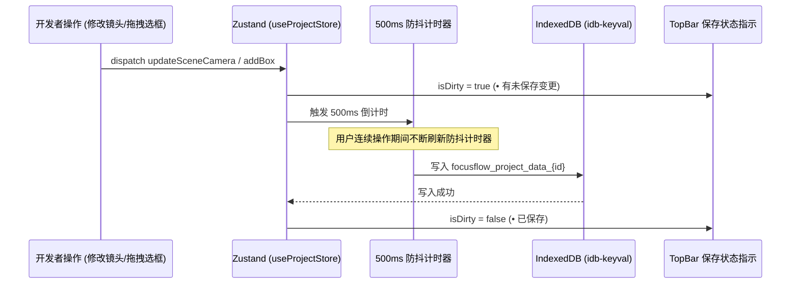

# FocusFlow Studio · Stage 2 详细技术开发设计文档
## 资产导入、IndexedDB 本地持久化与模板中心 (Ingestion, Local Storage & Templates)

---

## 1. 架构目标与设计原则 (Objectives & Design Principles)

Stage 2 核心使命是构筑 **FocusFlow Studio 模式 A（离线自治模式）** 的“数据底座”与“灵感起点”：
1. **0 依赖图片直传与零成本物理分辨率解析 (Zero-Cost Image Decoding)**：
   - 彻底脱离后端上传服务，纯浏览器端利用 `Image.decode()` 与 `Blob URL / Data URL` 瞬间完成 $4\text{K}/8\text{K}$（最高支持 $7680\times 4320$）无压缩超清架构图的物理像素提取与安全视口尺寸归一化；
   - 自动生成第一幕全景开场场景（Scene 0: Overview），完成 FocusFlow DSL 语法树的初始骨架装配。
2. **纯前端无感自治 IndexedDB 存储流水线 (Offline-First Persistent Pipeline)**：
   - 采用轻量且高性能的 `idb-keyval` 封装 IndexedDB 操作，实现草稿的 **500ms 防抖自动写入**；
   - 实现本地多工程管理（创建、读取、更新、重命名、复制、导出、物理删除），无需注册登录即可获得完整的桌面级 IDE 存储体验；
   - 包含超大底图二进制 `Blob` 的本地独立存储与跨会话秒级复原。
3. **6 套工业级高精架构演进预设模板 (Production Architecture Templates Library)**：
   - 内置覆盖酒店 PMS 房态调度（POC/MVP 经典升级版）、高并发微服务、DDD 领域驱动设计、Kubernetes 云原生、分布式事务、大模型 RAG 检索增强生成的 6 大完整 FocusFlow DSL 模板；
   - 提供开箱即用的一键应用与多场景镜头预览功能。
4. **统一设计语言的模态窗与抽屉体系 (Modal & Drawer Ecosystem)**：
   - 打造 `ImageUploadModal`、`TemplatesModal` 与 `ProjectManagerModal`，完美适配 Dark / Light 双主题与中英文 i18n。

```
┌─────────────────────────────────────────────────────────────────────────────┐
│                       FocusFlow Studio · Stage 2 数据架构                    │
└─────────────────────────────────────────────────────────────────────────────┘
                                      │
           ┌──────────────────────────┼──────────────────────────┐
           ▼                          ▼                          ▼
┌───────────────────────┐  ┌───────────────────────┐  ┌───────────────────────┐
│ 1. 资产导入引擎        │  │ 2. 离线 IndexedDB 存储 │  │ 3. 模板中心           │
│ - Drag & Drop 上传    │  │ - idb-keyval 数据库   │  │ - 6 套预置架构 DSL    │
│ - Image.decode() 解析 │  │ - 500ms 防抖自动保存  │  │ - 实时缩略图与运镜预览 │
│ - 物理分辨率智能适配   │  │ - 项目列表 CRUD       │  │ - 一键克隆为独立工程  │
└───────────────────────┘  └───────────────────────┘  └───────────────────────┘
           │                          │                          │
           └──────────────────────────┼──────────────────────────┘
                                      ▼
                      ┌──────────────────────────────┐
                      │   Zustand useProjectStore    │
                      │   FocusFlow DSL 响应式语法树  │
                      └──────────────────────────────┘
```

---

## 2. 资产导入与物理分辨率解析设计 (Image Ingestion Engine)

### 2.1 拖拽与文件选择解析流 (Ingestion Pipeline)

用户通过拖拽外部图片至画布区域，或点击顶部控制台/空画布界面的“导入底图”触发上传：
1. **支持格式**：`image/png`, `image/jpeg`, `image/webp`, `image/svg+xml`。
2. **文件安全校验**：限制单张底图体积 $\le 30\text{MB}$，防止移动端或极低配置机器出现 OOM。
3. **物理分辨率异步提取**：
   使用现代化 `Image.decode()` API（相比传统 `img.onload` 更稳定且具有异步解码优势）：

```typescript
export interface ImageMeta {
  url: string;
  blob?: Blob;
  width: number;
  height: number;
  fileName: string;
  fileSize: number;
  mimeType: string;
}

export async function parseImageFile(file: File): Promise<ImageMeta> {
  const blobUrl = URL.createObjectURL(file);
  const img = new Image();
  img.src = blobUrl;
  
  // 现代浏览器原生异步解码，不阻塞主线程渲染
  await img.decode();

  return {
    url: blobUrl,
    blob: file,
    width: img.naturalWidth || 1920,
    height: img.naturalHeight || 1080,
    fileName: file.name,
    fileSize: file.size,
    mimeType: file.type,
  };
}
```

### 2.2 智能开场生成与 DSL 初始化 (Scene 0 Synthesizer)

当解析到全新底图时，自动合成全景初始 DSL：
- `meta.title`: 默认为去除扩展名后的文件名（例如 `microservice-arch.png` $\rightarrow$ `microservice-arch`）；
- `meta.viewport`: 设置为天然物理分辨率 `{ width: img.width, height: img.height }`；
- `scenes[0]`: 自动创建 `Scene 0: 全局总览架构`，摄像机参数初始化为 `{ zoom: 1.0, x: 0, y: 0, duration: 1.2 }`，激活全景视图。

---

## 3. 离线自治 IndexedDB 存储架构 (Offline Persistent Pipeline)

### 3.1 存储模型与数据模式 (Storage Schema)

基于 `idb-keyval` 建立持久化键值存储，结构如下：

```typescript
export interface ProjectRecord {
  id: string;                    // 工程唯一 UUID (例如 "proj_1725000000000_abc")
  title: string;                 // 工程名称
  createdAt: number;             // 创建时间戳
  updatedAt: number;             // 最后修改时间戳
  thumbnail?: string;            // 项目首帧微缩图 DataURL
  dsl: FocusFlowDSL;             // 完整 FocusFlow DSL 数据树
  imageBlob?: Blob;              // 原始大底图二进制 Blob (保证脱网与持久可用)
}
```

### 3.2 存储键名规划 (Keys Topology)

| 键名 (Key) | 类型 | 说明 |
| :--- | :--- | :--- |
| `focusflow_current_project_id` | `string` | 当前工作区打开的工程 ID |
| `focusflow_project_index` | `Array<Omit<ProjectRecord, 'dsl' \| 'imageBlob'>>` | 轻量级项目元数据列表（用于工程列表秒开渲染） |
| `focusflow_project_data_{id}` | `ProjectRecord` | 单个工程的完整 DSL 与大底图二进制 |

### 3.3 自动保存与 500ms 防抖流程 (Debounced Auto-Save Flow)



---

## 4. 6 大工业级高精预设架构模板规范 (Templates Specification)

Stage 2 内置 6 套工业级高精预设模板，所有模板均包含完整底图（矢量高保真绘制/高精 SVG）、图元标注矩阵、解说气泡与多幕运镜编排：

### 4.1 模板清单 (Templates Catalog)

1. **`tpl-hotel-pms` · LuxeHMS 酒店 PMS 房态与高并发预订核心架构 (经典示例升级版)**
   - **核心背景**：源自 POC 与 MVP 验证阶段沉淀的经典生产级案例，经过全新 $5\text{K}$ 极清底图重构与动效全面升级；
   - **核心内容**：多端接入层 (Web/小程序) $\rightarrow$ Nginx 动静分离网关 $\rightarrow$ NestJS 业务中台 (CASL 权限与排房引擎) $\rightarrow$ Redis 房态分布式锁集群 $\rightarrow$ PostgreSQL 多租户行级事务存储 $\rightarrow$ Tape Chart (房态甘特画卷画中画深度下钻 Overlay)；
   - **镜头幕数**：5 幕立体推演 (01 全局总览 $\rightarrow$ 02 鉴权与调度核心 $\rightarrow$ 03 Redis 房态分布式锁 $\rightarrow$ 04 PostgreSQL 数据中枢 $\rightarrow$ 05 房态画卷画中画深度下钻)；
   - **视觉色系与动效**：极光青 (#38bdf8)、翡翠绿 (#34d399)、霓虹粉 (#f472b6) 与琥珀金 (#fbbf24)，搭配贝塞尔流光连线与动态画中画弹窗。

2. **`tpl-microservices` · 微服务高可用电商中台演进**
   - **核心内容**：API 网关集群 $\rightarrow$ 动态鉴权中心 $\rightarrow$ 订单核心微服务 $\rightarrow$ 扣减库存与防超卖 $\rightarrow$ 支付超时队列 $\rightarrow$ 分布式事务 Seata AT；
   - **镜头幕数**：5 幕连续运镜演进；
   - **视觉色系**：极光青 (#38bdf8) 与翡翠绿 (#34d399)。

3. **`tpl-ddd-architecture` · DDD 领域驱动设计典型分层模型**
   - **核心内容**：用户接口层 (Interfaces) $\rightarrow$ 应用服务层 (Application) $\rightarrow$ 领域模型层 (Domain Aggregate Root) $\rightarrow$ 基础设施层 (Infrastructure Repository)；
   - **镜头幕数**：4 幕自顶向下聚焦；
   - **视觉色系**：琥珀金 (#fbbf24) 与霓虹紫 (#c084fc)。

4. **`tpl-k8s-cloudnative` · Kubernetes 云原生 GitOps 流水线**
   - **核心内容**：GitHub Commit $\rightarrow$ ArgoCD 监听 $\rightarrow$ Ingress Controller $\rightarrow$ Service Mesh (Istio) $\rightarrow$ Pod 灰度金丝雀发布 (Canary)；
   - **镜头幕数**：5 幕流光连线追踪；
   - **视觉色系**：天空蓝 (#0ea5e9) 与科技橙 (#f97316)。

5. **`tpl-distributed-tx` · 分布式事务与最终一致性可靠消息队列**
   - **核心内容**：本地事务提交 $\rightarrow$ 写入本地消息表 $\rightarrow$ CDC 增量捕获 (Debezium) $\rightarrow$ Kafka Topic $\rightarrow$ 消费者幂等消费 $\rightarrow$ 补偿重试机制；
   - **镜头幕数**：4 幕深度下钻；
   - **视觉色系**：玫瑰红 (#f43f5e) 与翡翠绿 (#10b981)。

6. **`tpl-ai-rag-pipeline` · 大模型企业级 RAG 检索增强生成链路**
   - **核心内容**：文档切片 (Chunking) $\rightarrow$ Embedding 向量化 $\rightarrow$ Milvus 混合检索 $\rightarrow$ 重排器 (Rerank) $\rightarrow$ Prompt 组装 $\rightarrow$ LLM 深度推理输出；
   - **镜头幕数**：6 幕前沿流程式推演；
   - **视觉色系**：电光紫 (#a855f7) 与赛博青 (#06b6d4)。

---

## 5. UI 组件与交互设计 (UI & Modal Components)

Stage 2 新增 3 个核心业务弹窗与抽屉组件，存放于 `apps/studio/src/components/modals/`：

```
apps/studio/src/components/modals/
├── 📥 ImageUploadModal.tsx      # ✅ 底图导入弹窗 (拖拽上传区、URL 在线解析、分辨率预览)
├── 📚 TemplatesModal.tsx        # ✅ 5 大模板选择中心 (网格卡片、多幕镜头动态预览、一键克隆)
├── 🗂️ ProjectManagerModal.tsx   # ✅ 离线项目管理抽屉 (工程列表、最后编辑时间、重命名、导出 JSON、物理删除)
└── 📦 index.ts                 # ✅ 模态窗统一对外导出
```

### 5.1 `ImageUploadModal.tsx` 设计规范
- 区域一：全屏毛玻璃背景遮罩与发光边框；
- 区域二：支持点击选择或直接将本地图片（PNG/JPG/WEBP/SVG）拖拽进交互热区；
- 区域三：支持粘贴公开图片 URL 异步嗅探分辨率并一键导入；
- 区域四：解析成功即时显示图片尺寸微缩预览徽章（如 `5120 × 2880 px · 3.4 MB`）。

### 5.2 `TemplatesModal.tsx` 设计规范
- 顶部分类筛选 Tag（`全部`、`微服务`、`云原生`、`AI 大模型`、`数据架构`）；
- 卡片主体：封面缩略图、运镜幕数徽章、预估演播时长、架构说明文案；
- 悬停动效：霓虹青色辉光边框与“一键创建工程”主操作按键。

### 5.3 `ProjectManagerModal.tsx` 设计规范
- 列表式呈现本地 IndexedDB 中存储的所有历史工程；
- 单行支持：项目标题直接双击内联重命名、场景数统计、最后修改时间（如 `3分钟前`）、克隆副本、导出 DSL 文件 (`.json`)、危险红高亮物理删除。

---

## 6. 状态流转与持久化拓扑 (Zustand + Storage Integration)

在 `apps/studio/src/stores/` 中新建 `useStorageStore.ts`，并增强 `useProjectStore.ts`：

```typescript
export interface StorageState {
  currentProjectId: string | null;
  projectList: Array<{
    id: string;
    title: string;
    createdAt: number;
    updatedAt: number;
    sceneCount: number;
  }>;
  isSaving: boolean;
  
  // Actions
  loadProjectList: () => Promise<void>;
  createProject: (title: string, dsl: FocusFlowDSL, imageBlob?: Blob) => Promise<string>;
  openProject: (id: string) => Promise<void>;
  saveCurrentProject: () => Promise<void>;
  renameProject: (id: string, newTitle: string) => Promise<void>;
  duplicateProject: (id: string) => Promise<string>;
  deleteProject: (id: string) => Promise<void>;
  importFromDSL: (dsl: FocusFlowDSL, title?: string) => Promise<string>;
  applyTemplate: (templateId: string) => Promise<string>;
}
```

---

## 7. Playwright E2E 自动化测试设计 (Testing Strategy)

严格遵循全局规则（**测试用例逻辑全部提取为独立的异步 helper 函数，在 `it()` / `test()` 中调用**）：

```typescript
// apps/studio/e2e/stage2-ingestion-storage.spec.ts

async function verifyImageUploadAndResolutionExtraction(page: Page): Promise<void>;
async function verifyIndexedDBAutoSaveAndReload(page: Page): Promise<void>;
async function verifyTemplateApplicationFlow(page: Page): Promise<void>;
async function verifyProjectManagerCRUDOperations(page: Page): Promise<void>;

test.describe('FocusFlow Studio Stage 2 E2E Ingestion & Storage Suite', () => {
  test('TC201: 验证本地底图拖拽/选择上传并自动生成全景 Scene 0', async ({ page }) => {
    await verifyImageUploadAndResolutionExtraction(page);
  });

  test('TC202: 验证 500ms 防抖自动写入 IndexedDB 与刷新无损复原', async ({ page }) => {
    await verifyIndexedDBAutoSaveAndReload(page);
  });

  test('TC203: 验证从模板中心一键应用预置微服务架构', async ({ page }) => {
    await verifyTemplateApplicationFlow(page);
  });

  test('TC204: 验证项目管理器中重命名、克隆与物理删除工程', async ({ page }) => {
    await verifyProjectManagerCRUDOperations(page);
  });
});
```

---

## 8. Stage 2 任务分解与执行清单 (WBS Checklist)

- [x] **Task 2.1: 资产解析与图像解码引擎 (Image Ingestion & Decoding)**
  - [x] 2.1.1 编写 `src/utils/imageDecoder.ts`：利用原生 `Image.decode()` 提取真实天然宽高，生成安全 ObjectURL
  - [x] 2.1.2 编写 `src/components/modals/ImageUploadModal.tsx`：实现拖拽上传区、URL 导入与分辨率徽章显示
  - [x] 2.1.3 将底图上传与自动生成 Scene 0 逻辑接入工作台中心空状态与 TopBar
- [ ] **Task 2.2: 离线 IndexedDB 持久化引擎与项目管理 (IndexedDB & Storage Store)**
  - [ ] 2.2.1 引入 `idb-keyval` 并编写 `src/services/storage.ts` 数据访问层
  - [ ] 2.2.2 编写 `src/stores/useStorageStore.ts`：实现 500ms 防抖自动存盘与工程列表 CRUD
  - [ ] 2.2.3 编写 `src/components/modals/ProjectManagerModal.tsx`：提供工程列表、重命名、复制、导出与物理删除
- [ ] **Task 2.3: 6 大工业级高精预设架构模板中心 (Templates Library)**
  - [ ] 2.3.1 编写 `src/templates/` 6 套预置架构 DSL（LuxeHMS 酒店 PMS 房态调度经典升级版、微服务集群、DDD 模型、K8s 云原生、分布式事务、AI RAG 链路）
  - [ ] 2.3.2 编写 `src/components/modals/TemplatesModal.tsx`：实现分类过滤、动态预览与一键克隆为当前工程
  - [ ] 2.3.3 在 `TopBar.tsx` 新增“模板中心”与“我的项目”触发入口
- [ ] **Task 2.4: 国际化多语言词条扩充与类型更新 (i18n Augmentation)**
  - [ ] 2.4.1 扩充 `src/locales/zh/` 与 `src/locales/en/`（新增 `upload.ts`, `templates.ts`, `projects.ts`）
  - [ ] 2.4.2 更新 `src/i18n.d.ts` 强类型声明
- [ ] **Task 2.5: 质量门禁与 Playwright E2E 自动化测试 (Quality Gates & Verification)**
  - [ ] 2.5.1 编写 `e2e/stage2-ingestion-storage.spec.ts`（独立异步 helper 函数规范）
  - [ ] 2.5.2 运行 `pnpm lint`（Oxlint 极速静态检查 0 警告 0 错误）
  - [ ] 2.5.3 运行 `pnpm typecheck`（TypeScript 复合类型 100% 编译通过）
  - [ ] 2.5.4 运行 `pnpm build`（Turborepo 全局拓扑构建验证通过）

---
*FocusFlow Studio Architecture Working Group · 2026.08*
