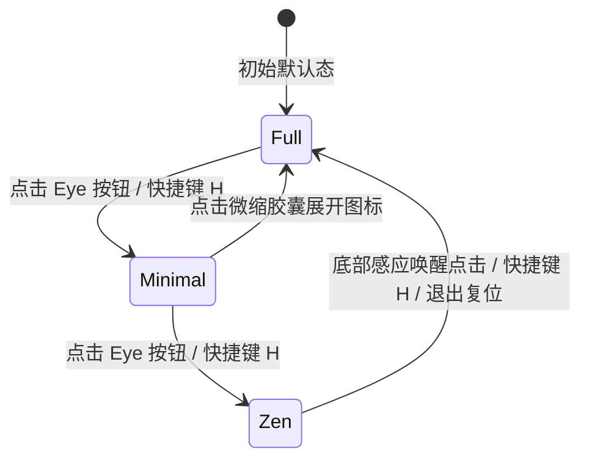

# FocusFlow 统一演播控制组件 (PlaybackIsland) 产品设计规范书 (PRD)

> **版本**：v1.0.0  
> **状态**：评审就绪 (Design Ready)  
> **核心定位**：全场景统一的架构演播与交互中枢 (Unified Playback Island)  
> **核心使命**：消除 Studio 全屏演播、脱机单文件 HTML 交付、60FPS 影视级视频录制三大场景的视觉、状态与交互割裂，实现“一处规范，全景如一”。

---

## 1. 产品定位与设计原则 (Product Positioning & Principles)

### 1.1 核心定位
`PlaybackIsland`（演播控制浮岛 / 播放控制组件）是 FocusFlow 项目的**唯一标准化演播交互枢纽**。无论宿主是 React 驱动的 Studio 演播大屏，还是 50KB 零依赖的离线单文件 `.html`，均呈现完全统一的视觉质感、响应逻辑与交互心智。

```
                       ┌───────────────────────────────────────┐
                       │     统一设计规范 (Playback Island)     │
                       └───────────────────┬───────────────────┘
                                           │
         ┌─────────────────────────────────┼─────────────────────────────────┐
         ▼                                 ▼                                 ▼
┌─────────────────┐               ┌─────────────────┐               ┌─────────────────┐
│ 独立单文件 HTML │               │ Studio 全屏演播 │               │ 60FPS 视频录制  │
│ (Vanilla JS DOM)│               │ (React UI 组件) │               │ (成片稳定保留)  │
└─────────────────┘               └─────────────────┘               └─────────────────┘
```

### 1.2 四大核心设计原则
1. **克制与不喧宾夺主 (Restrained & Canvas-First)**：
   - 核心主角永远是“动态演进的架构图本身”；
   - 控制栏采用深色高质感磨砂玻璃药丸形态（Linear/Raycast 风格），悬浮于画面底部，最大程度减少对架构主图的视线遮挡。
2. **动静自适应心理模型 (Dynamic & Context-Aware Time Cognition)**：
   - **手动单步交互态 (Paused / Manual)**：用户是在“翻看精美的技术 PPT / 架构白皮书”，没有时钟流动。**严格隐藏时间文字**，消除“系统卡死”的疑惑与催促焦虑；
   - **自动演播推演态 (Playing / Auto-advance)**：演播节奏正在自动流动。**微型时间勋章平滑展开**（`⏱️ 00:03 / 00:06`），帮助受众与演讲者掌控节奏。
3. **零学习成本全键鼠闭环 (Intuitive Dual-Mode Control)**：
   - 支持完整的鼠标悬停、点击、滑动操作；
   - 严格绑定标准快捷键（`Space` 启停、`←/→` 翻页、`H` 切换三态、`F` 全屏、`ESC` 退出），演讲者无需低头找鼠标。
4. **跨技术栈 1:1 像素级等价 (Pixel-Perfect Dual-Stack Parity)**：
   - 淘汰原先在 HTML 导出中遗留的粗糙长 Tab 按钮条；
   - 原生 Vanilla JS 渲染与 React 组件在 DOM 结构、CSS 类名、图标尺寸、间距配色上保持 100% 镜像一致。

---

## 2. 场景映射与功能矩阵 (Scenario Matrix)

| 场景划分 | 运行载体 | 核心模式 | 控制栏形态与包含元素 | 时间显示规则 | 创作者按钮 (Close/Eye) | 3秒无操作自动隐藏 |
| :--- | :--- | :--- | :--- | :--- | :--- | :--- |
| **场景 A：离线单文件 HTML** | 浏览器直接双击 `.html` | 默认暂停，用户自主点击翻页为主 | **居中 MVP 胶囊**<br/>`[◀][▶][▶] 01/05 · 场景名` | **🔴 隐藏**<br/>(点击播放后平滑展开) | 隐藏关闭按钮，保留 HUD 切换 | **开启** (鼠标静止 3s 渐隐) |
| **场景 B：Studio 全屏演播** | Studio 内部 `AudienceModal` | 演讲者彩排或现场投屏演播 | **支持三态** (`full` / `minimal` / `zen`) | **按需动态** (播放时展现，暂停时收起) | 完整保留 (右上角 X、全屏 F、Eye) | **开启** (鼠标静止 3s 渐隐) |
| **场景 C：60FPS 屏幕录制** | 浏览器媒体流捕获 | 自动连续录制推演 (`isPlaying=true`) | **居中 MVP 胶囊稳定常驻入片**<br/>(若选 zen 则全屏 0 DOM) | **🟢 实时展开** (`⏱️ 00:03 / 00:06`) | **🚫 彻底屏蔽** (创作者控制移至独立 PiP) | **🔴 禁用** (成片中恒定高亮，杜绝突兀闪烁) |

---

## 3. 视觉与排版系统规范 (Visual & Layout Specifications)

### 3.1 容器视觉规格 (Island Capsule Container)
* **定位**：`position: absolute; bottom: 24px; left: 50%; transform: translateX(-50%);`
* **高度与圆角**：固定高度 `40px`，圆角 `rounded-full` (`border-radius: 9999px;`)
* **材质与阴影**：
  * 背景：`rgba(15, 23, 42, 0.90)` (`bg-slate-900/90`)
  * 滤镜：`backdrop-filter: blur(16px); -webkit-backdrop-filter: blur(16px);`
  * 边框：`1px solid rgba(255, 255, 255, 0.10)` (`border-slate-800/90`)
  * 投影：`box-shadow: 0 20px 40px -15px rgba(0, 0, 0, 0.7), 0 0 20px rgba(56, 189, 248, 0.10);`
* **自适应约束**：`max-width: min(92vw, 760px); z-index: 40;`

```
┌───────────────────────────────────────────────────────────────────────────────────────────────────┐
│  [◀]  [⏸]  [▶]  │  ● 02 / 05 │ 核心数据流架构  │  ⏱️ 00:03 / 00:06  │  ⛶ 6  │  [👁️]            │
└───────────────────────────────────────────────────────────────────────────────────────────────────┘
   区1: 步进导航   分     区2: 分幕索引与场景标题      分   区3: 动态时间勋章  分  区4:图元 分  区5:HUD模式
                  割                                割   (isPlaying=true)   割  (可选)  割  (录制屏蔽)
                  线                                线                      线          线
```

### 3.2 内部七大功能区块排布 (Horizontal Anatomy)

1. **区 1：翻页与播放导航簇 (Step Navigation Group)**：
   * **上一幕 (`btn-prev`)**：`28px` 纯圆幽灵按钮，禁用态 `opacity: 0.35`；
   * **主播放/暂停键 (`btn-play`)**：`32px` 高亮强调按钮，主题青色（`bg-cyan-500/20 text-cyan-400 border border-cyan-500/40`），播放态为 `<Pause>`，暂停态为 `<Play>`；
   * **下一幕 (`btn-next`)**：`28px` 纯圆幽灵按钮，到末尾幕自动禁用。
2. **微分割线 1**：`h-4 w-px bg-slate-800`。
3. **区 2：分幕索引与标题徽章 (Scene Identity Capsule)**：
   * **微呼吸绿/青点**：`w-1.5 h-1.5 rounded-full bg-cyan-400 animate-pulse`；
   * **当前/总分幕序号**：`font-mono text-xs font-semibold text-white`（例：`02 / 05`）；
   * **微分割线**：`h-3 w-px bg-slate-800`；
   * **当前场景标题**：`text-xs text-slate-300 font-medium max-w-[180px] truncate`，悬浮时显示完整原生标题 tooltip。
4. **区 3：动态时间微勋章 (Dynamic Stopwatch Pill)**：
   * **显示条件**：`isPlaying === true` 时展开；`isPlaying === false` 时收缩隐藏；
   * **展开过渡**：`transition: all 0.3s cubic-bezier(0.16, 1, 0.3, 1);`；
   * **视觉式样**：`text-xs font-mono text-cyan-300 bg-cyan-950/60 border border-cyan-500/20 px-2.5 py-0.5 rounded-full`；
   * **内容**：`<Clock className="w-3 h-3 text-cyan-400" /> mm:ss / mm:ss`。
5. **微分割线 2**：`h-4 w-px bg-slate-800`。
6. **区 4：图元密度微指示器 (Element Density Counter)** *(大屏视口展现，小屏自动折叠)*：
   * 图标 `<Layers className="w-3 h-3 text-slate-400" />` + 文本 `text-[11px] font-mono text-slate-400`。
7. **区 5：HUD 模式切换操作 (Display Mode Switcher)**：
   * 包含 `<Eye>` 图标，用于在 `full` ⇋ `minimal` ⇋ `zen` 之间无缝轮转；
   * **录制模式下物理剔除**：确保导出的成片中没有任何编辑/控制类图标。

---

## 4. 交互状态机与行为流转 (Interaction State Machine)

### 4.1 三态切换状态机 (HUD Tri-State Cycle)



* **Full (完整态)**：底部居中 40px 完整胶囊，功能完备；
* **Minimal (微缩态)**：收缩至右下角 32px 紧凑圆角矩形，仅保留当前分幕序号（`02/05`）与展开按钮，大幅降低主画布遮挡；
* **Zen (沉浸纯净态)**：
  * 视口内 **0 像素遮挡**；
  * 屏幕底部设置 `64px` 高度的透明感应带；鼠标滑入或晃动时，底部正中平滑浮出唤醒浮岛：`[👁️ 纯净演播中 · 点击恢复控制栏 (快捷键 H)]`；
  * 鼠标静止 3 秒后再度平滑淡出。

### 4.2 动静与自动渐隐时序 (Auto-Hide Timing Model)

| 场景 | 播放状态 (PlayState) | 鼠标状态 | 控制栏显隐行为 |
| :--- | :--- | :--- | :--- |
| **Studio 演播** | `isPlaying = true` (推演中) | 鼠标活跃 | 100% 显现 (`opacity-100 scale-100`) |
| **Studio 演播** | `isPlaying = true` (推演中) | 静止超过 3.0s | 平滑淡出 (`opacity-0 scale-95 pointer-events-none`) |
| **Studio 演播** | `isPlaying = false` (暂停中) | 静止超过 3.0s | **保持 100% 常驻显现**（便于用户点击翻页） |
| **60FPS 录制** | `isRecording = true` | 任何状态 | **强制 100% 常驻显现**（杜绝录像成片中途突然消失） |

### 4.3 键盘全局无障碍映射 (Keyboard Navigation Matrix)

* `Space` (空格键)：播放 / 暂停切换；
* `ArrowRight` / `PageDown`：无缝推演至下一幕（最后一幕触发循环或静止）；
* `ArrowLeft` / `PageUp`：回溯至上一幕；
* `h` / `H`：切换 HUD 模式（Full ➔ Minimal ➔ Zen ➔ Full）；
* `f` / `F`：全屏切换；
* `Escape`：退出演播模式 / 终止视频录制并触发下载。

---

## 5. 双技术栈实现架构与数据契约 (Dual-Stack Architecture & Contract)

### 5.1 核心数据状态契约 (Core Contract)

```typescript
export type PlaybackHudMode = 'full' | 'minimal' | 'zen';

export interface PlaybackIslandProps {
  // 核心播放状态
  isPlaying: boolean;
  currentSceneIdx: number;
  totalScenes: number;
  currentSceneTitle?: string;
  elementCount?: number;
  
  // 时间刻度 (毫秒)
  sceneElapsedMs: number;
  sceneDurationMs: number;
  totalElapsedMs?: number;
  totalDurationMs?: number;

  // 模式与环境标志
  hudMode: PlaybackHudMode;
  isRecording?: boolean;        // 是否处于视频录制中 (录制态屏蔽Eye按钮，禁止3s自动淡出)
  isUserActive?: boolean;       // 鼠标是否活跃 (用于3s自动隐藏计算)

  // 动作回调
  onTogglePlay: () => void;
  onPrev: () => void;
  onNext: () => void;
  onCycleHudMode?: () => void;
  onRestoreFull?: () => void;
}
```

### 5.2 React 侧架构封装 (`apps/studio`)
* 路径：`apps/studio/src/components/playback/PlaybackIsland.tsx`
* 职责：纯受控展示组件（Pure Presentation Component），彻底将控制胶囊从 `AudienceModal.tsx` 的面条代码中剥离；
* 适用范围：
  1. `AudienceModal.tsx`（演播大屏）；
  2. 主编辑画布底部快速预览悬浮条；
  3. 未来的独立受众大屏多窗口视图。

### 5.3 Vanilla JS 核心层镜像重构 (`packages/player`)
* 路径：`packages/player/src/core/player.js` & `packages/player/src/styles/focusflow.css`
* 结构重构：
  * **彻底删除原先粗糙的 `.ff-step-tabs`（横向长条文本 Tab）**；
  * 原生模板结构与 CSS 类名采用与 React 相同的语义设计（`.focusflow-island`、`.ff-nav-cluster`、`.ff-scene-pill`、`.ff-timer-pill`）；
  * CSS 变量直接对齐主设计语言：
    ```css
    :root {
      --ff-island-bg: rgba(15, 23, 42, 0.90);
      --ff-island-border: rgba(255, 255, 255, 0.10);
      --ff-island-accent: #38bdf8;
      --ff-island-text: #f8fafc;
      --ff-island-muted: #94a3b8;
    }
    ```
  * 导出的脱机单文件 HTML 与 Studio 内部演播视觉达到 **100% 像素级一致**。

---

## 6. 实施路线图与验收基准 (Roadmap & Acceptance Criteria)

### 6.1 分阶段实施规划
* **Phase 1：React 受控组件抽离**
  * 在 Studio 中建立独立组件 `PlaybackIsland.tsx`，将 `AudienceModal` 内部内联代码解耦替换；
* **Phase 2：Vanilla JS 播放器 DOM 与 CSS 1:1 像素级升级**
  * 重构 `packages/player/src/core/player.js` 中的控制栏 HTML 模板，剔除长 Tab，引入与 `PlaybackIsland` 一致的居中胶囊与分幕标题指示器；
  * 重新构建 `@focusflow/player`，确保单文件 HTML 导出自带顶级美学质感；
* **Phase 3：全场景 E2E 自动化测试固化**
  * 覆盖 HTML 导出独立播放、Studio 全屏演播三态流转、60FPS 录制控制条稳定入片且屏蔽创作者按钮的全链路回归测试。

### 6.2 质量验收基准 (Acceptance Checklist)
- [ ] **视觉一致性**：导出的单文件 HTML 底部控制条与 Studio 演播大屏底部控制胶囊在比例、圆角、文字字号、图标风格上完全一致；
- [ ] **时间自适应**：
  - 手动单步操作或暂停时，时间刻度 100% 物理隐藏，消除读者卡顿疑虑；
  - 自动演播推演时，动态时间秒表微勋章平滑展开，准确呈现分幕进度；
- [ ] **录制稳定性**：录制生成的视频成片中，MVP 演示胶囊全程高亮稳定常驻，不随鼠标静止而闪烁淡出；同时视频中绝无任何 `X` 关闭按钮或 `Eye` 切换按钮残留；
- [ ] **测试覆盖率**：`stage5-export-compiler.spec.ts` 与 `stage5-audio-sync.spec.ts` 保持 100% 通过。
