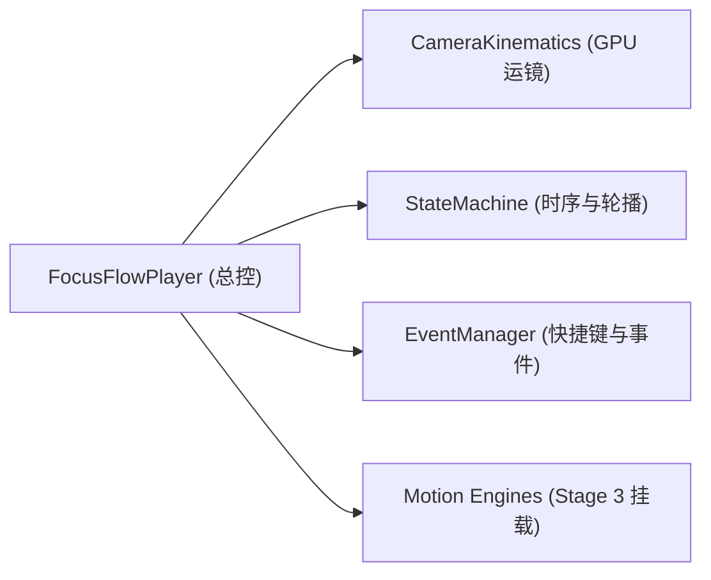

# FocusFlow Phase 1 (MVP) - Stage 2 进度报告
## Stage 2: 消费端播放器核心与状态机 (Player Core & Lifecycle Engine)

- **执行日期**：2026-08-28
- **当前状态**：✅ **已完成 (100%)**

---

### 1. 本阶段完成成果清单

| 任务项 | 交付文件 | 完成说明 |
| :--- | :--- | :--- |
| **2.1 `FocusFlowPlayer` 基础类封装** | `src/core/player.js` | 负责 DOM 装配、3 层视觉叠加体系初始化、SVG 动态渲染与子引擎总调度。 |
| **2.2 GPU 镜头运动学与安全边界** | `src/core/camera.js` | 实现 `scale` + `translate` 硬件加速矩阵变换与 $|T_x|, |T_y| \le \frac{Z-1}{2Z} \times 100\%$ 安全视口钳位算法。 |
| **2.3 场景状态机与双重 RAF 调度** | `src/core/state-machine.js` | 实现步骤流转（`goTo`, `next`, `prev`）、自动轮播定时器与状态维护。 |
| **2.4 全维交互控制系统** | `src/core/events.js` | 实现键盘快捷键（`←`/`→`/`Space`/`P`/`Home`/`End`/`Ctrl+Shift+D`）、底部 Tab 点击与全屏自适应。 |

---

### 2. 核心架构逻辑实现验证

---

### 3. 下一步计划 (Stage 3)
即将进入 **Stage 3: 矢量动效与拓扑几何子引擎 (Vector & Motion Sub-Engines)**：
* 编写 `src/motion/geometry.js`（圆角矩形精准周长算法与自动测长）
* 编写 `src/motion/bezier-router.js`（8 向标准吸附锚点与三次贝塞尔控制点自动推导）
* 编写 `src/motion/animator.js`（描边生长、持续流光跑马灯与气泡阶梯弹入调度器）
