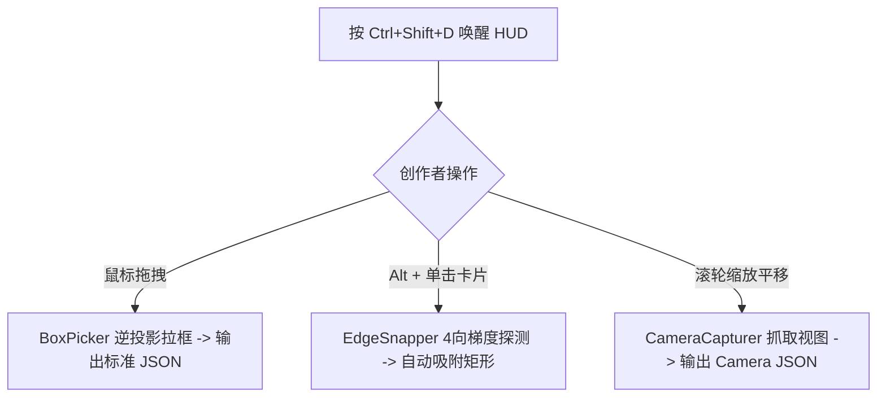

# FocusFlow Phase 1 (MVP) - Stage 4 进度报告
## Stage 4: 内置开发者 HUD 标定工具层 (In-Player HUD Calibration Tooling)

- **执行日期**：2026-08-28
- **当前状态**：✅ **已完成 (100%)**

---

### 1. 本阶段完成成果清单

| 任务项 | 交付文件 | 完成说明 |
| :--- | :--- | :--- |
| **4.1 HUD 标定管理器** | `src/hud/hud-manager.js` | 实现 `Ctrl+Shift+D` 快捷键切换调试层、实时坐标显示面板与 Toast 提示组件。 |
| **4.2 模式一：拖拽拉框生成选框** | `src/hud/box-picker.js` | 实现屏幕像素 ➔ 5120x2880 画布逻辑坐标逆投影算法，支持鼠标拖拽拉出虚线框并格式化输出 JSON。 |
| **4.3 模式二：单点点击边缘智能吸附** | `src/hud/edge-snapper.js` | 离屏 Canvas 底图像素采样，实现 4 向光线探测（Ray Casting）与色彩梯度跃变卡片边界吸附算法（Alt + 单击）。 |
| **4.4 模式三：一键镜头矩阵捕获** | `src/hud/camera-capturer.js` | 自动抓取当前自由缩放与平移的视图矩阵参数，输出 `camera: { zoom, x, y, duration }`。 |

---

### 2. 标定流程交互流验证

---

### 3. 下一步计划 (Stage 5)
即将进入 **Stage 5: 官方示例、验收测试与文档交付 (Examples & Acceptance)**：
* 编写 `src/index.js` 统一入口导出
* 创建 `examples/luxehms/` 官方实战示例（将 LuxeHMS 架构图解耦为标准 `config.json`，构建 `index.html`）
* 创建 `examples/simple-demo/` 极简快速测试示例
* 创建根目录统一预览入口 `index.html`
* 验证 6 大测试验收标准
