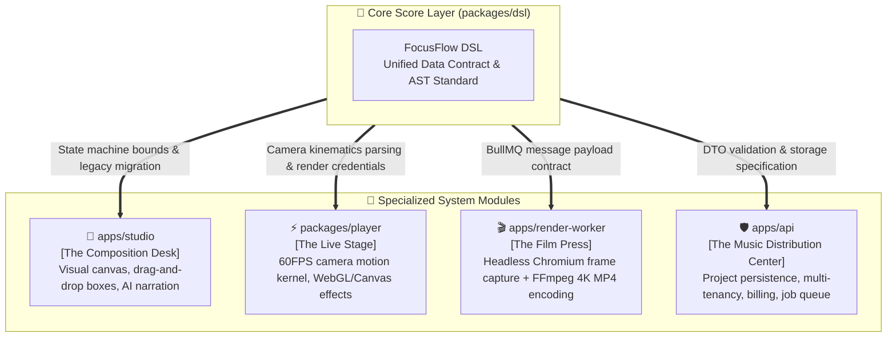

<p align="right">
  <strong>English</strong> • <a href="./02_ARCHITECTURE_AND_DSL_GUIDE.zh-CN.md">简体中文</a>
</p>

# FocusFlow Architecture Overview & DSL Data Contract Guide

> **Document Version**: 1.0.0  
> **Updated**: 2026-09-24  
> **Archive Path**: `docs/02_ARCHITECTURE_AND_DSL_GUIDE.md`  
> **Target Modules**: `@focusflow/dsl`, `@focusflow/player`, `apps/studio`, `apps/api`, `apps/render-worker`  
> **Source Files**: `packages/dsl/src/schema.ts`, `packages/dsl/src/validator.ts`, `packages/dsl/src/json-schema.ts`, `packages/dsl/src/migrations/`, `packages/dsl/src/jobs.ts`

---

## 1. System Architecture: The Orchestra Model

FocusFlow is a full-stack platform designed for **cinematic presentation and rendering of complex software and system architectures**. To avoid architectural drift and uncontrolled complexity across multiple environments (browsers, Node.js backend, distributed rendering workers), the system employs a strictly decoupled, layered topology.

Comparing the FocusFlow architecture to a professional symphony orchestra:



| Module | Architectural Role | Core Tech Stack | Primary Responsibilities |
| :--- | :--- | :--- | :--- |
| **`packages/dsl`** | **The Musical Score (Data Contract & Constitution)** | TypeScript, Zod | Single Source of Truth (SSOT), runtime defensive validation, standard JSON Schema export, cross-version self-healing migration pipeline, asynchronous render job contracts. |
| **`apps/studio`** | **The Composition Desk (Visual Studio)** | React 19, Vite 8, Tailwind CSS | Interactive authoring workspace providing box drawing, connector anchoring, Sobel edge snapping, scene script authoring, AI TTS voiceover, and live playback preview. |
| **`packages/player`** | **The Live Stage (Playback Core)** | Vanilla TS, WebGL, Canvas, Lucide | Ultra-lightweight, framework-agnostic player engine delivering 60FPS cinematic camera interpolation, Gaussian glows, spotlight bubbles, and calibration HUD controls. |
| **`apps/api`** | **The Distribution Center (SaaS Backend)** | NestJS 12, Prisma 7, PostgreSQL 18 | Enterprise master API gateway handling project persistence, tenant isolation, dual-token auth, CASL RBAC guards, ledger subscriptions, and BullMQ job scheduling. |
| **`apps/render-worker`** | **The Film Press (Headless Rendering)** | NestJS 12, Puppeteer, FFmpeg | 4K 60FPS offline video encoding worker that claims BullMQ jobs, steps through frames via virtual clock, accelerates audio-video encoding via FFmpeg, and uploads to S3/R2. |

---

## 2. Core Positioning & Five Pillars of `packages/dsl`

A common question is: *"Is `packages/dsl` simply responsible for TypeScript type definitions and JSON validation?"*

**Answer: Its role extends far beyond basic static types.**  
It functions as the **system constitution** across the entire Monorepo, sustained by five foundational pillars:

### Pillar 1: Dual-Defense Pipeline (Static Types + Runtime Validation)
* **Compile-Time Contract ([`schema.ts`](../packages/dsl/src/schema.ts))**:  
  Defines comprehensive AST interfaces (`FocusFlowDslRoot`, `DslNode`, `DslConnector`, `DslScene`, etc.), providing instant code autocompletion and static compile error detection.
* **Runtime Defensive Wall ([`validator.ts`](../packages/dsl/src/validator.ts))**:  
  Because TypeScript types are erased at runtime, untrusted external inputs (user-uploaded JSON or API payloads) are intercepted by Zod schemas. Validates bounds (camera zoom `0.1~3.0`, viewport dimensions > 0, non-empty scene arrays) with structured field-level diagnostic paths.

### Pillar 2: Single Source of Truth (SSOT)
Eliminates **Schema Drift**. In distributed architectures, frontends, backends, and workers frequently suffer out-of-sync schemas. In FocusFlow, all monorepo applications depend on `@focusflow/dsl`. When a contract evolves, all packages immediately detect it at compile time.

### Pillar 3: Offline IDE Autocompletion & Tooling (JSON Schema)
Automatically generates standard Draft-07 JSON Schema files via [`packages/dsl/scripts/export-schema.mjs`](../packages/dsl/scripts/export-schema.mjs):
* [`dsl-schema.json`](../packages/dsl/dsl-schema.json)
* [`schema/focusflow-dsl.v1.json`](../packages/dsl/schema/focusflow-dsl.v1.json)

Developers editing a local `focusflow.json` need only declare:
```json
{
  "$schema": "https://focusflow.io/schemas/dsl/v1.json"
}
```
VS Code and WebStorm immediately provide full hover documentation, autocomplete, and real-time redline syntax validation completely offline.

### Pillar 4: Backward Compatibility & Self-Healing Migration Pipeline
Projects created months ago must never fail to load due to software updates.  
[`packages/dsl/src/migrations/`](../packages/dsl/src/migrations/) provides a chainable migration engine:
1. **Automatic Version Detection**: Missing version headers default to `0.9.0` (MVP legacy format);
2. **Sequential Step Chaining**: Executes registered migration graphs (e.g. `0.9.0 -> 1.0.0`);
3. **Topological Self-Healing**: Automatically infers `aspectRatio: "16:9"`, prunes orphaned paths referencing non-existent boxes, normalizes scenes and camera bounds;
4. **Final Defense Validation**: Automatically validates with `validateDSL` to guarantee 100% compliant output.

### Pillar 5: Distributed Asynchronous Job Contracts (`jobs.ts`)
The API service and rendering workers operate on separate physical machines. [`packages/dsl/src/jobs.ts`](../packages/dsl/src/jobs.ts) standardizes:
* **`RenderVideoJobPayload`**: Global TypeID, resolution profile (4K / 1080P / 60FPS), audio mixing configuration, and direct S3 bucket upload destination;
* **`RenderJobProgressEvent`**: Micro-progress percentage during frame capture, status, and error logs.

---

## 3. How Packages Consume `@focusflow/dsl`

### 3.1 Studio Consumption (`apps/studio`)
Uses AST types to type Zustand reactive stores and self-heals legacy drafts upon import:

```typescript
import {
  type FocusFlowDSL,
  type ElementBox,
  migrateDSLToLatest,
} from '@focusflow/dsl';

export function handleImportDsl(rawInput: unknown): FocusFlowDSL {
  return migrateDSLToLatest(rawInput);
}
```

### 3.2 Player Kernel Consumption (`packages/player`)
Consumes `FocusFlowDSL` as the single canonical input credential:

```typescript
import { type FocusFlowDSL } from '@focusflow/dsl';

export class FocusFlowPlayer {
  constructor(private container: HTMLElement, private dsl: FocusFlowDSL) {
    this.initCamera(dsl.meta.viewport);
  }

  public updateDSL(nextDSL: FocusFlowDSL): void {
    this.dsl = nextDSL;
    this.rebuildTimeline();
  }
}
```

### 3.3 Main API Gateway Consumption (`apps/api`)
Validates incoming project payloads before database writes:

```typescript
import { Controller, Post, Body, BadRequestException } from '@nestjs/common';
import { validateDSL, type FocusFlowDSL } from '@focusflow/dsl';

@Controller('projects')
export class ProjectsController {
  @Post()
  async createProject(@Body() body: { title: string; dsl: unknown }) {
    const check = validateDSL(body.dsl);
    if (!check.valid) {
      throw new BadRequestException({
        message: 'Invalid FocusFlow DSL structure',
        errors: check.errors,
      });
    }
    const safeDsl: FocusFlowDSL = check.data!;
    // Persist to PostgreSQL ...
  }
}
```

### 3.4 Render Worker Consumption (`apps/render-worker`)
Consumes strongly typed BullMQ job payloads:

```typescript
import { Processor, WorkerHost } from '@nestjs/bullmq';
import { Job } from 'bullmq';
import type { RenderVideoJobPayload } from '@focusflow/dsl/jobs';

@Processor('render-video')
export class RenderVideoConsumer extends WorkerHost {
  async process(job: Job<RenderVideoJobPayload>): Promise<void> {
    const { jobId, dsl, resolution, fps } = job.data;
    console.log(`Starting headless render for job: ${jobId}`);
  }
}
```

---

## 4. Responsibility & Boundary Matrix (Do's and Don'ts)

| Dimension | Correct Practice (DO) | Strictly Forbidden (DON'T) |
| :--- | :--- | :--- |
| **External Dependencies** | Depends only on `zod`; stays pure TS/JS utility library | ❌ Never import React, NestJS, Prisma, Pixi, or DOM APIs |
| **Data Flow** | Unidirectionally imported (`apps/* -> @focusflow/dsl`) | ❌ Never reverse-import upper applications |
| **AST Evolution** | Add fields backward-compatibly and register in `migrations/` | ❌ Never remove or break existing required fields directly |
| **Statefulness** | Pure stateless functional library | ❌ Never maintain global mutable singletons or caches |
