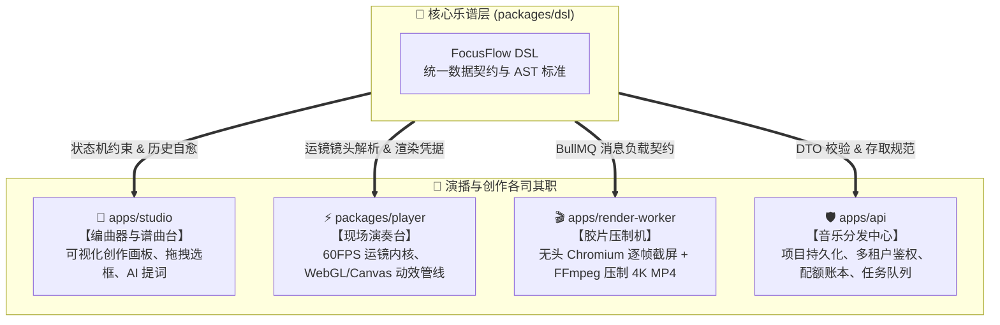

<p align="right">
  <a href="./02_ARCHITECTURE_AND_DSL_GUIDE.md">English</a> • <strong>简体中文</strong>
</p>

# FocusFlow 架构全景与 DSL 数据契约包深度指南 (FocusFlow Architecture & DSL Guide)

> **文档版本**: 1.0.0  
> **更新日期**: 2026-09-24  
> **归档路径**: `docs/02_ARCHITECTURE_AND_DSL_GUIDE.zh-CN.md`  
> **所属模块**: `@focusflow/dsl`, `@focusflow/player`, `apps/studio`, `apps/api`, `apps/render-worker`  
> **核心源码**: `packages/dsl/src/schema.ts`, `packages/dsl/src/validator.ts`, `packages/dsl/src/json-schema.ts`, `packages/dsl/src/migrations/`, `packages/dsl/src/jobs.ts`

---

## 1. 系统全景架构分工：交响乐团模型

FocusFlow 是面向复杂软件与系统架构图的**电影级动态演播与渲染全栈系统**。为了避免单体工程在多端（浏览器、Node.js 服务端、分布式截帧节点）蔓延带来的复杂度失控，系统采用严格的解耦分层架构。

如果将整个 FocusFlow 架构比作一个专业交响乐团：



| 子模块 | 架构角色 | 核心技术栈 | 核心职责 |
| :--- | :--- | :--- | :--- |
| **`packages/dsl`** | **通用五线谱（数据契约与宪法）** | TypeScript, Zod | 定义全系统唯一事实来源（SSOT）、运行时防御校验、标准 JSON Schema 导出、跨版本向下兼容自愈迁移流水线、异步渲染作业契约。 |
| **`apps/studio`** | **编曲器与谱曲台（创作端）** | React 19, Vite 8, Tailwind CSS | 可视化交互工作台，提供拖拽划框、流光飞线锚定、智能边缘吸附（Sobel）、分幕台词编辑、AI 语音合成与即时演播预览。 |
| **`packages/player`** | **现场演奏台（播放内核）** | 原生 TS, WebGL, Canvas, Lucide | 纯前端极致轻量无框架播放引擎，实现 60FPS 电影级相机平滑插值运镜、高斯流光、气泡高亮与 HUD 标定控制。 |
| **`apps/api`** | **音乐分发中心（SaaS 服务端）** | NestJS 12, Prisma 7, PostgreSQL 18 | 企业级主 API 网关，负责工程持久化落盘、多租户隔离、双 Token 认证、CASL 细粒度权限管控、商业账本订阅与 BullMQ 任务派发。 |
| **`apps/render-worker`** | **胶片压制机（无头转码集群）** | NestJS 12, Puppeteer, FFmpeg | 4K 60FPS 离线视频压制节点，认领 BullMQ 转码作业，启动虚拟时钟逐帧渲染，音轨硬件加速合成并直传对象存储（S3/R2）。 |

---

## 2. `packages/dsl` 核心定位与五大支柱

开发者常常容易产生疑问：*“`packages/dsl` 只是用来做 TypeScript 类型声明和 JSON 校验的吗？”*

**答案：它的职责远比单纯的类型声明更深、更系统化。**  
它是整个 FocusFlow Monorepo 的**“宪法标准”**，由以下五大核心支柱构成：

### 支柱 1：编译期强类型与运行时防御的双重防线
* **编译期契约（[`schema.ts`](../packages/dsl/src/schema.ts)）**：  
  定义了 `FocusFlowDslRoot`、`DslNode`、`DslConnector`、`DslScene` 等数十个强类型 AST 接口，让前端、后端、播放内核在编写代码时拥有极速精准的代码补全与静态错误预警。
* **运行时防御墙（[`validator.ts`](../packages/dsl/src/validator.ts)）**：  
  TypeScript 编译后会被完全擦除，外来不可信输入（用户导入的 JSON、API 接收的 Payload）必须经过 Zod 运行时拦截。校验器深入验证坐标合法性（相机缩放 `0.1~3.0`、视口必须大于 0、分幕序列不可为空等），并返回格式化路径错误报告。

### 支柱 2：全系统的单一事实来源（SSOT）
消灭“类型漂移（Schema Drift）”。在传统分布式架构中，前端改了字段、后端忘改、Worker 解析崩溃的事故屡见不鲜。FocusFlow 全 Monorepo 所有应用均统一依赖 `@focusflow/dsl`，契约变更时编译期自动感知，杜绝接口不一致。

### 支柱 3：IDE 智能提示与静态生态互通（JSON Schema）
通过 [`packages/dsl/scripts/export-schema.mjs`](../packages/dsl/scripts/export-schema.mjs) 自动导出标准 Draft-07 JSON Schema（[`dsl-schema.json`](../packages/dsl/dsl-schema.json) 与 [`schema/focusflow-dsl.v1.json`](../packages/dsl/schema/focusflow-dsl.v1.json)）。  
任何开发者在本地编辑 `focusflow.json` 时，只需配置：
```json
{
  "$schema": "https://focusflow.io/schemas/dsl/v1.json"
}
```
即可在 VS Code 或 WebStorm 中享受完全脱离 Node.js 环境的字段提示、智能补全与实时纠错。

### 支柱 4：保证用户历史工程“永久可读可播”的跨版本迁移流水线
用户半年前创建的历史草稿，系统绝不能因为软件升级而报错打不开。  
[`packages/dsl/src/migrations/`](../packages/dsl/src/migrations/) 内置了开箱即用的链式迁移管道：
1. **自动版本识别**：缺省版本号自动识别为 `0.9.0`（MVP 遗留格式）；
2. **链式逐级迁移**：按注册步进图有序升维（如 `0.9.0 -> 1.0.0`）；
3. **拓扑自愈修复**：自动推导补齐 `aspectRatio: "16:9"`、自动剔除引用了已删除图元的悬空孤儿飞线、修补默认场景与相机边界；
4. **终点防御强校验**：迁移完成后自动调用 `validateDSL` 确保输出 100% 合规。

### 支柱 5：分布式跨服务作业契约（`jobs.ts`）
API 服务与渲染 Worker 运行在不同物理节点上。[`packages/dsl/src/jobs.ts`](../packages/dsl/src/jobs.ts) 规范化了：
* **`RenderVideoJobPayload`**：任务全局 TypeID、清晰度规格（4K/1080P/60FPS）、音频混音配置与 S3 存储桶直传路径；
* **`RenderJobProgressEvent`**：实时截帧微观进度百分比、渲染状态与错误报告。

---

## 3. 各子包消费实战指南 (How to Consume)

### 3.1 前端 Studio 消费模式 (`apps/studio`)
在创作端，主要使用 AST 类型声明来约束 Zustand 响应式状态机，并在加载历史草稿时调用自愈升级：

```typescript
import {
  type FocusFlowDSL,
  type ElementBox,
  migrateDSLToLatest,
} from '@focusflow/dsl';

// 1. 加载任意版本的用户草稿，毫秒级平滑自愈升维至最新 AST
export function handleImportDsl(rawInput: unknown): FocusFlowDSL {
  return migrateDSLToLatest(rawInput);
}

// 2. 状态机约束
export interface ProjectState {
  dsl: FocusFlowDSL;
  selectedBox?: ElementBox;
}
```

### 3.2 播放器内核消费模式 (`packages/player`)
播放器将 `FocusFlowDSL` 作为唯一输入凭据：

```typescript
import { type FocusFlowDSL } from '@focusflow/dsl';

export class FocusFlowPlayer {
  constructor(private container: HTMLElement, private dsl: FocusFlowDSL) {
    this.initCamera(dsl.meta.viewport);
  }

  public updateDSL(nextDSL: FocusFlowDSL): void {
    this.dsl = nextDSL;
    this.rebuildTimeline();
  }
}
```

### 3.3 主 API 服务消费模式 (`apps/api`)
在 NestJS 控制器中，利用 `validateDSL` 拦截非合规 JSON 载荷：

```typescript
import { Controller, Post, Body, BadRequestException } from '@nestjs/common';
import { validateDSL, type FocusFlowDSL } from '@focusflow/dsl';

@Controller('projects')
export class ProjectsController {
  @Post()
  async createProject(@Body() body: { title: string; dsl: unknown }) {
    // 运行时深度防御
    const check = validateDSL(body.dsl);
    if (!check.valid) {
      throw new BadRequestException({
        message: 'Invalid FocusFlow DSL structure',
        errors: check.errors,
      });
    }

    const safeDsl: FocusFlowDSL = check.data!;
    // 存入 PostgreSQL 数据库 ...
  }
}
```

### 3.4 渲染工作节点消费模式 (`apps/render-worker`)
在 BullMQ 消费者中消费强类型作业载荷：

```typescript
import { Processor, WorkerHost } from '@nestjs/bullmq';
import { Job } from 'bullmq';
import type { RenderVideoJobPayload } from '@focusflow/dsl/jobs';

@Processor('render-video')
export class RenderVideoConsumer extends WorkerHost {
  async process(job: Job<RenderVideoJobPayload>): Promise<void> {
    const { jobId, dsl, resolution, fps } = job.data;
    console.log(`Starting 4K headless render for Job: ${jobId}`);
    // 驱动无头浏览器逐帧截屏与 FFmpeg 压制 ...
  }
}
```

---

## 4. 职责边界与禁区矩阵 (Do's and Don'ts)

为了维持系统的长期整洁与极速构建，必须严格恪守以下边界：

| 规范准则 | 正确做法 (DO) | 严禁行为 (DON'T) |
| :--- | :--- | :--- |
| **外部依赖** | 仅依赖 `zod`，保持纯 TS/JS 纯函数库 | ❌ 严禁引入 React, NestJS, Prisma, Pixi, DOM API |
| **数据流向** | 作为基础包，被应用单向引用 (`apps/* -> @focusflow/dsl`) | ❌ 严禁反向引用上层应用（如在 dsl 中引用 studio 的 store） |
| **语法树演进**| 扩展字段必须向后兼容，并在 `migrations/` 中注册升维步进 | ❌ 严禁直接破坏已有字段含义或移除必填字段 |
| **状态持有** | 纯工具函数库，无全局共享可变状态 (Stateless) | ❌ 严禁在模块内维护任何全局缓存变量或单例状态 |
