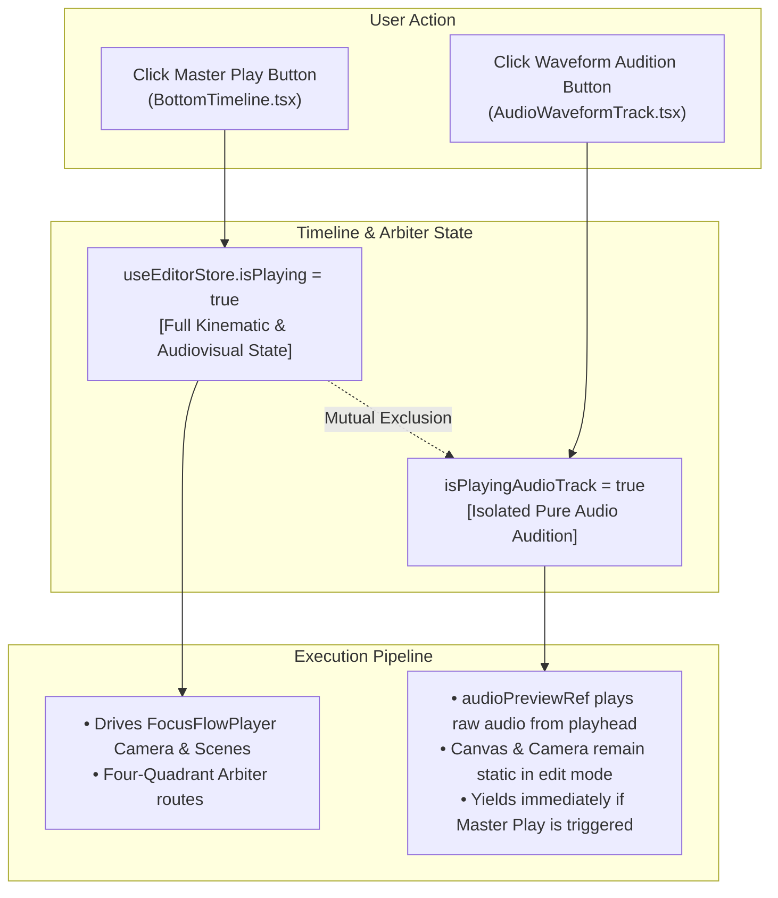
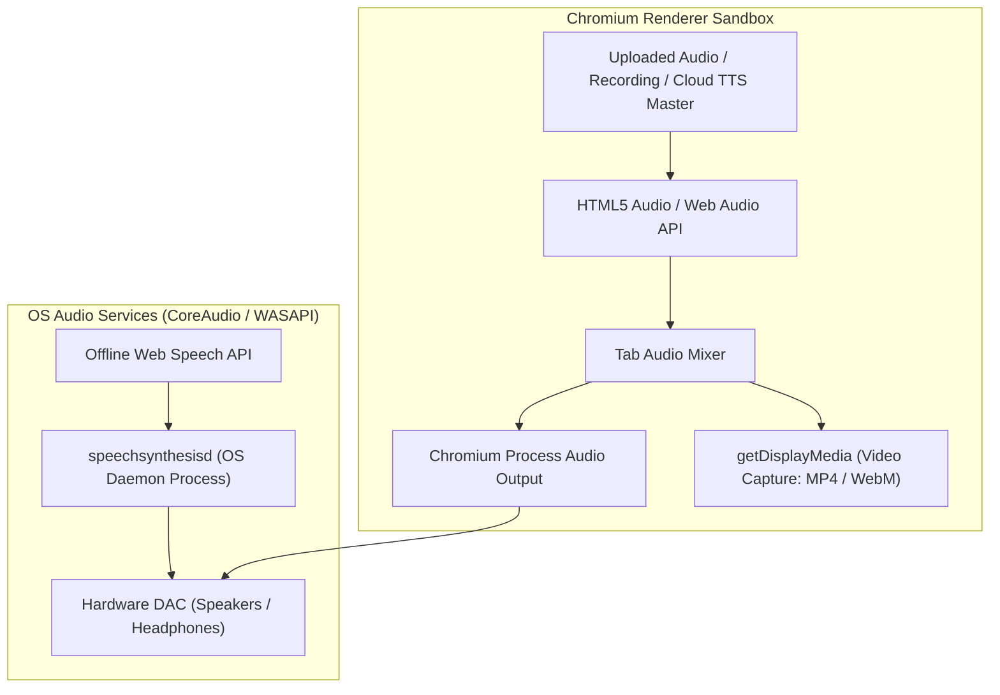
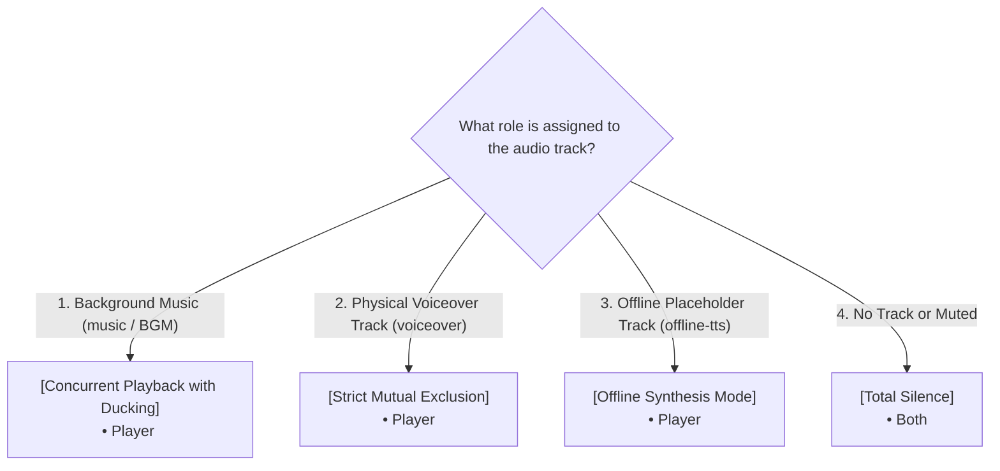
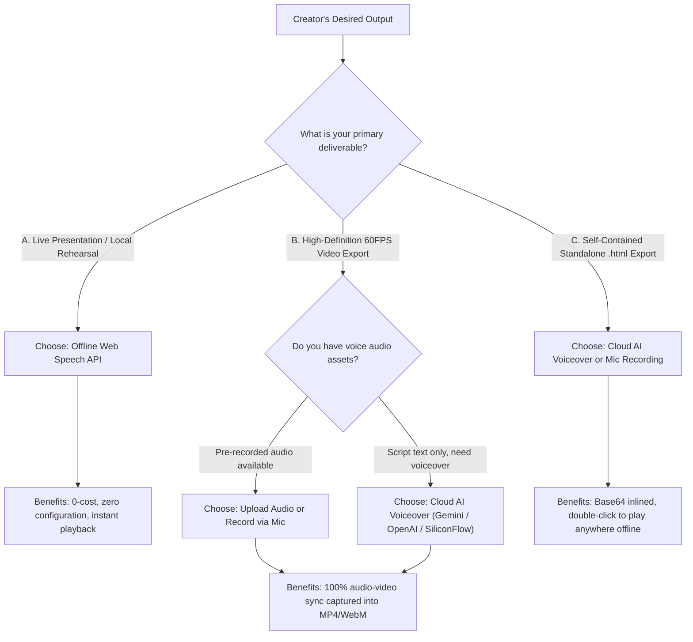

<p align="right">
  <strong>English</strong> • <a href="./20_AUDIO_PLAYBACK_AND_EXPORT_MATRIX.zh-CN.md">简体中文</a>
</p>

# FocusFlow Omnichannel Audio Playback, Recording & Export Architecture
## Dual-Engine Synthesis, Four-Quadrant Arbiter, and High-Fidelity Master Track Matrix

| Metadata | Description |
| :--- | :--- |
| **Specification Version** | `1.2.0` |
| **Last Updated** | `2026-09-17` |
| **Module Scope** | `@focusflow/studio`, `@focusflow/player`, `@focusflow/dsl` |
| **Target Audience** | System Architects, Audio/Video Engineers, Full-Stack Developers |

---

## Table of Contents

1. [Architecture Philosophy & Strategic Positioning](#1-architecture-philosophy--strategic-positioning)
2. [Omnichannel Audio Capability Master Matrix](#2-omnichannel-audio-capability-master-matrix)
3. [The 4 Audio Sources: Storage & Lifecycle](#3-the-4-audio-sources-storage--lifecycle)
   - [3.1 Uploaded Audio Files (MP3 / WAV / AAC)](#31-uploaded-audio-files-mp3--wav--aac)
   - [3.2 Microphone Voiceover Recordings](#32-microphone-voiceover-recordings)
   - [3.3 Cloud AI Voice Master Tracks (BYOK)](#33-cloud-ai-voice-master-tracks-byok)
   - [3.4 Offline System Web Speech API](#34-offline-system-web-speech-api)
4. [The 7 Playback & Export Scenarios](#4-the-7-playback--export-scenarios)
   - [4.1 Inspector Single-Scene Preview](#41-inspector-single-scene-preview)
   - [4.2 Waveform Track Scrubbing & Audition](#42-waveform-track-scrubbing--audition)
   - [4.3 Studio Canvas Interactive Playback](#43-studio-canvas-interactive-playback)
   - [4.4 Full-Screen Audience Presentation Mode](#44-full-screen-audience-presentation-mode)
   - [4.5 60FPS Video Recording Monitor](#45-60fps-video-recording-monitor)
   - [4.6 Exported MP4 / WebM Video Files](#46-exported-mp4--webm-video-files)
   - [4.7 Zero-Dependency Standalone Offline HTML](#47-zero-dependency-standalone-offline-html)
   - [4.8 Dual Timeline Play Buttons Architecture](#48-dual-timeline-play-buttons-architecture)
5. [Underlying Physics: Binary Streams vs OS Speech Daemons](#5-underlying-physics-binary-streams-vs-os-speech-daemons)
   - [5.1 AudioBuffer Stream vs OS Daemon Process](#51-audiobuffer-stream-vs-os-daemon-process)
   - [5.2 Tab Audio Capture Sandbox Boundaries](#52-tab-audio-capture-sandbox-boundaries)
   - [5.3 Base64 Inlining in Standalone HTML](#53-base64-inlining-in-standalone-html)
   - [5.4 Decoupled Runtime Engine Philosophy](#54-decoupled-runtime-engine-philosophy)
   - [5.5 System-Wide Playback Modalities](#55-system-wide-playback-modalities)
   - [5.6 Four-Quadrant Audio Arbiter State Machine & BGM Ducking](#56-four-quadrant-audio-arbiter-state-machine--bgm-ducking)
6. [Best Practices & Decision Flowchart](#6-best-practices--decision-flowchart)
7. [Troubleshooting & FAQ](#7-troubleshooting--faq)

---

## 1. Architecture Philosophy & Strategic Positioning

FocusFlow is engineered around **"Cinematic Camera Kinematics + Synchronized Explanatory Voiceover"**.

From an audio engineering perspective, the system bridges two distinct user demands:
1. **Zero-Barrier, Zero-Cost Instant Rehearsal**: Enabling vocal presentation immediately without external commercial API keys, registration friction, or cloud billing;
2. **Broadcast-Grade Production & Permanent Archiving**: Rendering 60FPS lossless video exports (native MP4 H.264 & WebM VP9) and single-file self-contained HTML presentations that open anywhere offline without server dependencies.

To resolve these opposing forces, FocusFlow establishes a **"Dual-Engine + Multi-Track Arbiter + Progressive Delivery"** pipeline:
- **Offline Layer**: W3C Web Speech API serves as a zero-cost, zero-latency synthesizer;
- **Physical Layer**: Uploaded MP3/WAV files, live browser microphone capture, and BYOK Cloud AI LLM models (Google Gemini official TTS, OpenAI, SiliconFlow) output physical binary master tracks and per-scene discrete stems;
- **Arbitration Layer**: An Audio Arbiter state machine orchestrates mutual exclusion between synthetic voiceover and binary streams, completely preventing acoustic phasing and double-trigger echoing.

---

## 2. Omnichannel Audio Capability Master Matrix

Comprehensive performance comparison of **4 Audio Sources** across all **7 Consumption Scenarios**:

| Audio Source Type | ① Inspector Preview | ② Waveform Audition | ③ Canvas Preview | ④ Audience Mode | ⑤ Recording Monitor | ⑥ Exported MP4 / WebM | ⑦ Standalone HTML |
| :--- | :---: | :---: | :---: | :---: | :---: | :---: | :---: |
| **A. Uploaded Audio**<br>`(MP3 / WAV / AAC)` | ⚪ N/A<br>*(Global track)* | 🟢 **Supported**<br>*(HTML5 Audio)* | 🟢 **Supported**<br>*(HTML5 Audio)* | 🟢 **Supported**<br>*(HTML5 Audio)* | 🟢 **Audible**<br>*(Direct to headphones)* | 🟢 **100% Captured**<br>*(Tab Audio Mixer)* | 🟢 **100% Embedded**<br>*(Base64 Inlined)* |
| **B. Live Microphone Recording**<br>`(Recorded WAV Blob)` | ⚪ N/A<br>*(Global track)* | 🟢 **Supported**<br>*(HTML5 Audio)* | 🟢 **Supported**<br>*(HTML5 Audio)* | 🟢 **Supported**<br>*(HTML5 Audio)* | 🟢 **Audible**<br>*(Direct to headphones)* | 🟢 **100% Captured**<br>*(Tab Audio Mixer)* | 🟢 **100% Embedded**<br>*(Base64 Inlined)* |
| **C. Cloud AI Voiceover Master**<br>`(Gemini / OpenAI / SiliconFlow)` | 🟢 **Supported**<br>*(Streamed sentence)* | 🟢 **Supported**<br>*(Stitched waveform)* | 🟢 **Supported**<br>*(Scene-aligned)* | 🟢 **Supported**<br>*(Scene-aligned)* | 🟢 **Audible**<br>*(Direct to headphones)* | 🟢 **100% Captured**<br>*(Tab Audio Mixer)* | 🟢 **100% Embedded**<br>*(Base64 Inlined)* |
| **D. Offline System Web Speech**<br>`(Zero-Key Web Speech API)` | 🟢 **Supported**<br>*(OS Voice Daemon)* | 🟢 **Supported**<br>*(Scene speech)* | 🟢 **Supported**<br>*(OS Voice Daemon)* | 🟢 **Supported**<br>*(OS Voice Daemon)* | 🟢 **Audible**<br>*(Real-time hardware output)* | 🔴 **Silent (Sandbox limit)**<br>*(Bypasses Tab Mixer)* | 🔴 **Silent (Engine purity)**<br>*(Player engine has no TTS)* |

---

## 3. The 4 Audio Sources: Storage & Lifecycle

### 3.1 Uploaded Audio Files (MP3 / WAV / AAC)
- **Source**: Added via the Timeline Audio Tools area. When scenes already possess narration scripts, an `AudioConflictModal` prompts for classification (set as background BGM vs replace scene narration);
- **Storage Target**: Ephemeral browser Blob URL: `blob:http://localhost:5174/<uuid>`;
- **Structure**:
  ```typescript
  {
    id: 'track-1725760000000',
    name: 'bgm-corporate-tech',
    url: 'blob:http://localhost:5174/3a7...',
    durationMs: 45200,
    volume: 1.0, // Reduced to 0.2 if designated as background music
    type: 'voiceover' | 'music',
    isBackgroundBGM: boolean
  }
  ```
- **Characteristics**: Contains raw PCM audio samples (44.1kHz / 48kHz), allowing Web Audio API to decode real physical waveforms.

### 3.2 Microphone Voiceover Recordings
- **Source**: Live recording panel (`VoiceoverPreflightModal`) records narration synchronized with camera playback. Includes real-time VU meter displays, Acoustic Echo Cancellation (AEC), and Ambient Noise Suppression (ANS);
- **Output**: Lossless WAV Blob mounted directly into project state.

### 3.3 Cloud AI Voice Master Tracks (BYOK)
- **Source**: Configured in `AIVoiceoverSettingsModal` with provider keys (Google Gemini official, OpenAI, SiliconFlow). Supports batch compilation from the timeline or incremental single-scene audition and application in RightInspector;
- **Technical Pipeline**:
  1. Requests remote endpoints for raw WAV/MP3 streams per scene;
  2. Decodes via `AudioContext.decodeAudioData` into `AudioBuffer`;
  3. Stretches scene duration dynamically using `adaptSceneDurationToAudio`;
  4. Stores scene-specific audio binary in `scene.voiceoverAudio`;
  5. The `masterAudioStitcher.ts` engine splices buffers into a unified global master track saved in `dsl.audio.tracks[0]`.

### 3.4 Offline System Web Speech API
- **Source**: Default zero-configuration offline mode;
- **Technical Pipeline**:
  - **Playback**: Dispatches `window.speechSynthesis.speak(utterance)` to the OS speech synthesizer;
  - **Timeline Representation**: Generates a clean silence-padded placeholder WAV (`createMockAudioBlob`) based on speaking rate heuristics (Chinese $\approx$ 4 chars/s, English $\approx$ 2.8 words/s) to enable timeline scaling and waveform track layout.

---

## 4. The 7 Playback & Export Scenarios

### 4.1 Inspector Single-Scene Preview
- Triggered via `[🎙️ Audition TTS]` in RightInspector;
- **Offline**: Invokes `speakWebSpeech()` for the active scene;
- **Cloud**: Streams speech sentence into an ephemeral `<audio>` element with single-click `[✓ Apply]` incremental stitching.

### 4.2 Waveform Track Scrubbing & Audition
- Triggered by scrubbing or clicking play on the AudioWaveformTrack header;
- Uses `AudioContext` slice grain generators to audition audio slices under the cursor without triggering global camera motion.

### 4.3 Studio Canvas Interactive Playback
- Triggered by canvas play controls or `Spacebar`;
- Evaluated by the Audio Arbiter state machine in `App.tsx`:
  1. **Zero Tracks**: Total silence (`<audio>` and `WebSpeech` both deactivated);
  2. **Physical Voiceover Track**: `<audio>` plays master stream; `WebSpeech` is strictly suppressed to avoid echo;
  3. **Offline TTS Track**: `<audio>` ignores placeholder; `WebSpeech` narrates scenes sequentially;
  4. **Background BGM Mode**: `<audio>` plays accompaniment; `WebSpeech` superimposes foreground dialogue.

### 4.4 Full-Screen Audience Presentation Mode
- Clean, read-only presentation sandbox container (`AudienceModal.tsx`);
- **Audio-Sync PLL**: Physical WAV audio serves as the hardware clock master; camera motion subscribes to physical audio timestamps (Zero Clock Drift);
- **Safe Teardown**: Closing the modal (`Esc` or `X`) triggers both `stopWebSpeech()` and `player.destroy()`, terminating frame loops and audio streams instantly with zero residual audio leakage;
- **State Isolation**: Does not mutate editor store state (`activeSceneIndex`, camera zoom/pan), preserving the canvas in its exact prior edit state.

### 4.5 60FPS Video Recording Monitor
- While recording in the background via PiP or tab capture, audio is mirrored to speakers/headphones so the presenter monitors live narration.

### 4.6 Exported MP4 / WebM Video Files
- Captured using Chromium `getDisplayMedia({ audio: true })` and encoded via hardware acceleration;
- **Physical Audio**: Routed through the browser's Tab Audio Mixer and encoded losslessly into the video container;
- **Offline Web Speech**: Cannot be captured into video due to W3C sandboxing (pre-flight checks warn the user to switch to Cloud TTS or mic recordings).

### 4.7 Zero-Dependency Standalone Offline HTML
- Compiled by `standalonePackager.ts` into a self-contained `.html` file;
- **Base64 Inlining**: Global tracks and scene-specific stems are serialized into `data:audio/wav;base64,...` payloads, guaranteeing offline double-click playback permanently.

### 4.8 Dual Timeline Play Buttons Architecture

Studio features two distinct play buttons in the lower workspace:
1. **Timeline Master Play** (`BottomTimeline.tsx`): Audiovisual master orchestrating camera movements, scene steps, and audio playback;
2. **Waveform Track Audition** (`AudioWaveformTrack.tsx`): Isolated audio listener playing audio without moving cameras or altering global presentation states.



---

## 5. Underlying Physics: Binary Streams vs OS Speech Daemons

### 5.1 AudioBuffer Stream vs OS Daemon Process

| Dimension | Player `<audio>` (Binary Stream) | `WebSpeech` (OS Daemon Text Synthesizer) |
| :--- | :--- | :--- |
| **Core Mechanism** | Decodes binary byte streams (WAV/MP3/PCM) | Dispatches IPC commands to OS speech synthesis daemon |
| **Data Payload** | Blob URL, Base64 URI, or HTTP resource | Plain text string (`utterance.text`) |
| **Execution Pipeline** | Chromium Renderer Tab Audio Pipeline | macOS `speechsynthesisd` / Windows `SAPI` external process |
| **Video Recording** | 🟢 **100% Recorded** via Tab Audio Mixer | 🔴 **Cannot be captured** (direct to DAC hardware) |
| **Standalone HTML** | 🟢 **Permanent offline playback** (Base64) | 🔴 **Not portable** (environment dependent) |
| **Synchronization** | Millisecond hard clock (`currentTime` seekable) | Soft heuristic clock (susceptible to system CPU load) |



### 5.2 Tab Audio Capture Sandbox Boundaries
Chromium `preferCurrentTab: true` enforces minimum sandbox privileges: it intercepts only audio emitted by the DOM within that tab. Capturing global system speaker output is disallowed by modern security standards to prevent user surveillance.

### 5.3 Base64 Inlining in Standalone HTML
The standalone compiler fetches memory blobs and serializes them into Data URIs, neutralizing ephemeral blob expiration.

### 5.4 Decoupled Runtime Engine Philosophy
`@focusflow/player` remains ultralight (~35KB), handling only Bezier camera kinematics and native `<audio>` playback. All speech synthesis heuristics, VAD segmenting, and cloud retry orchestration live strictly inside `@focusflow/studio`.

### 5.5 System-Wide Playback Modalities
1. **Master Engine (`FocusFlowPlayer` `<audio>`)**: Master clock anchor for camera interpolations;
2. **OS Speech Synthesizer (`window.speechSynthesis`)**: Zero-cost text narrator;
3. **Web Audio Grain Scrubbing Player**: Instantaneous sub-second audio slicing for timeline scrubbing;
4. **Inspector Ephemeral Preview**: Isolated sandboxed stem preview.

### 5.6 Four-Quadrant Audio Arbiter State Machine & BGM Ducking



---

## 6. Best Practices & Decision Flowchart



---

## 7. Troubleshooting & FAQ

### Q1: Why is there no sound in Audience Presentation Mode?
1. Ensure the active scene contains text in **Scene Voiceover Script**;
2. Check if a muted audio track is mounted on the timeline;
3. Verify system speaker hardware is not muted.

### Q2: Why is the exported MP4 / WebM video missing offline TTS narration?
Web Speech API bypasses the browser's Tab Audio Mixer and routes directly to the sound card. **Solution**: Use **Cloud AI Voiceover (BYOK)** to compile physical WAV stems, or record narration using the built-in **Record Voiceover** tool.

### Q3: Why is background music too loud during speech?
Set the track type to `[🎵 Background BGM 20%]`. FocusFlow automatically ducks music to $20\%$ (`-14\text{dB}$ attenuation) to maintain clear voice comprehension.

### Q4: Why does the exported standalone HTML have no offline speech on another machine?
Offline Web Speech relies on host browser capabilities. For permanent portable offline audio, synthesize a Cloud AI master track or record via microphone before exporting HTML.
