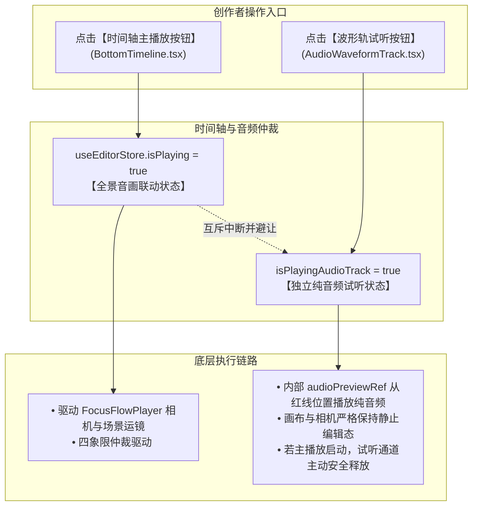
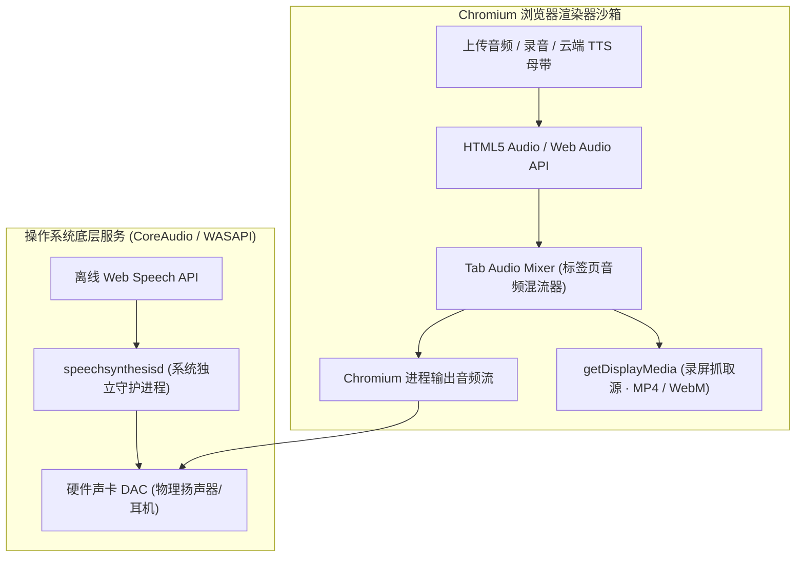
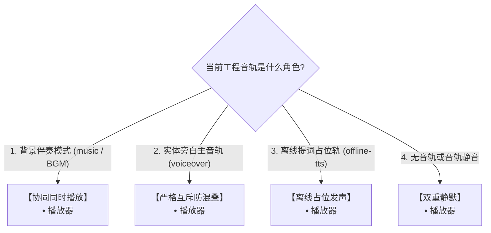
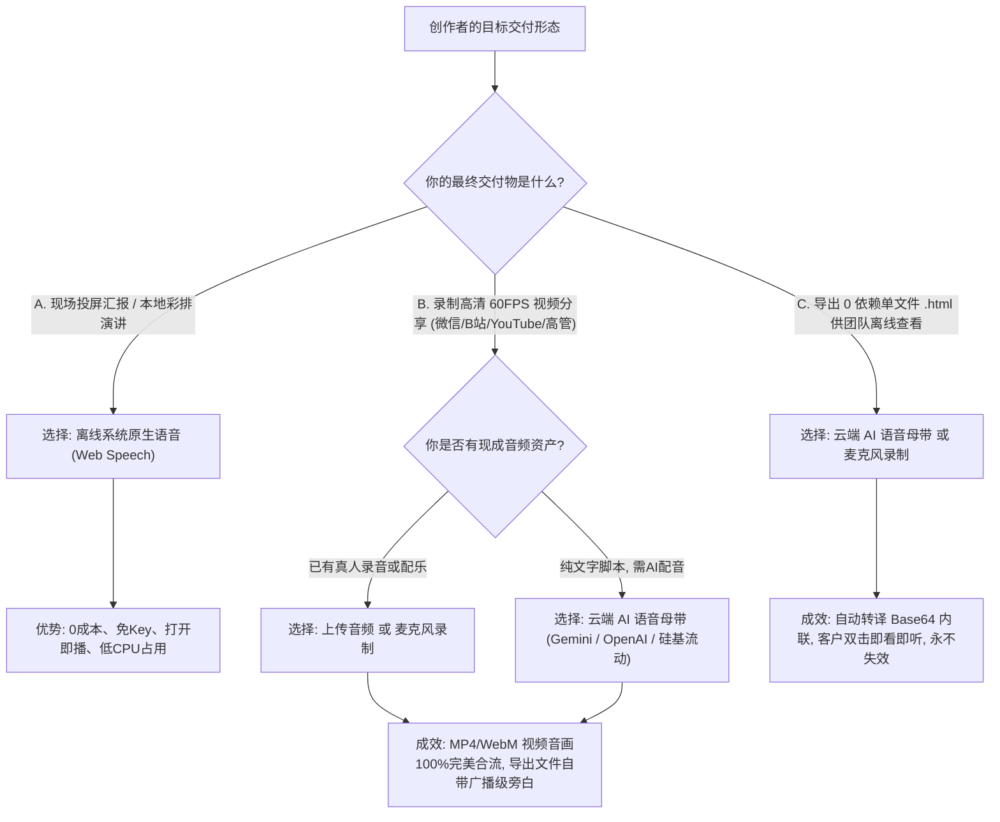

<p align="right">
  <a href="./20_AUDIO_PLAYBACK_AND_EXPORT_MATRIX.md">English</a> • <strong>简体中文</strong>
</p>

# FocusFlow 全场景音频播放、录制与导出技术全景手册

> **文档版本**: 1.2.0  
> **更新日期**: 2026-09-17  
> **归档路径**: `docs/20_AUDIO_PLAYBACK_AND_EXPORT_MATRIX.zh-CN.md`  
> **所属模块**: `@focusflow/studio`, `@focusflow/player`, `@focusflow/dsl`  
> **目标读者**: 核心架构师、前端开发工程师、音视频研发工程师、内容创作者  

---

## 目录
1. [架构定位与设计哲学](#1-架构定位与设计哲学)
2. [全场景音频能力对照矩阵 (Master Matrix)](#2-全场景音频能力对照矩阵-master-matrix)
3. [4 大音频源的底层存储与生命周期](#3-4-大音频源的底层存储与生命周期)
   - [3.1 外部上传音频 (Uploaded Audio)](#31-外部上传音频-uploaded-audio)
   - [3.2 麦克风演播录音 (Microphone Voiceover)](#32-麦克风演播录音-microphone-voiceover)
   - [3.3 云端 AI 语音母带 (Cloud TTS · BYOK)](#33-云端-ai-语音母带-cloud-tts--byok)
   - [3.4 离线系统原生语音 (Offline Web Speech API)](#34-离线系统原生语音-offline-web-speech-api)
4. [7 大播放与导出消费场景的技术链路](#4-7-大播放与导出消费场景的技术链路)
   - [4.1 属性检查器单幕试听 (Inspector Preview)](#41-属性检查器单幕试听-inspector-preview)
   - [4.2 时间轴波形轨试听与微调 (Waveform Track Scrub & Preview)](#42-时间轴波形轨试听与微调-waveform-track-scrub--preview)
   - [4.3 Studio 画板日常播放测试 (Studio Canvas Preview)](#43-studio-画板日常播放测试-studio-canvas-preview)
   - [4.4 受众全屏演播模式 (AudienceModal Presentation)](#44-受众全屏演播模式-audiencemodal-presentation)
   - [4.5 60FPS 视频录制中同屏监听 (Recording Real-time Monitor)](#45-60fps-视频录制中同屏监听-recording-real-time-monitor)
   - [4.6 导出的 MP4 / WebM 视频成品文件 (Exported MP4/WebM Video File)](#46-导出的-mp4--webm-视频成品文件-exported-mp4webm-video-file)
   - [4.7 导出的 0 依赖独立单文件 HTML (Standalone HTML Artifact)](#47-导出的-0-依赖独立单文件-html-standalone-html-artifact)
   - [4.8 时间轴双播放按钮（主播放 vs 波形试听）架构对照](#48-时间轴双播放按钮主播放-vs-波形试听架构对照)
5. [底层物理机制差异与沙箱隔离剖析](#5-底层物理机制差异与沙箱隔离剖析)
   - [5.1 实体二进制流 (Audio Buffer) vs 操作系统发音进程 (Speech Daemon)](#51-实体二进制流-audio-buffer-vs-操作系统发音进程-speech-daemon)
   - [5.2 浏览器 Tab Audio Capture 录制抓取范围限制](#52-浏览器-tab-audio-capture-录制抓取范围限制)
   - [5.3 独立 HTML 的全局 Base64 内联序列化机制](#53-独立-html-的全局-base64-内联序列化机制)
   - [5.4 播放内核纯净性与 Studio 调度解耦设计](#54-播放内核纯净性与-studio-调度解耦设计)
   - [5.5 全系统 4 大音频播放形态全景剖析 (Playback Modalities Overview)](#55-全系统-4-大音频播放形态全景剖析-playback-modalities-overview)
   - [5.6 多轨协同与互斥：四象限音频仲裁状态机 (Audio Arbiter) 与 BGM 混音](#56-多轨协同与互斥四象限音频仲裁状态机-audio-arbiter-与-bgm-混音)
6. [创作者出片最佳实践与决策树](#6-创作者出片最佳实践与决策树)
7. [常见排障手册与 FAQ](#7-常见排障手册与-faq)

---

## 1. 架构定位与设计哲学

FocusFlow 作为新一代架构演进动态可视化系统，其核心体验是**“电影级镜头调度 + 高度同步的解说旁白”**。

在音频处理层面，系统面临两项极具挑战性的技术诉求：
1. **零门槛、零成本、即开即用的快速彩排与同屏演讲**：不需要用户注册任何第三方商业 API 或支付 Token 费用即可发声；
2. **商业级发布、高保真录制、离线分发交付**：支持生成无损 60FPS 高清视频（原生推荐 MP4 H.264 与 WebM VP9 双格式），以及双击即看、永不失效的单个脱机 HTML 文件。

为此，FocusFlow 确立了 **“双模驱动 + 多轨仲裁 + 渐进式交付”** 的音频架构路线：
- **离线层**：以浏览器 W3C Web Speech API 为基石，提供 0 成本、零延迟、免 Key 的原生播音员朗读；
- **实体层**：支持外部 MP3/WAV 上传、浏览器原生麦克风录音、以及 BYOK 云端大模型（Google Gemini 官方 TTS、OpenAI、硅基流动）生成实体母带文件与分幕专属物理音频；
- **仲裁层**：通过严谨的音频仲裁状态机（Audio Arbiter），确保实体音轨与合成语音互斥避让，彻底消除声音混叠轰鸣。

---

## 2. 全场景音频能力对照矩阵 (Master Matrix)

下表全面对比了 **4 大音频源** 在 FocusFlow **7 大使用与导出场景** 下的具体表现与支持特性：

| 音频来源分类 | ① 检查器单幕试听 | ② 时间轴波形试听 | ③ 画板日常播放测试 | ④ 受众全屏演播模式 | ⑤ 录制时耳机实时监听 | ⑥ 导出的 MP4/WebM 视频成品 | ⑦ 导出的单文件 HTML |
| :--- | :---: | :---: | :---: | :---: | :---: | :---: | :---: |
| **A. 外部上传音频**<br>`(MP3 / WAV / AAC)` | ⚪ 无此场景<br>*(整轨无单幕)* | 🟢 **支持**<br>*(HTML5 Audio)* | 🟢 **支持**<br>*(HTML5 Audio)* | 🟢 **支持**<br>*(HTML5 Audio)* | 🟢 **支持**<br>*(耳机清晰可听)* | 🟢 **完美包含**<br>*(标签页直接内录)* | 🟢 **完美支持**<br>*(Base64 离线内嵌)* |
| **B. 麦克风演播录音**<br>`(录音器生成的 WAV)` | ⚪ 无此场景<br>*(整轨无单幕)* | 🟢 **支持**<br>*(HTML5 Audio)* | 🟢 **支持**<br>*(HTML5 Audio)* | 🟢 **支持**<br>*(HTML5 Audio)* | 🟢 **支持**<br>*(耳机清晰可听)* | 🟢 **完美包含**<br>*(实体流合流内录)* | 🟢 **完美支持**<br>*(Base64 离线内嵌)* |
| **C. 云端 AI 语音母带**<br>`(Gemini / OpenAI / 硅基流动)` | 🟢 **支持**<br>*(单句流式合成)* | 🟢 **支持**<br>*(全幕拼接波形)* | 🟢 **支持**<br>*(随分幕对齐播放)* | 🟢 **支持**<br>*(随分幕对齐播放)* | 🟢 **支持**<br>*(耳机清晰可听)* | 🟢 **完美包含**<br>*(音画同步合流)* | 🟢 **完美支持**<br>*(Base64 离线内嵌)* |
| **D. 离线系统原生语音**<br>`(Web Speech 免 Key)` | 🟢 **支持**<br>*(系统播音员朗读)* | 🟢 **支持**<br>*(分幕微调发音)* | 🟢 **支持**<br>*(系统播音员朗读)* | 🟢 **支持**<br>*(系统播音员朗读)* | 🟢 **支持**<br>*(耳朵可实时听到)* | 🔴 **无声（需转云端）**<br>*(受浏览器沙箱限制)* | 🔴 **无声（需转云端）**<br>*(播放内核纯净无发音)* |

---

## 3. 4 大音频源的底层存储与生命周期

### 3.1 外部上传音频 (Uploaded Audio)
- **获取途径**：创作者在底部时间轴右下角音频工具区点击【导入音频】按钮，选择本地配乐、语音或解说干声。若工程已有分幕台词，系统自动弹出 `AudioConflictModal` 进行冲突决策（设为背景伴奏或替代分幕旁白）。
- **存储载体**：由浏览器生成本地临时引用：`blob:http://localhost:5174/<uuid>`。
- **元数据规格**：
  ```typescript
  {
    id: 'track-1725760000000',
    name: 'bgm-corporate-tech',
    url: 'blob:http://localhost:5174/3a7...',
    durationMs: 45200,
    volume: 1.0, // 若选择作为伴奏则为 0.2
    type: 'voiceover' | 'music',
    isBackgroundBGM: boolean
  }
  ```
- **核心特点**：具备真实音频采样数据（44.1kHz / 48kHz PCM），可以被 Web Audio API 解码并绘制真实物理波形峰值（Peaks）。

### 3.2 麦克风演播录音 (Microphone Voiceover)
- **获取途径**：在底部时间轴右下角点击【录制旁白】按钮唤起同屏录音面板（`VoiceoverPreflightModal`），伴随时间轴镜头运镜同步进行真人配音解说，支持实时 VU 动圈音量电平表与环境降噪。
- **技术实现**：基于 `MediaStreamTrack` + Web Audio `AudioWorklet` / `MediaRecorder`，带有回声消除（AEC）与背景降噪（ANS）。
- **录制产物**：无压缩高保真 WAV Blob，自动挂载入工程音轨并提取波形。

### 3.3 云端 AI 语音母带 (Cloud TTS · BYOK)
- **获取途径**：在时间轴右下角点击【✨ AI 提词】旁边的 ⚙️ 图标打开配音设置面板（`AIVoiceoverSettingsModal`），配置服务商（Google Gemini 官方、OpenAI、SiliconFlow 等），输入用户自备的 API Key。可选择在时间轴一键批量合成，也可在右侧检查器单幕试听并点击【✓ 应用】执行增量流式合流。
- **技术实现**：
  1. 并发请求服务商 REST 接口获取各分幕的真实 WAV/MP3 数据流（Gemini 官方自带 RIFF WAV 封装，OpenAI 自带 MP3/AAC 编码）；
  2. 使用 `AudioContext.decodeAudioData` 解码为 `AudioBuffer`；
  3. 自适应计算分幕时长（`adaptSceneDurationToAudio`），遵循“长扩短留白”准则拉伸时间轴；
  4. 分幕专属物理音频保存至各幕 `scene.voiceoverAudio` 实体属性中；
  5. 由底层母带缝合引擎（`masterAudioStitcher.ts`）按各幕起始时间偏移将音频缓冲区缝合为全局母带，编译为标准 WAV Blob 存入 `dsl.audio.tracks[0]`。
- **核心特点**：广播级真人播音质感，实体二进制文件完整驻留工程，支持分幕增量拼装与时序拓扑自愈。

### 3.4 离线系统原生语音 (Offline Web Speech API)
- **获取途径**：系统默认启用的免 Key 离线模式。
- **技术实现**：
  - **发声层**：调用浏览器 `window.speechSynthesis.speak(utterance)`，由操作系统原生语音合成器发声；
  - **时间轴与波形层**：由于浏览器不提供 Web Speech 的音频字节导出接口，系统通过字数与语速算法（中文约 4 字/秒，英文约 2.8 词/秒）预估精准时长，并生成一段**干净的纯静音占位 WAV 轨（`createMockAudioBlob`）**，以便时间轴进行波形绘制与自适应时长伸缩；
- **核心标识**：`track.isOfflineTTS === true` 或 `track.type === 'offline-tts'`。

---

## 4. 7 大播放与导出消费场景的技术链路

### 4.1 属性检查器单幕试听 (Inspector Preview)
- **调用位置**：右侧检查器各分幕底部的 `[🎙️ 试听 TTS]` 浮动工具条。
- **技术路径**：
  - **离线模式**：直接调用 `speakWebSpeech(text, speed, undefined, voice)`，试听当前分幕发音；
  - **云端模式**：请求单句流式合成，通过内存中的临时 `<audio>` 播放，试听满意后可直接点击「✓ 应用」增量写入全局母带。

### 4.2 时间轴波形轨试听与微调 (Waveform Track Scrub & Preview)
- **调用位置**：底部时间轴波形轨头部的【播放试听】按钮与画布上的颗粒刮擦试听（Audio Scrubbing）。
- **技术路径**：
  - **实体音轨（上传/录音/云端母带）**：创建 `AudioContext` 粒度切片播放源（Scrub Grain），响应指针拖拽动态试听该切片的波形内容；
  - **离线 TTS 音轨**：若处于离线占位音轨，点击试听时自动转为朗读当前光标所在分幕的文本台词。

### 4.3 Studio 画板日常播放测试 (Studio Canvas Preview)
- **调用位置**：工作区主画布下方的控制栏【播放/暂停】按钮或按空格键。
- **技术路径**：
  - 由 `App.tsx` 统一协调四象限音频仲裁状态机：
    ```typescript
    // 若工程中无任何音轨、或音轨处于静音/0音量状态，绝对不发声（删除音轨后彻底静音）
    if (!currentlyPlaying || !mainTrack || mainTrack.muted || (mainTrack.volume ?? 1) <= 0) {
      return;
    }
    ```
  - **四象限仲裁决策**：
    1. **工程无音轨（未添加或已删除音轨）**：内核 `<audio>` 与系统 WebSpeech **双静默**，保证画板播放 100% 纯净无声；
    2. **实体旁白主音轨（上传/录音/云端 TTS）**：底层 `FocusFlowPlayer` 内部 `audioEl` 独占发声，WebSpeech 严格静默，避免双音混叠；
    3. **离线 TTS 音轨（AI 提词生成的 offline-tts 轨）**：`<audio>` 跳过静音占位，由 WebSpeech 实时朗读当前分幕台词；
    4. **背景音乐模式（music / BGM 伴奏）**：`<audio>` 播放伴奏，WebSpeech 叠加朗读前景台词。

### 4.4 受众全屏演播模式 (AudienceModal Presentation)
- **调用位置**：点击顶部导航栏的【受众演播模式】（或快捷键全屏汇报）。
- **技术路径**：
  - 挂载独立的 `AudienceModal.tsx` 容器与受众级纯净播放器；
  - 采用同源的 **音频仲裁状态机（Audio Arbiter）**：
    - **云端高清 AI 语音母带（Gemini / OpenAI / 硅基流动）** ➔ 播放器 `<audio>` 独占播放实体 WAV，作为绝对物理主时钟（AudioSync PLL），运镜与流光严格订阅音频物理时间戳（Zero Clock Drift）；支持基于 `markers` 的切幕精准毫秒级寻道（Seek），WebSpeech 严格静默；
    - **外部上传 / 麦克风录音实体轨** ➔ 播放器 `<audio>` 独占播放，WebSpeech 严格静默；
    - **背景伴奏 BGM 模式** ➔ 播放器 `<audio>` 降为 20% 音量播放，WebSpeech 同步朗读前景人声；
    - **离线原生 TTS 模式** ➔ 播放器跳过静音占位轨，WebSpeech 同步朗读分幕台词（支持国际化脚本提取）；
    - **工程无音轨或音轨被删除** ➔ 全局彻底静默，不触发任何声音。
- **退出销毁与中断保护机制 (Destruction Pipeline & Abort Safety)**：
  - **直接退出不漏音**：在演播播放过程中直接点击关闭按钮（`X`）或按下 `Esc` 退出时，`AudienceModal` 的 `handleClose` 与组件销毁钩子（`useEffect cleanup`）执行双重清理：
    1. 立即调用 `stopWebSpeech()`，通过 `window.speechSynthesis.cancel()` 强制打断任何正在进行的语音朗读；
    2. 立即调用 `player.destroy()`，执行 `audioEl.pause()` 并将 `<audio>` 实例完全置空，彻底切断物理音频流；
    3. 取消高精度 RAF 帧推演循环（`cancelAnimationFrame`）与状态机所有计时器，保证后台 **100% 绝对静默**，绝无幽灵发声或内存泄漏。
  - **进入前底板自动静音预暂停**：打开演播模式时（[`App.tsx: handleOpenAudience`](../apps/studio/src/App.tsx)），系统会自动检查并预先暂停 Studio 画板自身的播放器与试听通道（`playerRef.current.pause(); setIsPlaying(false)`），确保退出后底层设计画布同样保持静止状态。
- **状态隔离与只读沙箱特性 (Read-only Sandbox & Zero State Pollution)**：
  - **时间轴 (Timeline) 零污染**：演播模式的分幕切幕进度（`currentSceneIdx`）为弹窗内部私有状态，**绝不向全局 `useEditorStore` 派发** `activeSceneIndex` 或 `currentTime` 变更。因此退出后，底部时间轴依然完好停留在进入演播前的分幕与时间刻度上；
  - **主画布 (Canvas) 零污染**：演播模式的相机动力学平移与缩放只在 Modal 内部的独立容器内渲染。退出后，主设计画布的缩放比（Zoom）、平移坐标（Pan）与选中态保持不变，保证创作者随时无缝继续后续编辑。

### 4.5 60FPS 视频录制中同屏监听 (Recording Real-time Monitor)
- **调用位置**：点击【导出中心】➔【视频】选项卡 ➔【启动录制】。
- **技术路径**：
  - 系统自动唤起全屏 `AudienceModal` 并结合画中画（Document PiP）控制器进行纯净无痕录制；
  - **同屏监听保证**：创作者在录制过程中，耳机或电脑扬声器能**同步听到完整的解说台词**，方便实时掌握演示节奏与运镜动效。

### 4.6 导出的 MP4 / WebM 视频成品文件 (Exported MP4/WebM Video File)
- **生成方式**：通过 Chromium 原生 `navigator.mediaDevices.getDisplayMedia({ audio: true })` 捕获标签页音频与画面，经由 `MediaRecorder` 硬件加速编码：
  - **MP4 (H.264)**：官方推荐格式，支持微信、iOS、Android 手机原生无障碍秒开播放；
  - **WebM (VP9)**：开源标准高压缩比格式，适用于现代浏览器与专业视频后期。
- **声音内录机制**：
  - **实体音频（上传/录音/云端 TTS 母带）**：HTML5 `<audio>` 播放产生的声音直接经由浏览器渲染引擎内部混音器（Tab Audio Mixer）输出，**100% 完整无损内录进导出的 MP4 / WebM 视频文件中**；
  - **离线系统语音（Web Speech）**：因 W3C 规范限制，Web Speech 发声不经过浏览器的 Tab Audio Mixer，而是直接调用操作系统声卡。**因此录出的视频中无离线台词声**（导出中心已具备明确的前检黄标提醒与防误导指引）。

### 4.7 导出的 0 依赖独立单文件 HTML (Standalone HTML Artifact)
- **生成方式**：通过【导出中心】➔【立即下载 .html 文件】。
- **技术路径**：
  - 由 [`standalonePackager.ts`](../apps/studio/src/services/standalonePackager.ts) 将 DSL 结构树、底图 Base64、播放引擎 CSS/JS 打包为纯静态单个 `.html` 文件；
  - **实体音频内联**：不仅全局主音轨（`exportDSL.audio.tracks`），包括各分幕的专属物理音频（`scene.voiceoverAudio`）均会被自动转译为内联 Base64 `data:audio/wav;base64,...` 并写入 HTML；
  - **播放行为**：双击该 HTML，轻量内核 `@focusflow/player` 通过内置 `<audio>` 读取 Base64 播放；因轻量脱机内核不包含 Studio 的庞大 TTS 调度器，离线 Web Speech 在该单文件中默认不发声。

### 4.8 时间轴双播放按钮（主播放 vs 波形试听）架构对照 (Dual Timeline Play Buttons Architecture)

在 Studio 底部工作区中，创作者可在界面上看到**两个不同的播放/暂停按钮**：一个位于时间轴底栏左侧的控制区（对应场景 4.3），另一个嵌入在展开后的音频波形轨头部左侧（对应场景 4.2）。两者的架构职责、驱动内核与协作关系对比如下：

#### 4.8.1 维度特性全景对比

| 对比维度 | ① 时间轴主播放按钮 (Timeline Master Play) | ② 波形轨试听按钮 (Waveform Track Audition) |
| :--- | :--- | :--- |
| **UI 呈现位置** | 时间轴底栏左侧核心控制区（分幕步进、循环、全屏旁） | 音频波形轨头部左侧（Track Header，静音开关/音量滑块旁） |
| **源码组件** | [`BottomTimeline.tsx`](../apps/studio/src/components/layout/BottomTimeline.tsx) (`data-testid="timeline-play-btn"`) | [`AudioWaveformTrack.tsx`](../apps/studio/src/components/timeline/AudioWaveformTrack.tsx) (`data-testid="toggle-audio-track-play"`) |
| **驱动状态** | 全局演播状态机：`useEditorStore.togglePlay()` | 轨道局部试听状态：`isPlayingAudioTrack` |
| **底层驱动对象** | **音画联动总指挥 (Audiovisual Master)**：<br>1. 驱动画板相机运镜（Smooth Pan / Zoom 弹性动力学）<br>2. 驱动分幕切换与图元入场进退动效<br>3. 驱动时间轴全局红线播放指针步进<br>4. 驱动主音轨 `<audio>` 或系统 `WebSpeech` 发声 | **独立纯音频监听器 (Isolated Audio Pre-listen)**：<br>1. 仅通过内部独立的 HTML5 `<audio>` 播放当前轨音频（`track.url`）<br>2. 从当前红线位置开始试听声音细节<br>3. **绝对不动**相机、**绝对不切**分幕、**不触碰**全局演播状态 |
| **播放指针联动** | 随全局时钟与分幕时长推进，跨全片所有场景流动 | 从当前红线位置起播，仅在当前轨道时长范围内推进红线 |
| **静音/音量继承** | 遵循音轨配置（音轨静音或音量为 0 时演播静音） | 遵循音轨配置（通过 `track.volume` / `track.muted` 试听） |
| **设计核心目标** | **全流程演示排练**：模拟最终受众视角的音画视听成品体验 | **音画对齐剪辑**：创作者专注于校准波形切片、听辨人声清晰度与断句空白，无需忍受画板反复频繁运镜晃动 |

#### 4.8.2 互斥与协同机制



1. **互斥停止防串音**：
   - 当主播放器启动播放（`isPlaying` 变为 `true`）时，波形轨独立试听通道（`audioPreviewRef`）会被立即暂停并重置，防止同一段声音在主播放器与波形轨试听中出现毫秒级重叠回声（Double Trigger / Phasing Echo）；
   - 当波形轨试听触发时，它仅操作独立的 `new Audio()` 实例，不触发 `useEditorStore.setIsPlaying(true)`，从而保证右侧检查器和中心画布仍可保持编辑状态。
2. **职责解耦哲学 (Separation of Concerns)**：
   - **主播放**是“剧场总导演”，统领舞台上的视觉（图元、运镜、流光）与声音（台词、伴奏）；
   - **波形试听**是“调音台监听耳机”，专为创作者检查音频文件是否正常、台词语速是否自然、前后空白留白是否恰当而设。两者在 UI 上的清晰分工既满足了专业微调的高效性，又保证了全局演播的严谨性。

---

## 5. 底层物理机制差异与沙箱隔离剖析

### 5.1 实体二进制流 (Audio Buffer) vs 操作系统发音进程 (Speech Daemon)

FocusFlow 架构中的两大主要发声形态——**播放器 `<audio>` 实体流** 与 **`WebSpeech` 操作系统文本朗读**，在底层运行机制与调用链路上存在本质差异：

| 对比维度 | 播放器 `<audio>` (实体物理流播放) | `WebSpeech` (操作系统原生文本朗读) |
| :--- | :--- | :--- |
| **底层原理** | 解码并播放 **实体音频二进制流**（WAV/MP3/PCM） | 浏览器发送 IPC 指令给 **操作系统后台播音守护进程** |
| **数据载体** | Blob URL、Base64 Data URI 或 HTTP 实体文件 | 纯文本字符串（`utterance.text`） |
| **物理管道** | 浏览器渲染沙箱内部管线（Chromium Tab Audio Pipeline） | macOS `speechsynthesisd` / Windows `SAPI` 独立系统进程 |
| **视频内录能力** | 🟢 **100% 完美内录**（经由浏览器的 Tab Audio Mixer） | 🔴 **录屏无法抓取**（直奔硬件声卡，绕过了浏览器混音器） |
| **单文件 HTML 导出** | 🟢 **完美脱机播放**（实体音频被转译为内联 Base64 嵌入） | 🔴 **脱机无法携带**（依赖宿主特定浏览器环境，无实体文件） |
| **音画同步控制** | 毫秒级硬时钟（可通过 `currentTime` 精准寻道 Seek） | 软预估时钟（受系统负载波动影响，无法快进/精准 Seek） |



- **实体音频流**：生命周期完全收敛在 Chromium 渲染引擎内部。它的每一个字节都经过 Chromium 的音频调度管道，因此既能送入硬件耳机，也能被 `MediaRecorder` 内部抓取合成进 MP4/WebM 容器；
- **Web Speech API**：浏览器仅向操作系统发送了指令字符串（IPC），实际发音是由 macOS `speechsynthesisd` 或 Windows `SAPI` 独立进程调动系统原生 TTS 库发声并直达硬件声卡，**完全绕过了浏览器的渲染混流器**。

### 5.2 浏览器 Tab Audio Capture 录制抓取范围限制

在现代浏览器安全规范中：
1. **当前标签页录制（`preferCurrentTab: true`）**：严格遵循沙箱最小权限原则，仅抓取本标签页 DOM 内产生的音频元素与 Web Audio 节点；
2. 浏览器严禁网页端 JavaScript 任意截获操作系统层级的全局扬声器混音（防止恶意脚本窃听用户的系统通知声、音乐播放器或通讯软件语音）。

这就是为什么在无服务端依赖的纯前端录制方案中，离线 Web Speech 无法被内录进视频的物理本质根因。

### 5.3 独立 HTML 的全局 Base64 内联序列化机制

为实现“不依赖服务器、脱机双击即看、防外链失效”的交付标准，FocusFlow 设计了全局 Base64 内联管线（摘自 `apps/studio/src/services/standalonePackager.ts`）：

```typescript
// 1. 全局母带音轨自动转译为内联 Base64
if (exportDSL.audio?.tracks?.length) {
  for (const track of exportDSL.audio.tracks) {
    if (track.url && !track.url.startsWith('data:')) {
      const resp = await fetch(track.url);
      const blob = await resp.blob();
      track.url = await blobToDataUrl(blob);
    }
  }
}

// 2. 分幕专属配音 (voiceoverAudio) 自动转译为内联 Base64 (彻底杜绝泄漏临时 blob: 死链)
if (exportDSL.scenes?.length) {
  for (const scene of exportDSL.scenes) {
    if (scene.voiceoverAudio?.url && !scene.voiceoverAudio.url.startsWith('data:')) {
      const resp = await fetch(scene.voiceoverAudio.url);
      const blob = await resp.blob();
      scene.voiceoverAudio.url = await blobToDataUrl(blob);
    }
  }
}
```

- 上传的配音、麦克风录音以及云端合成的分幕音频，在导出时全部被编译为 Base64 字符串嵌入 HTML DOM 中；
- 这种机制实现了“100% 独立与永久保存”，彻底杜绝了因本地临时 Blob URL 释放而导致的声音失效。

### 5.4 播放内核纯净性与 Studio 调度解耦设计

`@focusflow/player` 的设计哲学是**绝对纯净、超高性能、0 依赖**：
- 它仅负责镜头运镜动力学（Bezier 运动学、Spring 弹性算法）与标准 `<audio>` 播放；
- 复杂繁重的文件解码器、VAD 智能停顿分析、Web Speech 白名单正则引擎、云端 API 请求重试等逻辑全部隔离在 `@focusflow/studio` 中；
- 这种解耦保证了独立交付的单文件 HTML 极其轻巧（仅几百 KB），运行流畅不掉帧。

### 5.5 全系统 4 大音频播放形态全景剖析 (Playback Modalities Overview)

在 FocusFlow 的完整运行生命周期中，共包含 **4 种专业分工的音频播放形式**，满足不同层级的音画交互需求：

1. **播放器主母带实体播放器 (`FocusFlowPlayer` 内部 `<audio>`)**：
   - **载体**：HTML5 `<audio>` 元素；
   - **定位**：整个演播文稿的绝对物理主时钟（Master Clock）；
   - **职责**：驱动全片长母带、背景伴奏配乐或麦克风演播长音频的连续播放，为镜头运镜、高亮流光与切幕提供锁相环基准时钟。
2. **操作系统原生文本朗读引擎 (`window.speechSynthesis`)**：
   - **载体**：宿主浏览器 W3C Web Speech API；
   - **定位**：0 成本免 Key 的离线提词朗读器；
   - **职责**：在画板日常演播或受众全屏演示中，逐幕朗读创作者编写的解说词，随分幕切换自适应发声。
3. **Web Audio API 粒度微切片播放器 (Grain Scrubbing Player)**：
   - **载体**：`AudioContext.createBufferSource()`；
   - **定位**：时间轴波形轨（`AudioWaveformTrack.tsx`）上的毫秒级刮擦试听引擎；
   - **职责**：创作者在波形轨上用鼠标拖拽播放头（Audio Scrubbing）或点击寻道时，系统直接从已解码的内存 `AudioBuffer` 中提取当前指针周围 100ms~300ms 的微小音频切片（Grain）即时发声，提供类似 Final Cut / Premiere 专业剪辑台的极速响应，完全规避传统 `<audio>.seek()` 的延迟破音。
4. **检查器单句临时试听播放器 (Ephemeral Preview Audio)**：
   - **载体**：`App.tsx` 中的独立轻量 `previewAudioRef`；
   - **定位**：属性检查器分幕台词的沙箱试听通道；
   - **职责**：创作者在右侧检查器调优单个分幕的发音人、语速时，单独播放当前分幕的音频 Blob，完全不干扰底层主时间轴的时序状态，试听完毕后安全释放。

### 5.6 多轨协同与互斥：四象限音频仲裁状态机 (Audio Arbiter) 与 BGM 混音

创作者常问：**播放器 `<audio>` 与 `WebSpeech` 可以同时发声吗？**  
**答案是：不仅可以，而且 FocusFlow 专门设计了两者协同同时发声的“伴奏+旁白”模式！**

系统通过四象限音频仲裁状态机（Audio Arbiter）统一裁决两者的共存与互斥：



#### 运行机制深度解析：
1. **协同同时播放（BGM 伴奏模式 · 模式 1）**：
   - 当创作者导入了外部音频并标记为【背景伴奏】（`track.type === 'music'` 或 `track.isBackgroundBGM === true`）时，系统自动将伴奏音量衰减为 20%（`volume: 0.2`）；
   - 在画板演播或受众全屏汇报时，**`<audio>` 在底层作为背景垫乐循环播放，同时 `WebSpeech` 逐幕朗读前景解说台词**。两者在物理声卡端自然混流，实现“低音量动感伴奏 + 高清晰度真人/AI 解说”的沉浸式体验。
2. **严格互斥防混叠（实体旁白模式 · 模式 2）**：
   - 当工程中已有通过云端 TTS（Gemini / OpenAI）合成或麦克风录制的高保真母带（`track.type === 'voiceover'`）时，母带本身已经具备了完整的真人语音；
   - 此时仲裁器**强制执行互斥策略（调用 `stopWebSpeech()`）**，仅允许 `<audio>` 单独发声，彻底杜绝了“云端母带播音员和本地系统播音员同时念同一句话”的灾难性回声轰鸣。

---

## 6. 创作者出片最佳实践与决策树

为确保创作者在不同使用场景下获得最佳体验，请参考以下决策树：



---

## 7. 常见排障手册与 FAQ

### Q1: 为什么在演播模式（AudienceModal）中播放时听不到声音？
- **检查排查步骤**：
  1. 检查当前分幕是否填写了【分幕台词】（若台词为空，系统默认不发声）；
  2. 检查底部时间轴是否挂载了一段静音的外部音频轨；
  3. 确认系统的音频输出设备未静音；
  4. 当前版本已修复了离线占位轨阻断 WebSpeech 的 Bug，更新至最新版本即可正常听到朗读。

### Q2: 为什么导出的 MP4 / WebM 视频文件中没有离线 TTS 的旁白声音？
- **原因**：离线 TTS（Web Speech）受浏览器沙箱限制，声音直接送往物理扬声器，无法被标签页录屏抓取。
- **解决方案**：
  - **方案 A（强烈推荐）**：在底部时间轴右下角点击【✨ AI 提词】旁的 ⚙️ 设置图标，切换为【云端 AI 语音】，填入 Google Gemini / OpenAI / 硅基流动 Key，一键批量生成母带或单幕试听应用，录出的视频音画 100% 完美合流；
  - **方案 B**：使用时间轴自带的【录制旁白】录制真人解说；
  - **方案 C**：在浏览器弹出录屏共享框时，选择【整个屏幕】并勾选【同时共享系统音频】。

### Q3: 为什么上传了背景音乐 (BGM) 后，演播时声音太响听不清解说？
- **解决方案**：
  - 点击时间轴波形轨头部的模式切换胶囊徽章，一键切换为 `[🎵 背景伴奏 20%]`；
  - 系统会自动将该音频音量衰减至 20%（`volume: 0.2`），使分幕 AI 提词能作为清晰的前景人声朗读。

### Q4: 为什么导出的单个 HTML 文件发给别人后没有离线语音？
- **原因**：离线系统语音属于宿主浏览器环境特有能力，不产生实体音频文件，因此无法内嵌进单文件 HTML 中。
- **解决方案**：在导出 HTML 前，使用【云端 TTS】或【麦克风录音】生成实体音频轨，系统编译时会自动将其（含各分幕 `voiceoverAudio`）完整转译为 Base64 嵌入 HTML，确保离线双击即听。

### Q5: 播放器 `<audio>` 与 `WebSpeech` 能同时发声吗？背景音乐会盖过旁白吗？
- **解答**：
  - **可以同时发声**：当工程音频轨标记为【背景伴奏】（`type: 'music'`）时，系统仲裁器会指挥播放器 `<audio>` 播放背景配乐，同时驱动 `WebSpeech` 逐幕朗读台词；
  - **自动闪避与衰减**：系统已将背景伴奏默认音量限制为 20%（`-14dB` 衰减），前景的系统播音员朗读声音清晰突出，绝不会发生伴奏盖过台词的情况。

### Q6: 演播模式播放中直接按 Esc 退出，后台会继续发声吗？会干扰画板和时间轴状态吗？
- **解答**：
  - **后台绝对不发声**：退出时系统会同时触发 `stopWebSpeech()`（强行终止操作系统原生朗读）与 `player.destroy()`（暂停并销毁物理 `<audio>` 播放器实例、注销高精度时钟与帧循环），音频流瞬间切断，不会有任何后台幽灵发声；
  - **设计态绝对零污染**：演播模式被严格设计为只读沙箱（Read-only Sandbox）。即便在演播中一路播到最后一幕，退出后 Studio 工作区的时间轴（Timeline）与画布（Canvas）仍旧完好停留于进入前所选中的分幕和时间刻度上，相机缩放平移也丝毫不受干扰，方便创作者继续专注编辑。

---

> **文档维护约定**: 当 `@focusflow/player` 或 `@focusflow/studio` 的音频流控链路（如引入 WASM 本地离线合成模型或支持多轨硬件混音器）发生重大重构时，须同步修订本手册。
