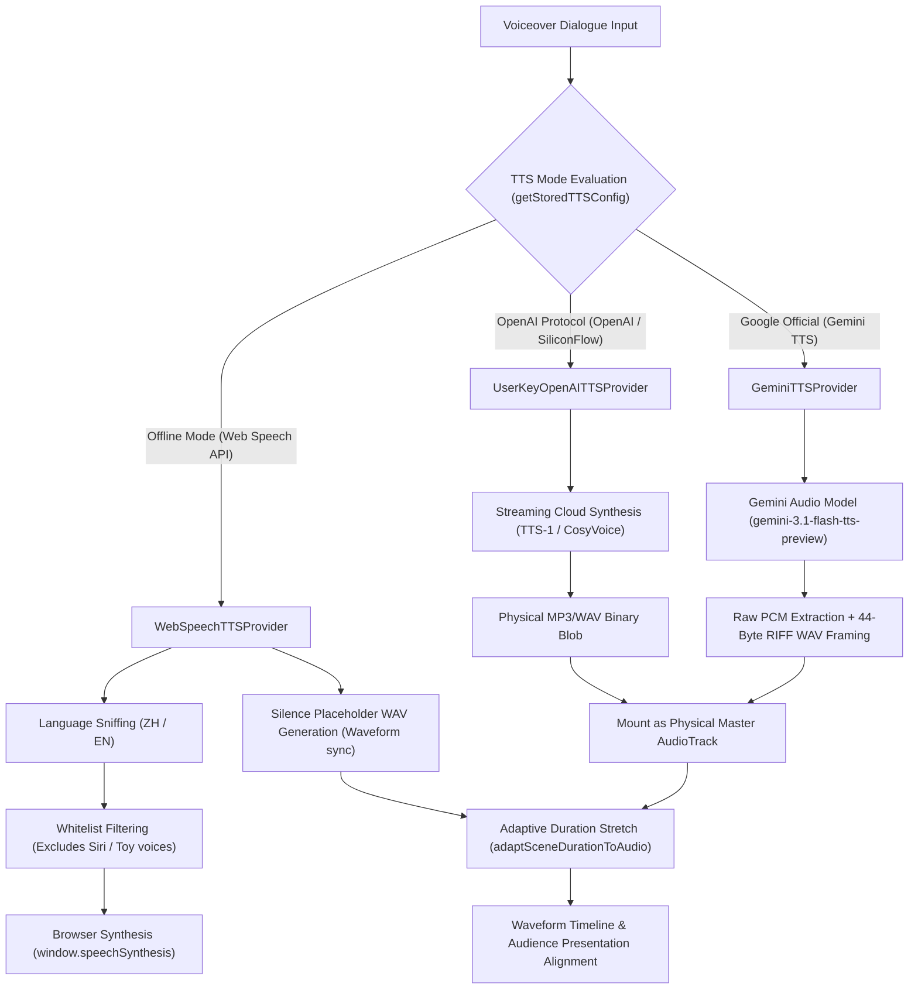

<p align="right">
  <strong>English</strong> • <a href="./21_TTS_ARCHITECTURE_AND_TROUBLESHOOTING.zh-CN.md">简体中文</a>
</p>

# FocusFlow AI Voice Synthesis (TTS) & Audio Synchronization Architecture
## Technical Summary, IPC Deadlock Mitigation, and Full-Stack Troubleshooting Manual

| Metadata | Description |
| :--- | :--- |
| **Specification Version** | `1.0.0` |
| **Last Updated** | `2026-09-17` |
| **Module Scope** | `@focusflow/studio` & `@focusflow/player` (Stage 5.6 & Stage 5.7) |
| **Runtime Environment** | macOS (Sonoma / Sequoia), Chromium (Chrome / Edge), WebKit (Safari) |
| **Target Audience** | Audio Engineers, Web Audio Specialists, Full-Stack Architects |

---

## Table of Contents

1. [Architecture Philosophy & Strategic Positioning](#1-architecture-philosophy--strategic-positioning)
2. [Core Code Topology & Module Responsibilities](#2-core-code-topology--module-responsibilities)
3. [Core Technical Obstacles & Fault Tree Analysis](#3-core-technical-obstacles--fault-tree-analysis)
   - [3.1 macOS Siri Voice Deadlock & Daemon Hang (Critical Bug)](#31-macos-siri-voice-deadlock--daemon-hang-critical-bug)
   - [3.2 Chromium cancel() vs speak() Microtask Race Condition](#32-chromium-cancel-vs-speak-microtask-race-condition)
   - [3.3 State Machine Deadlock from Calling resume() in Non-Paused States](#33-state-machine-deadlock-from-calling-resume-in-non-paused-states)
   - [3.4 Ting-Ting Hyphenated Regex Boundary Failure](#34-ting-ting-hyphenated-regex-boundary-failure)
   - [3.5 V8/WebKit Garbage Collection (GC) Aborting Long Utterances](#35-v8webkit-garbage-collection-gc-aborting-long-utterances)
   - [3.6 Audience Presentation Mode Audio Decoupling](#36-audience-presentation-mode-audio-decoupling)
   - [3.7 Mute Placeholder Audio with Empty Cloud API Keys](#37-mute-placeholder-audio-with-empty-cloud-api-keys)
   - [3.8 Orphaned Bezier Routing Faults Blocking Scene Switches](#38-orphaned-bezier-routing-faults-blocking-scene-switches)
   - [3.9 Google Gemini Raw PCM Packaging & Demuxer Crashes](#39-google-gemini-raw-pcm-packaging--demuxer-crashes)
   - [3.10 Cloud Audio Fallback Identification & Flat Waveform Rectification](#310-cloud-audio-fallback-identification--flat-waveform-rectification)
   - [3.11 Gemini Audio Output Modality Validation & 503 Retries](#311-gemini-audio-output-modality-validation--503-retries)
   - [3.12 Browser Session Lifecycles & Blob URL Invalidation (ERR_FILE_NOT_FOUND)](#312-browser-session-lifecycles--blob-url-invalidation-err_file_not_found)
4. [Evolutionary Solutions & Final Implementations](#4-evolutionary-solutions--final-implementations)
   - [4.1 Resilient WebSpeechTTSProvider Architecture](#41-resilient-webspeechttsprovider-architecture)
   - [4.2 Topological Self-Healing sanitizeDSL & Runtime Purity](#42-topological-self-healing-sanitizedsl--runtime-purity)
   - [4.3 Audience Presentation Mode Lifecycle Safety](#43-audience-presentation-mode-lifecycle-safety)
   - [4.4 Automatic 44-Byte RIFF WAV Header Inserter for Gemini Raw PCM](#44-automatic-44-byte-riff-wav-header-inserter-for-gemini-raw-pcm)
   - [4.5 Unified Physical Audio Track Classification](#45-unified-physical-audio-track-classification)
   - [4.6 Sonner Diagnostic Notification Framework](#46-sonner-diagnostic-notification-framework)
   - [4.7 IndexedDB Audio Persistence & Session Freshness](#47-indexeddb-audio-persistence--session-freshness)
5. [Browser SpeechSynthesis Engineering Best Practices](#5-browser-speechsynthesis-engineering-best-practices)
6. [Automated Regression Suites & Verification Matrix](#6-automated-regression-suites--verification-matrix)

---

## 1. Architecture Philosophy & Strategic Positioning

FocusFlow synchronizes high-precision camera kinematics with speech voiceovers. The synthesis layer balances **Zero-Barrier Offline Autonomy** and **Studio-Quality Neural Voices (BYOK)**:



### Core Design Tenets
1. **Zero-Barrier Offline Default**: Operates via native browser `SpeechSynthesis` without requiring external API keys, tokens, or network round-trips;
2. **Multi-Model BYOK Cloud Integration**: Compatible with OpenAI-standard endpoints and Google's official Gemini TTS APIs;
3. **Adaptive Audiovisual Synchronization**: Speeds are never unnaturally pitch-shifted. If narration is extensive, the scene timeline extends proportionally ($\text{duration} = T_{\text{audio}} + 500\text{ms}$).

---

## 2. Core Code Topology & Module Responsibilities

| File Path | Component | Responsibility |
| :--- | :--- | :--- |
| `apps/studio/src/services/audio/tts/WebSpeechTTSProvider.ts` | **Offline Synthesizer** | `SpeechSynthesis` wrapper, broadcast voice whitelist, GC retention pool, 25ms IPC dispatch debounce |
| `apps/studio/src/services/audio/tts/OpenAITTSProvider.ts` | **OpenAI Cloud Provider** | BYOK integration for OpenAI, SiliconFlow, and custom HTTP proxies |
| `apps/studio/src/services/audio/tts/GeminiTTSProvider.ts` | **Google Gemini Provider** | Direct integration with Google GenerativeLanguage endpoints, multi-voice mapping, and raw PCM WAV encapsulation |
| `apps/studio/src/services/audio/tts/aiTtsSynthesizer.ts` | **Master Synthesizer Coordinator** | Unified factory, batch timeline concatenation, marker placement, and adaptive scene duration stretching |
| `apps/studio/src/components/timeline/AudioWaveformTrack.tsx` | **Audio Waveform Timeline** | Web Audio physical waveform decoding, VAD pause detection, and magnetic scene border snapping |
| `apps/studio/src/components/modals/AudienceModal.tsx` | **Audience Presentation Mode** | Full-screen read-only presentation sandbox with isolated speech dispatching |
| `packages/player/src/core/player.js` | **Playback Core** | Bezier camera kinematics, scene stepper, and hardware-accelerated audio synchronization |

---

## 3. Core Technical Obstacles & Fault Tree Analysis

### 3.1 macOS Siri Voice Deadlock & Daemon Hang (Critical Bug)
- **Pathology**: On macOS Chrome/Edge, all browser-based TTS muted completely across every tab, and the native terminal `say` utility hung indefinitely ($> 120\text{s}$ timeout);
- **Root Cause**: macOS exposes Siri voices (`Siri Voice 1`, `Siri 声音 2`) to the browser. Due to Apple sandboxing restrictions, non-Apple applications cannot utilize Siri synthesis engines. Assigning `utterance.voice = siriVoice` caused macOS's `speechsynthesisd` daemon IPC connection to deadlock, freezing system-wide TTS queues;
- **Solution**: Established strict `isSafeVoice` filters, explicitly blacklisting and purging any voice identifying as `siri`.

### 3.2 Chromium `cancel()` vs `speak()` Microtask Race Condition
- **Pathology**: Calling `speak()` immediately after `cancel()` resulted in dropped utterances with `canceled` errors;
- **Root Cause**: Chromium's `cancel()` is asynchronous IPC. Immediate synchronous `speak()` execution caused `cancel` to purge the newly queued utterance;
- **Solution**: Introduced a **25ms IPC scheduling delay** after `cancel()` before queuing new speech tasks.

### 3.3 State Machine Deadlock from Calling `resume()` in Non-Paused States
- Calling `window.speechSynthesis.resume()` while the engine is idle causes Chromium's internal state machine to stall;
- **Solution**: Guard `resume()` with `if (window.speechSynthesis.paused)`.

### 3.4 Ting-Ting Hyphenated Regex Boundary Failure
macOS designates its broadcast Mandarin female voice as `Ting-Ting`. The regex `/\btingting\b/i` failed due to hyphen word boundaries. Updated to `/(ting[- ]?ting|xiaoxiao|yunxi|yunjian)/i`.

### 3.5 V8/WebKit Garbage Collection (GC) Aborting Long Utterances
- **Pathology**: Utterances longer than 15s suddenly cut off silently mid-sentence;
- **Root Cause**: The browser's garbage collector collects `SpeechSynthesisUtterance` JS instances when stored only in local closure scopes, severing active audio pipelines;
- **Solution**: Global `activeUtterancePool` Set holds strong references to active utterances until `onend` or `onerror` fires.

### 3.6 Audience Presentation Mode Audio Decoupling
Closing `AudienceModal` with `Esc` previously left ghost audio running in the background. Now explicitly executes `stopWebSpeech()` and `player.destroy()` on modal teardown.

### 3.7 Mute Placeholder Audio with Empty Cloud API Keys
Providing invalid keys generated corrupt placeholder blobs. Resolved by deploying pre-flight key validators and informative configuration guidance.

### 3.8 Orphaned Bezier Routing Faults Blocking Scene Switches
When endpoints were deleted, orphaned connecting paths crashed `BezierRouter`. The `sanitizeDSL` engine now purges dangling paths during project state loading.

### 3.9 Google Gemini Raw PCM Packaging & Demuxer Crashes
- **Pathology**: Gemini TTS API emits raw single-channel, 24kHz, 16-bit little-endian PCM bytes lacking container headers. Browser `<audio>` elements fail with demuxer errors;
- **Solution**: Implemented an automated in-memory **44-byte RIFF WAV Header Encoder** prepending standard headers (`fmt `, `data`, sample rate, byte rate) before Blob instantiation.

### 3.10 Cloud Audio Fallback Identification & Flat Waveform Rectification
Differentiated offline placeholder tracks (`offline-tts`) from physical binary streams (`voiceover`), ensuring physical tracks are never misidentified as offline silence.

### 3.11 Gemini Audio Output Modality Validation & 503 Retries
Gemini requires `"responseModalities": ["AUDIO"]` and speech configuration objects. Integrated exponential backoff retries to manage transient 503 capacity errors.

### 3.12 Browser Session Lifecycles & Blob URL Invalidation (`ERR_FILE_NOT_FOUND`)
- **Pathology**: Refreshing the browser invalidated ephemeral `blob:http://...` URLs, breaking playback upon reload;
- **Solution**: Binary audio blobs are written directly to **IndexedDB**, reinstantiating fresh object URLs upon project hydration.

---

## 4. Evolutionary Solutions & Final Implementations

### 4.1 Resilient `WebSpeechTTSProvider` Architecture
Features voice sniffing, GC retention sets, and anti-deadlock IPC dispatchers.

### 4.2 Topological Self-Healing `sanitizeDSL`
Ensures all referential integrity checks pass before passing DSL snapshots to the `@focusflow/player` kernel.

### 4.3 Automatic 44-Byte RIFF WAV Header Inserter
```typescript
export function prependWavHeader(pcmData: Uint8Array, sampleRate = 24000, channels = 1): ArrayBuffer {
  const header = new ArrayBuffer(44);
  const view = new DataView(header);
  // Write 'RIFF', ChunkSize, 'WAVE', 'fmt ', Subchunk1Size (16), AudioFormat (1 = PCM)...
  // Prepend header to pcmData and return intact ArrayBuffer
}
```

### 4.4 Sonner Diagnostic Notification Framework
Integrated Sonner toast alerts with action buttons ("Configure Keys", "Retry") to guide users through API misconfigurations gracefully.

---

## 5. Browser SpeechSynthesis Engineering Best Practices

1. **Purge Siri Voices from Whitelists**: Completely exclude `siri` from voice selection patterns;
2. **Always Retain Utterance References**: Maintain global strong references until playback terminates;
3. **Never Call `cancel()` and `speak()` Synchronously**: Introduce at least a 25ms delay;
4. **Guard `resume()`**: Invoke only when `window.speechSynthesis.paused === true`.

---

## 6. Automated Regression Suites & Verification Matrix

- `apps/studio/e2e/stage5-audio-sync.spec.ts`: Validates dual-engine routing, batch synthesis, and waveform synchronization;
- Run suite: `pnpm --filter @focusflow/studio test:e2e`.
