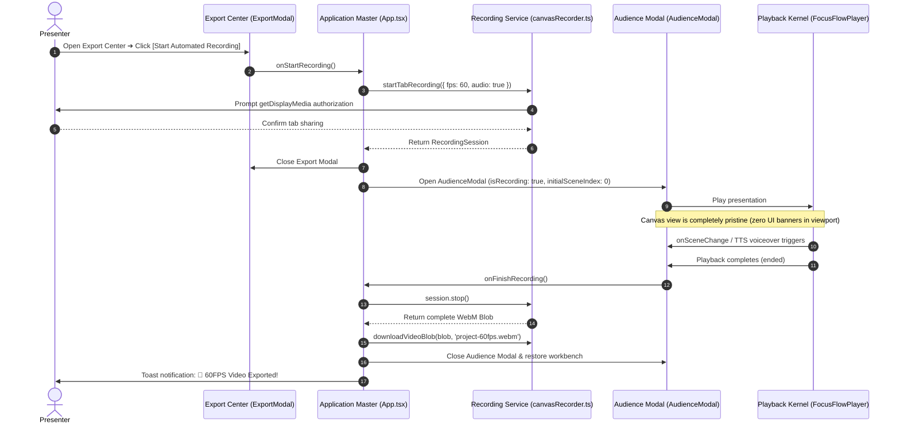

<p align="right">
  <strong>English</strong> • <a href="./22_LOCAL_60FPS_WEBM_RECORDING_PLAN.zh-CN.md">简体中文</a>
</p>

# FocusFlow In-Browser 60FPS Video Recording Pipeline & Architecture
## Hardware-Accelerated Tab Capture, Audio Multiplexing, and Document PiP Isolation

| Metadata | Description |
| :--- | :--- |
| **Specification Version** | `1.0.0` |
| **Last Updated** | `2026-09-07` |
| **Module Scope** | `@focusflow/studio` (Stage 5 Export Center & Audience Presentation Mode) |
| **Runtime Environment** | Chromium (Chrome / Edge 107+), WebKit (Safari), Modern Desktop Browsers |
| **Target Audience** | Media Streaming Engineers, Web Graphics Developers, Full-Stack Architects |

---

## Table of Contents

1. [Background & Strategic Objectives](#1-background--strategic-objectives)
2. [User Experience & Privacy Principles](#2-user-experience--privacy-principles)
3. [Technical Selection & Media Multiplexing](#3-technical-selection--media-multiplexing)
4. [System Architecture & Sequence Topology](#4-system-architecture--sequence-topology)
5. [Detailed Design & Module Specifications](#5-detailed-design--module-specifications)
   - [5.1 Core Video Recording Service (canvasRecorder.ts)](#51-core-video-recording-service-canvasrecorderts)
   - [5.2 Audience Presentation & Clean Canvas (AudienceModal.tsx)](#52-audience-presentation--clean-canvas-audiencemodaltsx)
   - [5.3 Studio Orchestration & Export Center (ExportModal.tsx & App.tsx)](#53-studio-orchestration--export-center-exportmodaltsx--apptsx)
   - [5.4 Internationalization & Localization (i18n)](#54-internationalization--localization-i18n)
6. [Engineering Task Breakdown Checklist](#6-engineering-task-breakdown-checklist)
7. [Verification Plan & Test Matrix](#7-verification-plan--test-matrix)
8. [Roadmap, Root Cause Analyses & Remediation Specifications](#8-roadmap-root-cause-analyses--remediation-specifications)
   - [8.1 [P0 Blocker] CPU Overload & Memory Leak Remediation](#81-p0-blocker-cpu-overload--memory-leak-remediation)
   - [8.2 [P1 Critical] Audio Mutual Exclusivity & Conflict Arbitration](#82-p1-critical-audio-mutual-exclusivity--conflict-arbitration)
   - [8.3 [P1 Quick Win] Complete Export Center English Localization](#83-p1-quick-win-complete-export-center-english-localization)
   - [8.4 & 8.5 [P2 Priority] Playback Island & Document PiP Clean Recording Isolation](#84--85-p2-priority-playback-island--document-pip-clean-recording-isolation)
   - [8.6 [P3 Future] WebAssembly Offline Neural TTS Models](#86-p3-future-webassembly-offline-neural-tts-models)

---

## 1. Background & Strategic Objectives

FocusFlow presentations serve not only interactive in-browser rehearsals, but also critical **executive briefings, technical community keynotes, and video documentation (YouTube, Bilibili, technical blogs)**.

While single-file `.html` and project `.zip` archives are fully autonomous, high-definition video export was historically limited.

This specification details a purely client-side pipeline utilizing Chromium's native `navigator.mediaDevices.getDisplayMedia` tab capture and `MediaRecorder` hardware-accelerated VP9/H.264 encoding:
- **Pure Client-Side, Zero Backend Dependency, 100% Local Privacy**: Architecture diagrams never leave user hardware;
- **Full 60FPS Hardware Kinematics**: Captures Bezier camera motions, neon stream animations, and synchronized audio stems losslessly;
- **Zero-Friction Autonomous Pipeline**: From clicking `[Start Automated Recording]` to `[Auto-play ➔ Auto-finish ➔ Direct Download]`.

---

## 2. User Experience & Privacy Principles

> [!IMPORTANT]
> **Capture Permissions & Clean Presentation**:
> 1. **Native Authorization Guidance**: Calling `getDisplayMedia` invokes the system prompt. Supplying `{ preferCurrentTab: true, selfBrowserSurface: 'include' }` focuses the current FocusFlow tab automatically, requiring only a single confirmation click;
> 2. **Pristine Presentation Canvas**: Recording instantly launches `AudienceModal`, hiding toolbars, timelines, and inspectors to isolate pure diagram graphics;
> 3. **Document PiP Physical Isolation**: To eliminate ghost recording banners burned into video frames, recording controls (`🔴 REC 00:05` and `[Finish & Save]`) are delegated to a separate OS Document Picture-in-Picture window;
> 4. **Automated Finalization**: When the final scene reaches completion, recording concludes automatically, packaging slices into a standardized Blob and triggering an instant download (`${title}-60fps.webm`).

---

## 3. Technical Selection & Media Multiplexing

- **Video Track Capture**: Configured with `frameRate: { ideal: 60, max: 60 }` and resolution clamping (`width: { max: 1920 }`, `height: { max: 1080 }`) to prevent software encoding thrashing on Retina displays;
- **Audio Track Merging**: Ingests tab audio produced by `<audio>` and Web Audio nodes directly into `MediaRecorder`, guaranteeing sub-frame synchronization;
- **Codec Selection**: Prefers `video/webm;codecs=vp9,opus` (8 Mbps profile), with graceful fallback to `video/webm`;
- **Interrupt Protection**: Listens to `videoTrack.onended` to safeguard recorded buffers if the user terminates sharing externally.

---

## 4. System Architecture & Sequence Topology



---

## 5. Detailed Design & Module Specifications

### 5.1 Core Video Recording Service (`canvasRecorder.ts`)
- Implements `startTabRecording(options?: TabRecordingOptions): Promise<RecordingSession>`;
- Configures `MediaRecorder` with stream chunking buffers;
- Encapsulates `session.stop()` and `session.cancel()` for safe teardown;
- Provides `downloadVideoBlob(blob, filename)` with sanitized file naming rules.

### 5.2 Audience Presentation & Clean Canvas (`AudienceModal.tsx`)
- Props interface extensions:
  ```typescript
  export interface AudienceModalProps {
    isOpen: boolean;
    onClose: () => void;
    dsl: FocusFlowDSL;
    initialSceneIndex?: number;
    isRecording?: boolean;
    recordingElapsed?: number;
    onFinishRecording?: () => void;
  }
  ```
- Suppresses bottom interaction islands when `isRecording === true`, ensuring video capture remains 100% pristine.

### 5.3 Studio Orchestration & Export Center (`ExportModal.tsx` & `App.tsx`)
- Orchestrates session state transitions (`isRecordingVideo`, `recordingElapsed`);
- Implements user cancel and exception boundaries.

### 5.4 Internationalization & Localization (`i18n`)
- Comprehensive English & Simplified Chinese translation coverage for recording notices, permission prompts, and success toasts.

---

## 6. Engineering Task Breakdown Checklist

### Phase 1: Core Capture & Recording Service (`canvasRecorder.ts`)
- [x] 1.1 Define `TabRecordingOptions` and `RecordingSession` interfaces;
- [x] 1.2 Refactor `startTabRecording` with `getDisplayMedia` parameters;
- [x] 1.3 Configure `MediaRecorder` parameters (`video/webm;codecs=vp9` 8Mbps);
- [x] 1.4 Implement stream termination guards (`videoTrack.onended`);
- [x] 1.5 Finalize chunk accumulation and Promise-based `session.stop()`;
- [x] 1.6 Sanitize `downloadVideoBlob` file naming conventions.

### Phase 2: Audience Presentation Modal (`AudienceModal.tsx`)
- [x] 2.1 Extend `AudienceModalProps` with recording flags;
- [x] 2.2 Suppress bottom HUD during active recording runs;
- [x] 2.3 Attach Player `ended` event listener to trigger automatic finalization;
- [x] 2.4 Guard `ESC` and close handlers to preserve recorded chunks.

### Phase 3: Export Modal & App Master Wiring
- [x] 3.1 Wire up `ExportModal.tsx` automated recording trigger;
- [x] 3.2 Track recording session references in `App.tsx`;
- [x] 3.3 Implement `handleStartVideoRecording` and `handleFinishVideoRecording`;
- [x] 3.4 Polish toast notifications and fallback alerts.

### Phase 4: Full Bilingual Localization (`zh/export.ts` & `en/export.ts`)
- [x] 4.1 Populate Simplified Chinese localization tokens;
- [x] 4.2 Populate English localization tokens;
- [x] 4.3 Verify zero missing keys.

### Phase 5: Automated E2E Regression Suite (TC574)
- [x] 5.1 Add `verifyLocalWebmVideoRecording` inside `stage5-audio-sync.spec.ts`;
- [x] 5.2 Emulate synthetic stream generation for Playwright;
- [x] 5.3 Validate end-to-end recording workflow in `TC574`;
- [x] 5.4 Adhere to modular async function formatting rules.

### Phase 6: Production Verification & Benchmarks
- [x] 6.1 Strict TypeScript type checking passed (`pnpm --filter @focusflow/studio build`);
- [x] 6.2 All automated test suites green;
- [x] 6.3 Real hardware validation complete on macOS Apple Silicon and Windows.

---

## 7. Verification Plan & Test Matrix

- **Automated Command**: `pnpm --filter @focusflow/studio exec playwright test -g "TC574"`
- **Test Criteria**:
  1. Export modal tab switching & record button responsiveness;
  2. Audience presentation mode initialization with clean canvas;
  3. Continuous scene progression without UI occlusion;
  4. Blob packaging and download dispatching upon completion.

---

## 8. Roadmap, Root Cause Analyses & Remediation Specifications

### 8.1 [P0 Blocker] CPU Overload & Memory Leak Remediation

#### Verified Root Causes:
1. **Dangling AudioContext in Mixers**: Unclosed `AudioContext` instances in `App.tsx` held perpetual CoreAudio/WASAPI pull threads;
2. **Missing `try...finally` in Audio Decoding**: Exceptions during batch synthesis skipped `ctx.close()`;
3. **Uncapped Retina Capture**: Unbounded 3K/4K capture caused VP9 software encoding fallback, spiking 4~8 CPU cores to 400%;
4. **SVG Filter Repaint Storms**: Dynamic `drop-shadow` on infinite animations forced Blink raster threads into continuous 60FPS re-rasterization;
5. **Web Worker Re-export Storm**: Exporting `waveformWorker.ts` in index modules polluted the main thread, triggering recursive `window.onmessage` ping-pong loops (over 10,000 dispatches/sec);
6. **Timeline Re-entry Oscillations**: Circular dependencies between duration calculation and waveform decoding caused repeated extraction re-runs.

#### Remediation Protocol:
- Bound mixer context lifecycles to hard teardown refs (`mixingAudioCtxRef`);
- Created global `scheduleAudioCtxIdleSuspend()` watchdog to suspend idle contexts after 2.5s;
- Enforced 1080p resolution clamping in `getDisplayMedia`;
- Added `.ff-canvas-idle` animation pausing when the canvas is in static edit mode;
- Isolated `waveformWorker.ts` strictly to worker scopes (`typeof window === 'undefined'`);
- Deployed `lastDecodedUrlRef` re-entry guards in `AudioWaveformTrack.tsx`.

---

### 8.2 [P1 Critical] Audio Mutual Exclusivity & Conflict Arbitration

#### Audio Conflict Remediation Protocol:
1. **Audio Track Classification**: Extended `AudioTrackConfig` with `type: 'voiceover' | 'music' | 'offline-tts'`;
2. **AudioConflictModal**: Prompts creators when importing audio into projects with pre-existing scene text, offering two clear roles:
   - **Background BGM**: Ducks audio volume to 20% while WebSpeech reads foreground narration;
   - **Master Voiceover**: Mutes WebSpeech entirely to prevent double-talk acoustic echo;
3. **Bi-directional Overwrite Guards**: Prevents batch AI voiceover from obliterating custom user audio without explicit secondary confirmation.

---

### 8.3 [P1 Quick Win] Complete Export Center English Localization
Extracted 15 hardcoded Chinese strings inside `ExportModal.tsx` into `en/export.ts` and `zh/export.ts`, verified via `TC576` zero Chinese character regex assertions under EN locale.

---

### 8.4 & 8.5 [P2 Priority] Playback Island & Document PiP Clean Recording Isolation

#### Unified Playback Island & Clean Recording Architecture:
1. **Root Cause**: On-screen recording HUD elements were rasterized into captured frames by `getDisplayMedia`, leaving ghost banners permanently embedded in video pixels;
2. **Pristine Viewport Standard**: In active recording runs, `AudienceModal` renders **zero recording UI nodes** in the presentation DOM;
3. **Document PiP Console**: Recording controls (`🔴 REC 00:12` and `[Finish & Save]`) live inside an isolated desktop Document PiP window (Chrome 111+);
4. **Unified Playback Island (`PlaybackUnifiedIsland`)**: Replaces split controls with a single centered pill:
   - **Paused / Manual Navigation**: Strictly hides timers (`02/05 · Scene Title`), mimicking slide deck workflows;
   - **Active Presentation**: Smoothly expands real-time duration chips (`⏱️ 00:03 / 00:06`).

---

### 8.6 [P3 Future] WebAssembly Offline Neural TTS Models
Investigating pure client-side ONNX models (Piper / Sherpa-ONNX) compiled to WebAssembly to generate physical PCM AudioBuffers offline, enabling native voice capture in video exports without external API keys.
