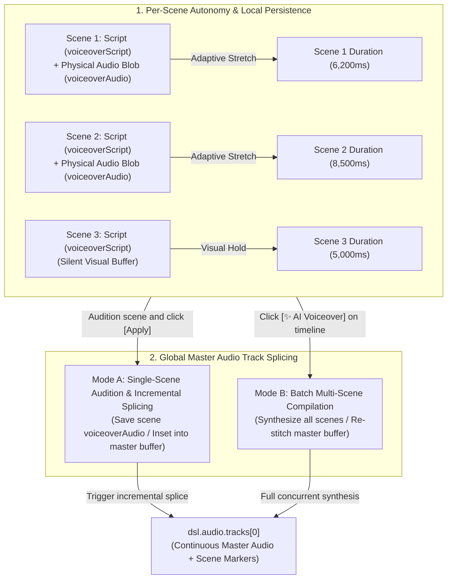

<p align="right">
  <strong>English</strong> • <a href="./23_SCENE_VOICEOVER_AND_AUDIO_TRACK_MODELS.zh-CN.md">简体中文</a>
</p>

# FocusFlow Scene Voiceover & Audio Track Architectural Specification
## Per-Scene Autonomy, Incremental Master Splicing, and Responsive Audio Topology

| Metadata | Description |
| :--- | :--- |
| **Specification Version** | `1.1.0` |
| **Last Updated** | `2026-09-17` |
| **Module Scope** | `@focusflow/studio` & `@focusflow/player` (Stage 5.6 ~ Stage 5.8, Master Track Splicing) |
| **Source Modules** | `apps/studio/src/services/audio/tts/aiTtsSynthesizer.ts`, `apps/studio/src/services/audio/tts/masterAudioStitcher.ts`, `apps/studio/src/components/layout/RightInspector.tsx`, `apps/studio/src/components/layout/BottomTimeline.tsx` |

---

## 1. Architectural Philosophy & Dual Tenets

In FocusFlow's presentation engine, voiceover scripts and physical audio tracks adhere to two foundational tenets:



### Tenet 1: Per-Scene Autonomy & Asset Persistence
- **Independent Scripting**: Every scene holds its own `scene.voiceoverScript` and `scene.voiceoverScriptI18n` dictionary;
- **Discrete Physical Assets**: `scene.voiceoverAudio` retains the scene's standalone audio binary (URL, duration, sample rate, voice model, and adapter parameters);
- **Isolated Adaptive Duration**: Audio length stretches only the active scene ($\text{duration} = T_{\text{audio}} + 500\text{ms}$ breathing margin), preserving visual pauses on other scenes.

### Tenet 2: Single-Master Global Track with Reactive Splicing
- **Single-Track Driver**: `@focusflow/player` and hardware-accelerated video recorders require a unified timeline anchor (`dsl.audio.tracks[0]`);
- **Incremental Master Splicer**: Applying an auditioned scene injects its audio into the master buffer while leaving pre-existing scenes untouched;
- **Reactive Self-Healing**: Mutating scene order or trimming durations triggers `audioTopologyKey` to re-splice the master track reactively without user intervention.

---

## 2. DSL Data Model & Schema

```typescript
// 1. Per-Scene Discrete Physical Voiceover Entity
export interface SceneVoiceoverAudio {
  url: string;                // Audio source (Blob URL / Data URI / Relative Path)
  durationMs: number;         // Physical audio duration in milliseconds
  sampleRate?: number;        // e.g. 24000 or 44100 Hz
  voiceId?: string;           // Voice avatar (e.g. Puck, Fenrir, alloy)
  model?: string;             // AI model (e.g. gemini-2.5-flash or tts-1)
  adaptedDuration?: number;   // Recommended scene duration including breathing margins
}

// 2. Scene Configuration Schema
export interface SceneStep {
  id: string;
  title: string;
  titleI18n?: Record<string, string>;
  duration?: number;                            // Display duration in milliseconds (default: 3800ms)
  voiceoverScript?: string;                     // Per-scene narration dialogue
  voiceoverScriptI18n?: Record<string, string>; // Bilingual narration scripts
  voiceoverAudio?: SceneVoiceoverAudio;         // Standalone physical audio asset
  camera: CameraTransform;
  activeElements: ActiveElements;
}

// 3. Global Master Audio Track Schema
export interface AudioTrackConfig {
  id: string;                 // Track identifier (e.g. track-master-1725950000)
  url: string;                // Master audio data URL (Blob URL or inlined Base64)
  name?: string;              // Descriptive track label
  durationMs: number;         // Total master audio length in milliseconds
  volume?: number;            // 0.0 ~ 1.0 (default: 1.0)
  muted?: boolean;
  type?: AudioTrackRole;      // 'voiceover' | 'music' | 'offline-tts'
  isOfflineTTS?: boolean;     // True if using zero-key Web Speech API
  isBackgroundBGM?: boolean;  // True if flagged as ducked background music
  markers?: AudioMarker[];    // Scene transition anchor points
}

// 4. Audio Marker for Visual Synchronization
export interface AudioMarker {
  id: string;
  timeMs: number;             // Offset in milliseconds from master audio start
  label: string;              // Scene name
  sceneIndex?: number;        // 0-based scene index
}
```

---

## 3. Operational Modalities: Incremental vs Batch

| Metric | Mode A: Single-Scene Incremental Audition | Mode B: Batch Multi-Scene Voiceover |
| :--- | :--- | :--- |
| **Trigger Location** | `[🎙️ Audition TTS]` ➔ `[✓ Apply]` in RightInspector | `[✨ AI Voiceover]` on BottomTimeline |
| **Handler** | `onApplySceneTTS` in `App.tsx` | `handleBatchAIVoiceover` in `BottomTimeline.tsx` |
| **Scope** | Mutates active scene; insets into master buffer | Synthesizes all scenes; compiles new master buffer |
| **Existing Stems** | **Preserved**: Retains pre-recorded stems | **Replaced**: Overwrites all scene stems |
| **Duration Impact** | Stretches only the selected scene | Recomputes durations for all scenes |
| **Splicer Service** | `composeMasterAudioFromScenes` in `masterAudioStitcher.ts` | `synthesizeAllScenesVoiceover` in `aiTtsSynthesizer.ts` |
| **Typical Use Case** | Fine-tuning cadence or voice actors scene by scene | Final production pass before video export |

---

## 4. Master Audio Splicing Engine

```typescript
// Splicing algorithm excerpt from apps/studio/src/services/audio/tts/masterAudioStitcher.ts

export async function composeMasterAudioFromScenes(
  scenes: SceneStep[],
  options: { defaultInterval: number; trackName?: string }
): Promise<{ masterTrack: AudioTrackConfig | null; totalDurationMs: number }> {
  // 1. Calculate cumulative temporal offsets across all scenes
  // 2. Instantiate master Web Audio AudioBuffer matching total timeline span
  // 3. Decode discrete scene audio Blobs and resample into master channel buffers
  // 4. Encode spliced buffer into a broadcast-standard 44-byte RIFF WAV Blob
  // 5. Populate AudioMarker anchors at scene transition points
}
```

This ensures that discrete scene audio blobs can be fine-tuned individually while the master output remains locked to a single, seekable hardware track.
