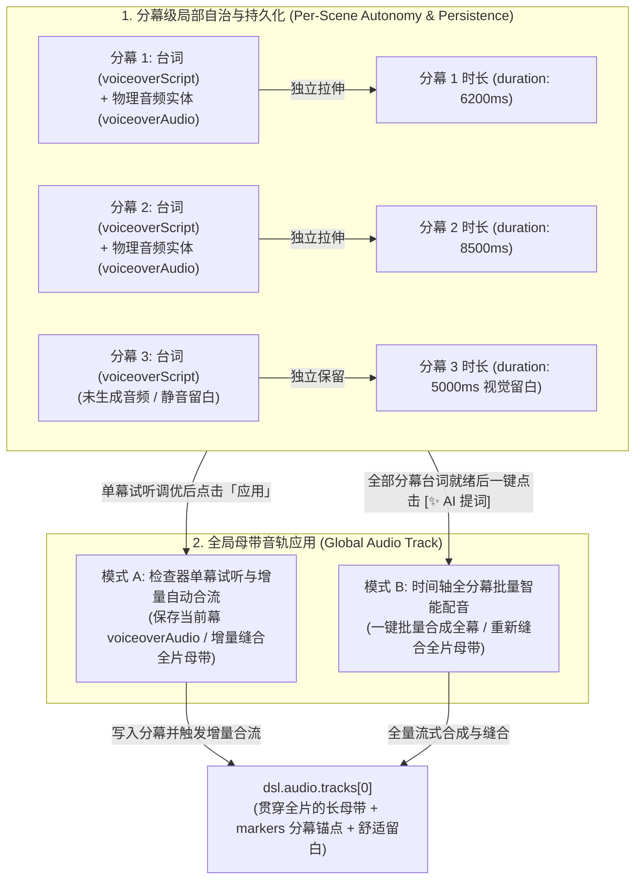
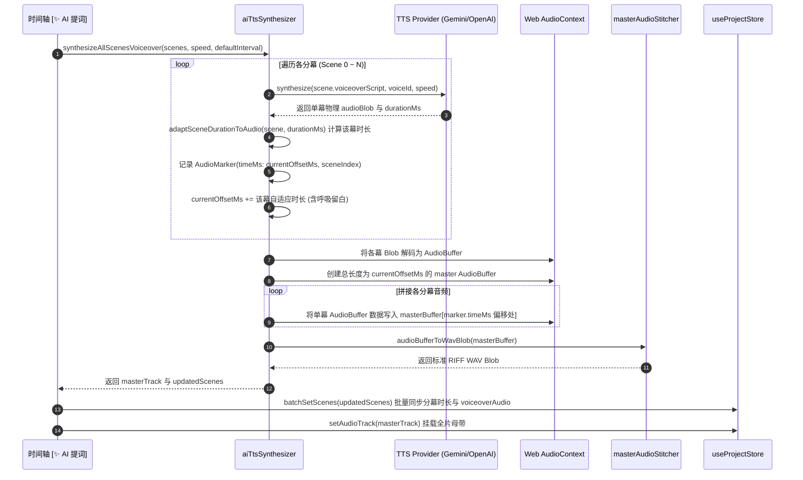

<p align="right">
  <a href="./23_SCENE_VOICEOVER_AND_AUDIO_TRACK_MODELS.md">English</a> • <strong>简体中文</strong>
</p>

# FocusFlow 分幕旁白台词与音轨应用架构规范 (Scene Voiceover & Audio Track Architecture)

> **文档版本**: 1.1.0  
> **更新日期**: 2026-09-17  
> **归档路径**: `docs/23_SCENE_VOICEOVER_AND_AUDIO_TRACK_MODELS.zh-CN.md`  
> **所属模块**: `@focusflow/studio` & `@focusflow/player` (Stage 5.6 ~ Stage 5.8, Master Track Splicing)  
> **相关代码**: `apps/studio/src/services/audio/tts/aiTtsSynthesizer.ts`, `apps/studio/src/services/audio/tts/masterAudioStitcher.ts`, `apps/studio/src/components/layout/RightInspector.tsx`, `apps/studio/src/components/layout/BottomTimeline.tsx`, `apps/studio/src/App.tsx`

---

## 1. 架构定位与核心原则

在 FocusFlow 的影视级架构演播系统中，解说旁白台词与物理音频轨道的协同遵循两大核心原则：



### 原则一：台词文本与物理音频的「分幕独立自治与持久化」
- **独立台词存储**：每个分幕卡片拥有独立的 `scene.voiceoverScript` 属性，并支持双语国际化脚本 `scene.voiceoverScriptI18n`，彼此互不干扰；
- **专属物理音频实体**：每个分幕拥有独立的 `scene.voiceoverAudio` 实体元数据（包含物理音频资源 URL、时长、采样率、发音人与模型标识），实现分幕物理音频资产的原生持久化；
- **独立时长自适应**：各分幕生成的语音朗读物理时长仅用于计算**当前该分幕的最佳展示时长**，遵循“长则扩延（音频时长 + 500ms 呼吸缓冲）、短则留白（保留原有较长时间供观众消化架构图）”的准则，**严禁跨场景波及或篡改其他分幕的时长**。

### 原则二：物理母带音频的「全局单轨制与增量响应式缝合」
- **为什么采用全局单轨制**：为了保障浏览器原生 `<audio>` 播放、Web Audio 混音、本地 60FPS WebM 录制导出以及离线单文件 HTML 分发的高效与绝对同步，FocusFlow DSL 的 `dsl.audio.tracks` 采用母带单轨模型；
- **增量智能缝合 (Incremental Splicing Engine)**：创作者在右侧检查器为任意分幕生成/试听并点击「应用」时，系统自动将该幕音频插桩到全局母带轨的对应时间段，**已有分幕音频完好保留，未配音分幕保持静音留白**；
- **时序拓扑响应式自愈**：系统部署了拓扑监听器（`audioTopologyKey`），当创作者拖拽调整任意分幕时长、删除分幕或重排分幕顺序时，底层母带缝合器自动响应式重新计算时间偏移并无缝重构全局母带，永不脱节。

---

## 2. 数据模型映射 (DSL Schema)

分幕旁白台词与音轨结构在 DSL 中的定义如下（源码见 [`packages/dsl/src/schema.ts`](../packages/dsl/src/schema.ts)）：

```typescript
// 1. 分幕级专属物理音频实体定义
export interface SceneVoiceoverAudio {
  url: string;                // 音频资源 (Blob URL / Data URI / 相对路径)
  durationMs: number;         // 该分幕物理音频的实际时长 (毫秒)
  sampleRate?: number;        // 采样率 (如 24000 或 44100)
  voiceId?: string;           // 合成发音人标识 (如 Puck, Fenrir, alloy)
  model?: string;             // 合成模型 (如 gemini-2.5-flash 或 tts-1)
  adaptedDuration?: number;   // 该分幕自适应推荐时长 (含呼吸留白)
}

// 2. 分幕级台词与展示时长定义
export interface SceneStep {
  id: string;
  title: string;
  titleI18n?: Record<string, string>;           // 双语标题 { zh: "...", en: "..." }
  duration?: number;                            // 当前分幕展示时长（单位：毫秒，默认 3800ms）
  voiceoverScript?: string;                     // 当前分幕专属旁白解说台词
  voiceoverScriptI18n?: Record<string, string>; // 多语言配音脚本 { zh: "...", en: "..." }
  voiceoverAudio?: SceneVoiceoverAudio;         // 🌟 当前分幕专属物理音频实体
  camera: CameraTransform;
  activeElements: ActiveElements;
}

// 3. 全局母带音频轨定义
export interface AudioTrackConfig {
  id: string;                 // 唯一音轨 ID (如 track-ai-1725950000 或 track-master-1725950000)
  url: string;                // 音频数据源 (Blob URL / Base64 / HTTP URL)
  name?: string;              // 音轨可读名称 (如 🎙️ 全局分幕智能合流母带)
  durationMs: number;         // 音轨总物理时长（毫秒）
  volume?: number;            // 音量 (0.0 ~ 1.0，默认 1.0)
  muted?: boolean;            // 是否静音
  type?: AudioTrackRole;      // "voiceover" | "music" | "sfx" | "offline-tts"
  isOfflineTTS?: boolean;     // 是否为无实体文件的 Web Speech 离线朗读占位轨
  isBackgroundBGM?: boolean;  // 便捷布尔标识，指示该音轨是否作为低音量背景音乐
  markers?: AudioMarker[];    // 分幕接缝时间点锚点
  vadSilences?: Array<{ startMs: number; endMs: number; centerMs?: number }>; // VAD 智能停顿带
}

// 4. 分幕接缝时间点打点定义 (用于音画精准对齐)
export interface AudioMarker {
  id: string;                 // 锚点 ID (如 marker-scene-1)
  timeMs: number;             // 该分幕在总音频轨中的起始毫秒偏移量 (Offset)
  label: string;              // 分幕标题
  sceneIndex?: number;        // 对应的分幕索引 (0-based)
}
```

---

## 3. 音轨应用的两大运行模式深度对比

FocusFlow 针对创作者在不同创作阶段的需求，设计了两种互补的音轨生成与应用机制：

| 维度 | 模式 A：检查器单幕试听与增量合流 (Single-Scene Incremental) | 模式 B：时间轴全分幕批量配音 (Batch Multi-Scene Voiceover) |
| :--- | :--- | :--- |
| **操作入口** | 右侧属性检查器（Right Inspector）各分幕底部的 `[🎙️ 试听 TTS]` 浮动条之「✓ 应用」按钮 | 底部时间轴控制区（Bottom Timeline）右下角的 `[✨ AI 提词]` 按钮 |
| **触发函数** | `onApplySceneTTS` (位于 `apps/studio/src/App.tsx`) | `handleBatchAIVoiceover` (位于 `apps/studio/src/components/layout/BottomTimeline.tsx`) |
| **生效范围** | **写入当前选中分幕**，并**增量更新全局母带轨** | **一键合成全部分幕**，并**重新生成全局母带轨** |
| **已有分幕音频处理** | **完全保留**：已有分幕音频原封不动保留在其时段，当前幕音频写入其对应 offset，未配音分幕留白静音 | **全面覆写**：重新为全部分幕调用 TTS 并按顺序全量缝合 |
| **时长更新行为** | 仅自适应调整当前分幕时长：<br>`updateSceneVoiceoverAudio(activeSceneIndex, audio, adaptedDur)` | 批量计算并更新全部分幕的时长：<br>`batchSetScenes(res.updatedScenes)` |
| **底层合流函数** | [`composeMasterAudioFromScenes`](../apps/studio/src/services/audio/tts/masterAudioStitcher.ts) (纯内存 AudioBuffer 快速缝合) | [`synthesizeAllScenesVoiceover`](../apps/studio/src/services/audio/tts/aiTtsSynthesizer.ts) (网络 TTS 批量请求 + 母带缝合) |
| **安全防覆盖守卫** | 单幕应用仅影响对应时隙，其他分幕不受破坏 | 内置防冲掉检测：若工程中已有用户自行上传的非 AI 外部音频，触发二次确认拦截 |
| **分幕标记点** | 自动生成全量分幕锚点 `markers: AudioMarker[]` | 自动生成全量分幕锚点 `markers: AudioMarker[]` |
| **时间轴波形呈现** | 完整呈现各分幕连续起伏波形带（当前幕波形实时注入，其他幕波形依然可见） | 完整呈现所有分幕按序缝合的连贯波形带与各分幕切幕垂直标记线 |
| **持久化保障** | 执行后立即自动触发 IndexedDB 存盘（`saveProject`） | 执行后立即自动触发 IndexedDB 存盘（`saveProject`） |
| **典型适用场景** | 1. 逐幕微调台词咬字、语速与发音人（如 Gemini Puck）<br>2. 某幕台词修改后局部替换，无需重新全量合成全片<br>3. 边写脚本边预览单幕节奏 | 1. 全片所有分幕台词已经全部撰写定稿<br>2. 准备整片导出 60FPS 视频或受众全屏演播<br>3. 快速一键完成全片配音工作流 |

---

## 4. 底层全分幕智能合流（AudioBuffer 缝合）架构与算法

FocusFlow 的合流体系由两大核心服务协同支撑：
1. **[`aiTtsSynthesizer.ts`](../apps/studio/src/services/audio/tts/aiTtsSynthesizer.ts)**：负责 TTS Provider 适配（Google Gemini / OpenAI / Web Speech）、单幕与多幕批量合成调度、语速适配与分幕时长拉伸计算；
2. **[`masterAudioStitcher.ts`](../apps/studio/src/services/audio/tts/masterAudioStitcher.ts)**：负责底层的流式 AudioBuffer 缝合、线性插值采样率重采样（`resampleAndCopy`）、分幕物理 Blob 内存级缓存（`sceneRawBlobCache`）以及标准 RIFF WAV 封装。

### 4.1 算法执行时序 (全量模式 B)



### 4.2 响应式拓扑重合流 (增量模式 A & 分幕时序变动)

在 `apps/studio/src/App.tsx` 中，系统对全部分幕的拓扑状态进行实时监听：

```typescript
// 监听分幕时序拓扑变化 (分幕增删、时长调整、顺序重排、台词语音变更)
const audioTopologyKey = useMemo(() => {
  return dsl.scenes.map((s) => `${s.id}:${s.duration || 3800}:${s.voiceoverAudio?.url || ''}`).join('|');
}, [dsl.scenes]);

useEffect(() => {
  if (audioTopologyKey === lastProcessedKeyRef.current) return;

  const timer = setTimeout(async () => {
    try {
      const defaultInterval = dsl.meta.controls?.interval || 3800;
      const { masterTrack } = await composeMasterAudioFromScenes(dsl.scenes, {
        defaultInterval,
        trackName: `🎙️ 全局分幕智能合流母带`,
      });

      if (masterTrack) {
        setAudioTrack(masterTrack);
      }
      lastProcessedKeyRef.current = audioTopologyKey;
    } catch (err) {
      console.warn('[App] Failed to auto-sync stitched master audio track:', err);
    }
  }, 150); // 150ms 防抖调度，避免拖拽时长滑块造成主线程卡顿

  return () => clearTimeout(timer);
}, [audioTopologyKey, ...]);
```

### 4.3 核心流式缝合算法片段

```typescript
// 摘自 apps/studio/src/services/audio/tts/masterAudioStitcher.ts

export async function composeMasterAudioFromScenes(
  scenes: SceneStep[],
  options: StitchOptions = {}
): Promise<{ masterTrack: AudioTrackConfig | null; totalDurationMs: number }> {
  const defaultInterval = options.defaultInterval || 3800;
  const targetSampleRate = options.sampleRate || 44100;

  // 1. 计算各分幕起始偏移 (Offset) 与全局总时长
  const sceneOffsets = calculateSceneTimeOffsets(scenes, defaultInterval);
  const totalDurationMs = sceneOffsets[sceneOffsets.length - 1].endMs;

  const markers: AudioMarker[] = sceneOffsets.map((so) => ({
    id: `marker-scene-${so.sceneIndex}`,
    timeMs: so.startMs,
    label: scenes[so.sceneIndex]?.title || `Scene ${so.sceneIndex + 1}`,
    sceneIndex: so.sceneIndex,
  }));

  // 2. 创建贯穿全片长度的 Master AudioBuffer
  const totalSamples = Math.ceil((totalDurationMs / 1000) * targetSampleRate);
  const masterBuffer = ctx.createBuffer(1, Math.max(1, totalSamples), targetSampleRate);
  const masterChannel = masterBuffer.getChannelData(0);

  // 3. 将各分幕音频按其 startOffset 写入主通道，采样率不匹配时自动线性重采样
  for (let i = 0; i < scenes.length; i++) {
    const s = scenes[i];
    if (!s.voiceoverAudio?.url) continue;

    const decoded = await getOrDecodeAudioBuffer(s);
    const startSample = Math.floor((sceneOffsets[i].startMs / 1000) * targetSampleRate);
    const maxSceneSamples = Math.floor((sceneOffsets[i].durationMs / 1000) * targetSampleRate);
    const srcChannel = decoded.getChannelData(0);

    if (decoded.sampleRate === targetSampleRate) {
      const maxSamples = Math.min(srcChannel.length, maxSceneSamples, masterChannel.length - startSample);
      masterChannel.set(srcChannel.subarray(0, maxSamples), startSample);
    } else {
      resampleAndCopy(srcChannel, decoded.sampleRate, masterChannel, startSample, targetSampleRate, maxSceneSamples);
    }
  }

  // 4. 打包为标准 44 字节 RIFF WAV Blob 并挂载
  const masterBlob = audioBufferToWavBlob(masterBuffer);
  return {
    masterTrack: {
      id: `track-master-${Date.now()}`,
      name: options.trackName || "🎙️ 分幕多轨智能合流母带",
      url: URL.createObjectURL(masterBlob),
      durationMs: totalDurationMs,
      volume: 1.0,
      muted: false,
      isOfflineTTS: false,
      type: "voiceover",
      markers,
    },
    totalDurationMs,
  };
}
```

---

## 5. 创作者最佳实践工作流

为了达到最高效的音画同步出片体验，推荐创作者遵循 **“单幕调教，全片合流”** 的黄金工作流：

```
[步骤 1] 逐幕撰写台词
   └── 在右侧检查器中选中场景 1，填入旁白解说词；切换到场景 2，填入旁白解说词...
         │
[步骤 2] 单幕局部试听与增量应用 (推荐边写边听)
   └── 点击检查器的「🎙️ 试听 TTS (自适应分幕时长)」，试听发音节奏与音色；
       满意后点击「✓ 应用」：
       - 该分幕时长自动拉伸到位（含 500ms 舒适留白）；
       - 该分幕物理音频自动保存至 scene.voiceoverAudio；
       - 全局母带音轨实时增量合流，绝不影响其他分幕已有配音！
         │
[步骤 3] 全片一键合流出片 (可选·全自动)
   └── 所有分幕台词草拟完成后，也可以随时点击底部时间轴右下角的「✨ AI 提词」按钮；
       系统全自动将全部分幕一次性合成、流式缝合并生成一条完整母带音轨；
       底部时间轴展现完整的波形段落与分幕切割线。
         │
[步骤 4] 演播与导出
   └── 点击时间轴播放按钮或按空格键，整部演示文稿音画对齐、逐幕连贯播报；
       可直接通过「导出中心」录制 60FPS 超清 WebM 视频或导出独立 HTML。
```

---

## 6. 常见疑问与排障指引 (FAQ)

### Q1: 我在检查器中逐幕点击「应用」，会冲掉或丢失其他分幕之前生成的音频吗？
**解答**：**完全不会。** FocusFlow 已全面升级为“分幕音频增量智能缝合”架构。每个分幕的音频都会独立保存在其 `scene.voiceoverAudio` 属性中。当您在场景 2 点击应用时，场景 1 的音频会完好保留在第 1 幕的时段内，场景 2 的音频会自动无缝拼接到场景 1 之后；未配音的分幕则自动保持静音留白。

### Q2: 拖拽改变分幕时长、删除分幕或调整分幕顺序后，音画会脱节错位吗？
**解答**：**绝不会脱节。** 系统内置了 `audioTopologyKey` 响应式拓扑监听机制。无论您在检查器拉伸某幕时长、在时间轴拖动分幕边缘、还是拖拽卡片调换分幕顺序，母带缝合器（`masterAudioStitcher`）都会在后台（150ms 去抖调度）自动重新计算所有分幕的毫秒偏移量，并将内存中缓存的 AudioBuffer 瞬时无缝重组，确保音频与运镜画面永远绝对对齐。

### Q3: 如果工程中已有我自行上传的配乐或录音，点击时间轴的「✨ AI 提词」会直接覆盖吗？
**解答**：**不会静默覆盖。** 时间轴批量提词配音内置了双向防覆盖守卫（Safety Guard）。当系统检测到工程中已存在用户自行上传的外部音轨时，会主动弹出二次确认弹窗（“工程中已有您上传的音频文件，生成 AI 旁白将替换该音频，是否继续？”），只有在创作者主动确认后才会继续执行，充分保护创作者的资产安全。

### Q4: 离线模式（Web Speech）与云端模式（Gemini / OpenAI）在合流时有何区别？
**解答**：
- **云端模式（Gemini / OpenAI）**：每次合流调用大模型 API 获取真实 PCM/WAV 音频流，缝合成一个包含真实波形振幅的独立 WAV 文件，导出视频时能内录高清真人原声；
- **离线模式（系统内置语音）**：由于浏览器沙箱禁止直接内录本地声卡，离线合流会根据各幕台词文本的字数与语速，精确计算并拉伸各分幕的时长，同时生成一条占位波形轨；演播播放时由全局调度中心驱动浏览器底层的 `window.speechSynthesis` 逐幕平滑发声。
