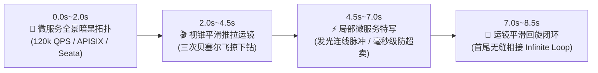

# FocusFlow 方案 A：电影级运镜与贝塞尔流光高质量循环 GIF 动图工程方案

> **文档编号**: `docs/33_HIGH_QUALITY_CINEMATIC_LOOP_GIF_PLAN.zh-CN.md`  
> **制定时间**: 2026-09-22  
> **目标场景**: Reddit `r/coolgithubprojects` 等开源海外社区顶级流量曝光动图（兼顾 `README.md` 与主站画廊）  
> **资产归属规范**: 遵循 [37_CLOUDFLARE_R2_MEDIA_ASSETS_ARCHITECTURE.md](file:///Users/xt/WebstormProjects/focusflow/design/37_CLOUDFLARE_R2_MEDIA_ASSETS_ARCHITECTURE.md)，本地存放于 `media/docs/`，由 `.gitignore` 保护，通过 `pnpm sync:r2` 增量同步至 Cloudflare R2，全球 Anycast CDN 高速分发。

---

## 一、 背景与方案目标

根据 Reddit `r/coolgithubprojects` 板块深度调研报告（[coolgithubprojects_subreddit_analysis.md](file:///Users/xt/WebstormProjects/skills/reddit/coolgithubprojects_subreddit_analysis.md)）：
- **核心逻辑**：极客与开发者在 Reddit 信息流中平均停留仅 2~3 秒。**高质量、免点击、自动循环播放的 GIF 动图**是获得 500~1000+ Upvotes 的第一梯队爆款标配。
- **现状诊断**：旧版 `hero-demo.gif`（`media/docs/hero-demo.gif`，原 `docs/assets/hero-demo.gif`）分辨率低（560x315）、帧率低（10fps），前 7 秒为静态白底弹窗，严重稀释了视觉冲击力。
- **方案 A 目标**：
  1. 打造 **7~9 秒高能纯享、首尾平滑相接的 60fps 视锥连续推拉与贝塞尔流光发光动图**；
  2. 画面采用**高对比度暗黑科技风（Microservices Dark E-Commerce Topology）**，无白底弹窗打断，开屏即震撼；
  3. 分辨率提升至 **800x450（或 848x476）**，文本代码极清可见；
  4. 采用 FFmpeg 工业级双通道动态调色板差量算法（Two-pass `palettegen=stats_mode=diff` + Bayer 抖动优化），将体积严格压制在 **5MB ~ 8MB**（低于 Reddit 20MB 限制，全球秒开无卡顿）；
  5. 落地符合统一媒体架构 `media/docs/`，一键通过 R2 远端同步与 CDN 链接生效。

---

## 二、 资产归属与动静分离规范 (对齐规范 37)

依据 [37_CLOUDFLARE_R2_MEDIA_ASSETS_ARCHITECTURE.md](file:///Users/xt/WebstormProjects/focusflow/design/37_CLOUDFLARE_R2_MEDIA_ASSETS_ARCHITECTURE.md)：

| 维度 | 规约内容 |
| :--- | :--- |
| **本地物理路径** | `media/docs/focusflow-cinematic-loop.gif`（本地开发与调试使用） |
| **Git 版本追踪** | **Strictly Untracked**。已被根目录 `.gitignore` 中的 `media/` 规则全局忽略，**绝不污染 `.git` 仓库对象**。 |
| **云端存储桶** | `tumio-assets` |
| **R2 远端 Key** | `focusflow/docs/focusflow-cinematic-loop.gif` |
| **全球 CDN 访问地址** | `https://assets.tumio.site/focusflow/docs/focusflow-cinematic-loop.gif` |
| **同步工具** | `pnpm sync:r2`（执行增量校验与一键分发） |

---

## 三、 动图分镜与视觉呈现设计 (7~9秒节奏)

动图采用“**全景认知 -> 视锥掠影 -> 局部下钻 -> 流光脉冲 -> 优雅闭环**”的循环电影感节奏：



### 逐秒镜头细目表：
1. **0.0s ~ 2.0s【全局震撼定格】**：
   - 画面：全景微服务拓扑大图（`Cloud-Native High-Availability E-Commerce Microservices`）。
   - 视觉元素：发光彩色节点（网关蓝、订单绿、库存金、Seata 红）与全局贝塞尔连接线，展示超大系统的宏大与秩序感。
2. **2.0s ~ 4.5s【60fps 电影级视锥推拉】**：
   - 画面：镜头在连续仿射变换矩阵（Continuous Affine Matrix）驱动下，从全局 1.0x 平滑推近至 3.2x 局部。
   - 视觉元素：聚焦于核心业务链路（`APISIX Gateway Cluster -> Order Core Microservice`）。
3. **4.5s ~ 7.0s【贝塞尔发光流光特写与参数交互】**：
   - 画面：沿连线流动的高亮度霓虹脉冲波，卡片展示 QPS、P99 延迟及分布式事务两阶段锁。
   - 视觉元素：微服务之间的动态数据流转直观可见，彻底区别于传统死的 PPT 和截图。
4. **7.0s ~ 8.5s【优雅拉回 / 循环闭环】**：
   - 画面：镜头以平滑阻尼曲线缓动回拉至全景或下一切入点，实现帧级顺畅循环播放。

---

## 四、 关键技术实施流程与 FFmpeg 调色参数

为彻底解决传统 GIF 常见的“颜色杂斑严重、文字边缘发虚、文件体积动辄 20MB+”的问题，本方案采用高阶双通道调色板生成流程：

### 步骤 1：精确切片并提取高帧率源片段
从现有母源 1080p 60fps 视频中提取黄金 8 秒区间：
```bash
ffmpeg -y -ss 00:00:10.5 -i media/docs/focusflow-feature-cn-1080p-60fps.mp4 \
  -t 8.0 -vf "fps=24,scale=800:-1:flags=lanczos" \
  scratch/cinematic_raw.mp4
```

### 步骤 2：Pass 1 - 提取精准动态色板 (`stats_mode=diff`)
针对深色背景与霓虹渐变流光，统计帧间色彩差异最大的像素生成 192 色最优调色板：
```bash
ffmpeg -y -i scratch/cinematic_raw.mp4 \
  -vf "fps=24,scale=800:-1:flags=lanczos,palettegen=max_colors=192:stats_mode=diff:reserve_transparent=0" \
  scratch/palette.png
```

### 步骤 3：Pass 2 - 像素级色彩量化与 Bayer 算法抖动渲染
应用色板渲染 GIF，使用 Bayer 抖动避免平滑渐变产生色块断层，同时消除杂色斑点：
```bash
ffmpeg -y -i scratch/cinematic_raw.mp4 -i scratch/palette.png \
  -filter_complex "[0:v][1:v]paletteuse=dither=bayer:bayer_scale=3" \
  media/docs/focusflow-cinematic-loop.gif
```

### 步骤 4：无损优化与体积约束验收
- 使用 `gifsicle` 或体积检测脚本验证文件大小：必须控制在 **5MB ~ 8MB** 之间。
- 检查首尾循环连贯性与分辨率标度（800x450）。

---

## 五、 上云同步与文档引用实施步骤

1. **本地调试与视觉确认**：
   - 生成后通过 `view_file` 抽取关键帧并由您检视确认。
2. **自动化同步至 Cloudflare R2**：
   ```bash
   pnpm sync:r2
   ```
   - 脚本将自动比对哈希，增量上传 `media/docs/focusflow-cinematic-loop.gif` 至 `tumio-assets`。
3. **多平台物料注入**：
   - 更新 Reddit `03-reddit-webdev-showcase.md` 与后续发帖物料，直接挂载该 GIF 与外链。
   - （可选）在 `README.md` 与 `README.zh-CN.md` 的顶部增加或更新该循环动图，提升 GitHub 首页转化率。

---

## 六、 实施排期与行动确认点

| 序号 | 步骤 | 耗时估计 | 验收标准 |
| :---: | :--- | :---: | :--- |
| **1** | 本文档提交并待用户审核确认 | 当前节点 | 用户审阅规划与参数无误 |
| **2** | 裁剪高能区间并生成首个候选 GIF | ~2 分钟 | 获得 `media/docs/focusflow-cinematic-loop.gif` |
| **3** | 抽帧检视与体积校验 | ~1 分钟 | 体积 5~8MB，文字极清，流光丝滑 |
| **4** | 执行 `pnpm sync:r2` 增量推送至 R2 | ~30 秒 | CDN 访问返回 HTTP 200，支持跨域 |
| **5** | 更新 Reddit 宣传文案物料清单 | ~1 分钟 | 物料文档就绪，准备出海发帖 |
