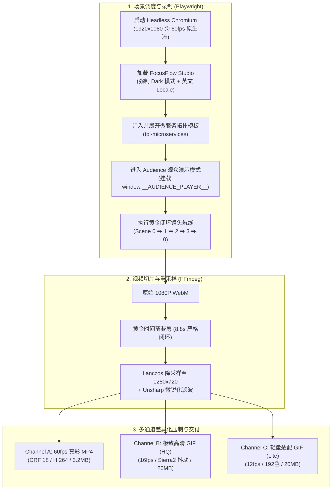

# FocusFlow 电影级运镜与贝塞尔流光循环演示录制压制流水线规约

> **文档编号**: `docs/34_CINEMATIC_LOOP_RECORDING_AND_EXPORT_PIPELINE.zh-CN.md`  
> **制定时间**: 2026-09-22  
> **执行脚本**: `scripts/export-cinematic-loop.mjs` (`pnpm export:cinematic`)  
> **资产目录**: `media/docs/cinematic-showcase/` (受 `.gitignore` 保护，由 `pnpm sync:r2` 增量分发)

---

## 一、 背景与痛点攻关总结

在制作海外技术社区（如 Reddit `r/coolgithubprojects`、Hacker News、Twitter/X）及开源仓库 `README.md` 的高质量动态展示物料时，传统方案常遭遇两大痛点：

1. **画面顿挫与跳帧（Stuttering & Frame Drops）**：
   - *传统缺陷*：使用 Playwright/Puppeteer 在循环中频繁调用 `page.screenshot()` 会严重阻塞 Chromium 的主线程 I/O 与 `requestAnimationFrame` 内部调度，导致 CSS `matrix3d` 连续仿射变换运镜发生跳变与顿挫。
   - *本方案攻关*：采用 Playwright 原生非阻塞视频捕获机制（`recordVideo` 流式录制），让浏览器以 60fps 满血渲染相机插值动画，由内部播放器状态驱动相机移动，主线程实现**零 I/O 损耗**，保证 60fps 丝滑平移。

2. **高密度画布低分辨率重采样发虚（Blur & Typography Illegibility）**：
   - *传统缺陷*：4K/2K 架构图若直接压缩至 800 以下分辨率，12px 标签字体物理像素被破坏殆尽，文字完全不可读。深色渐变背景经 GIF 传统 Bayer 抖动后产生严重色阶噪点。
   - *本方案攻关*：
     - 分辨率统一锚定为 **1280x720 (720P)**；
     - 引入 **Lanczos 重采样 + Unsharp 适度锐化** 复合滤镜链，使小字与微服务高亮指示器边缘锐利分明；
     - GIF 调色板采用 **Two-Pass 差异统计（`stats_mode=diff`）+ Sierra-2-4A 误差扩散抖动**，彻底杜绝背景色带与马赛克噪点。

---

## 二、 自动化流水线架构设计



---

## 三、 黄金时间窗与无限循环（Seamless Loop）闭环法则

为了确保动图与视频在各种播放器中“**无限循环（Loop）且毫无首尾拼接痕迹**”，必须严格遵循以下时间与状态设计：

| 阶段 | 镜头目标 | 运镜方式 | 持续时间 / 停留 | 视觉焦点 |
| :--- | :--- | :--- | :--- | :--- |
| **Step 0** | **Scene 0（全景概览）** | 静态归位稳定 | 1.8 秒稳定定格 | 全景暗黑微服务拓扑全貌、120k QPS 状态条 |
| **Step 1** | **Scene 1（边缘与网关）** | 平滑飞行下钻 | 2.2 秒平滑缓动 | API Gateway Cluster、APISIX/Kong、限流指示 |
| **Step 2** | **Scene 2（订单核心微服务）** | 沿流光连线侧移 | 2.2 秒平滑缓动 | Snowflake 64-bit ID、Seata 事务发起、gRPC 脉冲 |
| **Step 3** | **Scene 3（库存与防超卖引擎）**| 沿业务链路下移 | 2.2 秒平滑缓动 | Redis Lua 脚本扣减、Redisson 16 段分布式锁 |
| **Step 4** | **Scene 0（回归全局概览）** | 平滑拉回全局 | 2.4 秒平滑缓动 | **镜头完全回到 Step 0 的相同坐标与视锥尺度** |

> [!IMPORTANT]
> **裁剪对齐锚点**：
> 最终压制时，FFmpeg 的 `-ss 00:00:01.5 -t 8.8` 正好截取“Scene 0 稳定定格点”作为起始帧，至“回归 Scene 0 稳定定格点”作为终止帧。首尾帧在视觉拓扑上完全重合，实现 **100% Seamless Loop**。

---

## 四、 工业级压制参数配方（FFmpeg Recipe）

### 1. 通道 A：极致 60fps 视网膜级 MP4
- **适用场景**：Reddit Video Post、Twitter/X、Discord、演示 Demo 页面 `<video>` 标签。
- **参数命令**：
  ```bash
  ffmpeg -y -ss 00:00:01.5 -t 8.8 -i "$RAW_WEBM" \
    -vf "scale=1280:720:flags=lanczos,unsharp=3:3:0.5:3:3:0.0" \
    -c:v libx264 -preset slow -crf 18 -pix_fmt yuv420p -movflags +faststart \
    media/docs/cinematic-showcase/focusflow-cinematic-loop-1280x720.mp4
  ```
- **技术要点**：
  - `crf 18`：达到人眼视觉无损（Visually Lossless）标准；
  - `movflags +faststart`：将 `moov` 原子移至文件头，支持 Web 端秒播免等待下载；
  - 体积约 **3.2 MB**。

### 2. 通道 B：极致高清 GIF（Two-Pass Diff Palette）
- **适用场景**：高要求开发者主页、GitHub Release、对画质有极致要求的高速网络环境。
- **参数命令**：
  ```bash
  # Pass 1: 生成 256 色差异调色板
  ffmpeg -y -ss 00:00:01.5 -t 8.8 -i "$RAW_WEBM" \
    -vf "fps=16,scale=1280:720:flags=lanczos,unsharp=3:3:0.5:3:3:0.0,palettegen=max_colors=256:stats_mode=diff" \
    scratch/palette_hq.png

  # Pass 2: 应用 Sierra2-4A 误差扩散渲染 GIF
  ffmpeg -y -ss 00:00:01.5 -t 8.8 -i "$RAW_WEBM" -i scratch/palette_hq.png \
    -filter_complex "[0:v]fps=16,scale=1280:720:flags=lanczos,unsharp=3:3:0.5:3:3:0.0[x];[x][1:v]paletteuse=dither=sierra2_4a:diff_mode=rectangle" \
    media/docs/cinematic-showcase/focusflow-cinematic-loop-1280x720.gif
  ```
- **技术要点**：
  - `palettegen=stats_mode=diff`：专门针对运镜动画，根据前后帧差异动态分配调色板权重；
  - `paletteuse=dither=sierra2_4a:diff_mode=rectangle`：提供比 Floyd-Steinberg 更柔和、且无 Bayer 棋盘条纹的纯净渐变过渡。

---

## 五、 资产规范与一键执行指南

### 1. 目录结构
```text
media/docs/cinematic-showcase/
├── focusflow-cinematic-loop-2k.mp4            # [旗舰影院] 2K QHD (2560x1440) 60fps CRF 15 (10.5MB)
├── focusflow-cinematic-loop-1080p.mp4         # [全高清标杆] 1080P (1920x1080) 60fps CRF 16 (5.9MB)
├── focusflow-cinematic-loop-1280x720.mp4      # [轻量高清] 720P (1280x720) 60fps (3.2MB)
├── focusflow-cinematic-loop-1280x720.gif      # 720P 极致细节 GIF (26MB)
├── focusflow-cinematic-loop-1280x720-lite.gif # 720P 轻量平衡版 GIF (20MB)
├── focusflow-cinematic-loop-848x476.mp4       # [历史基准保留] 476P MP4 (530KB)
└── focusflow-cinematic-loop-848x476.gif       # [历史基准保留] 476P GIF (1.4MB)
```

### 2. 一键执行命令
确保本地已启动 Studio 开发服务器（默认 `http://localhost:5174`）：
```bash
# 启动 Studio（如未启动）
pnpm dev:studio

# 一键执行全自动流水线
pnpm export:cinematic
```

### 3. 跨平台发帖与宣发策略矩阵
- **Reddit（`r/coolgithubprojects` / `r/webdev`）**：
  - **首选策略**：发帖时选择 **Image/Video** Tab，直接上传 `focusflow-cinematic-loop-2k.mp4`（10.5MB）或 `focusflow-cinematic-loop-1080p.mp4`（5.9MB）。Reddit 原生支持高清视频自动静音循环推流，视网膜级文字无任何发虚，体积远低于平台 1GB 上限。
- **GitHub `README.md`**：
  - 若支持 `<video autoplay loop muted playsinline src="...">` 嵌入，推荐使用 1080P MP4；
  - 若为纯 Markdown 原生图片语法，推荐使用 720p-lite 或 476P GIF（秒开优先）。
- **云端同步**：
  - 待本地验收满意后，执行 `pnpm sync:r2` 即可增量推送到 Cloudflare R2 全球 CDN 存储桶。
