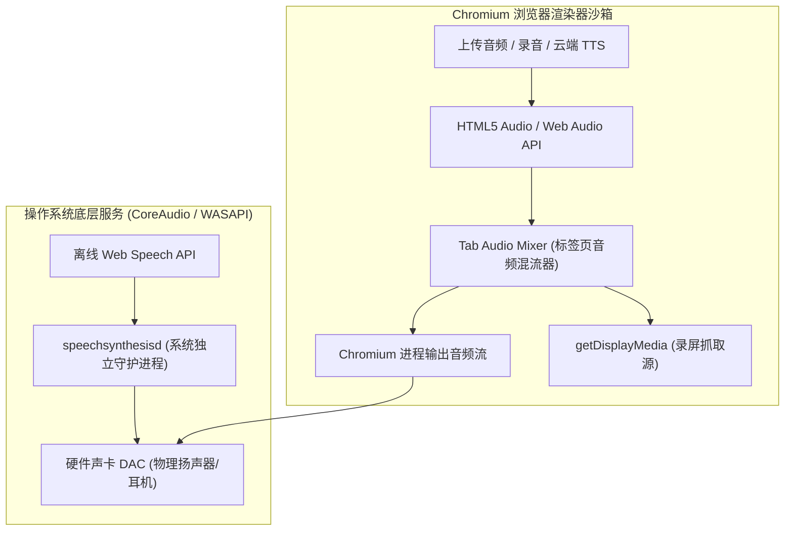
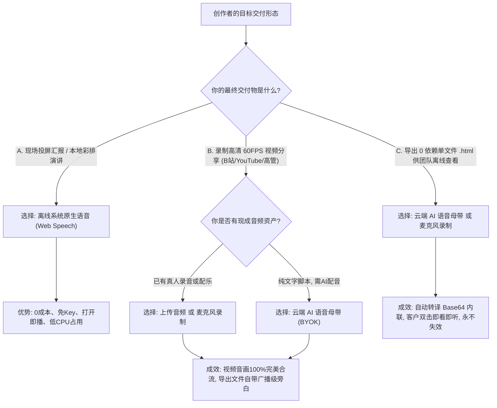

# FocusFlow 全场景音频播放、录制与导出技术全景手册

> **文档版本**: 1.0.0  
> **归档路径**: `docs/AUDIO_PLAYBACK_AND_EXPORT_MATRIX.md`  
> **所属模块**: `@focusflow/studio`, `@focusflow/player`, `@focusflow/dsl`  
> **目标读者**: 核心架构师、前端开发工程师、音视频研发工程师、内容创作者  

---

## 目录
1. [架构定位与设计哲学](#1-架构定位与设计哲学)
2. [全场景音频能力对照矩阵 (Master Matrix)](#2-全场景音频能力对照矩阵-master-matrix)
3. [4 大音频源的底层存储与生命周期](#3-4-大音频源的底层存储与生命周期)
   - [3.1 外部上传音频 (Uploaded Audio)](#31-外部上传音频-uploaded-audio)
   - [3.2 麦克风演播录音 (Microphone Voiceover)](#32-麦克风演播录音-microphone-voiceover)
   - [3.3 云端 AI 语音母带 (Cloud TTS · BYOK)](#33-云端-ai-语音母带-cloud-tts--byok)
   - [3.4 离线系统原生语音 (Offline Web Speech API)](#34-离线系统原生语音-offline-web-speech-api)
4. [7 大播放与导出消费场景的技术链路](#4-7-大播放与导出消费场景的技术链路)
   - [4.1 属性检查器单幕试听 (Inspector Preview)](#41-属性检查器单幕试听-inspector-preview)
   - [4.2 时间轴波形轨试听与微调 (Waveform Track Scrub & Preview)](#42-时间轴波形轨试听与微调-waveform-track-scrub--preview)
   - [4.3 Studio 画板日常播放测试 (Studio Canvas Preview)](#43-studio-画板日常播放测试-studio-canvas-preview)
   - [4.4 受众全屏演播模式 (AudienceModal Presentation)](#44-受众全屏演播模式-audiencemodal-presentation)
   - [4.5 60FPS WebM 录制中同屏监听 (Recording Real-time Monitor)](#45-60fps-webm-录制中同屏监听-recording-real-time-monitor)
   - [4.6 导出的 WebM 视频成品文件 (Exported WebM Video File)](#46-导出的-webm-视频成品文件-exported-webm-video-file)
   - [4.7 导出的 0 依赖独立单文件 HTML (Standalone HTML Artifact)](#47-导出的-0-依赖独立单文件-html-standalone-html-artifact)
5. [底层物理机制差异与沙箱隔离剖析](#5-底层物理机制差异与沙箱隔离剖析)
   - [5.1 实体二进制流 (Audio Buffer) vs 操作系统发音进程 (Speech Daemon)](#51-实体二进制流-audio-buffer-vs-操作系统发音进程-speech-daemon)
   - [5.2 浏览器 Tab Audio Capture 录制抓取范围限制](#52-浏览器-tab-audio-capture-录制抓取范围限制)
   - [5.3 独立 HTML 的 Base64 内联序列化机制](#53-独立-html-的-base64-内联序列化机制)
   - [5.4 播放内核纯净性与 Studio 调度解耦设计](#54-播放内核纯净性与-studio-调度解耦设计)
6. [创作者出片最佳实践与决策树](#6-创作者出片最佳实践与决策树)
7. [常见排障手册与 FAQ](#7-常见排障手册与-faq)

---

## 1. 架构定位与设计哲学

FocusFlow 作为新一代架构演进动态可视化系统，其核心体验是**“电影级镜头调度 + 高度同步的解说旁白”**。

在音频处理层面，系统面临两项极具挑战性的技术诉求：
1. **零门槛、零成本、即开即用的快速彩排与同屏演讲**：不需要用户注册任何第三方商业 API 或支付 Token 费用即可发声；
2. **商业级发布、高保真录制、离线分发交付**：支持生成无损 60FPS WebM 视频，以及双击即看、永不失效的单个脱机 HTML 文件。

为此，FocusFlow 确立了 **“双模驱动 + 多轨仲裁 + 渐进式交付”** 的音频架构路线：
- **离线层**：以浏览器 W3C Web Speech API 为基石，提供 0 成本、零延迟、免 Key 的原生播音员朗读；
- **实体层**：支持外部 MP3/WAV 上传、浏览器原生麦克风录音、以及 BYOK 云端商业大模型（OpenAI / 硅基流动）生成实体母带文件；
- **仲裁层**：通过严谨的音频仲裁状态机（Audio Arbiter），确保实体音轨与合成语音互斥避让，彻底消除声音混叠轰鸣。

---

## 2. 全场景音频能力对照矩阵 (Master Matrix)

下表全面对比了 **4 大音频源** 在 FocusFlow **7 大使用与导出场景** 下的具体表现与支持特性：

| 音频来源分类 | ① 检查器单幕试听 | ② 时间轴波形试听 | ③ 画板日常播放测试 | ④ 受众全屏演播模式 | ⑤ 录制时耳机实时监听 | ⑥ 导出的 WebM 视频成品 | ⑦ 导出的单文件 HTML |
| :--- | :---: | :---: | :---: | :---: | :---: | :---: | :---: |
| **A. 外部上传音频**<br>`(MP3 / WAV / AAC)` | ⚪ 无此场景<br>*(整轨无单幕)* | 🟢 **支持**<br>*(HTML5 Audio)* | 🟢 **支持**<br>*(HTML5 Audio)* | 🟢 **支持**<br>*(HTML5 Audio)* | 🟢 **支持**<br>*(耳机清晰可听)* | 🟢 **完美包含**<br>*(标签页直接内录)* | 🟢 **完美支持**<br>*(Base64 离线内嵌)* |
| **B. 麦克风演播录音**<br>`(录音器生成的 WAV)` | ⚪ 无此场景<br>*(整轨无单幕)* | 🟢 **支持**<br>*(HTML5 Audio)* | 🟢 **支持**<br>*(HTML5 Audio)* | 🟢 **支持**<br>*(HTML5 Audio)* | 🟢 **支持**<br>*(耳机清晰可听)* | 🟢 **完美包含**<br>*(实体流合流内录)* | 🟢 **完美支持**<br>*(Base64 离线内嵌)* |
| **C. 云端 AI 语音母带**<br>`(OpenAI / 硅基流动)` | 🟢 **支持**<br>*(单句流式合成)* | 🟢 **支持**<br>*(全幕拼接波形)* | 🟢 **支持**<br>*(随分幕对齐播放)* | 🟢 **支持**<br>*(随分幕对齐播放)* | 🟢 **支持**<br>*(耳机清晰可听)* | 🟢 **完美包含**<br>*(音画同步合流)* | 🟢 **完美支持**<br>*(Base64 离线内嵌)* |
| **D. 离线系统原生语音**<br>`(Web Speech 免 Key)` | 🟢 **支持**<br>*(系统播音员朗读)* | 🟢 **支持**<br>*(分幕微调发音)* | 🟢 **支持**<br>*(系统播音员朗读)* | 🟢 **支持**<br>*(系统播音员朗读)* | 🟢 **支持**<br>*(耳朵可实时听到)* | 🔴 **无声（需转云端）**<br>*(受浏览器沙箱限制)* | 🔴 **无声（需转云端）**<br>*(播放内核纯净无发音)* |

---

## 3. 4 大音频源的底层存储与生命周期

### 3.1 外部上传音频 (Uploaded Audio)
- **获取途径**：创作者在底部时间轴点击【导入音频文件】，选择本地配音或背景音乐。
- **存储载体**：由浏览器生成本地临时引用：`blob:http://localhost:5174/<uuid>`。
- **元数据规格**：
  ```typescript
  {
    id: 'track-1725760000000',
    name: 'bgm-corporate-tech',
    url: 'blob:http://localhost:5174/3a7...',
    durationMs: 45200,
    volume: 1.0, // 若选择作为伴奏则为 0.2
    type: 'voiceover' | 'music',
    isBackgroundBGM: boolean
  }
  ```
- **核心特点**：具备真实音频采样数据（44.1kHz / 48kHz PCM），可以被 Web Audio API 解码并绘制真实物理波形峰值（Peaks）。

### 3.2 麦克风演播录音 (Microphone Voiceover)
- **获取途径**：在时间轴唤起【同屏演播麦克风录音器】（`StudioVoiceRecorder`），伴随时间轴镜头运镜同步进行真人配音解说，并可通过键盘快捷键 `M` 打入场景转场锚点（Punch Markers）。
- **技术实现**：基于 `MediaStreamTrack` + Web Audio `AudioWorklet` / `MediaRecorder`，带有回声消除（AEC）与背景降噪（ANS）。
- **录制产物**：无压缩高保真 WAV Blob，自动挂载入工程音轨并提取波形。

### 3.3 云端 AI 语音母带 (Cloud TTS · BYOK)
- **获取途径**：在配置中选用【云端高清 AI 语音】，输入用户自备的 API Key（OpenAI、SiliconFlow、OneAPI 等），点击【一键生成分幕 AI 旁白】。
- **技术实现**：
  1. 并发请求服务商 REST 接口获取各分幕的真实 MP3/WAV 数据流；
  2. 使用 `AudioContext.decodeAudioData` 解码为 `AudioBuffer`；
  3. 自适应计算分幕时长（`adaptSceneDurationToAudio`），拉伸时间轴；
  4. 将各分幕的音频缓冲区无缝拼接为全局母带 `combinedBuffer`；
  5. 将母带编译为标准 WAV Blob 存入 `dsl.audio.tracks[0]`。
- **核心特点**：高拟真真人广播级播音质感，实体二进制文件完整驻留工程。

### 3.4 离线系统原生语音 (Offline Web Speech API)
- **获取途径**：系统默认启用的免 Key 离线模式。
- **技术实现**：
  - **发声层**：调用浏览器 `window.speechSynthesis.speak(utterance)`，由操作系统原生语音合成器发声；
  - **时间轴与波形层**：由于浏览器不提供 Web Speech 的音频字节导出接口，系统通过字数与语速算法（中文约 4 字/秒，英文约 2.8 词/秒）预估精准时长，并生成一段**干净的纯静音占位 WAV 轨（`createMockAudioBlob`）**，以便时间轴进行波形绘制与自适应时长伸缩；
- **核心标识**：`track.isOfflineTTS === true` 或 `track.type === 'offline-tts'`。

---

## 4. 7 大播放与导出消费场景的技术链路

### 4.1 属性检查器单幕试听 (Inspector Preview)
- **调用位置**：右侧检查器中的分幕台词卡片上的【试听】按钮。
- **技术路径**：
  - **离线模式**：直接调用 `speakWebSpeech(text, speed, undefined, voice)`，试听当前句发音；
  - **云端模式**：请求单句流式合成，通过内存中的临时 `<audio>` 播放，试听完成后自动销毁。

### 4.2 时间轴波形轨试听与微调 (Waveform Track Scrub & Preview)
- **调用位置**：底部时间轴波形轨头部的【播放试听】按钮与画布上的颗粒刮擦试听（Audio Scrubbing）。
- **技术路径**：
  - **实体音轨（上传/录音/云端）**：创建 `AudioContext` 粒度切片播放源（Scrub Grain），响应指针拖拽动态试听该切片的波形内容；
  - **离线 TTS 音轨**：若处于离线占位音轨，点击试听时自动转为朗读当前光标所在分幕的文本台词。

### 4.3 Studio 画板日常播放测试 (Studio Canvas Preview)
- **调用位置**：工作区主画布下方的控制栏【播放/暂停】按钮或按空格键。
- **技术路径**：
  - 由 `App.tsx` 统一协调四象限音频仲裁状态机：
    ```typescript
    // 若工程中无任何音轨、或音轨处于静音/0音量状态，绝对不发声（删除音轨后彻底静音）
    if (!currentlyPlaying || !mainTrack || mainTrack.muted || (mainTrack.volume ?? 1) <= 0) {
      return;
    }
    ```
  - **四象限仲裁决策**：
    1. **工程无音轨（未添加或已删除音轨）**：内核 `<audio>` 与系统 WebSpeech **双静默**，保证画板播放 100% 纯净无声；
    2. **实体旁白主音轨（上传/录音/云端 TTS）**：底层 `FocusFlowPlayer` 内部 `audioEl` 独占发声，WebSpeech 严格静默，避免双音混叠；
    3. **离线 TTS 音轨（AI 提词生成的 offline-tts 轨）**：`<audio>` 跳过静音占位，由 WebSpeech 实时朗读当前分幕台词；
    4. **背景音乐模式（music / BGM 伴奏）**：`<audio>` 播放伴奏，WebSpeech 叠加朗读前景台词。

### 4.4 受众全屏演播模式 (AudienceModal Presentation)
- **调用位置**：点击顶部导航栏的【受众演播模式】（或全屏汇报）。
- **技术路径**：
  - 挂载独立的 `AudienceModal.tsx` 容器与受众级纯净播放器；
  - 采用同源的 **音频仲裁状态机（Audio Arbiter）**：
    - 工程无音轨或音轨被删除 ➔ 全局彻底静默，不触发任何声音；
    - 实体旁白主音轨 ➔ 播放器 `<audio>` 独占播放，WebSpeech 严格静默；
    - 背景伴奏 BGM 模式 ➔ 播放器 `<audio>` 降为 20% 音量播放，WebSpeech 同步朗读前景人声；
    - 离线 TTS 模式 ➔ 播放器跳过静音占位轨，WebSpeech 同步朗读分幕台词。

### 4.5 60FPS WebM 录制中同屏监听 (Recording Real-time Monitor)
- **调用位置**：点击【导出中心】➔【启动全自动录制】。
- **技术路径**：
  - 系统自动唤起全屏 `AudienceModal` 并从第 1 幕自动起播；
  - **同屏监听保证**：创作者在录制过程中，耳朵所戴耳机或电脑扬声器能**同步听到完整的解说台词**，方便实时掌握演示节奏。

### 4.6 导出的 WebM 视频成品文件 (Exported WebM Video File)
- **生成方式**：通过 Chromium 的 `navigator.mediaDevices.getDisplayMedia({ audio: true })` 捕获当前标签页，经由 `MediaRecorder` 录制为标准 WebM 文件。
- **声音内录机制**：
  - **实体音频（上传/录音/云端 TTS）**：HTML5 `<audio>` 播放产生的声音直接经由浏览器渲染引擎内部混音器（Tab Audio Mixer）输出，**100% 完整内录进导出的 WebM 视频文件中**；
  - **离线系统语音（Web Speech）**：因 W3C 规范限制，Web Speech 发声不经过浏览器的 Tab Audio Mixer，而是直接调用操作系统声卡。**因此录出的 WebM 视频中无离线台词声**（导出中心已具备明确的前检黄标提醒与防误导指引）。

### 4.7 导出的 0 依赖独立单文件 HTML (Standalone HTML Artifact)
- **生成方式**：通过【导出中心】➔【立即下载 .html 文件】。
- **技术路径**：
  - 由 [`standalonePackager.ts`](file:///Users/xt/WebstormProjects/focusflow/apps/studio/src/services/standalonePackager.ts) 将 DSL 结构树、底图 Base64、播放引擎 CSS/JS 打包为纯静态单个 `.html` 文件；
  - **实体音频内联**：所有实体音频（上传/录音/云端 TTS）会被自动转译为内联 Base64 `data:audio/wav;base64,...` 并写入 HTML；
  - **播放行为**：双击该 HTML，轻量内核 `@focusflow/player` 通过内置 `<audio>` 读取 Base64 播放；因轻量脱机内核不包含 Studio 的庞大 TTS 调度器，离线 Web Speech 在该单文件中默认不发声。

---

## 5. 底层物理机制差异与沙箱隔离剖析

### 5.1 实体二进制流 (Audio Buffer) vs 操作系统发音进程 (Speech Daemon)



- **实体音频流**：生命周期完全收敛在 Chromium 渲染引擎内部。它的每一个字节都经过 Chromium 的音频调度管道，因此既能送入硬件耳机，也能被 `MediaRecorder` 内部抓取；
- **Web Speech API**：浏览器仅向操作系统发送了指令字符串（IPC），实际发音是由 macOS `speechsynthesisd` 或 Windows `SAPI` 独立进程调动系统原生 TTS 库发声并直达硬件声卡，**完全绕过了浏览器的渲染混流器**。

### 5.2 浏览器 Tab Audio Capture 录制抓取范围限制

在现代浏览器安全规范中：
1. **当前标签页录制（`preferCurrentTab: true`）**：严格遵循沙箱最小权限原则，仅抓取本标签页 DOM 内产生的音频元素与 Web Audio 节点；
2. 浏览器严禁网页端 JavaScript 任意截获操作系统层级的全局扬声器混音（防止恶意脚本窃听用户的系统通知声、音乐播放器或通讯软件语音）。

这就是为什么在无服务端依赖的纯前端录制方案中，离线 Web Speech 无法被内录进视频的物理本质根因。

### 5.3 独立 HTML 的 Base64 内联序列化机制

为实现“不依赖服务器、脱机双击即看、防外链失效”的军工级交付标准，FocusFlow 设计了 Base64 内联管线：
```typescript
if (exportDSL.audio?.tracks?.length) {
  for (const track of exportDSL.audio.tracks) {
    if (track.url?.startsWith('blob:')) {
      const resp = await fetch(track.url);
      const blob = await resp.blob();
      track.url = await blobToDataUrl(blob);
    }
  }
}
```
- 上传的配音或云端合成的母带文件，在导出时被编译为 Base64 字符串嵌入 HTML DOM 中；
- 这种机制实现了“100% 独立与永久保存”，彻底杜绝了因本地临时 Blob URL 释放而导致的音频失效问题。

### 5.4 播放内核纯净性与 Studio 调度解耦设计

`@focusflow/player` 的设计哲学是**绝对纯净、超高性能、0 依赖**：
- 它仅负责镜头运镜动力学（Bezier 运动学、Spring 弹性算法）与标准 `<audio>` 播放；
- 复杂繁重的文件解码器、VAD 智能停顿分析、Web Speech 白名单正则引擎、云端 API 请求重试等逻辑全部隔离在 `@focusflow/studio` 中；
- 这种解耦保证了独立交付的单文件 HTML 极其轻巧（仅几百 KB），运行流畅不掉帧。

---

## 6. 创作者出片最佳实践与决策树

为确保创作者在不同使用场景下获得最佳体验，请参考以下决策树：



---

## 7. 常见排障手册与 FAQ

### Q1: 为什么在演播模式（AudienceModal）中播放时听不到声音？
- **检查排查步骤**：
  1. 检查当前分幕是否填写了【分幕台词】（若台词为空，系统默认不发声）；
  2. 检查底部时间轴是否挂载了一段静音的外部音频轨；
  3. 确认系统的音频输出设备未静音；
  4. 当前版本已修复了离线占位轨阻断 WebSpeech 的 Bug，更新至最新版本即可正常听到朗读。

### Q2: 为什么导出的 WebM 视频文件中没有离线 TTS 的旁白声音？
- **原因**：离线 TTS（Web Speech）受浏览器沙箱限制，声音直接送往物理扬声器，无法被标签页录屏抓取。
- **解决方案**：
  - **方案 A（推荐）**：在【AI 提词设置】中切换为【云端 AI 语音】，填入 OpenAI / 硅基流动 Key，一键批量生成母带，录出的视频音画 100% 完美合流；
  - **方案 B**：使用时间轴自带的【演播麦克风录音器】录制真人配音；
  - **方案 C**：在浏览器弹出录屏共享框时，选择【整个屏幕】并勾选【同时共享系统音频】。

### Q3: 为什么上传了背景音乐 (BGM) 后，演播时声音太响听不清解说？
- **解决方案**：
  - 点击时间轴波形轨头部的模式切换胶囊徽章，一键切换为 `[🎵 背景伴奏 20%]`；
  - 系统会自动将该音频音量衰减至 20%（`volume: 0.2`），使分幕 AI 提词能作为清晰的前景人声朗读。

### Q4: 为什么导出的单个 HTML 文件发给别人后没有离线语音？
- **原因**：离线系统语音属于宿主浏览器环境特有能力，不产生实体音频文件，因此无法内嵌进单文件 HTML 中。
- **解决方案**：在导出 HTML 前，使用【云端 TTS】或【麦克风录音】生成实体音频轨，系统编译时会自动将其转译为 Base64 嵌入 HTML，确保离线双击即听。

---

> **文档维护约定**: 当 `@focusflow/player` 或 `@focusflow/studio` 的音频流控链路（如引入 WASM 本地离线合成模型或支持多轨硬件混音器）发生重大重构时，须同步修订本手册。
