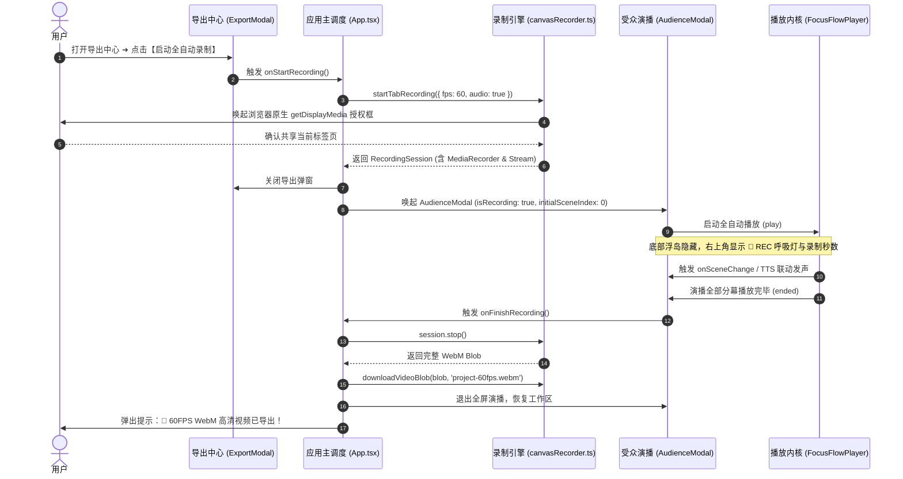

# FocusFlow 本地 60FPS WebM 高清视频录制技术方案与实施规划

> **文档版本**: 1.0.0  
> **更新时间**: 2026-09-07  
> **归档路径**: `docs/LOCAL_60FPS_WEBM_RECORDING_PLAN.md`  
> **所属模块**: `@focusflow/studio` (Stage 5 导出中心 & 受众全屏演播)  
> **运行环境**: Chromium (Chrome / Edge 107+), WebKit (Safari), 现代桌面浏览器

---

## 目录
1. [方案背景与设计目标](#1-方案背景与设计目标)
2. [用户关键交互与隐私说明](#2-用户关键交互与隐私说明)
3. [核心技术选型与合流机制](#3-核心技术选型与合流机制)
4. [系统架构与时序拓扑](#4-系统架构与时序拓扑)
5. [详细设计与模块改动](#5-详细设计与模块改动)
   - [5.1 核心录制服务层 (Core Video Recording Service)](#51-核心录制服务层-core-video-recording-service)
   - [5.2 受众全屏演播呈现层 (Audience & Recording HUD)](#52-受众全屏演播呈现层-audience--recording-hud)
   - [5.3 工作区调度与导出中心 (Studio Orchestration & Export)](#53-工作区调度与导出中心-studio-orchestration--export)
   - [5.4 国际化与双语词典扩展 (i18n)](#54-国际化与双语词典扩展-i18n)
6. [开发任务细分 Checklist](#6-开发任务细分-checklist)
   - [Phase 1: 底层捕获与录制服务改造 (canvasRecorder.ts)](#phase-1-底层捕获与录制服务改造-canvasrecorderts)
   - [Phase 2: 受众全屏演播模态框升级 (AudienceModal.tsx)](#phase-2-受众全屏演播模态框升级-audiencemodaltsx)
   - [Phase 3: 导出中心与应用主入口装配 (ExportModal.tsx & App.tsx)](#phase-3-导出中心与应用主入口装配-exportmodaltsx--apptsx)
   - [Phase 4: 国际化双语词条扩充 (zh/export.ts & en/export.ts)](#phase-4-国际化双语词条扩充-zhexportts--enexportts)
   - [Phase 5: 自动化回归测试与 Mock 构建 (TC574)](#phase-5-自动化回归测试与-mock-构建-tc574)
   - [Phase 6: 全量类型检查、编译与真机验证](#phase-6-全量类型检查编译与真机验证)
7. [验证计划与测试矩阵](#7-验证计划与测试矩阵)

---

## 1. 方案背景与设计目标

FocusFlow 的演播不仅支持在浏览器内实时交互查看，还承载着**高管汇报、对外技术分享与视频内容制作（B站/YouTube/技术博客）**的核心需求。
目前单文件 `.html` 与工程 `.zip` 归档已实现 100% 离线自治，但视频导出功能此前仅处于“UI 占位 + 骨架函数”阶段。

本方案旨在打通基于浏览器原生 `navigator.mediaDevices.getDisplayMedia` 标签页捕获与 `MediaRecorder` 硬件加速 VP9 编码器，实现：
- **纯客户端、0 后端依赖、100% 本地隐私安全**；
- **60FPS 硬件加速运镜、平滑流光动效与旁白台词音画无损合流**；
- **从点击【启动全自动录制】到【自动播放 ➔ 自动收尾 ➔ 本地下载 .webm】全流程无人值守一键出片**。

---

## 2. 用户关键交互与隐私说明

> [!IMPORTANT]
> **屏幕共享交互与隐私提示**：
> 1. **原生授权引导**：调用 `navigator.mediaDevices.getDisplayMedia` 时，浏览器将弹出系统原生的“选择要共享的标签页”弹窗。我们通过配置参数 `{ preferCurrentTab: true, selfBrowserSurface: 'include' }` 引导现代 Chromium 浏览器自动优先聚焦当前 FocusFlow 标签页，用户仅需点击一次“共享”确认即可。
> 2. **纯净演示环境**：录制启动瞬间，系统自动唤起 **受众全屏演示模式（AudienceModal）**：彻底隐藏所有编辑器面板、工具栏、时间轴与侧边属性栏，仅呈现纯粹的架构图视口与连贯运镜。
> 3. **轻量录制 HUD**：右上方提供半透明轻量 HUD（带红色呼吸灯 `🔴 REC 00:05 / 00:18`、分幕指示器与 `[提前结束并下载]` 快捷按钮）；底部控制浮岛在录制态默认自动隐去，确保画面零遮挡。
> 4. **自动定格与下载**：当演播到达最后一幕且驻留时长结束时，系统自动发送停止录制指令，将视频分片封装为标准 `Blob` 并自动唤起本地下载（`${工程标题}-60fps.webm`），随后无缝退出演播模式回到编辑区。

---

## 3. 核心技术选型与合流机制

- **画面采集**：采用 `navigator.mediaDevices.getDisplayMedia({ video: { displaySurface: 'browser', frameRate: { ideal: 60, max: 60 } }, audio: true, preferCurrentTab: true, selfBrowserSurface: 'include' } as any)` 捕获标签页画面。
- **音频合流**：优先通过 `getDisplayMedia` 捕获标签页音频轨；若工程配置了已生成的 TTS 合成音频或背景音轨，自动将音频与视频轨道合并输入 `MediaRecorder`，实现无延迟音画同步。
- **编码器与比特率**：首选 `video/webm;codecs=vp9`（高质量、8,000,000 bps 比特率），若当前浏览器不支持 VP9，则优雅回退至 `video/webm`。
- **防中断与异常兜底**：
  - 监听流中的 `videoTrack.onended` 事件（若用户点击浏览器原生悬浮条的“停止共享”，触发安全收尾并保存已录制内容，杜绝内存泄漏或数据丢失）；
  - 录制期间支持 `ESC` 或点击 `提前结束` 立即终止并导出。

---

## 4. 系统架构与时序拓扑



---

## 5. 详细设计与模块改动

### 5.1 核心录制服务层 (Core Video Recording Service)

#### [MODIFY] [canvasRecorder.ts](file:///Users/xt/WebstormProjects/focusflow/apps/studio/src/services/canvasRecorder.ts)
- 将原有空的 `startDomRecording` 重构升级为 `startTabRecording(options?: TabRecordingOptions): Promise<RecordingSession>`：
  - 内部调用 `getDisplayMedia` 取得当前标签页视轨与音轨；
  - 实例化 `MediaRecorder`，采集 `video/webm;codecs=vp9` 数据分片；
  - 启动秒级计时器，通过 `onTick(elapsedSeconds)` 驱动外部 HUD 更新；
  - 提供 `session.stop()`：关闭所有流音视频轨道，封装并返回完整 `Blob`；
  - 提供 `session.cancel()`：释放媒体流并丢弃未完成数据；
  - 保留并增强 `downloadVideoBlob(blob, filename)` 下载辅助函数。

---

### 5.2 受众全屏演播呈现层 (Audience & Recording HUD)

#### [MODIFY] [AudienceModal.tsx](file:///Users/xt/WebstormProjects/focusflow/apps/studio/src/components/modals/AudienceModal.tsx)
- Props 接口扩展：
  ```typescript
  export interface AudienceModalProps {
    isOpen: boolean;
    onClose: () => void;
    dsl: FocusFlowDSL;
    initialSceneIndex?: number;
    isRecording?: boolean;
    recordingElapsed?: number;
    onFinishRecording?: () => void;
  }
  ```
- 渲染逻辑适配：
  - 当 `isRecording === true` 时：
    - 底部悬浮控制条自动隐藏；
    - 右上方注入半透明极简录制条：包含红色呼吸圆点、`REC` 标记、录制计时器（`MM:SS`）与 `完成录制并保存` 按钮；
    - 播放内核监听 `ended` 事件后，自动触发 `onFinishRecording?.()`。

---

### 5.3 工作区调度与导出中心 (Studio Orchestration & Export)

#### [MODIFY] [ExportModal.tsx](file:///Users/xt/WebstormProjects/focusflow/apps/studio/src/components/modals/ExportModal.tsx)
- 将【客户端视频录制】Tab 内的【启动全自动录制】按钮与 `onStartRecording` 事件绑定；
- 增加用户友好提示说明（即将弹出浏览器标签页共享授权）。

#### [MODIFY] [App.tsx](file:///Users/xt/WebstormProjects/focusflow/apps/studio/src/App.tsx)
- 维护录制生命周期状态：
  ```typescript
  const [isRecordingVideo, setIsRecordingVideo] = useState(false);
  const [recordingElapsed, setRecordingElapsed] = useState(0);
  const recordingSessionRef = useRef<RecordingSession | null>(null);
  ```
- 实现 `handleStartVideoRecording`：
  1. 调用 `startTabRecording` 唤起权限；
  2. 若用户取消，温和提示并不抛出未捕获异常；
  3. 若授权成功，关闭 `ExportModal`，打开 `AudienceModal` 并置 `isRecordingVideo = true`；
  4. 演播结束后在 `handleFinishVideoRecording` 中调用 `session.stop()`，触发 `downloadVideoBlob`，重置状态。

---

### 5.4 国际化与双语词典扩展 (i18n)

#### [MODIFY] [zh/export.ts](file:///Users/xt/WebstormProjects/focusflow/apps/studio/src/locales/zh/export.ts) & [en/export.ts](file:///Users/xt/WebstormProjects/focusflow/apps/studio/src/locales/en/export.ts)
- 补充中英文词条：
  - `recordingInProgress`: '正在录制 60FPS 演播...' / 'Recording 60FPS Presentation...'
  - `finishAndSave`: '完成并保存视频' / 'Finish & Save Video'
  - `recordPermDenied`: '未授予标签页屏幕录制权限' / 'Screen capture permission was not granted'
  - `recordSuccess`: '🎉 60FPS WebM 高清视频已生成并开始下载！' / '🎉 60FPS WebM video generated and download started!'

---

## 6. 开发任务细分 Checklist

### Phase 1: 底层捕获与录制服务改造 (canvasRecorder.ts)
- [ ] 1.1 定义 `TabRecordingOptions`（含 `fps`, `audio`, `onTick`, `onStreamEnded`）与 `RecordingSession` 接口
- [ ] 1.2 重构 `startTabRecording`：封装 `navigator.mediaDevices.getDisplayMedia` 标签页捕获参数
- [ ] 1.3 配置 `MediaRecorder` 硬件加速参数（优先 `video/webm;codecs=vp9` 8Mbps，回退 `video/webm`）
- [ ] 1.4 实现流异常熔断保护（监听 `videoTrack.onended` 自动收尾，防止用户外部取消导致挂起）
- [ ] 1.5 完善分片收集机制与 `session.stop()` Promise 封装
- [ ] 1.6 增强 `downloadVideoBlob` 命名规则（去除特殊字符，拼接 `${title}-60fps.webm`）

### Phase 2: 受众全屏演播模态框升级 (AudienceModal.tsx)
- [ ] 2.1 扩展 `AudienceModalProps`（新增 `isRecording`, `recordingElapsed`, `onFinishRecording`）
- [ ] 2.2 录制模式视觉控制：录制进行时自动隐藏底部悬浮控制条
- [ ] 2.3 设计并嵌入右上角极简 HUD（红点呼吸灯、格式化时间戳 `00:00`、完成保存按钮）
- [ ] 2.4 挂载 Player `ended` 事件监听器：最后一幕播放完成时自动触发 `onFinishRecording`
- [ ] 2.5 键盘 `ESC` 与退出按钮防撕裂保护：退出时安全调用 `onFinishRecording` 保全已有录制切片

### Phase 3: 导出中心与应用主入口装配 (ExportModal.tsx & App.tsx)
- [ ] 3.1 检查并绑定 `ExportModal.tsx` 中【启动全自动录制】按钮触发 `onStartRecording`
- [ ] 3.2 在 `App.tsx` 中声明 `isRecordingVideo`、`recordingElapsed` 与 `recordingSessionRef`
- [ ] 3.3 实现 `handleStartVideoRecording`：异步请求录制、关闭导出弹窗、打开受众演播
- [ ] 3.4 实现 `handleFinishVideoRecording`：调用 `session.stop()`、触发本地下载、退出全屏恢复编辑区
- [ ] 3.5 完善异常捕获与友好 Toast/Alert 反馈

### Phase 4: 国际化双语词条扩充 (zh/export.ts & en/export.ts)
- [ ] 4.1 在 `apps/studio/src/locales/zh/export.ts` 中添加录制 HUD、授权与下载成功词条
- [ ] 4.2 在 `apps/studio/src/locales/en/export.ts` 中添加对应英文国际化翻译
- [ ] 4.3 校验全站多语言热重载与无缺失键警告

### Phase 5: 自动化回归测试与 Mock 构建 (TC574)
- [ ] 5.1 在 `apps/studio/e2e/` 中为 `stage5-audio-sync.spec.ts` 新增独立测试函数 `verifyLocalWebmVideoRecording`
- [ ] 5.2 在 Playwright 环境中提供合成 `getDisplayMedia` 模拟流或利用浏览器端录制触发机制
- [ ] 5.3 编写测试用例 `TC574: 验证导出中心唤起本地 60FPS WebM 高清录制与演播自动合流`
- [ ] 5.4 遵循全局规则：将 E2E 测试逻辑抽取为独立 `async` 函数并由 `it()` / `test()` 调用

### Phase 6: 全量类型检查、编译与真机验证
- [ ] 6.1 运行 TypeScript 严格类型检查 (`pnpm --filter @focusflow/studio build`)，确保 0 错误
- [ ] 6.2 运行 Playwright 自动化回归套件验证全流程通行
- [ ] 6.3 编写完成后的技术落地总结与更新记录

---

## 7. 验证计划与测试矩阵

### 自动化测试 (Automated Tests)
- **命令**: `pnpm --filter @focusflow/studio exec playwright test -g "TC574"`
- **验证项**:
  1. 导出中心 Tab 点击与启动录制按钮状态；
  2. 进入演播模态框后录制 HUD 正常挂载与呼吸灯激活；
  3. 演播自动推进且底部操作岛不出现；
  4. 录制结束时成功生成 Blob 并触发下载管道。

### 手动实机体验与画质验证 (Manual Verification)
1. 在 Chrome/Edge 浏览器打开 `http://localhost:5174/`；
2. 点击顶栏【导出】➔ 选择【客户端视频录制】➔ 点击【启动全自动录制】；
3. 系统弹出标签页共享提示，选择当前 FocusFlow Studio 标签页并点击“共享”；
4. 观察全屏演示模式自动从第 1 幕播放至最后一幕，右上角录制计时器均匀递增；
5. 自动下载生成的 `.webm` 视频文件，使用 VLC / QuickTime 打开，确认：
   - 画面帧率稳定 60FPS，无水印、无侧边栏干扰；
   - 运镜缩放平滑、流光连线清晰；
   - 语音旁白音频同步合入。

