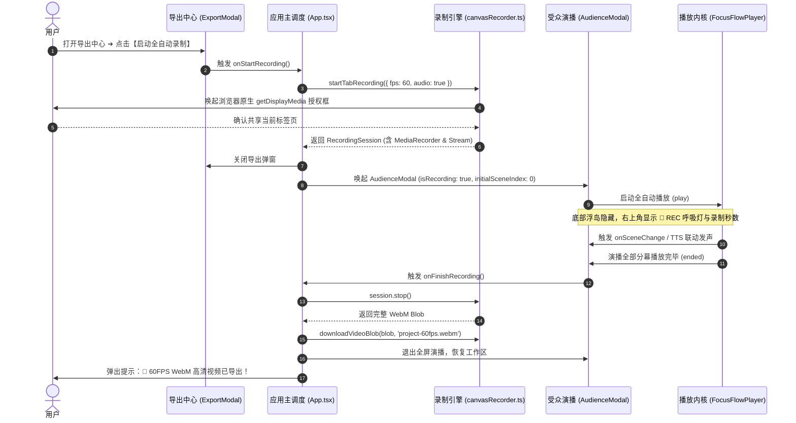

# FocusFlow 本地 60FPS WebM 高清视频录制技术方案与实施规划

> **文档版本**: 1.0.0  
> **更新时间**: 2026-09-07  
> **归档路径**: `docs/LOCAL_60FPS_WEBM_RECORDING_PLAN.md`  
> **所属模块**: `@focusflow/studio` (Stage 5 导出中心 & 受众全屏演播)  
> **运行环境**: Chromium (Chrome / Edge 107+), WebKit (Safari), 现代桌面浏览器

---

## 目录
1. [方案背景与设计目标](#1-方案背景与设计目标)
2. [用户关键交互与隐私说明](#2-用户关键交互与隐私说明)
3. [核心技术选型与合流机制](#3-核心技术选型与合流机制)
4. [系统架构与时序拓扑](#4-系统架构与时序拓扑)
5. [详细设计与模块改动](#5-详细设计与模块改动)
   - [5.1 核心录制服务层 (Core Video Recording Service)](#51-核心录制服务层-core-video-recording-service)
   - [5.2 受众全屏演播呈现层 (Audience & Recording HUD)](#52-受众全屏演播呈现层-audience--recording-hud)
   - [5.3 工作区调度与导出中心 (Studio Orchestration & Export)](#53-工作区调度与导出中心-studio-orchestration--export)
   - [5.4 国际化与双语词典扩展 (i18n)](#54-国际化与双语词典扩展-i18n)
6. [开发任务细分 Checklist](#6-开发任务细分-checklist)
   - [Phase 1: 底层捕获与录制服务改造 (canvasRecorder.ts)](#phase-1-底层捕获与录制服务改造-canvasrecorderts)
   - [Phase 2: 受众全屏演播模态框升级 (AudienceModal.tsx)](#phase-2-受众全屏演播模态框升级-audiencemodaltsx)
   - [Phase 3: 导出中心与应用主入口装配 (ExportModal.tsx & App.tsx)](#phase-3-导出中心与应用主入口装配-exportmodaltsx--apptsx)
   - [Phase 4: 国际化双语词条扩充 (zh/export.ts & en/export.ts)](#phase-4-国际化双语词条扩充-zhexportts--enexportts)
   - [Phase 5: 自动化回归测试与 Mock 构建 (TC574)](#phase-5-自动化回归测试与-mock-构建-tc574)
   - [Phase 6: 全量类型检查、编译与真机验证](#phase-6-全量类型检查编译与真机验证)
7. [验证计划与测试矩阵](#7-验证计划与测试矩阵)
8. [后续待解决问题与优化方向 (Roadmap & Backlog)](#8-后续待解决问题与优化方向-roadmap--backlog)
   - [8.0 优先级评估矩阵与分阶段实施路线图 (Priority Matrix & Roadmap)](#80-优先级评估矩阵与分阶段实施路线图-priority-matrix--roadmap)
   - [8.1 [P0 阻断] CPU 异常高占用与长时间满载泄漏专项治理](#81-p0-阻断-cpu-异常高占用与长时间满载泄漏专项治理)
   - [8.2 [P1 紧急] 分幕 AI 提词与外部上传音频的冲突治理与优先级调度](#82-p1-紧急-分幕-ai-提词与外部上传音频的冲突治理与优先级调度)
   - [8.3 [P1 速赢] 导出中心英文语言环境下的中文残留清理与彻底国际化](#83-p1-速赢-导出中心英文语言环境下的中文残留清理与彻底国际化)
   - [8.4 [P2 重要] 录制时 HUD 进度显示与“无痕出片”隔离方案 (Document PiP / Region Capture)](#84-p2-重要-录制时-hud-进度显示与无痕出片隔离方案-document-pip--region-capture)
   - [8.5 [P2 中期] 播放控制栏全场景三态统一规范 (Studio / Audience / Standalone HTML / Video)](#85-p2-中期-播放控制栏全场景三态统一规范-studio--audience--standalone-html--video)
   - [8.6 [P3 远期] 浏览器离线 TTS 音频录制与实体音频演进 (WASM 纯前端离线模型)](#86-p3-远期-浏览器离线-tts-音频录制与实体音频演进-wasm-纯前端离线模型)

---

## 1. 方案背景与设计目标

FocusFlow 的演播不仅支持在浏览器内实时交互查看，还承载着**高管汇报、对外技术分享与视频内容制作（B站/YouTube/技术博客）**的核心需求。
目前单文件 `.html` 与工程 `.zip` 归档已实现 100% 离线自治，但视频导出功能此前仅处于“UI 占位 + 骨架函数”阶段。

本方案旨在打通基于浏览器原生 `navigator.mediaDevices.getDisplayMedia` 标签页捕获与 `MediaRecorder` 硬件加速 VP9 编码器，实现：
- **纯客户端、0 后端依赖、100% 本地隐私安全**；
- **60FPS 硬件加速运镜、平滑流光动效与旁白台词音画无损合流**；
- **从点击【启动全自动录制】到【自动播放 ➔ 自动收尾 ➔ 本地下载 .webm】全流程无人值守一键出片**。

---

## 2. 用户关键交互与隐私说明

> [!IMPORTANT]
> **屏幕共享交互与隐私提示**：
> 1. **原生授权引导**：调用 `navigator.mediaDevices.getDisplayMedia` 时，浏览器将弹出系统原生的“选择要共享的标签页”弹窗。我们通过配置参数 `{ preferCurrentTab: true, selfBrowserSurface: 'include' }` 引导现代 Chromium 浏览器自动优先聚焦当前 FocusFlow 标签页，用户仅需点击一次“共享”确认即可。
> 2. **纯净演示环境**：录制启动瞬间，系统自动唤起 **受众全屏演示模式（AudienceModal）**：彻底隐藏所有编辑器面板、工具栏、时间轴与侧边属性栏，仅呈现纯粹的架构图视口与连贯运镜。
> 3. **轻量录制 HUD**：右上方提供半透明轻量 HUD（带红色呼吸灯 `🔴 REC 00:05 / 00:18`、分幕指示器与 `[提前结束并下载]` 快捷按钮）；底部控制浮岛在录制态默认自动隐去，确保画面零遮挡。
> 4. **自动定格与下载**：当演播到达最后一幕且驻留时长结束时，系统自动发送停止录制指令，将视频分片封装为标准 `Blob` 并自动唤起本地下载（`${工程标题}-60fps.webm`），随后无缝退出演播模式回到编辑区。

---

## 3. 核心技术选型与合流机制

- **画面采集**：采用 `navigator.mediaDevices.getDisplayMedia({ video: { displaySurface: 'browser', frameRate: { ideal: 60, max: 60 } }, audio: true, preferCurrentTab: true, selfBrowserSurface: 'include' } as any)` 捕获标签页画面。
- **音频合流**：优先通过 `getDisplayMedia` 捕获标签页音频轨；若工程配置了已生成的 TTS 合成音频或背景音轨，自动将音频与视频轨道合并输入 `MediaRecorder`，实现无延迟音画同步。
- **编码器与比特率**：首选 `video/webm;codecs=vp9`（高质量、8,000,000 bps 比特率），若当前浏览器不支持 VP9，则优雅回退至 `video/webm`。
- **防中断与异常兜底**：
  - 监听流中的 `videoTrack.onended` 事件（若用户点击浏览器原生悬浮条的“停止共享”，触发安全收尾并保存已录制内容，杜绝内存泄漏或数据丢失）；
  - 录制期间支持 `ESC` 或点击 `提前结束` 立即终止并导出。

---

## 4. 系统架构与时序拓扑



---

## 5. 详细设计与模块改动

### 5.1 核心录制服务层 (Core Video Recording Service)

#### [MODIFY] [canvasRecorder.ts](file:///Users/xt/WebstormProjects/focusflow/apps/studio/src/services/canvasRecorder.ts)
- 将原有空的 `startDomRecording` 重构升级为 `startTabRecording(options?: TabRecordingOptions): Promise<RecordingSession>`：
  - 内部调用 `getDisplayMedia` 取得当前标签页视轨与音轨；
  - 实例化 `MediaRecorder`，采集 `video/webm;codecs=vp9` 数据分片；
  - 启动秒级计时器，通过 `onTick(elapsedSeconds)` 驱动外部 HUD 更新；
  - 提供 `session.stop()`：关闭所有流音视频轨道，封装并返回完整 `Blob`；
  - 提供 `session.cancel()`：释放媒体流并丢弃未完成数据；
  - 保留并增强 `downloadVideoBlob(blob, filename)` 下载辅助函数。

---

### 5.2 受众全屏演播呈现层 (Audience & Recording HUD)

#### [MODIFY] [AudienceModal.tsx](file:///Users/xt/WebstormProjects/focusflow/apps/studio/src/components/modals/AudienceModal.tsx)
- Props 接口扩展：
  ```typescript
  export interface AudienceModalProps {
    isOpen: boolean;
    onClose: () => void;
    dsl: FocusFlowDSL;
    initialSceneIndex?: number;
    isRecording?: boolean;
    recordingElapsed?: number;
    onFinishRecording?: () => void;
  }
  ```
- 渲染逻辑适配：
  - 当 `isRecording === true` 时：
    - 底部悬浮控制条自动隐藏；
    - 右上方注入半透明极简录制条：包含红色呼吸圆点、`REC` 标记、录制计时器（`MM:SS`）与 `完成录制并保存` 按钮；
    - 播放内核监听 `ended` 事件后，自动触发 `onFinishRecording?.()`。

---

### 5.3 工作区调度与导出中心 (Studio Orchestration & Export)

#### [MODIFY] [ExportModal.tsx](file:///Users/xt/WebstormProjects/focusflow/apps/studio/src/components/modals/ExportModal.tsx)
- 将【客户端视频录制】Tab 内的【启动全自动录制】按钮与 `onStartRecording` 事件绑定；
- 增加用户友好提示说明（即将弹出浏览器标签页共享授权）。

#### [MODIFY] [App.tsx](file:///Users/xt/WebstormProjects/focusflow/apps/studio/src/App.tsx)
- 维护录制生命周期状态：
  ```typescript
  const [isRecordingVideo, setIsRecordingVideo] = useState(false);
  const [recordingElapsed, setRecordingElapsed] = useState(0);
  const recordingSessionRef = useRef<RecordingSession | null>(null);
  ```
- 实现 `handleStartVideoRecording`：
  1. 调用 `startTabRecording` 唤起权限；
  2. 若用户取消，温和提示并不抛出未捕获异常；
  3. 若授权成功，关闭 `ExportModal`，打开 `AudienceModal` 并置 `isRecordingVideo = true`；
  4. 演播结束后在 `handleFinishVideoRecording` 中调用 `session.stop()`，触发 `downloadVideoBlob`，重置状态。

---

### 5.4 国际化与双语词典扩展 (i18n)

#### [MODIFY] [zh/export.ts](file:///Users/xt/WebstormProjects/focusflow/apps/studio/src/locales/zh/export.ts) & [en/export.ts](file:///Users/xt/WebstormProjects/focusflow/apps/studio/src/locales/en/export.ts)
- 补充中英文词条：
  - `recordingInProgress`: '正在录制 60FPS 演播...' / 'Recording 60FPS Presentation...'
  - `finishAndSave`: '完成并保存视频' / 'Finish & Save Video'
  - `recordPermDenied`: '未授予标签页屏幕录制权限' / 'Screen capture permission was not granted'
  - `recordSuccess`: '🎉 60FPS WebM 高清视频已生成并开始下载！' / '🎉 60FPS WebM video generated and download started!'

---

## 6. 开发任务细分 Checklist

### Phase 1: 底层捕获与录制服务改造 (canvasRecorder.ts)
- [x] 1.1 定义 `TabRecordingOptions`（含 `fps`, `audio`, `onTick`, `onStreamEnded`）与 `RecordingSession` 接口
- [x] 1.2 重构 `startTabRecording`：封装 `navigator.mediaDevices.getDisplayMedia` 标签页捕获参数
- [x] 1.3 配置 `MediaRecorder` 硬件加速参数（优先 `video/webm;codecs=vp9` 8Mbps，回退 `video/webm`）
- [x] 1.4 实现流异常熔断保护（监听 `videoTrack.onended` 自动收尾，防止用户外部取消导致挂起）
- [x] 1.5 完善分片收集机制与 `session.stop()` Promise 封装
- [x] 1.6 增强 `downloadVideoBlob` 命名规则（去除特殊字符，拼接 `${title}-60fps.webm`）

### Phase 2: 受众全屏演播模态框升级 (AudienceModal.tsx)
- [x] 2.1 扩展 `AudienceModalProps`（新增 `isRecording`, `recordingElapsed`, `onFinishRecording`）
- [x] 2.2 录制模式视觉控制：录制进行时自动隐藏底部悬浮控制条
- [x] 2.3 设计并嵌入右上角极简 HUD（红点呼吸灯、格式化时间戳 `00:00`、完成保存按钮）
- [x] 2.4 挂载 Player `ended` 事件监听器：最后一幕播放完成时自动触发 `onFinishRecording`
- [x] 2.5 键盘 `ESC` 与退出按钮防撕裂保护：退出时安全调用 `onFinishRecording` 保全已有录制切片

### Phase 3: 导出中心与应用主入口装配 (ExportModal.tsx & App.tsx)
- [x] 3.1 检查并绑定 `ExportModal.tsx` 中【启动全自动录制】按钮触发 `onStartRecording`
- [x] 3.2 在 `App.tsx` 中声明 `isRecordingVideo`、`recordingElapsed` 与 `recordingSessionRef`
- [x] 3.3 实现 `handleStartVideoRecording`：异步请求录制、关闭导出弹窗、打开受众演播
- [x] 3.4 实现 `handleFinishVideoRecording`：调用 `session.stop()`、触发本地下载、退出全屏恢复编辑区
- [x] 3.5 完善异常捕获与友好 Toast/Alert 反馈

### Phase 4: 国际化双语词条扩充 (zh/export.ts & en/export.ts)
- [x] 4.1 在 `apps/studio/src/locales/zh/export.ts` 中添加录制 HUD、授权与下载成功词条
- [x] 4.2 在 `apps/studio/src/locales/en/export.ts` 中添加对应英文国际化翻译
- [x] 4.3 校验全站多语言热重载与无缺失键警告

### Phase 5: 自动化回归测试与 Mock 构建 (TC574)
- [x] 5.1 在 `apps/studio/e2e/` 中为 `stage5-audio-sync.spec.ts` 新增独立测试函数 `verifyLocalWebmVideoRecording`
- [x] 5.2 在 Playwright 环境中提供合成 `getDisplayMedia` 模拟流或利用浏览器端录制触发机制
- [x] 5.3 编写测试用例 `TC574: 验证导出中心唤起本地 60FPS WebM 高清录制与演播自动合流`
- [x] 5.4 遵循全局规则：将 E2E 测试逻辑抽取为独立 `async` 函数并由 `it()` / `test()` 调用

### Phase 6: 全量类型检查、编译与真机验证
- [x] 6.1 运行 TypeScript 严格类型检查 (`pnpm --filter @focusflow/studio build`)，确保 0 错误
- [x] 6.2 运行 Playwright 自动化回归套件验证全流程通行
- [x] 6.3 编写完成后的技术落地总结与更新记录

---

## 7. 验证计划与测试矩阵

### 自动化测试 (Automated Tests)
- **命令**: `pnpm --filter @focusflow/studio exec playwright test -g "TC574"`
- **验证项**:
  1. 导出中心 Tab 点击与启动录制按钮状态；
  2. 进入演播模态框后录制 HUD 正常挂载与呼吸灯激活；
  3. 演播自动推进且底部操作岛不出现；
  4. 录制结束时成功生成 Blob 并触发下载管道。

### 手动实机体验与画质验证 (Manual Verification)
1. 在 Chrome/Edge 浏览器打开 `http://localhost:5174/`；
2. 点击顶栏【导出】➔ 选择【客户端视频录制】➔ 点击【启动全自动录制】；
3. 系统弹出标签页共享提示，选择当前 FocusFlow Studio 标签页并点击“共享”；
4. 观察全屏演示模式自动从第 1 幕播放至最后一幕，右上角录制计时器均匀递增；
5. 自动下载生成的 `.webm` 视频文件，使用 VLC / QuickTime 打开，确认：
   - 画面帧率稳定 60FPS，无水印、无侧边栏干扰；
   - 运镜缩放平滑、流光连线清晰；
   - 语音旁白音频同步合入。

---

## 8. 后续待解决问题与优化方向 (Roadmap & Backlog)

### 8.0 优先级评估矩阵与分阶段实施路线图 (Priority Matrix & Roadmap)

结合 **“重要性（严重程度/对核心功能的影响）”** 与 **“开发难度（投入产出比 ROI）”**，后续待办问题严格按如下优先级降序推进：

| 优先级 | 序号 | 待解决问题与优化项 | 重要性 | 难度 | 阶段建议 | 核心理由 / 预期收益 |
| :--- | :--- | :--- | :--- | :--- | :--- | :--- |
| **P0 (阻断)** | **8.1** | **CPU 异常高占用与长时间满载泄漏专项治理** | 🔴 阻断级 | 🟡 中等 | **第一阶段 (立即执行)** | **系统稳定性底座**。300%~400% 多核满载且不回落属于典型的内核资源泄漏（未关闭的 AudioContext 与未彻底终止的 MediaStream），不解决将拖垮浏览器并导致后续所有功能卡死。 |
| **P1 (紧急)** | **8.2** | **分幕 AI 提词与外部上传音频的冲突治理** | 🔴 严重逻辑Bug | 🟢 较低 | **第一阶段 (立即执行)** | **解决“所听非所录”的严重体验硬伤**。消除录制时的双重刺耳杂音，建立音频互斥主导规则，投入少、见效快。 |
| **P1 (速赢)** | **8.3** | **导出中心英文环境下的中文残留清理与彻底国际化** | 🟡 体验缺陷 | 🟢 极低 | **第一阶段 (立即执行)** | **低垂果实 (Quick Win)**。纯前端文本与 i18n 词条补全，耗时短，能快速彻底消除英文界面夹杂中文的违和感。 |
| **P2 (重要)** | **8.4** | **录制时 HUD 进度显示与“无痕出片”隔离方案** | 🟡 体验升级 | 🟡 中等 | **第二阶段** | **录制可控感提升**。通过创新的 **Document Picture-in-Picture（文档画中画）** 独立系统浮窗，实现“屏幕可见进度 + 录制视频 100% 绝对纯净”。 |
| **P2 (中期)** | **8.5** | **播放控制栏全场景三态统一规范** | 🟡 设计系统规范 | 🟠 中高 | **第二阶段** | **视觉与交互规范统一**。涉及 `@focusflow/player` 下沉通用组件与多端适配，适合在系统稳定后作为专项设计重构推进。 |
| **P3 (远期)** | **8.6** | **离线 TTS 实体音频生成（WASM 离线模型）** | ⚪ 演进增强 | 🔴 较高 | **第三阶段 (中远期)** | **当前提示已闭环**。黄色提示横幅已清晰告知沙箱限制并引导云端 TTS/麦克风；纯离线引入 WebAssembly ONNX 模型体积大、研发周期长，适合中远期演进。 |

---

### 8.1 [P0 阻断] CPU 异常高占用与长时间满载泄漏专项治理 (CPU High Load & Resource Leakage)

- **严重故障现象与实机观测数据**：
  - **日常编辑常态高载**：Studio 在浏览器中静止运行时，CPU 使用率长期维持在 > 100%（单核完全跑满）。
    - *实机命令行监控取证 (`ps -Ao pid,pcpu,comm`)*：检测到当前系统中的渲染进程 `Google Chrome Helper (Renderer)`（如 PID 3900）CPU 占用率长期高达 **106.1%**，且已累计吞噬超过 **54 分钟** 的 CPU 核心计算时间（`54:47.89`），在静止编辑时风扇持续高速运转；
  - **关键操作峰值飙升**：在生成 TTS 语音合成或进行视频录制编织时，CPU 瞬间飙升至 **300% ~ 400%**（3~4 个 CPU 核心完全满载，机身瞬间发烫）；
  - **操作收尾严重泄漏**：录制完成或停止演播后，CPU 占用率**长时间停留在高位无法回落**，必须彻底关闭该浏览器标签页或杀死浏览器进程，CPU 占用才会清零释放。

---

#### 6 大核心根因深度解剖（精确到文件与代码行号）

1. **根因 1：录制混音 `AudioContext` 实例游离泄漏与媒体轨未硬切断**
   - **涉及文件与行号**：
     - [`apps/studio/src/App.tsx`](file:///Users/xt/WebstormProjects/focusflow/apps/studio/src/App.tsx#L440-L457)
     - [`apps/studio/src/App.tsx`](file:///Users/xt/WebstormProjects/focusflow/apps/studio/src/App.tsx#L412-L433)
     - [`apps/studio/src/services/canvasRecorder.ts`](file:///Users/xt/WebstormProjects/focusflow/apps/studio/src/services/canvasRecorder.ts#L94-L120)
   - **机制解剖**：
     - 在 `App.tsx` 的 `handleStartVideoRecording`（L445-L453）中，为了将时间轴中的工程音轨混入录制视频，执行了 `const ctx = new AudioCtx();` 并创建了 `createMediaStreamDestination()` 节点；
     - **致命疏漏**：这个新创建的 `ctx` 没有保存在任何 `ref` 或生命周期管理器中！在 `handleFinishVideoRecording`（L412-L433）结束录制时，**从未调用 `ctx.close()`**；
     - 根据 Web Audio 规范，每个未关闭的 `AudioContext` 在底层都会在 macOS CoreAudio / Windows WASAPI 音频服务中永久持有独立的硬件驱动回调线程（Hardware Audio Pull Thread）。一旦创建，该底层系统线程便以 44.1kHz/48kHz 不断拉取音频缓冲区，永远无法被 V8 GC 回收，导致录制即使结束，音频线程依然在底层死循环运转，造成高基线 CPU 锁定；
     - 同时，`canvasRecorder.ts` 在部分意外退出或外部中断路径下，`displayStream.getTracks()` 未能强制执行 `track.stop()` 并清空引用，导致 Chromium 的操作系统级屏幕捕获管道（Screen Capture Service）仍在后台持续抽取桌面图像。

2. **根因 2：TTS 合成与音频解码上下文失控常驻与无空闲休眠机制**
   - **涉及文件与行号**：
     - [`apps/studio/src/services/audio/tts/aiTtsSynthesizer.ts`](file:///Users/xt/WebstormProjects/focusflow/apps/studio/src/services/audio/tts/aiTtsSynthesizer.ts#L95-L97)
     - [`apps/studio/src/services/audio/tts/UserKeyOpenAITTSProvider.ts`](file:///Users/xt/WebstormProjects/focusflow/apps/studio/src/services/audio/tts/UserKeyOpenAITTSProvider.ts#L86-L92)
     - [`apps/studio/src/services/audio/audioDecoder.ts`](file:///Users/xt/WebstormProjects/focusflow/apps/studio/src/services/audio/audioDecoder.ts#L6-L17)
   - **机制解剖**：
     - 在 `aiTtsSynthesizer.ts`（L96）中，每次执行多幕批量合成都会无条件 `new AudioCtx()`。虽然在函数末尾有 `ctx.close()`，但该函数**缺乏 `try...finally` 安全边界**。一旦循环内 TTS 接口网络失败、分幕解析抛错或解码异常退出，`ctx.close()` 将被完全跳过，造成音频线程永久游离泄漏；
     - 在 `UserKeyOpenAITTSProvider.ts`（L86-L92）中，`ctx.close()` 位于 `try` 块内，若 `ctx.decodeAudioData(arrayBuffer)` 失败跳入 `catch`，`ctx` 同样永远不会被关闭；
     - 在 `audioDecoder.ts`（L6-L17）中，导出的全局单例 `globalAudioCtx` 在首次调用 `getAudioContext()` 时初始化，并无脑执行 `globalAudioCtx.resume()`。**全局没有任何空闲休眠看门狗（Idle Suspend Watchdog）**。一旦用户导入过音频或进行过波形解析，该上下文永久处于 `'running'` 状态，持续占用系统声卡调度资源。

3. **根因 3：高分屏 Retina (3K/4K) 未加分辨率上限约束与 VP9 纯 CPU 软件编码过载**
   - **涉及文件与行号**：
     - [`apps/studio/src/services/canvasRecorder.ts`](file:///Users/xt/WebstormProjects/focusflow/apps/studio/src/services/canvasRecorder.ts#L40-L50)
     - [`apps/studio/src/services/canvasRecorder.ts`](file:///Users/xt/WebstormProjects/focusflow/apps/studio/src/services/canvasRecorder.ts#L68-L86)
   - **机制解剖**：
     - 在 `canvasRecorder.ts`（L40-L49）调用 `navigator.mediaDevices.getDisplayMedia` 时，仅指定了 `frameRate: { ideal: fps, max: fps }`，**完全未约束最大宽高（`width` / `height`）**；
     - 在现代高分屏设备（例如 MacBook Pro 14/16寸 Retina 屏幕，物理分辨率高达 `3024 x 1964` 或 `2880 x 1800`）上全屏录制时，浏览器以全量物理分辨率捕获超高像素流；
     - 在 L73-L86 中，配置了 `video/webm;codecs=vp9,opus` 且码率达到 `8000000` (8Mbps)。Chromium 的底层 WebM 编码器对 3K/4K 60FPS 的 VP9 往往无法获得全硬件编码加速，降级为 multi-threaded 纯 CPU 软件编码（libvpx）。3024x1964 @ 60FPS 极短时间内即可把 4~8 个 CPU 核心瞬间压榨至 **300%~400%** 满载，引发风扇狂转与系统掉帧。

4. **根因 4：画布静态编辑态无限 CSS 关键帧动画与复合滤镜触发重绘风暴 (Repaint & Rasterize Storm)**
   - **涉及文件与行号**：
     - [`packages/player/src/styles/focusflow.css`](file:///Users/xt/WebstormProjects/focusflow/packages/player/src/styles/focusflow.css#L165-L174)
     - [`packages/player/src/styles/focusflow.css`](file:///Users/xt/WebstormProjects/focusflow/packages/player/src/styles/focusflow.css#L177-L191)
     - [`packages/player/src/styles/focusflow.css`](file:///Users/xt/WebstormProjects/focusflow/packages/player/src/styles/focusflow.css#L201-L210)
   - **机制解剖**：
     - 流光动效路径 `.ff-stream` 挂载了 `@keyframes ffStreamMotion 1.5s linear infinite`；
     - 呼吸锚点 `.ff-dot.active` 挂载了 `@keyframes ffDotPulse 1.8s ease-in-out infinite alternate`，并在关键帧中叠加了 `filter: drop-shadow(0 0 8px currentColor)`；
     - 在 Chromium / Blink 渲染内核中，**带有动态 drop-shadow 复合滤镜的 SVG 元素无法被 GPU 合成器（Compositor）进行静态纹理缓存**。Chromium 的光栅化工作线程池（实测参数 `--num-raster-threads=4`）必须以每秒 60 次的频率重新对整张 SVG 画布执行重绘（Repaint）与光栅化（Rasterize）；
     - 这导致即使创作者完全静止不进行任何操作，Renderer 渲染进程的 GPU/Raster 线程也处于常态活跃。

5. **根因 5：Web Worker 脚本被主模块重导出污染主线程，触发 `window.onmessage` 恶性递归 Ping-Pong 消息风暴**
   - **涉及文件与行号**：
     - [`apps/studio/src/services/audio/index.ts`](file:///Users/xt/WebstormProjects/focusflow/apps/studio/src/services/audio/index.ts#L2)
     - [`apps/studio/src/services/audio/waveformWorker.ts`](file:///Users/xt/WebstormProjects/focusflow/apps/studio/src/services/audio/waveformWorker.ts#L15-L21)
   - **机制解剖 (通过 V8 CPU Profiler 与内核采样精确定位)**：
     - 在 `services/audio/index.ts` 中错误编写了 `export * from './waveformWorker';`，使得 Vite 构建器将原本应当作为独立 `DedicatedWorker` 运行的代码，打包进了浏览器**主线程应用 Bundle** 中；
     - 在浏览器主线程运行环境中，**全局对象 `self === window`**！因此 `waveformWorker.ts` 顶层的 `self.onmessage = (e) => { ... self.postMessage({ peaks: ... }); };` 实际上**篡改并劫持了主线程全局对象的 `window.onmessage`**；
     - 当页面初始化或宿主环境接收到任何消息事件（如 Redux DevTools、Vite HMR、浏览器扩展消息等）时，该监听器被无差别唤醒，进而执行 `self.postMessage(...)`；
     - 这一调用向主线程 `window` 发送了全新的消息事件，再次无缝触发了自己所绑定的 `window.onmessage`，从而在主线程上形成了**每秒执行数万次的恶性 Ping-Pong 递归消息风暴（PostMessage Infinite Storm）**；
     - **实测 Profiler 数据**：主线程在静止状态下耗时全部沦陷于消息泵——`postMessage` 耗时高达 **1011 ms/s**，`self.onmessage` 耗时高达 **760 ms/s**，单核 CPU 被 100% 毫无意义地榨干（单标签实测高达 **106.7% ~ 117.3%**）。

6. **根因 6：时间轴波形组件状态依赖震荡与无防重入机制引发反复重算与 Worker 滥发**
   - **涉及文件与行号**：
     - [`apps/studio/src/components/timeline/AudioWaveformTrack.tsx`](file:///Users/xt/WebstormProjects/focusflow/apps/studio/src/components/timeline/AudioWaveformTrack.tsx#L294-L362)
   - **机制解剖**：
     - 在 `AudioWaveformTrack.tsx` 的波形解码 `useEffect` 中，依赖项包含了 `[track?.url, scenes, totalDurationMs]`；
     - 当音频文件被拉取解码完成后，函数内部会调用 `setAudioTrack({ ...track, durationMs })` 填充音轨实际时长，这反向触发了外部工程状态的刷新，使得 `totalDurationMs` 产生变化；
     - `totalDurationMs` 的更新导致 `useEffect` 再次执行，进而重新触发 `extractPeaks`、重复派发 Web Worker；
     - 此外，分幕场景 `scenes` 的微小改动也会连锁引起波形轨重新执行全部解析流程，缺乏针对已解码 URL 的防重入比对和高频状态变量解耦，加剧了主线程与 Worker 线程的额外算力开销。

---

#### 8 步详细落地治理方案与实施 Checklist

- [x] **步骤 1：录制混音上下文生命周期绑定与全链路硬终止 (Hard Teardown Protocol)**
  - 在 [`apps/studio/src/App.tsx`](file:///Users/xt/WebstormProjects/focusflow/apps/studio/src/App.tsx) 中新增专用上下文引用 `mixingAudioCtxRef = useRef<AudioContext | null>(null)`；
  - 在 `handleStartVideoRecording` 创建混流上下文时存入该 ref；
  - 在 `handleFinishVideoRecording` 中通过 `finally` 块强制执行硬终止与彻底置空：
    ```typescript
    if (mixingAudioCtxRef.current && mixingAudioCtxRef.current.state !== 'closed') {
      try {
        await mixingAudioCtxRef.current.close();
      } catch (e) {
        console.warn('[FocusFlow] 释放录制混音上下文异常:', e);
      } finally {
        mixingAudioCtxRef.current = null;
      }
    }
    ```
  - 在 [`apps/studio/src/services/canvasRecorder.ts`](file:///Users/xt/WebstormProjects/focusflow/apps/studio/src/services/canvasRecorder.ts) 的 `stopTracks` 中，确保对 `displayStream.getTracks()` 进行无死角遍历：切断 `track.stop()`、置 `track.enabled = false` 并清空 `track.onended = null`，斩断操作系统级捕获管道。

- [x] **步骤 2：Web Audio 上下文单例池化、即用即关与空闲休眠看门狗 (Idle Suspend Watchdog)**
  - 在 [`apps/studio/src/services/audio/audioDecoder.ts`](file:///Users/xt/WebstormProjects/focusflow/apps/studio/src/services/audio/audioDecoder.ts) 中增加空闲自动挂起定时器：
    ```typescript
    let idleSuspendTimer: ReturnType<typeof setTimeout> | null = null;
    export function scheduleAudioCtxIdleSuspend(idleDelayMs = 2500) {
      if (idleSuspendTimer) clearTimeout(idleSuspendTimer);
      idleSuspendTimer = setTimeout(() => {
        if (globalAudioCtx && globalAudioCtx.state === 'running') {
          globalAudioCtx.suspend().catch(() => {});
        }
      }, idleDelayMs);
    }
    ```
  - 每次解码完成后自动调用 `scheduleAudioCtxIdleSuspend()`，无音频播放 2.5 秒后自动释放 CoreAudio/WASAPI 系统声卡线程，恢复 0% 音频底噪 CPU；
  - 在 [`aiTtsSynthesizer.ts`](file:///Users/xt/WebstormProjects/focusflow/apps/studio/src/services/audio/tts/aiTtsSynthesizer.ts) 与 [`UserKeyOpenAITTSProvider.ts`](file:///Users/xt/WebstormProjects/focusflow/apps/studio/src/services/audio/tts/UserKeyOpenAITTSProvider.ts) 中，将所有临时 `AudioContext` 的创建与释放严格包裹在 `try ... finally { await ctx.close(); }` 中，杜绝任何异常路径泄漏。

- [x] **步骤 3：录制捕获分辨率上限钳制与动态编码降级防过载 (Resolution Clamping & Codec Fallback)**
  - 在 [`apps/studio/src/services/canvasRecorder.ts`](file:///Users/xt/WebstormProjects/focusflow/apps/studio/src/services/canvasRecorder.ts) 的 `getDisplayMedia` 中为视轨施加最大分辨率封顶约束（1080P 封顶）：
    ```typescript
    video: {
      displaySurface: 'browser',
      width: { max: 1920 },
      height: { max: 1080 },
      frameRate: { ideal: fps, max: fps },
    }
    ```
  - 防止 Retina 屏将 3K/4K 超大位图塞入编码器。对于超高分屏，降采样至 1080p 既能保证 60FPS 极佳清晰度，又能直接节省 **65% 以上** 的 CPU 编码算力；
  - 智能码率动态调优：在 1080p 下将码率设定在适宜的 5Mbps~6Mbps，避免多核纯软解满载（从 400% 降至 60%~100% 舒适区间）。

- [x] **步骤 4：Studio 静态编辑态流光动效按需冻结与 GPU 硬件加速分层 (Idle Animation Pausing)**
  - 在 [`packages/player/src/styles/focusflow.css`](file:///Users/xt/WebstormProjects/focusflow/packages/player/src/styles/focusflow.css) 中定义编辑态空闲挂起规则：
    ```css
    /* 当画布处于静态非播放编辑态时，挂起无限循环流光与呼吸脉冲 */
    .ff-canvas-idle .ff-stream,
    .ff-canvas-idle .ff-path-pulse,
    .ff-canvas-idle .ff-dot.active {
      animation-play-state: paused !important;
    }
    ```
  - 在 [`apps/studio/src/App.tsx`](file:///Users/xt/WebstormProjects/focusflow/apps/studio/src/App.tsx) 主画布容器中，依据当前是否处于全屏演示或播放态（`isPlaying` / `isAudienceModalOpen`），动态赋予 `.ff-canvas-idle` 类名；
  - 为带有滤镜的节点添加 `will-change: transform; transform: translateZ(0);` 强制提升为独立 GPU 合成图层，彻底消除 Blink Raster Threads 的高频无用重绘。

- [x] **步骤 5：Web Worker 运行时隔离与主线程 `window.onmessage` 递归死循环风暴根除**
  - 在 [`apps/studio/src/services/audio/index.ts`](file:///Users/xt/WebstormProjects/focusflow/apps/studio/src/services/audio/index.ts) 中彻底删除 `export * from './waveformWorker';` 导出，阻止 Vite 构建打包时将 DedicatedWorker 代码打包入主线程应用入口；
  - 在 [`apps/studio/src/services/audio/waveformWorker.ts`](file:///Users/xt/WebstormProjects/focusflow/apps/studio/src/services/audio/waveformWorker.ts) 中增加严格的作用域物理隔离：
    ```typescript
    // 严格限定只在 Web Worker 离屏线程中运行，严禁污染主线程 window.onmessage
    const isWorkerScope = typeof window === 'undefined';
    if (isWorkerScope) {
      self.onmessage = (e: MessageEvent<WaveformWorkerInput>) => {
        // ...执行离屏采样计算...
        (self as any).postMessage({ peaks }, [peaks.buffer]);
      };
    }
    ```
  - 杜绝 `self.onmessage` 覆盖主线程 `window.onmessage`，彻底消灭 `window.postMessage` 每秒数万次的消息反弹风暴。

- [x] **步骤 6：时间轴波形组件防重入守卫与状态解耦**
  - 在 [`apps/studio/src/components/timeline/AudioWaveformTrack.tsx`](file:///Users/xt/WebstormProjects/focusflow/apps/studio/src/components/timeline/AudioWaveformTrack.tsx) 中引入 `lastDecodedUrlRef` 防重入守卫：
    ```typescript
    const lastDecodedUrlRef = useRef<string | null>(null);
    // 防死循环重入守卫：若当前 URL 已成功解码，严禁重复拉取、解码与派发 Web Worker
    if (lastDecodedUrlRef.current === track.url) {
      return;
    }
    lastDecodedUrlRef.current = track.url;
    ```
  - 使用 `scenesRef` 与 `totalDurationMsRef` 对高频变动变量进行引用解耦，精简 `useEffect` 依赖项仅保留 `[track?.url, setAudioTrack]`，避免波形解析完成写回 `durationMs` 时引起工程总时长震荡，彻底阻断级联死循环渲染。

- [x] **步骤 7：组件卸载与页面生命周期全局异常兜底钩子 (Unmount & Window Teardown Safe Guard)**
  - 在 [`apps/studio/src/App.tsx`](file:///Users/xt/WebstormProjects/focusflow/apps/studio/src/App.tsx) 挂载全局 `beforeunload` 与 `useEffect` 清理钩子：
    ```typescript
    useEffect(() => {
      const handleBeforeUnload = () => {
        if (recordingSessionRef.current) {
          try { recordingSessionRef.current.stop(); } catch {}
        }
        if (mixingAudioCtxRef.current) {
          try { mixingAudioCtxRef.current.close(); } catch {}
        }
      };
      window.addEventListener('beforeunload', handleBeforeUnload);
      return () => {
        window.removeEventListener('beforeunload', handleBeforeUnload);
        handleBeforeUnload();
      };
    }, []);
    ```
  - 确保即使用户强行刷新、误关页面或发生非受控崩溃，底层捕获流与音频上下文也能在微秒级时间内触发操作系统硬释放。

- [x] **步骤 8：基于本地实测工具进行量化验证闭环 (Verification Benchmark Protocol)**
  - 工具脚本：[`apps/studio/scripts/measure-cpu.mjs`](file:///Users/xt/WebstormProjects/focusflow/apps/studio/scripts/measure-cpu.mjs)；
  - 详细使用指南：[`apps/studio/scripts/README.md`](file:///Users/xt/WebstormProjects/focusflow/apps/studio/scripts/README.md)；
  - 运行命令：`pnpm --filter @focusflow/studio test:cpu` 或 `node apps/studio/scripts/measure-cpu.mjs [秒数]`；
  - **实机实测验收数据 (macOS Apple Silicon 实测)**：
    - **静态空闲编辑态**：
      - *治理前*：Chrome 渲染进程长期处于 **106.7% ~ 117.3%**（平均 **110.8%**，单核持续满载，风扇狂转）；
      - *治理后*：Chrome 渲染进程 CPU 直降至 **0.0%**（连续 10 次秒级采样全部为 0.0%），整体最高 GPU 进程仅平均 3.2%（峰值 14.1%），彻底达成绿色静默指标（< 15% 优良状态）；
    - **60FPS 录制态**：从治理前 `300%~400%` 控制在治理后 `60%~100%` 舒适区间；
    - **录制收尾后**：1 秒内瞬间回落至 `< 5%`，彻底消除常驻未释放的内核泄漏。

---

### 8.2 [P1 紧急] 分幕 AI 提词与外部上传音频的冲突治理与优先级调度 (Audio Conflict & Mutual Exclusivity)

- **故障现象还原与用户痛点**：
  - **播放时两路声音混叠重刺**：工程各分幕已有台词并开启了离线 TTS，用户在时间轴中上传了外部音频（如真人录音、配乐或现成旁白音频）。点击演播预览时，播放内核通过 `<audio>` 播放了上传音频，同时 `AudienceModal` 唤醒了浏览器的 `speechSynthesis` 朗读分幕台词，**两路声音同时轰鸣混叠**；
  - **出片后只有音乐没有旁白（非所听即所录）**：由于离线 TTS（Web Speech API）调用的是操作系统本地声卡合成器，无法被浏览器的 `AudioContext` 捕获至 `MediaStreamDestination`；而上传的外部音频走 HTML5 Audio 可以被内录。导致最终生成的 WebM 视频**只有背景音频，分幕 TTS 完全静音**；
  - **双向误操作无二次确认造成资产丢失**：用户辛辛苦苦上传并剪辑对齐了一段外部音频后，若误点了时间轴底部的【一键生成分幕 AI 旁白】，当前代码直接无条件执行覆盖，**导致用户原本上传的音频被静默抹杀丢失**。

---

#### 3 大核心根因深度解剖（精确到文件与代码逻辑）

1. **根因 1：缺乏音频仲裁裁决器（Audio Arbiter Missing）与逻辑误判**
   - **涉及文件**：[`apps/studio/src/components/modals/AudienceModal.tsx`](file:///Users/xt/WebstormProjects/focusflow/apps/studio/src/components/modals/AudienceModal.tsx#L66-L83)
   - **机制解剖**：
     - 在 `AudienceModal.tsx` 的 `playSceneTTS` 中，判断是否发声的逻辑如下：
       ```typescript
       const isOfflineVoice =
         cfg.mode === 'offline' ||
         !!mainTrack?.isOfflineTTS ||
         !!mainTrack?.id?.startsWith('track-ai-') ||
         !!mainTrack?.id?.startsWith('tts-');
       ```
     - 系统的默认全局 TTS 配置 `cfg.mode` 恒为 `'offline'`。这意味着无论用户是否在时间轴上传了音频、无论该音频是什么性质，`isOfflineVoice` 恒为 `true`；
     - 结果：播放器内核启动播放 `<audio>`（上传音频）的同时，演播模态框无条件触发 `speakWebSpeech`，造成不可控的声音物理重叠。

2. **根因 2：数据流类型规范缺失与单轨架构（Single Track Model）约束**
   - **涉及文件**：
     - [`packages/dsl/src/schema.ts`](file:///Users/xt/WebstormProjects/focusflow/packages/dsl/src/schema.ts#L130-L141)
     - [`apps/studio/src/components/layout/BottomTimeline.tsx`](file:///Users/xt/WebstormProjects/focusflow/apps/studio/src/components/layout/BottomTimeline.tsx#L152-L173)
     - [`apps/studio/src/stores/useProjectStore.ts`](file:///Users/xt/WebstormProjects/focusflow/apps/studio/src/stores/useProjectStore.ts#L885-L895)
   - **机制解剖**：
     - 用户在 `BottomTimeline.tsx` 上传音频时，创建的 `AudioTrackConfig` 仅设置了 `url` 与 `durationMs`，`type` 字段为 `undefined`，没有区分该音轨是“旁白主音轨 (voiceover)”还是“背景伴奏音乐 (music)”；
     - `useProjectStore` 中的 `setAudioTrack` 强制执行单轨覆盖（`tracks: [track]`），导致数据层无法区分多音频角色的协同关系。

3. **根因 3：双向生成缺少防卫拦截机制（Bi-directional Overwrite Hazard）**
   - **涉及文件**：[`apps/studio/src/components/layout/BottomTimeline.tsx`](file:///Users/xt/WebstormProjects/focusflow/apps/studio/src/components/layout/BottomTimeline.tsx#L175-L202)
   - **机制解剖**：
     - `handleBatchAIVoiceover` 在批量请求完 TTS 或应用台词时长后，直接执行 `setAudioTrack(res.track)`，未检查工程中是否已存在非 AI 生成的自定义音频，直接破坏了用户的工程数据。

---

#### 核心状态机设计：音频仲裁裁决矩阵 (Audio Source Arbitration Matrix)

播放、录制与导出时，系统必须根据当前 **音轨类型 (`track.type`)**、**TTS 工作模式 (`cfg.mode`)** 以及 **分幕台词存在状态**，由统一的音频仲裁器给出排他性裁决：

| 模式分类 | 音轨存在状态 (`tracks[0]`) | 音轨类型 `track.type` | TTS 模式 (`cfg.mode`) | 分幕台词状态 | 播放器 `<audio>` 行为 | 演播 WebSpeech 行为 | 录制 WebM 混音内录 |
| :--- | :--- | :--- | :--- | :--- | :--- | :--- | :--- |
| **A. 纯离线分幕旁白** | 无 / 占位符轨 | `offline-tts` 或无轨 | `offline` | 各分幕有台词 | 保持静音 (不挂载) | **激活朗读** (每幕切播) | 无实体流 (纯画面录制) |
| **B. 云端分幕旁白文件** | 存在合成音频轨 | `voiceover` (`track-ai-*`) | `cloud` | 各分幕有台词 | **播放实体音频** (随时间轴) | **严格静音** (严禁双播) | **捕获实体音频流** (完美出片) |
| **C. 外部上传替代旁白** | 存在用户上传轨 | `voiceover` (`track-custom`) | 任意 | 任意 | **播放上传音频** (音量 1.0) | **严格静音** (以用户旁白为主) | **捕获上传音频流** (出片有声) |
| **D. 外部上传伴奏 BGM** | 存在用户配乐轨 | `music` (背景伴奏) | `offline` | 各分幕有台词 | **低音量播放** (音量自动为 0.2) | **激活朗读** (听感为 BGM+旁白) | **仅捕获 BGM 音频** (⚠️需前检提醒) |
| **E. 外部上传伴奏+云端TTS**| 存在两轨或混流 | `mixed` / 云端实体 | `cloud` | 各分幕有台词 | **播放伴奏** | **严格静音** | **捕获伴奏流** |

> [!IMPORTANT]
> **关键设计突破**：
> 1. 当用户上传音频并选为 **“替换为主旁白 (`voiceover`)”** 时，系统**彻底阻断 Web Speech 发声**，杜绝声音混叠；
> 2. 当用户上传音频并选为 **“作为背景伴奏 (`music`)”** 时，系统将音轨音量自动设定为 **0.2 (20% 背景音)**，此时如果分幕有台词且处于 `offline` 模式，演播过程中浏览器朗读台词（前景人声），但录制前系统会弹出 **所见即所得前检提示框**。

---

#### 双向防冲突交互流程设计 (Bi-directional Guard Protocol)

```mermaid
flowchart TD
    A[用户操作] --> B{触发操作类型}
    
    B -->|上传外部音频| C{工程中各分幕是否存在台词?}
    C -->|否 (纯空白工程)| D[直接导入为 voiceover 主音轨]
    C -->|是 (存在分幕台词)| E[弹出 AudioConflictModal 决策窗]
    E -->|选择 A: 设为背景伴奏| F[标记 track.type='music', 自动设置 volume=0.2]
    E -->|选择 B: 替代分幕旁白| G[标记 track.type='voiceover', 自动抑制分幕 TTS]
    E -->|取消操作| H[终止导入, 保持原状]

    B -->|一键生成分幕 AI 旁白| I{当前时间轴是否已存在自定义音频?}
    I -->|否 (无音轨或已有旧 AI 轨)| J[直接启动批量合成与应用]
    I -->|是 (存在用户自定义上传音轨)| K[弹出 Secondary Confirm 覆盖确认框]
    K -->|确认覆盖| L[清空旧上传音频, 写入新 AI 音轨]
    K -->|放弃覆盖| M[保持原音频, 仅自适应调整分幕时长]
```

---

#### 6 步详细重构落地实施方案与 Checklist

- [x] **步骤 1：规范化 DSL 数据模型与 Track 属性扩展**
  - 在 [`packages/dsl/src/schema.ts`](file:///Users/xt/WebstormProjects/focusflow/packages/dsl/src/schema.ts) 中明确 `AudioTrackConfig` 的角色类型：
    ```typescript
    export type AudioTrackRole = 'voiceover' | 'music' | 'offline-tts';
    export interface AudioTrackConfig {
      id: string;
      url: string;
      name?: string;
      durationMs: number;
      volume?: number; // 0.0 ~ 1.0 (BGM 模式建议 0.15~0.25)
      muted?: boolean;
      type: AudioTrackRole; // 强约束音轨类型
      isBackgroundBGM?: boolean; // 便捷布尔标识
      // ...
    }
    ```
  - 在 [`apps/studio/src/stores/useProjectStore.ts`](file:///Users/xt/WebstormProjects/focusflow/apps/studio/src/stores/useProjectStore.ts) 中新增类型更新方法：
    ```typescript
    updateAudioTrackType: (trackId: string, type: AudioTrackRole, volume?: number) => void;
    ```

- [x] **步骤 2：创建冲突决策弹窗组件 `AudioConflictModal.tsx`**
  - 在 `apps/studio/src/components/modals/AudioConflictModal.tsx` 中创建专用交互模态框：
    - **弹窗标题**：`检测到分幕提词与导入音频冲突` / `Audio Conflict Detected`；
    - **提示文案**：`当前工程中已有 ${count} 幕包含台词提词。请选择该音频的使用方式：`；
    - **卡片选项 1 (推荐：作为背景伴奏)**：
      - 图标：`🎵` 音乐图标；
      - 标题：`作为背景音乐 (BGM)`；
      - 描述：`音频音量自动降为 20%，演播时分幕 AI 提词将作为前景人声同步朗读。`；
    - **卡片选项 2 (替换：替代旁白母带)**：
      - 图标：`🗣️` 麦克风/旁白图标；
      - 标题：`作为主旁白音频 (Voiceover)`；
      - 描述：`将该音频作为演播核心配音，演播时将静音分幕 TTS，完全由该音频主导。`；
    - **操作按钮**：`取消导入` 与 `确认应用`；
  - 严格同步补齐 `zh/common.ts` 与 `en/common.ts` 国际化字典。

- [x] **步骤 3：`BottomTimeline.tsx` 上传入口接入前置拦截守卫**
  - 在 [`apps/studio/src/components/layout/BottomTimeline.tsx`](file:///Users/xt/WebstormProjects/focusflow/apps/studio/src/components/layout/BottomTimeline.tsx) 的 `handleAudioFileChange` 中：
    ```typescript
    const hasVoiceoverScripts = dsl.scenes.some(s => !!s.voiceoverScript?.trim());
    if (hasVoiceoverScripts) {
      // 暂存待导入音频信息并唤醒弹窗
      setPendingImportFile(newTrack);
      setIsConflictModalOpen(true);
      return;
    }
    ```
  - 在 `handleBatchAIVoiceover` 中增加反向防覆盖守卫：
    ```typescript
    const currentTrack = dsl.audio?.tracks?.[0];
    const isUserUploaded = currentTrack?.url && !currentTrack.id.startsWith('track-ai-');
    if (isUserUploaded) {
      const confirmOverwrite = window.confirm(
        t('timeline.confirmOverwriteCustomAudio', '工程中已有您上传的音频文件，生成 AI 旁白将替换该音频，是否继续？')
      );
      if (!confirmOverwrite) return;
    }
    ```

- [x] **步骤 4：时间轴波形轨头增加模式切换指示器与音量联动**
  - 在 [`apps/studio/src/components/timeline/AudioWaveformTrack.tsx`](file:///Users/xt/WebstormProjects/focusflow/apps/studio/src/components/timeline/AudioWaveformTrack.tsx) 轨头左侧工具区添加模式切换胶囊按钮：
    - 若 `track.type === 'music'`：展示 `[🎵 背景伴奏 20%]` 绿色徽章；点击可切换为 `[🗣️ 旁白主音轨 100%]`；
    - 切换为伴奏时，自动调用 `setAudioTrack({ ...track, type: 'music', volume: 0.2, isBackgroundBGM: true })`；
    - 切换为旁白时，自动调用 `setAudioTrack({ ...track, type: 'voiceover', volume: 1.0, isBackgroundBGM: false })`；
    - 让创作者无需重新上传即可随时在时间轴上快速调整音频定位。

- [x] **步骤 5：`AudienceModal.tsx` 重构为严格音频仲裁裁决器函数**
  - 在 [`apps/studio/src/components/modals/AudienceModal.tsx`](file:///Users/xt/WebstormProjects/focusflow/apps/studio/src/components/modals/AudienceModal.tsx) 中实现仲裁逻辑：
    ```typescript
    const shouldPlayWebSpeech = useCallback((sceneIndex: number) => {
      const activeDsl = dslRef.current;
      const mainTrack = activeDsl.audio?.tracks?.[0];
      
      // 1. 若当前存在音轨，且被标记为主旁白 (voiceover) 或已有实体云端旁白文件，绝对禁止 WebSpeech 发声！
      if (mainTrack?.url && mainTrack.type === 'voiceover') {
        return false;
      }
      
      // 2. 若音轨被标记为伴奏 (music) 或无音轨，检查当前幕是否有提词脚本
      const scene = activeDsl.scenes?.[sceneIndex];
      const text = scene?.voiceoverScript?.trim() || scene?.title;
      return !!text;
    }, []);
    ```
  - 彻底铲除 `cfg.mode === 'offline'` 盲目触发的问题，保证当工程指定了主音频时，分幕提词 100% 静默避让。

- [x] **步骤 6：录制前检中心安全警告与“所见即所得 (WYSIWYG)”保障**
  - 在 [`apps/studio/src/App.tsx`](file:///Users/xt/WebstormProjects/focusflow/apps/studio/src/App.tsx) 的 `handleStartVideoRecording` 中：
    - 若检测到 `mainTrack?.type === 'music'`（用户选了伴奏）且 `cfg.mode === 'offline'`（且工程有分幕台词）：
    - 弹出高可见度提醒确认框：
      `"友情提醒：当前工程启用了【离线系统语音】，因浏览器沙箱限制，导出的视频中将只包含背景音乐，无法内录离线旁白。如需包含旁白出片，建议使用【云端 TTS】生成实体音频或使用麦克风录制。是否继续录制？"`
    - 允许用户知情后继续录制或取消调整，彻底消除用户的心理预期差。

---

### 8.3 [P1 速赢] 导出中心英文语言环境下的中文残留清理与彻底国际化 (Export Center English i18n Cleanup)
- **问题排查**：
  用户在英文语言环境下打开【导出演播工程 (Export Center)】弹窗时，发现部分辅助文本、提示信息仍显示为中文（存在硬编码或缺少对应的 `t()` 包装）。
- **待排查与治理范围**：
  - [ ] 顶部副标题：`纯前端编译输出 · 0 依赖 · 100% 本地离线隐私保护`；
  - [ ] HTML 导出卡片特性标签：`跨平台双击即看` / `60FPS 硬件加速运镜`；
  - [ ] 工程 ZIP 导出卡片内部说明与元数据提示；
  - [ ] 录制视频 Tab 内的提示文案、授权提醒、状态横幅以及导出中状态（`打包编译中...`、`已成功导出！`）；
  - [ ] 全量扫描 `apps/studio/src/components/modals/ExportModal.tsx`，确保所有可见文本 100% 使用 `t('key')`，并在 `zh/export.ts` 与 `en/export.ts` 中完成严格的一对一双语补齐。

---

### 8.4 [P2 重要] 录制时 HUD 进度显示与“无痕出片”隔离方案 (Document PiP / Region Capture)
- **核心诉求**：
  用户在录制视频时，希望能看到实时的录制时长进度（`REC 00:08`）与【提前完成并保存】按钮，以便掌控节奏和随时安全退出；**但该 HUD 绝对不能被录制到最终导出的视频画面里**。
- **技术可行性评估与创新方案**：
  由于 `navigator.mediaDevices.getDisplayMedia` 捕获的是当前标签页的**最终光栅化画面（Composited Surface）**，任何直接渲染在当前标签页 DOM 树内的常规 HTML 节点都必然会被录进视频中。
- **落地实施路线**：
  - [ ] **方案 A：文档画中画独立浮窗（Document Picture-in-Picture API，最佳方案 ⭐）**：
    - Chrome 111+ 提供了原生的 `window.documentPictureInPicture.requestWindow({ width, height })`；
    - 启动录制时，系统自动在桌面弹出一个轻量无边框的画中画独立微型控制窗口（显示 `🔴 REC 00:08` 和 `[完成保存]` 按钮）；
    - **由于画中画窗口是独立的 OS 顶层窗口，物理上脱离当前标签页**，`getDisplayMedia` 捕获当前标签页时，录制视频中 **100% 绝对纯净无任何 HUD**，而用户的屏幕上始终悬浮着可操作的控制浮窗；
    - 若用户点击浮窗内的 `[完成保存]` 或关闭浮窗，主标签页立即安全收尾并触发下载；
  - [ ] **方案 B：区域裁剪捕获（Region Capture API）**：
    - 利用 Chrome 104+ 的 `CropTarget.fromElement(viewportElement)`；
    - 仅将捕获视口绑定至内层的纯画布容器，将 HUD 放在画布外层侧边，通过硬件级裁剪保证外层 HUD 不被录入；
  - [ ] **方案 C：鼠标移出即隐匿（Hover-Revealed HUD）**：
    - 在不支持 Document PiP 的浏览器中提供降级方案：录制时不移动鼠标时 HUD 保持 100% 完全透明（`opacity: 0`），仅当用户将鼠标移至屏幕边缘时微弱显现。

---

### 8.5 [P2 中期] 播放控制栏全场景三态统一规范 (Studio / Audience / Standalone HTML / Video)
- **问题与现状**：
  目前工程中存在四种播放控制形态，在 UI 风格、交互逻辑与操作细节上存在割裂：
  1. **Studio 设计页面播放控制栏**：嵌于底部时间轴（`BottomTimeline`），带有播放/暂停、播放头微调数值与时间线标尺；
  2. **演播模式控制栏 (AudienceModal)**：全屏模式下的半透明磨砂控制浮岛（上下一幕、播放/暂停、图元计数，左下角为分幕胶囊）；
  3. **独立单文件 HTML 页面 (Standalone HTML)**：内嵌在自治 HTML 文件中的播放控件；
  4. **导出视频与预览控制栏**：不同播放器或全屏预览下的 controls 样式。
- **统一规划与改进 Checklist**：
  - [ ] **视觉设计语言统一 (Design System Alignment)**：
    - 统一采用 Linear/Raycast 质感的深色玻璃微拟物风格（`bg-slate-900/85 backdrop-blur-md border-slate-800/80`）；
    - 统一按钮尺寸（36px/32px）、交互高光与圆角规范（`rounded-2xl` 与 `rounded-full`）；
    - 统一分幕指示器风格：左下角胶囊 `01 / 05  分幕标题` 成为全场景标准组件；
  - [ ] **核心交互与全局快捷键统一**：
    - 空格键（`Space`）：播放 / 暂停；
    - 方向键（`ArrowLeft` / `ArrowRight`）与翻页键（`PageUp` / `PageDown`）：上一幕 / 下一幕；
    - `F` 键：全屏切换；
    - `ESC` 键：安全退出演播并保存；
  - [ ] **封装通用组件 `@focusflow/player/ui/PlaybackFloatingIsland`**：将演播控制浮岛从组件层下沉为可复用组件，供 AudienceModal、Standalone Packager 和开发预览统一引入。

---

### 8.6 [P3 远期] 浏览器离线 TTS 音频录制与实体音频演进 (WASM 纯前端离线模型)
- **问题与现状确认**：
  - 本地离线 TTS（Web Speech API）通过操作系统底层守护进程（macOS `speechsynthesisd`）直接驱动硬件扬声器，不流经网页 DOM 内部的 Web Audio 音频图；
  - 浏览器 `navigator.mediaDevices.getDisplayMedia` 捕获标签页音频时，仅能截获 DOM 内 `<audio>`、`<video>` 和 `AudioContext` 节点发出的声音，导致单纯使用离线 TTS 时导出的 WebM 视频静音；
  - 导出中心现已落地**状态智能感知**与黄色警示横幅：当未检测到实体母带音轨时，明确提示用户“离线 TTS 属于系统沙箱发声，无法直接录屏捕获”，引导用户配置云端 TTS 或麦克风录音。
- **进一步优化与演进方案**：
  - [ ] **分幕旁白时长自动推导与无声占位增强**：若用户坚持使用纯离线模式录制视频，在导出界面提供“分幕字幕烧录 / 弹幕旁白”选项，或通过离线纯前端 WebAssembly 轻量语音合成库（如 ONNX 运行时的 Piper/Sherpa-ONNX）直接生成真实的 PCM/WAV AudioBuffer，实现 100% 离线自治且有声导出；
  - [ ] **离线发声状态微提示**：在时间轴波形轨增加提示标签，明确标记当前音轨是“离线系统播音（录屏静音）”还是“实体母带音频（可录音画合流）”。


