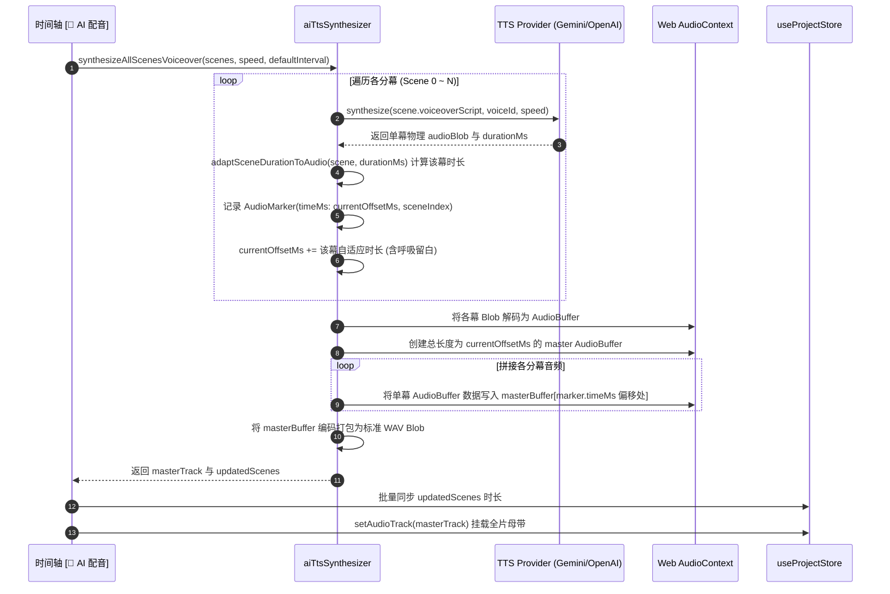

# FocusFlow 分幕旁白台词与音轨应用架构规范 (Scene Voiceover & Audio Track Architecture)

> **文档版本**: 1.0.0  
> **归档路径**: `docs/SCENE_VOICEOVER_AND_AUDIO_TRACK_MODELS.md`  
> **所属模块**: `@focusflow/studio` & `@focusflow/player` (Stage 5.6 ~ Stage 5.8)  
> **相关代码**: `apps/studio/src/services/audio/tts/aiTtsSynthesizer.ts`, `apps/studio/src/components/layout/RightInspector.tsx`, `apps/studio/src/components/layout/BottomTimeline.tsx`

---

## 1. 架构定位与核心原则

在 FocusFlow 的影视级架构演播系统中，解说旁白台词与物理音频轨道的协同遵循两大核心原则：

```mermaid
flowchart TD
    subgraph SceneLevel["1. 分幕级局部自治 (Per-Scene Autonomy)"]
        S1["分幕 1 台词 (voiceoverScript)"] -->|独立拉伸| D1["分幕 1 时长 (duration: 6200ms)"]
        S2["分幕 2 台词 (voiceoverScript)"] -->|独立拉伸| D2["分幕 2 时长 (duration: 8500ms)"]
        S3["分幕 3 台词 (voiceoverScript)"] -->|独立保留| D3["分幕 3 时长 (duration: 5000ms 视觉留白)"]
    end

    subgraph AudioTrackLevel["2. 全局母带音轨应用 (Global Audio Track)"]
        direction TB
        ModeA["模式 A: 检查器单幕独立应用\n(快速验证 / 单幕替换)"]
        ModeB["模式 B: 时间轴全分幕智能合流\n(Web Audio 缝合拼接 / 全片成片)"]
    end

    SceneLevel -->|单幕试听调优满意后| ModeA
    SceneLevel -->|全部分幕台词就绪后一键点击 [🤖 AI 配音]| ModeB
    ModeA -->|覆盖写入单轨| SingleTrack["dsl.audio.tracks[0]\n(仅含当前分幕音频)"]
    ModeB -->|全部分幕流式缝合| MasterTrack["dsl.audio.tracks[0]\n(贯穿全片的长母带 + markers 分幕锚点)"]
```

### 原则一：台词文本与分幕时长的「分场景独立自治」
- **独立台词存储**：每个分幕卡片拥有独立的 `scene.voiceoverScript` 属性，彼此互不干扰；
- **独立时长计算**：各分幕生成的语音朗读物理时长仅用于计算**当前该分幕的最佳展示时长**，遵循“长则扩延（音频时长 + 500ms 呼吸缓冲）、短则留白（保留原有较长时间供观众消化架构图）”的准则，**严禁跨场景波及或篡改其他分幕的时长**。

### 原则二：物理母带音频的「全局单轨制与双应用模式」
- **为什么采用全局单轨制**：为了保障浏览器原生 `<audio>` 播放、Web Audio 混音、本地 60FPS WebM 录制导出以及离线单文件 HTML 分发的高效与绝对同步，FocusFlow DSL 的 `dsl.audio.tracks` 采用母带单轨模型；
- **双应用模式互补**：系统同时支持**「检查器单幕独立应用」**（便于局部调试）与**「时间轴全分幕智能合流」**（最终整片母带合成）。

---

## 2. 数据模型映射 (DSL Schema)

分幕旁白台词与音轨结构在 DSL 中的定义如下：

```typescript
// 1. 分幕级台词与展示时长定义
export interface SceneStep {
  id: string;
  title: string;
  duration?: number;          // 当前分幕展示时长（单位：毫秒，默认 3800ms）
  voiceoverScript?: string;   // 当前分幕专属旁白解说台词
  camera: CameraTransform;
  activeElements?: ActiveElements;
}

// 2. 全局母带音频轨定义
export interface AudioTrackConfig {
  id: string;                 // 唯一音轨 ID (如 track-voiceover-1725950000)
  url: string;                // 音频数据源 (Blob URL / Base64 / HTTP URL)
  name?: string;              // 音轨可读名称 (如 🎙️ AI 智能配音合流)
  durationMs: number;         // 音轨总物理时长（毫秒）
  volume?: number;            // 音量 (0.0 ~ 1.0)
  muted?: boolean;            // 是否静音
  type?: AudioTrackRole;      // "voiceover" | "music" | "sfx" | "offline-tts"
  isOfflineTTS?: boolean;     // 是否为无实体文件的 Web Speech 离线朗读占位轨
  markers?: AudioMarker[];    // 分幕接缝时间点锚点
}

// 3. 分幕接缝时间点打点定义 (用于音画精准对齐)
export interface AudioMarker {
  id: string;                 // 锚点 ID (如 marker-scene-1)
  timeMs: number;             // 该分幕在总音频轨中的起始毫秒偏移量 (Offset)
  label: string;              // 分幕标题
  sceneIndex: number;         // 对应的分幕索引 (0-based)
}
```

---

## 3. 音轨应用的两大运行模式深度对比

FocusFlow 针对创作者在不同创作阶段的需求，设计了两种互补的音轨生成与应用机制：

| 维度 | 模式 A：检查器单幕独立应用 (Single-Scene Mode) | 模式 B：时间轴全分幕智能合流 (Multi-Scene Master Stitching) |
| :--- | :--- | :--- |
| **操作入口** | 右侧属性检查器（Right Inspector）各分幕底部的 `[🎙️ 试听 TTS]` 浮动条 | 底部时间轴控制区（Bottom Timeline）左下角的 `[🤖 AI 配音]` 按钮 |
| **触发函数** | `onApplySceneTTS` (位于 `App.tsx`) | `handleBatchAIVoiceover` (位于 `BottomTimeline.tsx`) |
| **生效范围** | **仅当前选中的单个分幕** (Active Scene Only) | **整部工程的所有分幕** (All Scenes in Project) |
| **时长更新行为** | 仅自适应调整当前分幕时长：<br>`updateSceneDuration(activeSceneIndex, adaptedDur)` | 批量计算并更新全部分幕的时长：<br>`updatedScenes.forEach(s => updateSceneDuration(...))` |
| **音轨生成方式** | 直接取当前单幕生成的物理 `audioBlob` 传入 `setAudioTrack` | 依次调用 TTS 合成各幕音频，使用 Web Audio API 将各音频块**流式缝合**成连续长音频 |
| **分幕标记点** | 无 `markers`（音轨即该单幕本身） | 自动注入全量 `markers: AudioMarker[]`，标记各分幕切幕接缝 |
| **时间轴波形呈现** | 仅显示当前分幕的音频波形（0 ~ 该分幕时长） | 完整显示整部演示所有分幕依次衔接的起伏波形带与分幕切割线 |
| **典型适用场景** | 1. 调优单个分幕的台词咬字与语速<br>2. 测试不同的发音人/模型（如 Gemini Puck 男声）<br>3. 临时单独演播验证该分幕 | 1. 各分幕台词已经全部撰写定稿<br>2. 准备整片导出 60FPS 视频或受众全屏演示<br>3. 生成贯穿全片的连贯高质量解说母带 |

---

## 4. 底层全分幕智能合流（AudioBuffer 缝合）算法

当创作者在底部时间轴点击 `[🤖 AI 配音]` 时，底层调度核心 [`synthesizeAllScenesVoiceover`](../apps/studio/src/services/audio/tts/aiTtsSynthesizer.ts) 执行全自动多幕合流流程：

### 算法执行时序



### 核心合流代码实现片段

```typescript
// 摘自 apps/studio/src/services/audio/tts/aiTtsSynthesizer.ts

// 1. 创建合流主 AudioBuffer
const sampleRate = decodedBuffers[0]?.sampleRate || 44100;
const totalLength = Math.ceil((currentOffsetMs / 1000) * sampleRate);
const combinedBuffer = ctx.createBuffer(1, Math.max(1, totalLength), sampleRate);
const combinedChannel = combinedBuffer.getChannelData(0);

// 2. 依据各分幕的开始标记点精确写入音频数据（未念台词的剩余时间自动保持静音留白）
for (let i = 0; i < decodedBuffers.length; i++) {
  const buf = decodedBuffers[i];
  const channel = buf.getChannelData(0);
  const startOffsetSample = Math.floor((markers[i].timeMs / 1000) * sampleRate);
  combinedChannel.set(channel, startOffsetSample);
}

// 3. 封装为 WAV 实体母带 Blob 并生成合流音轨
const wavBlob = audioBufferToWavBlob(combinedBuffer);
const track: AudioTrackConfig = {
  id: `track-ai-${Date.now()}`,
  name: `AI 智能配音合流 (${activeProvider.name})`,
  url: URL.createObjectURL(wavBlob),
  durationMs: currentOffsetMs,
  volume: 1.0,
  muted: false,
  isOfflineTTS: false,
  type: "voiceover",
  markers, // 携带所有分幕的跳转锚点
};
```

---

## 5. 创作者最佳实践工作流

为了达到最高效的音画同步出片体验，推荐创作者遵循 **“单幕调教，全片合流”** 的黄金工作流：

```
[步骤 1] 逐幕撰写台词
   └── 在右侧检查器中选中场景 1，填入旁白解说词；切换到场景 2，填入旁白解说词...
         │
[步骤 2] 单幕局部试听与时长锁定 (可选)
   └── 点击检查器的「🎙️ 试听 TTS (自适应分幕时长)」，试听发音节奏与音色；
       满意后点击「✓ 应用」，该分幕时长自动拉伸到位（含 500ms 舒适留白）。
         │
[步骤 3] 全片一键合流出片 (核心)
   └── 所有分幕台词拟定后，点击底部时间轴左下角的「🤖 AI 配音」按钮；
       系统全自动将全部分幕按顺序合成、流式缝合并生成一条完整母带音轨；
       底部时间轴展现完整的波形段落与分幕切割线。
         │
[步骤 4] 演播与导出
   └── 点击时间轴播放按钮或按空格键，整部演示文稿音画对齐、逐幕连贯播报；
       可直接通过「导出中心」录制 60FPS 超清 WebM 视频或导出独立 HTML。
```

---

## 6. 常见疑问与排障指引 (FAQ)

### Q1: 为什么我在场景 1 中点击了检查器的「应用」，演播到场景 2 时声音就停止了？
**解答**：检查器里的「应用」是**模式 A（单幕独立应用）**，其作用是方便您针对当前单个分幕进行局部试听和独立测试，因此它生成的音轨仅覆盖场景 1 的时长。若要让全片所有场景连贯发声，请点击时间轴左下角的 **`[🤖 AI 配音]`（模式 B）**，系统会自动将所有分幕的台词缝合成一条完整的贯穿全片的长音轨。

### Q2: 为什么在场景 1 点了应用，再去场景 2 点应用，场景 1 的音频就不见了？
**解答**：FocusFlow 的工程设计采用母带单轨制（`dsl.audio.tracks`）。单幕应用属于局部覆盖测试模式，当在场景 2 点击应用时，音轨被重设为场景 2 的测试音频。要实现多场景共同发声，请使用全分幕合流功能（时间轴 `[🤖 AI 配音]`）。

### Q3: 离线模式（Web Speech）与云端模式（Gemini / OpenAI）在合流时有何区别？
**解答**：
- **云端模式（Gemini / OpenAI）**：每次合流调用大模型 API 获取真实 PCM/WAV 音频流，缝合成一个包含真实波形振幅的独立 WAV 文件，导出视频时能内录真人原声；
- **离线模式（系统内置语音）**：由于浏览器沙箱禁止直接内录本地声卡，离线合流会根据各幕台词文本的字数与语速，精确计算并拉伸各分幕的时长，同时生成一条静音占位波形轨；演播播放时由全局调度中心驱动浏览器底层的 `window.speechSynthesis` 逐幕平滑发声。
