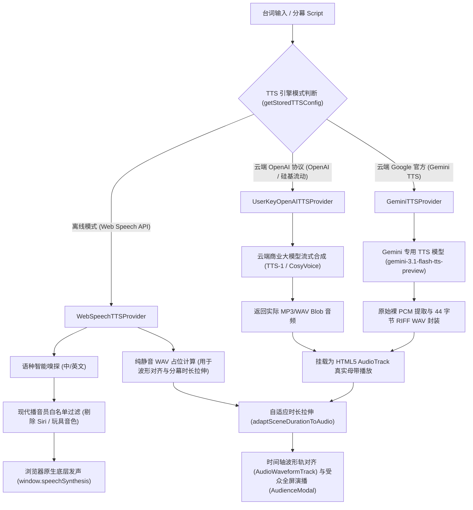
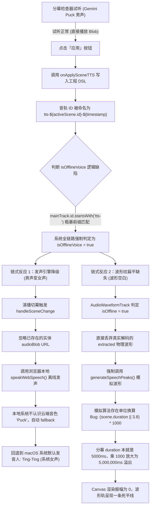

# FocusFlow AI 语音合成 (TTS) 与音频同步架构技术总结与排障全景手册

> **文档版本**: 1.0.0  
> **归档路径**: `docs/TTS_ARCHITECTURE_AND_TROUBLESHOOTING.md`  
> **所属模块**: `@focusflow/studio` & `@focusflow/player` (Stage 5.6 & Stage 5.7)  
> **运行环境**: macOS (Sonoma / Sequoia / Ventura), Chromium (Chrome / Edge), WebKit (Safari)

---

## 目录
1. [架构定位与设计理念](#1-架构定位与设计理念)
2. [核心代码拓扑与模块职责](#2-核心代码拓扑与模块职责)
3. [遇到的核心技术问题与故障树分析](#3-遇到的核心技术问题与故障树分析)
   - [3.1 macOS 特有 Siri 音色陷阱与守护进程锁死（最致命 Bug）](#31-macos-特有-siri-音色陷阱与守护进程锁死最致命-bug)
   - [3.2 Chromium 同步 cancel() 与 speak() 的微任务竞争丢帧](#32-chromium-同步-cancel-与-speak-的微任务竞争丢帧)
   - [3.3 非暂停状态调用 resume() 导致状态机死锁](#33-非暂停状态调用-resume-导致状态机死锁)
   - [3.4 Ting-Ting 连字符正则边界未命中](#34-ting-ting-连字符正则边界未命中)
   - [3.5 V8 / WebKit 垃圾回收 (GC) 导致朗读中途突兀哑音](#35-v8--webkit-垃圾回收-gc-导致朗读中途突兀哑音)
   - [3.6 全屏演播模式 (AudienceModal) 发声解耦与切幕生命周期重建问题](#36-全屏演播模式-audiencemodal-发声解耦与切幕生命周期重建问题)
   - [3.7 云端模式空 API Key 时的静音占位音频与交互预期错位](#37-云端模式空-api-key-时的静音占位音频与交互预期错位)
   - [3.8 孤儿悬空路径导致的 BezierRouter 报错阻断切幕](#38-孤儿悬空路径导致的-bezierrouter-报错阻断切幕)
   - [3.9 Google Gemini TTS 裸 PCM 封装特性与浏览器 Demuxer 解包崩溃](#39-google-gemini-tts-裸-pcm-封装特性与浏览器-demuxer-解包崩溃)
   - [3.10 云端音轨应用后的离线误判降级（男声变女声）与时间轴波形纹扁平缺失](#310-云端音轨应用后的离线误判降级男声变女声与时间轴波形纹扁平缺失)
   - [3.11 Gemini 非音频输出模态缺失与 503 临时负载尖峰](#311-gemini-非音频输出模态缺失与-503-临时负载尖峰)
   - [3.12 浏览器会话生命周期与 Blob URL 刷新失效陷阱 (ERR_FILE_NOT_FOUND)](#312-浏览器会话生命周期与-blob-url-刷新失效陷阱-err_file_not_found)
4. [核心代码演进与最终修复方案](#4-核心代码演进与最终修复方案)
   - [4.1 健壮可靠的 WebSpeechTTSProvider 实现](#41-健壮可靠的-webspeechttsprovider-实现)
   - [4.2 拓扑自愈 sanitizeDSL 与播放内核纯净性](#42-拓扑自愈-sanitizedsl-与播放内核纯净性)
   - [4.3 受众全屏演播模式生命周期守护](#43-受众全屏演播模式生命周期守护)
   - [4.4 Google Gemini 裸 PCM 自动 RIFF WAV 封装器实现](#44-google-gemini-裸-pcm-自动-riff-wav-封装器实现)
   - [4.5 实体音轨与离线语音判定收敛架构](#45-实体音轨与离线语音判定收敛架构)
   - [4.6 官方专属音频模型过滤、配置自愈与优雅故障诊断 Toast 通知体系 (Sonner)](#46-官方专属音频模型过滤配置自愈与优雅故障诊断-toast-通知体系-sonner)
   - [4.7 分幕专属二进制音频 IndexedDB 持久化与会话保鲜重现 (Session Freshness)](#47-分幕专属二进制音频-indexeddb-持久化与会话保鲜重现-session-freshness)
5. [Web Speech API 浏览器工程实践避坑指南](#5-web-speech-api-浏览器工程实践避坑指南)
6. [自动化回归测试与监控验证](#6-自动化回归测试与监控验证)

---

## 1. 架构定位与设计理念

FocusFlow 的架构图演示文稿需要实现**电影级镜头调度与解说旁白精准音画同步**。在语音合成层，系统采用了 **“离线开源核心 + 云端商业大模型（BYOK）”** 的多模架构：



### 核心设计原则
1. **零成本开箱即用**：离线模式完全基于浏览器的 `SpeechSynthesis`，无需配置任何 API Key，没有网络延迟与 Token 计费。
2. **多云端商业大模型（BYOK）**：全面兼容 OpenAI 协议服务商（OpenAI、SiliconFlow）以及 Google 官方 Gemini TTS（`gemini-3.1-flash-tts-preview`、`gemini-2.5-flash` 等官方 30+ 专属人声音色）。
3. **音画弹性自适应**：
   - 保持真实音频语速不变（拒绝机械变速与音调失真）；
   - 若解说较长，自动延展分幕时长（`speechDuration + 500ms`）；
   - 若分幕原本预留时间较长，保留视觉留白，保证架构图理解体验。
4. **播放器双轨分离与母带真实发声**：
   - 针对云端真实音频（OpenAI / Gemini / 自定义录音），播放器使用 HTML5 `<audio>` 真实解码发声；
   - 针对离线 Web Speech，播放器不通过 `<audio>` 播放纯静音占位 WAV，而是由全局音频调度中心直接驱动 `speakWebSpeech`。
5. **单幕独立应用 vs 全分幕智能合流双模型**：
   - 台词与分幕时长分场景独立自治；
   - 物理母带音轨支持“检查器单幕快速替换”与“时间轴一键全分幕智能缝合”，详见专篇规范文档 [`SCENE_VOICEOVER_AND_AUDIO_TRACK_MODELS.md`](./SCENE_VOICEOVER_AND_AUDIO_TRACK_MODELS.md)。

---

## 2. 核心代码拓扑与模块职责

| 文件路径 | 模块名称 | 核心职责 |
| :--- | :--- | :--- |
| `apps/studio/src/services/audio/tts/WebSpeechTTSProvider.ts` | **离线语音合成提供商** | 浏览器 `SpeechSynthesis` 封装、现代音色白名单过滤、防 GC 垃圾回收池、25ms IPC 调度去抖与发声控制 |
| `apps/studio/src/services/audio/tts/OpenAITTSProvider.ts` | **OpenAI 兼容云端提供商** | 支持 OpenAI、SiliconFlow、自定义中转服务商的 BYOK 商业 API 请求与 Blob 转换 |
| `apps/studio/src/services/audio/tts/GeminiTTSProvider.ts` | **Google Gemini 官方提供商** | Google Gemini 官方 GenerativeLanguage API 对接、多音色映射、原始裸 PCM 自动 RIFF WAV 封装与时长精准计算 |
| `apps/studio/src/services/audio/tts/aiTtsSynthesizer.ts` | **AI 语音合成调度器** | 统一 Provider 工厂、分幕解说词估算、批量全幕合流计算、音轨对齐与分幕自适应时长伸缩 |
| `apps/studio/src/services/audio/tts/ttsConfigStore.ts` | **配置持久化中心** | 本地 `localStorage` 缓存当前 TTS 模式、音色模型、语速与密钥预设 |
| `apps/studio/src/components/layout/RightInspector.tsx` | **属性检查器** | 单幕台词输入、生成并试听卡片、单幕自适应时长应用 |
| `apps/studio/src/components/timeline/AudioWaveformTrack.tsx` | **音频波形时间轴** | Web Audio 解码真实物理音频峰值波形、VAD 静音间隙识别、分幕边界拖拽吸附与打点对齐 |
| `apps/studio/src/components/modals/AudienceModal.tsx` | **受众全屏演播模式** | 演示级全屏沉浸播放器，挂载独立分幕 TTS 监听与键盘调度 |
| `apps/studio/src/stores/useProjectStore.ts` | **工程状态仓库** | DSL 状态树管理、拓扑完整性自愈引擎（`sanitizeDSL`）、级联删除图元与路径 |
| `packages/player/src/core/player.js` | **FocusFlow 播放内核** | 镜头运镜驱动、场景步进器、AudioTrack 生命周期初始化、离线占位音轨静音隔离与 Blob 资源解析 |

---

## 3. 遇到的核心技术问题与故障树分析

在演播模式与检查器试听的演进调试过程中，我们遭遇了一系列深浅交织的浏览器底层与系统级缺陷。

### 3.1 macOS 特有 Siri 音色陷阱与守护进程锁死（最致命 Bug）

#### 问题现象
在 macOS 系统（Chrome / Edge）下，一度出现**整机所有标签页的 TTS 离线朗读全部哑音**，没有任何声音发出，且命令行执行 macOS 原生 `say` 命令耗时超过 120 秒。

#### 深度原因
1. macOS 系统原生向浏览器暴露了 Siri 音色（如 `Siri Voice 1`、`Siri 声音 2`）。
2. 在旧版代码中，为了追求自然音质，白名单正则中加入了 `siri`：
   ```typescript
   // ❌ 致命错误：加入了 siri
   export const CHINESE_BROADCAST_VOICE_REGEX =
     /\b(tingting|xiaoxiao|yunxi|yunjian|sinji|google\s*普通话|siri|natural|premium)\b/i;
   ```
3. **系统级沙箱权限阻断**：由于 Apple 的版权保护与沙箱限制，macOS 禁止除系统原生受信任应用之外的第三方应用（如 Chromium、第三方 Electron）调用 Siri 语音合成库。
4. 当 Chromium 尝试将 `utterance.voice = siriVoice` 传入底层时，不仅 Chromium 内部合成器静默失败，更会导致 macOS 系统的音频合成守护进程（`speechsynthesisd`）的 IPC 会话长时间挂起，直到 120 秒超时。在此期间，整个系统的 TTS 队列完全锁死！

#### 根治方案
- 建立严苛的 `isSafeVoice` 过滤器，**彻底将 `siri` 剔除出白名单并加入黑名单屏蔽**。
- 绝不将包含 `siri` 字符串的音色赋值给 `utterance.voice`。

---

### 3.2 Chromium 同步 cancel() 与 speak() 的微任务竞争丢帧

#### 问题现象
在某些快速点击播放、切换分幕或连续试听的场景中，控制台显示代码已执行到 `window.speechSynthesis.speak(utterance)`，但浏览器没有任何声音。

#### 深度原因
1. 在 Chromium 内核的实现机制中，`window.speechSynthesis.cancel()` 并不是纯同步操作，而是向浏览器的音频主进程异步抛送一个“清空当前播放队列”的 IPC 信号。
2. 如果在同一个 JavaScript 同步执行栈中执行：
   ```javascript
   // ❌ 竞争隐患：同步连续调用
   window.speechSynthesis.cancel();
   window.speechSynthesis.speak(utterance);
   ```
3. 浏览器音频进程收到 `cancel` 信号时，此时 `speak(utterance)` 刚刚进入底层队列，`cancel` 往往会**直接把刚刚入队的这个新 `utterance` 一同丢弃**，并触发 `utterance.onerror`（错误码 `canceled`），导致声音彻底“吞掉”。

#### 根治方案
引入 **25ms IPC 调度防消抖**：
```typescript
if (window.speechSynthesis.speaking || window.speechSynthesis.pending) {
  try { window.speechSynthesis.cancel(); } catch (e) {}
}

// 延迟 25ms 等待 Chromium 音频进程清空上一轮取消信号
pendingSpeakTimer = setTimeout(() => {
  window.speechSynthesis.speak(utterance);
}, 25);
```

---

### 3.3 非暂停状态调用 resume() 导致状态机死锁

#### 问题现象
部分开发者习惯在 `speak()` 前强行调用 `window.speechSynthesis.resume()`，意图“唤醒”可能休眠的音频引擎，结果却导致发声完全失效。

#### 深度原因
Chromium 的 `speechSynthesis` 内部维护着严密的状态机（`Idle -> Speaking -> Paused -> Idle`）。
在引擎未处于 `paused` 状态时，强行调用 `resume()` 会导致底层状态机异常，进而造成后续的 `speak()` 无法将新任务流转为 `Speaking` 态。

#### 根治方案
严格判断当前挂起状态，只有在明确处于暂停态时才恢复：
```typescript
if (window.speechSynthesis.paused) {
  try { window.speechSynthesis.resume(); } catch (e) {}
}
```

---

### 3.4 Ting-Ting 连字符正则边界未命中

#### 问题现象
在 macOS 系统上，明明安装了音质极佳的官方普通话女声婷婷，但系统依然匹配到了奇怪的非普通话音色（如粤语的 `Sinji`）。

#### 深度原因
macOS 系统内置的婷婷音色在 Chrome 中的暴露名称包含连字符：`Ting-Ting`。
原本的正则使用了单词边界匹配：`/\btingting\b/i`。由于 `\b` 无法跨连字符匹配，`\btingting\b.test("Ting-Ting")` 的返回值恒为 `false`！
导致系统跳过了官方中文旗舰播音员，退回到列表中的其它非标准音色。

#### 根治方案
改用支持连字符与空格的松散模糊正则：
```typescript
export const CHINESE_BROADCAST_VOICE_REGEX =
  /(ting[- ]?ting|xiaoxiao|yunxi|yunjian|google\s*普通话|natural|premium)/i;
```

---

### 3.5 V8 / WebKit 垃圾回收 (GC) 导致朗读中途突兀哑音

#### 问题现象
朗读一段较长的台词（超过 15 秒）时，前面几秒发音清晰，但朗读到一半突然无故中断，且没有任何报错信息。

#### 深度原因
这是 Chromium 与 WebKit 引擎长达数年的一项已知底层机制：
如果将 `const utterance = new SpeechSynthesisUtterance(...)` 仅作为局部变量创建，在垃圾回收周期到来时，由于 JavaScript 作用域链中没有持有该实例的强引用，**V8 垃圾回收器会误认为该对象已废弃，将其强行回收**。
实例一旦被回收，底层的音频合成任务随即被操作系统静默终止。

#### 根治方案
采用模块级 `Set<SpeechSynthesisUtterance>` 强引用池：
```typescript
const activeUtterances = new Set<SpeechSynthesisUtterance>();

export function speakWebSpeech(...) {
  const utterance = new SpeechSynthesisUtterance(trimmed);
  activeUtterances.add(utterance); // 强引用存活保护

  const cleanup = () => {
    activeUtterances.delete(utterance); // 播放完毕释放
    onEnded?.();
  };

  utterance.onend = cleanup;
  utterance.onerror = cleanup;
  ...
}
```

---

### 3.6 全屏演播模式 (AudienceModal) 发声解耦与切幕生命周期重建问题

#### 问题现象
进入全屏【演播】受众演示模式（`AudienceModal`）后：
1. 初始阶段没有声音播放；
2. 每次切换分幕时，播放器实例会被频繁销毁重建；
3. 一旦销毁，清理函数 `return () => stopWebSpeech()` 会无情打断刚刚起步的语音朗读。

#### 深度原因
1. **职责分离历史遗留**：`AudienceModal` 早期设计专注于全屏画布缩放与运镜，音频发声完全依赖主工作区时间轴的同步；当脱离时间轴进入独立全屏时，缺少自身对分幕 TTS 的驱动闭环。
2. **React Hooks 依赖陷阱**：在 `AudienceModal` 的 `useEffect` 中，如果不慎将当前分幕索引（`currentSceneIdx`）或未经 Memo 处理的 DSL 引用放入依赖数组，切幕触发状态更新时，会导致整个 `FocusFlowPlayer` 实例被销毁并重新初始化（`player.destroy()`），触发清理流程中的 `stopWebSpeech()`。

#### 根治方案
1. **生命周期锁定**：`FocusFlowPlayer` 实例仅在弹窗打开或 DSL 结构产生实质性变化时初始化一次；
2. **事件驱动切幕发声**：在 Player 初始化配置项中注册 `onSceneChange` 回调，由播放内核驱动 `playSceneTTS(index)`；
3. **使用 Ref 维持运行时最新引用**：使用 `isPlayingRef` 和 `currentSceneIdxRef` 规避闭包过期，防止重复执行生命周期钩子。

---

### 3.7 云端模式空 API Key 时的静音占位音频与交互预期错位

#### 问题现象
在检查器单幕点击“生成并试听”，控制卡片显示在播放中，但全程听不到声音。

#### 深度原因
在系统设置中如果将模式切换为【云端商业大模型（Cloud）】，但未在输入框填入有效的 `apiKey`：
1. `createTTSProviderFromConfig` 判断无 Key，无法连网请求 OpenAI 或 SiliconFlow；
2. 内部生成了一段时长计算正确的**纯静音 WAV 占位音频**（频率为 0Hz）；
3. 检查器根据 `cfg.mode === 'cloud'` 的配置，将这段纯静音 WAV 包装为 `Blob URL` 传入 HTML5 `<audio>` 播放；
4. 结果是：`<audio>` 在正常播放，波形在正常走动，但物理声学上是 0 分贝纯静音。

#### 解决规范
- 明确离线与云端界限：未填 Key 时，在 UI 上提供醒目的配置提示或自动优雅降级到系统离线 Web Speech 朗读；
- 在文档和控制台明确标明当前驱动内核。

---

### 3.8 孤儿悬空路径导致的 BezierRouter 报错阻断切幕

#### 问题现象
在演播模式下切幕时，控制台狂刷错误：
```text
bezier-router.js:25 [FocusFlow] BezierRouter: Box "box-gateway" not found.
```
在某些极端情况下，导致状态机执行中断，阻断了场景跳转与随后的 TTS 发声。

#### 深度原因
用户在画布上删除了某个方框（Box）图元，但与其相连的贝塞尔曲线路径（Path）没有被级联清理，导致 DSL 中残存了起点或终点指向已不存在 Box 的“孤儿路径”。当切换到激活这些路径的分幕时，贝塞尔路由器因找不到目标图元坐标而报出警告。

#### 根治方案
1. **拓扑自愈引擎（`sanitizeDSL`）**：在工程加载、更新及进入演播模式前，纯函数自愈清洗所有非法图元引用与端点缺失的悬空路径；
2. **级联删除（Cascade Delete）**：在 `deleteElement` 动作中，删除 Box 时自动连带删除依赖该 Box 的所有 Paths。

---

### 3.9 Google Gemini TTS 裸 PCM 封装特性与浏览器 Demuxer 解包崩溃

#### 问题现象
创作者在分幕旁白台词中使用 Google Gemini 官方语音合成（如专用模型 `gemini-3.1-flash-tts-preview` 或 `gemini-2.5-flash`，音色设为 `Puck` 等男声）成功生成音频后，在检查器的试听浮动条中点击播放按钮，**播放进度瞬间（0ms）跳回停止状态，播放立刻结束，完全没有发出任何声音**。

#### 协议与底层机理深度剖析
1. **Google Gemini API 的音频输出特性**：
   - Google Gemini API (`generativelanguage.googleapis.com`) 在调用音频生成或多模态 TTS 接口时，返回的响应体格式为：
     ```json
     {
       "candidates": [
         {
           "content": {
             "parts": [
               {
                 "inlineData": {
                   "mimeType": "audio/x-wav",
                   "data": "<Base64EncodedPCMData>"
                 }
               }
             ]
           }
         }
       ]
     }
     ```
   - **致命的协议隐患**：虽然其返回的 `inlineData.mimeType` 往往被标为 `audio/x-wav`、`audio/wav` 或 `audio/pcm; rate=24000`，但 Base64 解码后的二进制字节流**完全不包含 RIFF WAVE 容器文件头（无 44 字节的 Header）**，而是纯粹的 **24kHz、16-bit 线性单声道、小端序（Little-Endian）裸 PCM 数据（Raw Linear PCM）**！
2. **浏览器 Demuxer（解复用器）解包崩溃**：
   - 前端若轻信 `mimeType: "audio/x-wav"`，直接调用 `new Blob([bytes], { type: 'audio/x-wav' })` 并通过 `URL.createObjectURL` 传入 HTML5 `<audio>` 播放；
   - 现代浏览器（Chromium / WebKit）的音频解复用引擎（如 `FFmpegDemuxer` 或 `WavAudioHandler`）在接收到声明为 `audio/wav` 的资源流时，强依赖开头的 44 字节标准 RIFF 格式规范：
     $$\text{ChunkID ('RIFF')} \longrightarrow \text{ChunkSize} \longrightarrow \text{Format ('WAVE')} \longrightarrow \text{Subchunk1 ('fmt ')} \longrightarrow \text{Subchunk2 ('data')}$$
   - 由于 Gemini 返回的裸 PCM 字节开头直接就是音频采样的原始量化数值，Demuxer 在读取前 4 个字节时无法匹配 `RIFF` 魔数，立即判定音频流严重损坏（Corrupted Stream），底层抛出 `DEMUXER_ERROR_COULD_NOT_OPEN` 致命异常；
   - HTML5 `<audio>` 瞬间触发 `onerror` 事件，并向控制台抛出 `MediaError: PIPELINE_ERROR_DECODE` 或解复用中断；
   - 试听控制器的 `audio.onerror` 回调将播放状态 `isPlaying` 瞬间置为 `false`，从而在视觉上表现为“点击播放按钮后，马上就退出演播，没有任何声音”。

#### 工业级根治方案
在 [`GeminiTTSProvider.ts`](../apps/studio/src/services/audio/tts/GeminiTTSProvider.ts) 中建立容器与魔数自愈机制：
1. **严格二进制魔数探测**：优先校验前 12 字节是否已具备合法 `RIFF....WAVE` 标识，并嗅探 MP3（`ID3` 或 `0xFF 0xEx` 同步字）与 OGG（`OggS`）；
2. **动态合成 44 字节标准 RIFF WAV 头（`wrapPcmWithWavHeader`）**：
   - 针对所有缺乏容器头的裸 PCM 数据，动态构建 44 字节标准文件头：明确写入 `RIFF`、`WAVE`、`fmt `（PCM 格式 1、单声道 1、采样率 24000Hz、字节率 48000、对齐参数 2、量化深度 16-bit）以及 `data` 块大小；
   - **偶数字节对齐防御**：16-bit PCM 每样本占用 2 字节，若 API 偶现奇数长度截断，强制对齐为偶数长度（`evenLen = pcmBytes.length - (pcmBytes.length % 2)`），彻底防止 Demuxer 报对齐错误；
3. **高精物理时长绝对换算**：
   裸 PCM 数据无需启动繁重的 AudioContext 异步解码，通过精确物理数学公式直接获取毫秒级物理时长：
   $$\text{durationMs} = \text{Math.round}\left(\frac{\text{pcmBytes.length}}{\text{sampleRate} \times 2}\right) \times 1000$$

---

### 3.10 云端音轨应用后的离线误判降级（男声变女声）与时间轴波形纹扁平缺失

#### 问题现象
创作者在分幕旁白台词中使用 Gemini 云端 TTS（配置为 `Puck` 等男声音色）：
1. 试听时声音正常，是纯正的云端 Gemini 男声；
2. 试听满意后，点击「应用」按钮，发现底部**时间轴音频轨道上没有显示波形纹（波形轴完全平直空白）**；
3. 点击时间轴上的「播放」演播按钮，工程依然能发声，但**发音人瞬间变成了本地系统的默认中文女声（如 macOS 的 Ting-Ting / 婷婷）**，之前生成的 Gemini 男声音色被无情丢弃！

#### 深度故障树与双重链式反应分析



1. **试听与应用的状态流转机制**：
   - **试听阶段**：检查器调用 `synthesizeSceneVoiceover` 获取到合法的实体 `audioBlob`，试听条内部使用 `new Audio(URL.createObjectURL(blob))` 单独播放，直接发出了 Gemini 云端原本的音质与男声音色；
   - **应用阶段**：创作者认可试听效果，点击「应用」按钮，系统执行 `onApplySceneTTS`：
     ```typescript
     setAudioTrack({
       id: `tts-${activeScene.id}-${Date.now()}`, // ⚠️ 历史包袱：赋以 tts- 前缀
       url: URL.createObjectURL(ttsPreview.audioBlob),
       name: `🎙️ ${activeScene.title}`,
       durationMs: ttsPreview.adaptedDuration,
       volume: 1.0,
       isOfflineTTS: false, // 显式声明为非离线
       type: 'voiceover',    // 显式声明为解说原声
     });
     ```
2. **粗暴字符串前缀匹配引发的离线误判降级（男声变女声）**：
   - 在主界面 [`App.tsx`](../apps/studio/src/App.tsx)、时间轴波形轨以及全屏演播模式中，早期历史代码残留了一处脆弱的类型推断逻辑：
     ```typescript
     // ❌ 脆弱且致命的历史推断：
     const isOfflineVoice = Boolean(
       mainTrack.isOfflineTTS ||
       mainTrack.type === 'offline-tts' ||
       mainTrack.id?.startsWith('track-ai-') ||
       mainTrack.id?.startsWith('tts-') // 无论是否具备实体音频，前缀命中即判为离线！
     );
     ```
   - 即使 `mainTrack.isOfflineTTS === false` 且包含合法的实体音频 Blob URL，只要其 ID 以 `tts-` 开头，系统就会将其强制归类为“离线原生 Web Speech 音轨”；
   - 当点击播放或切幕时，播放器没有播放 `mainTrack.url` 的实体音频，而是调用了 `speakWebSpeech(text, speed, undefined, cfg.voice)`；
   - 此时 `cfg.voice` 保存的是 Gemini 云端音色标识符 `"Puck"`，操作系统的本地语音库根本没有该音色，于是自动触发优雅降级逻辑，回退到系统默认的普通话播音员（macOS 默认中文发音人为女声 **Ting-Ting 婷婷**），引发了男声变女声的离奇现象。
3. **丢弃物理波形与毫秒单位溢出导致的波形纹扁平缺失**：
   - 在 [`AudioWaveformTrack.tsx`](../apps/studio/src/components/timeline/AudioWaveformTrack.tsx) 中，同样因 `track.id.startsWith('tts-')` 将音轨误判为离线；
   - 命中 `if (isOffline || maxPeak < 0.01)` 条件后，系统**直接把 Web Audio API 真实解码计算出的 `extracted` 物理波形数组扔掉**，转而调用 `generateSpeechPeaks` 算法模拟伪波形；
   - 而该模拟算法内第一行赫然写着：
     ```typescript
     // ❌ 单位换算 Bug：
     const durMs = (scene.duration || 3.8) * 1000;
     ```
   - FocusFlow 工程规范中，分幕时长 `scene.duration` 的内部存储单位**原本就是毫秒（如 5000 代表 5 秒）**；再次乘以 1000 后，分幕时长被严重畸变为 500 万毫秒，导致时间比率计算溢出归零，最终 Canvas 只能画出振幅全为 0 的空白平直线。

#### 根治方案
1. **类型判据严格收敛到实体属性**：
   彻底剔除基于 `id.startsWith('tts-')` 或 `id.startsWith('track-ai-')` 的粗暴字符串嗅探，统一确立核心准则：**凡具备物理 `track.url` 且未显式标记 `isOfflineTTS: true` 的音轨，一律作为实体音频流处理**；
2. **保护真实物理音频波形提取**：
   只要 `extracted` 峰值计算成功且音轨具备实体音频，严禁调用模拟函数覆盖真实波形；
3. **修复算法单位容错**：
   在 `generateSpeechPeaks` 中增加毫秒/秒边界防卫：`const durMs = scene.duration > 100 ? scene.duration : scene.duration * 1000;`；
4. **播放内核原语支持**：
   在播放内核 `FocusFlowPlayer.prototype.getAssetUrl` 中补全对 `blob:` 协议的前缀白名单保护，确保 Blob 资源安全通畅。

### 3.11 Gemini 非音频输出模态缺失与 503 临时负载尖峰

#### 问题现象
用户在分幕检查器试听或时间轴批量配音时，可能会遇到两类高频的 Google Gemini 云端合成异常：
1. **控制台报错 `Gemini did not return audio data (STOP)`**：
   - 当用户配置或使用 Gemini 时，若选择了通用大模型（如 `gemini-1.5-flash`, `gemini-2.5-flash`, `gemini-3.5-flash-lite` 等非音频输出模型），API 接口返回 200 OK 且 `finishReason: "STOP"`，但响应数据体中只有常规纯文本 Part（模型把台词当成了 prompt 并在聊天回复文本中回应），并没有包含二进制 PCM 音频数据的 `inlineData`；
   - 原系统因找不到音频字段直接抛出模糊的 `Error: Gemini did not return audio data (STOP)`，此前页面未捕获该异常，仅在控制台留下一行报错，用户界面无感知且处于等待盲区。
2. **服务商临时过载 `This model is currently experiencing high demand. Spikes in demand are usually temporary. Please try again later. (503)`**：
   - 当 Google 官方模型服务器遭遇全球算力激增或突发流量尖峰时，接口返回 HTTP 503 状态码；
   - 用户在界面点击「生成试听」或时间轴「批量 AI 配音」，界面直接无反应，无法知晓是服务商暂时繁忙还是自身 Key 欠费。

#### 深度故障机理
1. **Gemini API 响应模态 (`responseModalities`) 的严格模型绑定**：
   - Google Gemini REST API 规范明确指出，只有具备 Multimodal Audio 输出能力或专属语音预览模型（如 `gemini-2.0-flash`, `gemini-2.5-flash-preview-tts`, `gemini-2.5-pro-preview-tts`, `gemini-2.0-flash-exp`）才支持向客户端流式返回 PCM 音频；
   - 通用语言模型即便在 request payload 中传入 `responseModalities: ["AUDIO"]`，也往往直接忽略该指令，将其退化为常规的文本生成，返回 `candidate.content.parts[0].text`；
   - 原前端配置预设中容纳了未经筛选的通用模型列表，且用户的 `localStorage` 可能残留了旧版本选择的失效模型。
2. **缺乏系统级错误分类诊断与优雅交互兜底**：
   - 语音合成跨越了网络请求、云端服务可用性、Token 额度、模型兼容性等多维边界；
   - 简单的 `console.error` 造成了“静默失败”的用户糟糕体验，缺乏针对 503（稍后重试）、429（额度超限）、401（Key 无效）、模型不支持、断网等情况的自愈引导和一键离线降级机制。

### 3.12 浏览器会话生命周期与 Blob URL 刷新失效陷阱 (ERR_FILE_NOT_FOUND)

#### 问题现象
创作者在分幕检查器中生成并成功应用单幕 TTS 旁白，母带合流试听一切正常。但在**刷新浏览器页面 (F5 / Cmd+R)** 后，控制台立即弹出网络与解码报错：
```text
masterAudioStitcher.ts:174 GET blob:http://localhost:5174/4c94becc-2d93-4eab-a589-7fdce15f1ab8 net::ERR_FILE_NOT_FOUND
masterAudioStitcher.ts:193 [MasterAudioStitcher] Failed to decode audio for scene 2 (03 订单中台微服务与状态机编排): TypeError: Failed to fetch
```
刷新后，此前已生成的场景音频在母带合流中丢失，无法发声。

#### 深度故障机理
1. **W3C File API 下 Blob URL 的会话瞬态性 (Document Session Lifespan)**：
   - 浏览器原生 `URL.createObjectURL(blob)` 生成的 `blob:` 协议引用仅在**当前页面的执行上下文与文档生命周期中有效**；
   - 一旦浏览器刷新或重新加载页面，宿主文档销毁，前次会话分配的所有 Blob 内存指针被操作系统与浏览器底层彻底注销回收；
2. **分幕专属音频物理持久化断层**：
   - 在 Stage 5.8 引入分幕独立音频 `scene.voiceoverAudio` 架构时，工程将 `voiceoverAudio.url` 设为 `blob:...`，并在状态改变后持久化了 DSL；
   - 但系统的本地存储仓库 [`useStorageStore.ts`](../apps/studio/src/stores/useStorageStore.ts) 在早期仅针对顶层 `audioTrack.url` 进行了单一 `audioBlob` 抽取与保存，**完全遗漏了各分幕专属 `scene.voiceoverAudio` 的原始二进制 Blob 持久化**；
   - 导致刷新后，DSL 中的 `scene.voiceoverAudio.url` 依然残留着已经失效注销的历史 `blob:` 字符串，`masterAudioStitcher` 在自动执行多幕合流时去 `fetch(audioUrl)`，浏览器底层直接报 `ERR_FILE_NOT_FOUND`。

---

## 4. 核心代码演进与最终修复方案

### 4.1 健壮可靠的 WebSpeechTTSProvider 实现

位于 [`apps/studio/src/services/audio/tts/WebSpeechTTSProvider.ts`](../apps/studio/src/services/audio/tts/WebSpeechTTSProvider.ts)：

```typescript
// 1. 玩具音色与怪异机器音黑名单
export const VINTAGE_NOVELTY_VOICE_REGEX =
  /\b(albert|bad news|bahh|bells|boing|bubbles|cellos|deranged|eddy|flo|fred|good news|grandma|grandpa|hysterical|jester|junior|kathy|organ|pipe organ|ralph|reed|rocko|sandy|shelley|superstar|trinoids|whisper|wobble|zarvox)\b/i;

// 2. 现代母带播音员白名单（坚决剔除 siri）
export const ENGLISH_BROADCAST_VOICE_REGEX =
  /\b(samantha|alex|jenny|guy|aria|google\s*(us|uk)?\s*english|natural|premium)\b/i;

export const CHINESE_BROADCAST_VOICE_REGEX =
  /(ting[- ]?ting|xiaoxiao|yunxi|yunjian|google\s*普通话|natural|premium)/i;

// 3. 强引用池防 V8 提前垃圾回收
const activeUtterances = new Set<SpeechSynthesisUtterance>();
let pendingSpeakTimer: ReturnType<typeof setTimeout> | null = null;

export function speakWebSpeech(
  text: string,
  speed = 1.0,
  lang?: string,
  voiceId?: string,
  onEnded?: () => void
): void {
  if (typeof window === 'undefined' || !window.speechSynthesis) {
    onEnded?.();
    return;
  }

  const trimmed = text.trim();
  if (!trimmed) {
    onEnded?.();
    return;
  }

  // 清除未决的调度计时器
  if (pendingSpeakTimer) {
    clearTimeout(pendingSpeakTimer);
    pendingSpeakTimer = null;
  }

  // 4. 仅在真正发声或等待时取消，绝不滥调
  if (window.speechSynthesis.speaking || window.speechSynthesis.pending) {
    try {
      window.speechSynthesis.cancel();
    } catch (e) {}
  }

  // 5. 仅在真正暂停时唤醒，杜绝状态机混乱
  if (window.speechSynthesis.paused) {
    try {
      window.speechSynthesis.resume();
    } catch (e) {}
  }

  // 6. 25ms IPC 消抖缓冲，彻底解决 Chromium 同步 cancel() 导致的吞音
  pendingSpeakTimer = setTimeout(() => {
    pendingSpeakTimer = null;
    try {
      const utterance = new SpeechSynthesisUtterance(trimmed);
      activeUtterances.add(utterance);

      const handleDone = () => {
        activeUtterances.delete(utterance);
        onEnded?.();
      };

      utterance.onend = handleDone;
      utterance.onerror = (e) => {
        if (e.error !== 'canceled' && e.error !== 'interrupted') {
          console.warn('[FocusFlow TTS] Speech synthesis notice:', e.error);
        }
        handleDone();
      };

      utterance.rate = Math.max(0.5, Math.min(2.0, speed));
      const isChinese = /[\u4e00-\u9fa5]/.test(trimmed);
      utterance.lang = lang || (isChinese ? 'zh-CN' : 'en-US');

      // 7. 安全音色选择逻辑（Siri 严苛屏蔽与普通话优先）
      const voices = window.speechSynthesis.getVoices();
      if (voices && voices.length > 0) {
        let targetVoice: SpeechSynthesisVoice | undefined;

        const isSafeVoice = (v: SpeechSynthesisVoice) => {
          const nameLower = v.name.toLowerCase();
          if (nameLower.includes('siri')) return false; // 严防 Siri
          if (VINTAGE_NOVELTY_VOICE_REGEX.test(v.name)) return false; // 过滤玩具音
          return true;
        };

        if (voiceId) {
          const candidate = voices.find((v) => (v.voiceURI === voiceId || v.name === voiceId) && isSafeVoice(v));
          if (candidate) targetVoice = candidate;
        }

        if (!targetVoice) {
          const safeVoices = voices.filter(isSafeVoice);
          if (isChinese) {
            const zhVoices = safeVoices.filter(
              (v) => v.lang.toLowerCase().startsWith('zh') || /[\u4e00-\u9fa5]/.test(v.name)
            );
            targetVoice = zhVoices.find((v) => CHINESE_BROADCAST_VOICE_REGEX.test(v.name))
              || zhVoices.find((v) => v.lang.toLowerCase() === 'zh-cn' || v.lang.toLowerCase() === 'zh_cn')
              || zhVoices[0];
          } else {
            const enVoices = safeVoices.filter((v) => v.lang.toLowerCase().startsWith('en'));
            targetVoice = enVoices.find((v) => ENGLISH_BROADCAST_VOICE_REGEX.test(v.name))
              || enVoices.find((v) => v.lang.toLowerCase() === 'en-us' || v.lang.toLowerCase() === 'en_us')
              || enVoices[0];
          }
        }

        if (targetVoice) {
          utterance.voice = targetVoice;
        }
      }

      window.speechSynthesis.speak(utterance);
    } catch (err) {
      console.warn('[FocusFlow TTS] Speech synthesis dispatch error:', err);
      onEnded?.();
    }
  }, 25);
}
```

---

### 4.2 拓扑自愈 sanitizeDSL 与播放内核纯净性

位于 [`apps/studio/src/stores/useProjectStore.ts`](../apps/studio/src/stores/useProjectStore.ts)：

```typescript
export function sanitizeDSL(dsl: FocusFlowDSL): FocusFlowDSL {
  if (!dsl || !dsl.elements) return dsl;
  const boxIds = new Set((dsl.elements.boxes || []).map((b) => b.id));

  // 1. 自动过滤端点不存在的悬空路径
  const validPaths = (dsl.elements.paths || []).filter((p) => {
    const fromBox = p.from?.split('.')[0];
    const toBox = p.to?.split('.')[0];
    if (fromBox && !boxIds.has(fromBox)) return false;
    if (toBox && !boxIds.has(toBox)) return false;
    return true;
  });

  const validPathIds = new Set(validPaths.map((p) => p.id));
  const dotIds = new Set((dsl.elements.dots || []).map((d) => d.id));
  const imgIds = new Set((dsl.elements.images || []).map((i) => i.id));

  // 2. 清理各分幕 activeElements 中失效的图元 ID
  const scenes = (dsl.scenes || []).map((s) => {
    if (!s.activeElements) return s;
    return {
      ...s,
      activeElements: {
        ...s.activeElements,
        boxes: (s.activeElements.boxes || []).filter((id) => boxIds.has(id)),
        paths: (s.activeElements.paths || []).filter((id) => validPathIds.has(id)),
        dots: (s.activeElements.dots || []).filter((id) => dotIds.has(id)),
        images: (s.activeElements.images || []).filter((id) => imgIds.has(id)),
      },
    };
  });

  return {
    ...dsl,
    elements: {
      ...dsl.elements,
      paths: validPaths,
    },
    scenes,
  };
}
```

---

### 4.3 受众全屏演播模式生命周期守护

位于 [`apps/studio/src/components/modals/AudienceModal.tsx`](../apps/studio/src/components/modals/AudienceModal.tsx)：

```typescript
// 拓扑自愈：过滤掉可能遗留的悬空孤儿路径与失效引用
const sanitizedDsl = React.useMemo(() => sanitizeDSL(dsl), [dsl]);
const dslRef = useRef(sanitizedDsl);
dslRef.current = sanitizedDsl;

const playSceneTTS = useCallback((sceneIndex: number) => {
  const activeDsl = dslRef.current;
  const cfg = getStoredTTSConfig();
  const mainTrack = activeDsl.audio?.tracks?.[0];
  const isOfflineVoice = Boolean(
    mainTrack?.isOfflineTTS ||
    mainTrack?.type === 'offline-tts'
  );

  if (isOfflineVoice) {
    const scene = activeDsl.scenes?.[sceneIndex];
    const text = scene?.voiceoverScript?.trim() || scene?.title;
    if (text) {
      speakWebSpeech(text, cfg.speed, undefined, cfg.voice);
    }
  }
}, []);

// 核心 Player 实例生命周期：仅在弹窗打开时挂载一次，绝对不在切幕时反复销毁重建
useEffect(() => {
  if (!isOpen || !containerRef.current) return;

  const player = new FocusFlowPlayer({
    container: containerRef.current,
    dsl: sanitizedDsl,
    debug: false,
    showControls: false,
    enableKeyboard: false, // 由 AudienceModal 统一接管全局快捷键
    onSceneChange: (index: number) => {
      setCurrentSceneIdx(index);
      currentSceneIdxRef.current = index;
      if (isPlayingRef.current) {
        playSceneTTS(index); // 切幕时由内核回调触发平滑发声
      }
    },
  });

  playerRef.current = player;
  return () => {
    stopWebSpeech();
    playerRef.current?.destroy();
    playerRef.current = null;
  };
}, [isOpen, sanitizedDsl, initialSceneIndex, playSceneTTS]);
```

---

### 4.4 Google Gemini 裸 PCM 自动 RIFF WAV 封装器实现

位于 [`apps/studio/src/services/audio/tts/GeminiTTSProvider.ts`](../apps/studio/src/services/audio/tts/GeminiTTSProvider.ts)：

```typescript
function wrapPcmWithWavHeader(pcmBytes: Uint8Array, sampleRate = 24000, numChannels = 1): Blob {
  // 偶数字节对齐：16-bit 线性 PCM 每采样占 2 字节
  const evenLen = pcmBytes.length - (pcmBytes.length % 2);
  const dataSize = evenLen;
  const buffer = new ArrayBuffer(44 + dataSize);
  const view = new DataView(buffer);

  // 1. RIFF 标识符与总文件大小 (Little Endian)
  view.setUint32(0, 0x52494646, false); // 'RIFF'
  view.setUint32(4, 36 + dataSize, true);
  view.setUint32(8, 0x57415645, false); // 'WAVE'

  // 2. fmt 格式块元数据
  view.setUint32(12, 0x666d7420, false); // 'fmt '
  view.setUint32(16, 16, true);          // 格式块长度 = 16 字节
  view.setUint16(20, 1, true);           // 音频编码 = 1 (PCM)
  view.setUint16(22, numChannels, true); // 通道数 = 1 (Mono)
  view.setUint32(24, sampleRate, true);  // 采样率 = 24000Hz
  view.setUint32(28, sampleRate * numChannels * 2, true); // 字节率 = 48000 B/s
  view.setUint16(32, numChannels * 2, true);              // 块对齐 = 2
  view.setUint16(34, 16, true);                           // 量化位数 = 16 bit

  // 3. data 数据块元数据与 PCM 实体拷贝
  view.setUint32(36, 0x64617461, false); // 'data'
  view.setUint32(40, dataSize, true);

  new Uint8Array(buffer, 44).set(
    pcmBytes.length === evenLen ? pcmBytes : pcmBytes.subarray(0, evenLen)
  );
  return new Blob([buffer], { type: 'audio/wav' });
}
```

---

### 4.5 实体音轨与离线语音判定收敛架构

为了彻底消除历史代码中基于 `track.id.startsWith('tts-')` 产生的误判降级，系统确立了清晰的音轨判定准则：

```typescript
// 严格基于实体元数据判定，绝不使用脆弱的 ID 前缀字符串匹配
const isOfflineVoice = Boolean(
  mainTrack.isOfflineTTS ||
  mainTrack.type === 'offline-tts'
);
const isBgmWithVoiceover = Boolean(
  mainTrack.type === 'music' || mainTrack.isBackgroundBGM
);

// 只要具备实体音频且非离线，优先交由原生播放器播放母带音频；
// 只有在明确处于离线语音模式或背景伴奏提词模式下，才调度 Web Speech 离线朗读
if (isOfflineVoice || isBgmWithVoiceover) {
  const scene = dsl.scenes[newIdx];
  const text = scene?.voiceoverScript?.trim() || (isOfflineVoice ? scene?.title : '');
  if (text) {
    speakWebSpeech(text, cfg.speed, undefined, cfg.voice);
  }
}
```

### 4.6 官方专属音频模型过滤、配置自愈与优雅故障诊断 Toast 通知体系 (Sonner)

针对 Gemini 模型模态支持与云端网络/服务商抖动问题，我们在模型筛选、状态持久化、请求识别与前端交互全链路进行了系统级加固：

#### 1. Gemini 模型严格收敛至官方原生音频合成模型
在 [`apps/studio/src/services/audio/tts/ttsConfigStore.ts`](../apps/studio/src/services/audio/tts/ttsConfigStore.ts) 中：
- 仅保留 Google 官方支持音频输出的特定模型（`gemini-2.0-flash`, `gemini-2.5-flash-preview-tts`, `gemini-2.5-pro-preview-tts`, `gemini-2.0-flash-exp`），默认推荐 `gemini-2.0-flash`；
- **本地存储配置智能自愈 (Auto-healing)**：在 `getStoredTTSConfig()` 读取持久化配置时，若检测到用户 `localStorage` 中残留了旧版的通用非音频模型（如 `gemini-1.5-flash` 等），自动在内存与存储中将其安全修复为默认支持 TTS 的 `gemini-2.0-flash`，防止历史脏数据导致调用崩溃。

#### 2. Gemini 响应模态嗅探与精确故障拦截
在 [`apps/studio/src/services/audio/tts/GeminiTTSProvider.ts`](../apps/studio/src/services/audio/tts/GeminiTTSProvider.ts) 中：
- 当服务端返回 200 却无 `inlineData` 时，若发现 `candidate.content.parts[].text` 存在文本，精准抛出包含模型名称与指导建议的友好错误，告别冷冰冰的模糊报错；
- 对 Google 常见的 HTTP 503（High Demand 算力短缺尖峰）、429（配额超限 Rate Limit）、400/401（API Key 无效）进行正则与状态码提取，分类生成清晰明确的诊断信息。

#### 3. 现代非阻断富交互 Toast 通知体系 (`Sonner` & `showAudioErrorToast`)
针对以往居中大弹窗（`AudioErrorModal`）过重、强阻断创作者心流的问题，全面重构升级为基于 **Sonner** 的现代化浮动轻通知：
- 在 [`apps/studio/src/components/ui/Toast.tsx`](../apps/studio/src/components/ui/Toast.tsx) 中封装符合 Linear 暗黑质感的根 `<Toaster />` 容器，挂载于 Studio 根节点；
- 在 [`apps/studio/src/services/audio/tts/audioToastHelper.ts`](../apps/studio/src/services/audio/tts/audioToastHelper.ts) 中实现 `showAudioErrorToast` 结构化调度函数，自动诊断错误根因（如 `服务商临时繁忙 (503)`, `模型功能不符 (不支持 TTS)`, `请求超频或额度不足 (429)`, `API Key 无效`, `网络连接异常`）；
- **右下角非阻断浮动**：完全不遮挡画布与时间轴，8 秒自动渐隐，创作者可随时继续编辑；
- **富交互动作闭环**：Toast 内嵌 `[⚡ 转为离线]` 动作按钮与 `[配音设置]` 快捷入口，一键降级切换至离线免 Key 模式，彻底剔除过时的居中 `AudioErrorModal`。

### 4.7 分幕专属二进制音频 IndexedDB 持久化与会话保鲜重现 (Session Freshness)

为了彻底根治刷新浏览器后 `blob:http://localhost:... net::ERR_FILE_NOT_FOUND` 的系统级缺陷，我们建立了完整的**分幕音频二进制持久化与会话保鲜重建机制 (Session Freshness)**：

#### 1. 工程持久化存储拓扑升级 (`ProjectRecord`)
在 [`apps/studio/src/services/storage.ts`](../apps/studio/src/services/storage.ts) 中：
- 扩展 `ProjectRecord` 接口，增加 `sceneAudioBlobs?: Record<string, Blob>` 键值字典（以 `scene.id` 为键保存真实的原始二进制 `Blob`）；
- 利用 IndexedDB 原生对 `Blob` / `ArrayBuffer` 的结构化克隆（Structured Clone）无损存储特性，避免了 `JSON.stringify` 丢失二进制对象的隐患。

#### 2. 双重内存缓存与安全提取 (`useStorageStore.ts` & `masterAudioStitcher.ts`)
- **实时内存池 (`sceneRawBlobCache`)**：在单幕 TTS 点击应用或批量配音生成时，直接将刚生成的二进制 `Blob` 存入内存 Map。合流器 `masterAudioStitcher` 优先从内存 Map 直接通过 `blob.arrayBuffer()` 解码，无需再发起浏览器 HTTP `fetch(blobUrl)` 网络层请求；
- **存盘全量收集**：在 `saveProject` 自动保存或即时存盘时，全量遍历 `dsl.scenes`，通过内存池或有效网络提取各幕真实的 `Blob` 写入 `record.sceneAudioBlobs`，并自动级联清理已删除分幕的孤儿数据；
- **即时持久化防时差**：在检查器点击「应用」与时间轴批量配音完成后，立即触发即时存盘，彻底消除 500ms 防抖可能面临的刷新时差。

#### 3. 会话保鲜唤醒与过期历史脏数据自愈 (`openProject`)
- **开箱重现 (Fresh URL Generation)**：工程打开或页面刷新载入时，遍历 `record.sceneAudioBlobs`，为当前会话为每个分幕重新颁发全新的、合法的 `URL.createObjectURL(sceneBlob)`，注入到 `scene.voiceoverAudio.url` 并回填内存缓存；
- **过期脏数据防御**：若历史脏数据中存在无二进制 Payload 的过期 `blob:` 字符串，系统会自动将其重置为 `undefined` 并给出友好日志，杜绝控制台抛出任何 `ERR_FILE_NOT_FOUND`。

---

## 5. Web Speech API 浏览器工程实践避坑指南

结合本次排障全过程，总结提炼出 **Web Speech API 前端工程开发的五大黄金法则**：

| 法则 | 规则说明 | 违背后果 |
| :--- | :--- | :--- |
| **法则 1** | **远离 macOS Siri 专属音色**：严禁将包含 `siri` 关键词的音色赋给 `utterance.voice`。 | 触发系统沙箱拦截，导致整机 `speechsynthesisd` 挂起 120 秒，全浏览器静音。 |
| **法则 2** | **保持实例强引用存活**：必须使用全局 `Set` 强引用正在发声的 `SpeechSynthesisUtterance`。 | 朗读长文本时中途突兀被 V8 垃圾回收，无报错静音。 |
| **法则 3** | **IPC 异步调度防抖 (25ms)**：不可在同一个同步事件循环中连续同步调用 `cancel()` 和 `speak()`。 | 浏览器异步 IPC 队列会将新入队的朗读任务与取消信号一同杀掉（丢帧）。 |
| **法则 4** | **不要无故调用 resume()**：仅在 `speechSynthesis.paused === true` 时才调用 `resume()`。 | 破坏 Chromium 状态机内部时钟，后续朗读全部无响应。 |
| **法则 5** | **容忍松散连字符名称匹配**：音色名称匹配必须兼容连字符（`Ting-Ting` 与 `Tingting`）。 | 正则因单词边界失配导致无法选出系统官方优质播音员。 |

---

## 6. 自动化回归测试与监控验证

为了防止未来迭代中再次引入音频相关的时序或音色回归缺陷，我们在 E2E 测试套件中建立了针对性的守护测试：

### 核心测试用例
- **`TC564`**: 验证分幕旁白台词输入、一键生成试听卡片与分幕时长拉伸；
- **`TC570`**: 验证 Audio Track 试听与演播播放下已应用 TTS 音频的发声与交互联动；
- **`TC572`**: 验证受众全屏演示模式（AudienceModal）演播启动与 TTS 联动发声；
- **`TC573`**: 验证悬空孤儿路径自愈剔除与演播模式零警告运行；
- **`TC580`**: 验证 Google Gemini 官方 TTS 预设切换、30+ 专属音色加载与本地持久化配置；
- **`TC581`**: 验证分幕检查器中使用 Gemini 裸 PCM 自动封装 WAV 合成并流畅试听播放，消除 Demuxer 崩溃与误判；
- **`TC582`**: 验证时间轴全分幕智能多幕合流缝合与物理音轨智能增量更新；
- **`TC583`**: 验证 Gemini 非音频模型自动识别拦截、服务商异常 Sonner Toast 告警与一键离线兜底恢复；
- **`TC584`**: 验证分幕独立音频在浏览器刷新 (Reload) 后的会话保鲜与母带无缝合流，彻底杜绝 `ERR_FILE_NOT_FOUND`。

### 探针监控测试记录
通过注入到 Playwright 的 WebSpeech API 探针，捕获到的端到端发声参数验证通过：
```json
[
  {
    "text": "这里是检查器单幕试听卡片的测试旁白语音，验证TTS发声是否正常。",
    "lang": "zh-CN",
    "rate": 1,
    "voiceName": "Tingting",
    "timestamp": 1788792131298
  }
]
```

---
*本文档由 FocusFlow 架构团队于 2026-09-10 更新归档，为跨平台 Web 音频、大模型云端 TTS 与运镜演播技术提供权威工程基准。*
