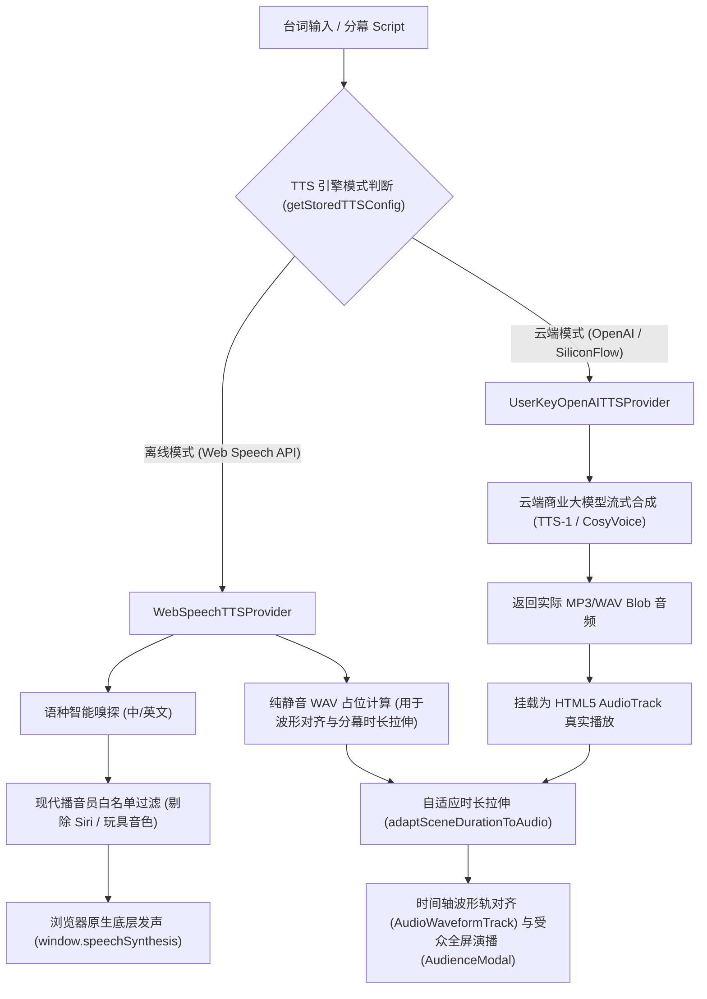

# FocusFlow AI 语音合成 (TTS) 与音频同步架构技术总结与排障全景手册

> **文档版本**: 1.0.0  
> **归档路径**: `docs/TTS_ARCHITECTURE_AND_TROUBLESHOOTING.md`  
> **所属模块**: `@focusflow/studio` & `@focusflow/player` (Stage 5.6 & Stage 5.7)  
> **运行环境**: macOS (Sonoma / Sequoia / Ventura), Chromium (Chrome / Edge), WebKit (Safari)

---

## 目录
1. [架构定位与设计理念](#1-架构定位与设计理念)
2. [核心代码拓扑与模块职责](#2-核心代码拓扑与模块职责)
3. [遇到的核心技术问题与故障树分析](#3-遇到的核心技术问题与故障树分析)
   - [3.1 macOS 特有 Siri 音色陷阱与守护进程锁死（最致命 Bug）](#31-macos-特有-siri-音色陷阱与守护进程锁死最致命-bug)
   - [3.2 Chromium 同步 cancel() 与 speak() 的微任务竞争丢帧](#32-chromium-同步-cancel-与-speak-的微任务竞争丢帧)
   - [3.3 非暂停状态调用 resume() 导致状态机死锁](#33-非暂停状态调用-resume-导致状态机死锁)
   - [3.4 Ting-Ting 连字符正则边界未命中](#34-ting-ting-连字符正则边界未命中)
   - [3.5 V8 / WebKit 垃圾回收 (GC) 导致朗读中途突兀哑音](#35-v8--webkit-垃圾回收-gc-导致朗读中途突兀哑音)
   - [3.6 全屏演播模式 (AudienceModal) 发声解耦与切幕生命周期重建问题](#36-全屏演播模式-audiencemodal-发声解耦与切幕生命周期重建问题)
   - [3.7 云端模式空 API Key 时的静音占位音频与交互预期错位](#37-云端模式空-api-key-时的静音占位音频与交互预期错位)
   - [3.8 孤儿悬空路径导致的 BezierRouter 报错阻断切幕](#38-孤儿悬空路径导致的-bezierrouter-报错阻断切幕)
4. [核心代码演进与最终修复方案](#4-核心代码演进与最终修复方案)
   - [4.1 健壮可靠的 WebSpeechTTSProvider 实现](#41-健壮可靠的-webspeechttsprovider-实现)
   - [4.2 拓扑自愈 sanitizeDSL 与播放内核纯净性](#42-拓扑自愈-sanitizedsl-与播放内核纯净性)
   - [4.3 受众全屏演播模式生命周期守护](#43-受众全屏演播模式生命周期守护)
5. [Web Speech API 浏览器工程实践避坑指南](#5-web-speech-api-浏览器工程实践避坑指南)
6. [自动化回归测试与监控验证](#6-自动化回归测试与监控验证)

---

## 1. 架构定位与设计理念

FocusFlow 的架构图演示文稿需要实现**电影级镜头调度与解说旁白精准音画同步**。在语音合成层，系统采用了 **“离线开源核心 + 云端商业大模型（BYOK）”** 的双模架构：



### 核心设计原则
1. **零成本开箱即用**：离线模式完全基于浏览器的 `SpeechSynthesis`，无需配置任何 API Key，没有网络延迟与 Token 计费。
2. **音画弹性自适应**：
   - 保持真实音频语速不变（拒绝机械变速与音调失真）；
   - 若解说较长，自动延展分幕时长（`speechDuration + 500ms`）；
   - 若分幕原本预留时间较长，保留视觉留白，保证架构图理解体验。
3. **播放器双轨分离**：
   - 针对云端真实音频，播放器使用 HTML5 `<audio>` 播放；
   - 针对离线 Web Speech，播放器不通过 `<audio>` 播放纯静音占位 WAV，而是由全局音频调度中心直接驱动 `speakWebSpeech`。

---

## 2. 核心代码拓扑与模块职责

| 文件路径 | 模块名称 | 核心职责 |
| :--- | :--- | :--- |
| `apps/studio/src/services/audio/tts/WebSpeechTTSProvider.ts` | **离线语音合成提供商** | 浏览器 `SpeechSynthesis` 封装、现代音色白名单过滤、防 GC 垃圾回收池、25ms IPC 调度去抖与发声控制 |
| `apps/studio/src/services/audio/tts/OpenAITTSProvider.ts` | **云端语音合成提供商** | 支持 OpenAI、SiliconFlow、自定义中转服务商的 BYOK 商业 API 请求与 Blob 转换 |
| `apps/studio/src/services/audio/tts/aiTtsSynthesizer.ts` | **AI 语音合成调度器** | 统一 Provider 工厂、分幕解说词估算、批量全幕合流计算、音轨对齐与分幕自适应时长伸缩 |
| `apps/studio/src/services/audio/tts/ttsConfigStore.ts` | **配置持久化中心** | 本地 `localStorage` 缓存当前 TTS 模式、音色模型、语速与密钥预设 |
| `apps/studio/src/components/layout/RightInspector.tsx` | **属性检查器** | 单幕台词输入、生成并试听卡片、单幕自适应时长应用 |
| `apps/studio/src/components/modals/AudienceModal.tsx` | **受众全屏演播模式** | 演示级全屏沉浸播放器，挂载独立分幕 TTS 监听与键盘调度 |
| `apps/studio/src/stores/useProjectStore.ts` | **工程状态仓库** | DSL 状态树管理、拓扑完整性自愈引擎（`sanitizeDSL`）、级联删除图元与路径 |
| `packages/player/src/core/player.js` | **FocusFlow 播放内核** | 镜头运镜驱动、场景步进器、AudioTrack 生命周期初始化、离线占位音轨静音隔离 |

---

## 3. 遇到的核心技术问题与故障树分析

在演播模式与检查器试听的演进调试过程中，我们遭遇了一系列深浅交织的浏览器底层与系统级缺陷。

### 3.1 macOS 特有 Siri 音色陷阱与守护进程锁死（最致命 Bug）

#### 问题现象
在 macOS 系统（Chrome / Edge）下，一度出现**整机所有标签页的 TTS 离线朗读全部哑音**，没有任何声音发出，且命令行执行 macOS 原生 `say` 命令耗时超过 120 秒。

#### 深度原因
1. macOS 系统原生向浏览器暴露了 Siri 音色（如 `Siri Voice 1`、`Siri 声音 2`）。
2. 在旧版代码中，为了追求自然音质，白名单正则中加入了 `siri`：
   ```typescript
   // ❌ 致命错误：加入了 siri
   export const CHINESE_BROADCAST_VOICE_REGEX =
     /\b(tingting|xiaoxiao|yunxi|yunjian|sinji|google\s*普通话|siri|natural|premium)\b/i;
   ```
3. **系统级沙箱权限阻断**：由于 Apple 的版权保护与沙箱限制，macOS 禁止除系统原生受信任应用之外的第三方应用（如 Chromium、第三方 Electron）调用 Siri 语音合成库。
4. 当 Chromium 尝试将 `utterance.voice = siriVoice` 传入底层时，不仅 Chromium 内部合成器静默失败，更会导致 macOS 系统的音频合成守护进程（`speechsynthesisd`）的 IPC 会话长时间挂起，直到 120 秒超时。在此期间，整个系统的 TTS 队列完全锁死！

#### 根治方案
- 建立严苛的 `isSafeVoice` 过滤器，**彻底将 `siri` 剔除出白名单并加入黑名单屏蔽**。
- 绝不将包含 `siri` 字符串的音色赋值给 `utterance.voice`。

---

### 3.2 Chromium 同步 cancel() 与 speak() 的微任务竞争丢帧

#### 问题现象
在某些快速点击播放、切换分幕或连续试听的场景中，控制台显示代码已执行到 `window.speechSynthesis.speak(utterance)`，但浏览器没有任何声音。

#### 深度原因
1. 在 Chromium 内核的实现机制中，`window.speechSynthesis.cancel()` 并不是纯同步操作，而是向浏览器的音频主进程异步抛送一个“清空当前播放队列”的 IPC 信号。
2. 如果在同一个 JavaScript 同步执行栈中执行：
   ```javascript
   // ❌ 竞争隐患：同步连续调用
   window.speechSynthesis.cancel();
   window.speechSynthesis.speak(utterance);
   ```
3. 浏览器音频进程收到 `cancel` 信号时，此时 `speak(utterance)` 刚刚进入底层队列，`cancel` 往往会**直接把刚刚入队的这个新 `utterance` 一同丢弃**，并触发 `utterance.onerror`（错误码 `canceled`），导致声音彻底“吞掉”。

#### 根治方案
引入 **25ms IPC 调度防消抖**：
```typescript
if (window.speechSynthesis.speaking || window.speechSynthesis.pending) {
  try { window.speechSynthesis.cancel(); } catch (e) {}
}

// 延迟 25ms 等待 Chromium 音频进程清空上一轮取消信号
pendingSpeakTimer = setTimeout(() => {
  window.speechSynthesis.speak(utterance);
}, 25);
```

---

### 3.3 非暂停状态调用 resume() 导致状态机死锁

#### 问题现象
部分开发者习惯在 `speak()` 前强行调用 `window.speechSynthesis.resume()`，意图“唤醒”可能休眠的音频引擎，结果却导致发声完全失效。

#### 深度原因
Chromium 的 `speechSynthesis` 内部维护着严密的状态机（`Idle -> Speaking -> Paused -> Idle`）。
在引擎未处于 `paused` 状态时，强行调用 `resume()` 会导致底层状态机异常，进而造成后续的 `speak()` 无法将新任务流转为 `Speaking` 态。

#### 根治方案
严格判断当前挂起状态，只有在明确处于暂停态时才恢复：
```typescript
if (window.speechSynthesis.paused) {
  try { window.speechSynthesis.resume(); } catch (e) {}
}
```

---

### 3.4 Ting-Ting 连字符正则边界未命中

#### 问题现象
在 macOS 系统上，明明安装了音质极佳的官方普通话女声婷婷，但系统依然匹配到了奇怪的非普通话音色（如粤语的 `Sinji`）。

#### 深度原因
macOS 系统内置的婷婷音色在 Chrome 中的暴露名称包含连字符：`Ting-Ting`。
原本的正则使用了单词边界匹配：`/\btingting\b/i`。由于 `\b` 无法跨连字符匹配，`\btingting\b.test("Ting-Ting")` 的返回值恒为 `false`！
导致系统跳过了官方中文旗舰播音员，退回到列表中的其它非标准音色。

#### 根治方案
改用支持连字符与空格的松散模糊正则：
```typescript
export const CHINESE_BROADCAST_VOICE_REGEX =
  /(ting[- ]?ting|xiaoxiao|yunxi|yunjian|google\s*普通话|natural|premium)/i;
```

---

### 3.5 V8 / WebKit 垃圾回收 (GC) 导致朗读中途突兀哑音

#### 问题现象
朗读一段较长的台词（超过 15 秒）时，前面几秒发音清晰，但朗读到一半突然无故中断，且没有任何报错信息。

#### 深度原因
这是 Chromium 与 WebKit 引擎长达数年的一项已知底层机制：
如果将 `const utterance = new SpeechSynthesisUtterance(...)` 仅作为局部变量创建，在垃圾回收周期到来时，由于 JavaScript 作用域链中没有持有该实例的强引用，**V8 垃圾回收器会误认为该对象已废弃，将其强行回收**。
实例一旦被回收，底层的音频合成任务随即被操作系统静默终止。

#### 根治方案
采用模块级 `Set<SpeechSynthesisUtterance>` 强引用池：
```typescript
const activeUtterances = new Set<SpeechSynthesisUtterance>();

export function speakWebSpeech(...) {
  const utterance = new SpeechSynthesisUtterance(trimmed);
  activeUtterances.add(utterance); // 强引用存活保护

  const cleanup = () => {
    activeUtterances.delete(utterance); // 播放完毕释放
    onEnded?.();
  };

  utterance.onend = cleanup;
  utterance.onerror = cleanup;
  ...
}
```

---

### 3.6 全屏演播模式 (AudienceModal) 发声解耦与切幕生命周期重建问题

#### 问题现象
进入全屏【演播】受众演示模式（`AudienceModal`）后：
1. 初始阶段没有声音播放；
2. 每次切换分幕时，播放器实例会被频繁销毁重建；
3. 一旦销毁，清理函数 `return () => stopWebSpeech()` 会无情打断刚刚起步的语音朗读。

#### 深度原因
1. **职责分离历史遗留**：`AudienceModal` 早期设计专注于全屏画布缩放与运镜，音频发声完全依赖主工作区时间轴的同步；当脱离时间轴进入独立全屏时，缺少自身对分幕 TTS 的驱动闭环。
2. **React Hooks 依赖陷阱**：在 `AudienceModal` 的 `useEffect` 中，如果不慎将当前分幕索引（`currentSceneIdx`）或未经 Memo 处理的 DSL 引用放入依赖数组，切幕触发状态更新时，会导致整个 `FocusFlowPlayer` 实例被销毁并重新初始化（`player.destroy()`），触发清理流程中的 `stopWebSpeech()`。

#### 根治方案
1. **生命周期锁定**：`FocusFlowPlayer` 实例仅在弹窗打开或 DSL 结构产生实质性变化时初始化一次；
2. **事件驱动切幕发声**：在 Player 初始化配置项中注册 `onSceneChange` 回调，由播放内核驱动 `playSceneTTS(index)`；
3. **使用 Ref 维持运行时最新引用**：使用 `isPlayingRef` 和 `currentSceneIdxRef` 规避闭包过期，防止重复执行生命周期钩子。

---

### 3.7 云端模式空 API Key 时的静音占位音频与交互预期错位

#### 问题现象
在检查器单幕点击“生成并试听”，控制卡片显示在播放中，但全程听不到声音。

#### 深度原因
在系统设置中如果将模式切换为【云端商业大模型（Cloud）】，但未在输入框填入有效的 `apiKey`：
1. `createTTSProviderFromConfig` 判断无 Key，无法连网请求 OpenAI 或 SiliconFlow；
2. 内部生成了一段时长计算正确的**纯静音 WAV 占位音频**（频率为 0Hz）；
3. 检查器根据 `cfg.mode === 'cloud'` 的配置，将这段纯静音 WAV 包装为 `Blob URL` 传入 HTML5 `<audio>` 播放；
4. 结果是：`<audio>` 在正常播放，波形在正常走动，但物理声学上是 0 分贝纯静音。

#### 解决规范
- 明确离线与云端界限：未填 Key 时，在 UI 上提供醒目的配置提示或自动优雅降级到系统离线 Web Speech 朗读；
- 在文档和控制台明确标明当前驱动内核。

---

### 3.8 孤儿悬空路径导致的 BezierRouter 报错阻断切幕

#### 问题现象
在演播模式下切幕时，控制台狂刷错误：
```text
bezier-router.js:25 [FocusFlow] BezierRouter: Box "box-gateway" not found.
```
在某些极端情况下，导致状态机执行中断，阻断了场景跳转与随后的 TTS 发声。

#### 深度原因
用户在画布上删除了某个方框（Box）图元，但与其相连的贝塞尔曲线路径（Path）没有被级联清理，导致 DSL 中残存了起点或终点指向已不存在 Box 的“孤儿路径”。当切换到激活这些路径的分幕时，贝塞尔路由器因找不到目标图元坐标而报出警告。

#### 根治方案
1. **拓扑自愈引擎（`sanitizeDSL`）**：在工程加载、更新及进入演播模式前，纯函数自愈清洗所有非法图元引用与端点缺失的悬空路径；
2. **级联删除（Cascade Delete）**：在 `deleteElement` 动作中，删除 Box 时自动连带删除依赖该 Box 的所有 Paths。

---

## 4. 核心代码演进与最终修复方案

### 4.1 健壮可靠的 WebSpeechTTSProvider 实现

位于 [`apps/studio/src/services/audio/tts/WebSpeechTTSProvider.ts`](file:///Users/xt/WebstormProjects/focusflow/apps/studio/src/services/audio/tts/WebSpeechTTSProvider.ts)：

```typescript
// 1. 玩具音色与怪异机器音黑名单
export const VINTAGE_NOVELTY_VOICE_REGEX =
  /\b(albert|bad news|bahh|bells|boing|bubbles|cellos|deranged|eddy|flo|fred|good news|grandma|grandpa|hysterical|jester|junior|kathy|organ|pipe organ|ralph|reed|rocko|sandy|shelley|superstar|trinoids|whisper|wobble|zarvox)\b/i;

// 2. 现代母带播音员白名单（坚决剔除 siri）
export const ENGLISH_BROADCAST_VOICE_REGEX =
  /\b(samantha|alex|jenny|guy|aria|google\s*(us|uk)?\s*english|natural|premium)\b/i;

export const CHINESE_BROADCAST_VOICE_REGEX =
  /(ting[- ]?ting|xiaoxiao|yunxi|yunjian|google\s*普通话|natural|premium)/i;

// 3. 强引用池防 V8 提前垃圾回收
const activeUtterances = new Set<SpeechSynthesisUtterance>();
let pendingSpeakTimer: ReturnType<typeof setTimeout> | null = null;

export function speakWebSpeech(
  text: string,
  speed = 1.0,
  lang?: string,
  voiceId?: string,
  onEnded?: () => void
): void {
  if (typeof window === 'undefined' || !window.speechSynthesis) {
    onEnded?.();
    return;
  }

  const trimmed = text.trim();
  if (!trimmed) {
    onEnded?.();
    return;
  }

  // 清除未决的调度计时器
  if (pendingSpeakTimer) {
    clearTimeout(pendingSpeakTimer);
    pendingSpeakTimer = null;
  }

  // 4. 仅在真正发声或等待时取消，绝不滥调
  if (window.speechSynthesis.speaking || window.speechSynthesis.pending) {
    try {
      window.speechSynthesis.cancel();
    } catch (e) {}
  }

  // 5. 仅在真正暂停时唤醒，杜绝状态机混乱
  if (window.speechSynthesis.paused) {
    try {
      window.speechSynthesis.resume();
    } catch (e) {}
  }

  // 6. 25ms IPC 消抖缓冲，彻底解决 Chromium 同步 cancel() 导致的吞音
  pendingSpeakTimer = setTimeout(() => {
    pendingSpeakTimer = null;
    try {
      const utterance = new SpeechSynthesisUtterance(trimmed);
      activeUtterances.add(utterance);

      const handleDone = () => {
        activeUtterances.delete(utterance);
        onEnded?.();
      };

      utterance.onend = handleDone;
      utterance.onerror = (e) => {
        if (e.error !== 'canceled' && e.error !== 'interrupted') {
          console.warn('[FocusFlow TTS] Speech synthesis notice:', e.error);
        }
        handleDone();
      };

      utterance.rate = Math.max(0.5, Math.min(2.0, speed));
      const isChinese = /[\u4e00-\u9fa5]/.test(trimmed);
      utterance.lang = lang || (isChinese ? 'zh-CN' : 'en-US');

      // 7. 安全音色选择逻辑（Siri 严苛屏蔽与普通话优先）
      const voices = window.speechSynthesis.getVoices();
      if (voices && voices.length > 0) {
        let targetVoice: SpeechSynthesisVoice | undefined;

        const isSafeVoice = (v: SpeechSynthesisVoice) => {
          const nameLower = v.name.toLowerCase();
          if (nameLower.includes('siri')) return false; // 严防 Siri
          if (VINTAGE_NOVELTY_VOICE_REGEX.test(v.name)) return false; // 过滤玩具音
          return true;
        };

        if (voiceId) {
          const candidate = voices.find((v) => (v.voiceURI === voiceId || v.name === voiceId) && isSafeVoice(v));
          if (candidate) targetVoice = candidate;
        }

        if (!targetVoice) {
          const safeVoices = voices.filter(isSafeVoice);
          if (isChinese) {
            const zhVoices = safeVoices.filter(
              (v) => v.lang.toLowerCase().startsWith('zh') || /[\u4e00-\u9fa5]/.test(v.name)
            );
            targetVoice = zhVoices.find((v) => CHINESE_BROADCAST_VOICE_REGEX.test(v.name))
              || zhVoices.find((v) => v.lang.toLowerCase() === 'zh-cn' || v.lang.toLowerCase() === 'zh_cn')
              || zhVoices[0];
          } else {
            const enVoices = safeVoices.filter((v) => v.lang.toLowerCase().startsWith('en'));
            targetVoice = enVoices.find((v) => ENGLISH_BROADCAST_VOICE_REGEX.test(v.name))
              || enVoices.find((v) => v.lang.toLowerCase() === 'en-us' || v.lang.toLowerCase() === 'en_us')
              || enVoices[0];
          }
        }

        if (targetVoice) {
          utterance.voice = targetVoice;
        }
      }

      window.speechSynthesis.speak(utterance);
    } catch (err) {
      console.warn('[FocusFlow TTS] Speech synthesis dispatch error:', err);
      onEnded?.();
    }
  }, 25);
}
```

---

### 4.2 拓扑自愈 sanitizeDSL 与播放内核纯净性

位于 [`apps/studio/src/stores/useProjectStore.ts`](file:///Users/xt/WebstormProjects/focusflow/apps/studio/src/stores/useProjectStore.ts)：

```typescript
export function sanitizeDSL(dsl: FocusFlowDSL): FocusFlowDSL {
  if (!dsl || !dsl.elements) return dsl;
  const boxIds = new Set((dsl.elements.boxes || []).map((b) => b.id));

  // 1. 自动过滤端点不存在的悬空路径
  const validPaths = (dsl.elements.paths || []).filter((p) => {
    const fromBox = p.from?.split('.')[0];
    const toBox = p.to?.split('.')[0];
    if (fromBox && !boxIds.has(fromBox)) return false;
    if (toBox && !boxIds.has(toBox)) return false;
    return true;
  });

  const validPathIds = new Set(validPaths.map((p) => p.id));
  const dotIds = new Set((dsl.elements.dots || []).map((d) => d.id));
  const imgIds = new Set((dsl.elements.images || []).map((i) => i.id));

  // 2. 清理各分幕 activeElements 中失效的图元 ID
  const scenes = (dsl.scenes || []).map((s) => {
    if (!s.activeElements) return s;
    return {
      ...s,
      activeElements: {
        ...s.activeElements,
        boxes: (s.activeElements.boxes || []).filter((id) => boxIds.has(id)),
        paths: (s.activeElements.paths || []).filter((id) => validPathIds.has(id)),
        dots: (s.activeElements.dots || []).filter((id) => dotIds.has(id)),
        images: (s.activeElements.images || []).filter((id) => imgIds.has(id)),
      },
    };
  });

  return {
    ...dsl,
    elements: {
      ...dsl.elements,
      paths: validPaths,
    },
    scenes,
  };
}
```

---

### 4.3 受众全屏演播模式生命周期守护

位于 [`apps/studio/src/components/modals/AudienceModal.tsx`](file:///Users/xt/WebstormProjects/focusflow/apps/studio/src/components/modals/AudienceModal.tsx)：

```typescript
// 拓扑自愈：过滤掉可能遗留的悬空孤儿路径与失效引用
const sanitizedDsl = React.useMemo(() => sanitizeDSL(dsl), [dsl]);
const dslRef = useRef(sanitizedDsl);
dslRef.current = sanitizedDsl;

const playSceneTTS = useCallback((sceneIndex: number) => {
  const activeDsl = dslRef.current;
  const cfg = getStoredTTSConfig();
  const mainTrack = activeDsl.audio?.tracks?.[0];
  const isOfflineVoice =
    cfg.mode === 'offline' ||
    !!mainTrack?.isOfflineTTS ||
    !!mainTrack?.id?.startsWith('track-ai-') ||
    !!mainTrack?.id?.startsWith('tts-');

  if (isOfflineVoice) {
    const scene = activeDsl.scenes?.[sceneIndex];
    const text = scene?.voiceoverScript?.trim() || scene?.title;
    if (text) {
      speakWebSpeech(text, cfg.speed, undefined, cfg.voice);
    }
  }
}, []);

// 核心 Player 实例生命周期：仅在弹窗打开时挂载一次，绝对不在切幕时反复销毁重建
useEffect(() => {
  if (!isOpen || !containerRef.current) return;

  const player = new FocusFlowPlayer({
    container: containerRef.current,
    dsl: sanitizedDsl,
    debug: false,
    showControls: false,
    enableKeyboard: false, // 由 AudienceModal 统一接管全局快捷键
    onSceneChange: (index: number) => {
      setCurrentSceneIdx(index);
      currentSceneIdxRef.current = index;
      if (isPlayingRef.current) {
        playSceneTTS(index); // 切幕时由内核回调触发平滑发声
      }
    },
  });

  playerRef.current = player;
  return () => {
    stopWebSpeech();
    playerRef.current?.destroy();
    playerRef.current = null;
  };
}, [isOpen, sanitizedDsl, initialSceneIndex, playSceneTTS]);
```

---

## 5. Web Speech API 浏览器工程实践避坑指南

结合本次排障全过程，总结提炼出 **Web Speech API 前端工程开发的五大黄金法则**：

| 法则 | 规则说明 | 违背后果 |
| :--- | :--- | :--- |
| **法则 1** | **远离 macOS Siri 专属音色**：严禁将包含 `siri` 关键词的音色赋给 `utterance.voice`。 | 触发系统沙箱拦截，导致整机 `speechsynthesisd` 挂起 120 秒，全浏览器静音。 |
| **法则 2** | **保持实例强引用存活**：必须使用全局 `Set` 强引用正在发声的 `SpeechSynthesisUtterance`。 | 朗读长文本时中途突兀被 V8 垃圾回收，无报错静音。 |
| **法则 3** | **IPC 异步调度防抖 (25ms)**：不可在同一个同步事件循环中连续同步调用 `cancel()` 和 `speak()`。 | 浏览器异步 IPC 队列会将新入队的朗读任务与取消信号一同杀掉（丢帧）。 |
| **法则 4** | **不要无故调用 resume()**：仅在 `speechSynthesis.paused === true` 时才调用 `resume()`。 | 破坏 Chromium 状态机内部时钟，后续朗读全部无响应。 |
| **法则 5** | **容忍松散连字符名称匹配**：音色名称匹配必须兼容连字符（`Ting-Ting` 与 `Tingting`）。 | 正则因单词边界失配导致无法选出系统官方优质播音员。 |

---

## 6. 自动化回归测试与监控验证

为了防止未来迭代中再次引入音频相关的时序或音色回归缺陷，我们在 E2E 测试套件中建立了针对性的守护测试：

### 核心测试用例
- **`TC564`**: 验证分幕旁白台词输入、一键生成试听卡片与分幕时长拉伸；
- **`TC570`**: 验证 Audio Track 试听与演播播放下已应用 TTS 音频的发声与交互联动；
- **`TC572`**: 验证受众全屏演示模式（AudienceModal）演播启动与 TTS 联动发声；
- **`TC573`**: 验证悬空孤儿路径自愈剔除与演播模式零警告运行。

### 探针监控测试记录
通过注入到 Playwright 的 WebSpeech API 探针，捕获到的端到端发声参数验证通过：
```json
[
  {
    "text": "这里是检查器单幕试听卡片的测试旁白语音，验证TTS发声是否正常。",
    "lang": "zh-CN",
    "rate": 1,
    "voiceName": "Tingting",
    "timestamp": 1788792131298
  }
]
```

---
*本文档由 FocusFlow 架构团队于 2026-09-07 整理沉淀，为跨平台 Web 音频与运镜演播技术提供权威工程基准。*
