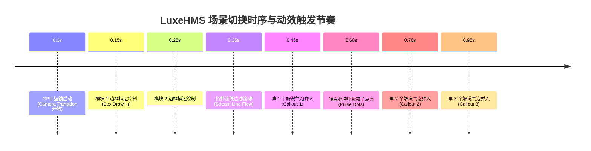

# LuxeHMS 拓扑图实战示例与动效应用全景拆解
## LuxeHMS Architecture Showcase - Motion & Choreography Breakdown

> **所属示例**：`examples/luxehms/`  
> **关联配置**：[`config.json`](./config.json) · [`index.html`](./index.html)  
> **底层引擎**：FocusFlow Universal Core Runtime (Phase 1 MVP)

---

## 1. 示例背景与设计目标

本示例基于 **LuxeHMS（奢华酒店管理系统）4K 云原生架构拓扑图**（分辨率 5120 × 2880），展示了如何通过 FocusFlow 将一张复杂的企业级静态架构图，转化为兼具**电影级运镜推拉**、**动态矢量发光流线**与**多阶梯解说气泡**的沉浸式交互演示。

```
+---------------------------------------------------------------------------------------------------+
|                                  LuxeHMS 4 大场景叙事演进流                                        |
|                                                                                                   |
|  [ Scene 0: 全局总览 ] ➔ [ Scene 1: 数据持久化与夜审 ] ➔ [ Scene 2: 鉴权与核心库 ] ➔ [ Scene 3: 全景归位 ] |
|      (全图宏观视角)           (运镜推近 + 数据流流光)          (跨区横移 + 模块高亮)          (拉远总结)   |
+---------------------------------------------------------------------------------------------------+
```

---

## 2. 6 大动效体系在 LuxeHMS 中的深度应用

在 LuxeHMS 示例中，FocusFlow 的 **6 种复合动效体系全部得到了深度实战应用**：

| 动效分类 | 在 LuxeHMS 中的具体应用实例 | 激活场景 | 视觉感受与交互价值 |
| :--- | :--- | :--- | :--- |
| **1. 🎥 GPU 电影级运镜** | • 全景（1.0×）➔ 数据持久化区（1.42×，平移 `[-11%, 6%]`）<br/>• 跨区横移至左侧鉴权区（1.75×，平移 `[23%, 10%]`）<br/>• 顺滑拉远全景归位（1.0×） | 全场景 (0 ~ 3) | 模拟专业摄像机推拉平移，消除普通幻灯片的生硬跳切感 |
| **2. 🔲 卡片边框描边生长** | • `box-postgres`（绿色 Neon 高亮框）<br/>• `box-folio`（蓝色 Neon 高亮框）<br/>• `box-cron`（黄色 Neon 高亮框）<br/>• `box-auth-casl`（粉色 Neon 高亮框）<br/>• `box-core-internal` & `box-badge-lib-core` | 场景 1 & 场景 2 | 高亮框从一端顺时针绘制生长并伴随霓虹辉光，引导观众视觉焦点精准落入目标模块 |
| **3. ⚡ 拓扑数据流动跑马灯** | • `line-folio-pg`：账务收银模块 ➔ PostgreSQL 16 数据流<br/>• `line-cron-pg`：夜审定时守护进程 ➔ PostgreSQL 16 数据流 | 场景 1 | 虚线光斑持续向数据库流动（`mode: "stream"`），直观表达数据的实时写入与落盘过程 |
| **4. 🔴 接口端点脉冲呼吸点** | • `dot-folio-out`（账务出点）<br/>• `dot-cron-out`（夜审出点）<br/>• `dot-pg-in-folio`（数据库入点 1）<br/>• `dot-pg-in-cron`（数据库入点 2） | 场景 1 | 位于连线出入端口的圆形微光斑，周期性微呼吸放大，强化接口物理挂载与连接感 |
| **5. 💬 毛玻璃气泡阶梯弹入** | • 场景 1（3 张卡片）：Folio、Cron Scheduler、PostgreSQL<br/>• 场景 2（3 张卡片）：Auth & CASL、Core Libraries、lib-core | 场景 1 & 场景 2 | 按 `0.45s ➔ 0.70s ➔ 0.95s` 阶梯节奏依次弹性弹入（Spring 阻尼），带有高质感毛玻璃模糊 |
| **6. 📊 顶栏进度与底栏状态流转** | • 顶部三色渐变进度条（0% ➔ 33% ➔ 66% ➔ 100%）<br/>• 底部 4 个胶囊 Tab 按钮高亮平滑移动 | 全场景 (0 ~ 3) | 观众可实时感知当前叙事进度与章节定位，支持键盘盲操与鼠标快速跳转 |

---

## 3. 各场景分步动效与编排时序详解



---

### 场景 0：全局总览 (Overview)
* **镜头参数**：`zoom: 1.0, x: 0, y: 0`
* **激活元素**：无高亮框与连线，展示 100% 完整底图。
* **设计意图**：向观众交代整个系统分层（接入网关层、核心领域服务层、数据存储层、基础设施层）的宏观全貌。

---

### 场景 1：数据持久化与夜审引擎 (Persistence & Night Audit)
* **镜头参数**：`zoom: 1.42, x: -11, y: 6`（推近聚焦至右中侧区域）
* **动效组合（6 大动效全开）**：
  1. **运镜**：平滑推近至右侧数据库与收银集群；
  2. **选框**：`box-postgres`（绿）、`box-folio`（蓝）、`box-cron`（黄）三框同步顺时针生长；
  3. **数据流**：两条平滑三次贝塞尔流光虚线从 Folio 与 Cron 持续射向 PostgreSQL；
  4. **端点**：4 个出入端点粒子同步开始呼吸微动；
  5. **解说气泡**：
     * `0.45s` 弹入：**Folio & Cashier**（复式记账、交接班平账、实时同步）；
     * `0.70s` 弹入：**Cron Scheduler Daemon**（5 阶段夜审引擎、自动过账、营业日滚动）；
     * `0.95s` 弹入：**PostgreSQL 16**（主事务型数据库、账务数据强 ACID 一致性保证）。

---

### 场景 2：鉴权系统与基础核心库 (Auth & Core Libraries)
* **镜头参数**：`zoom: 1.75, x: 23, y: 10`（横移推近聚焦至中左侧区域）
* **动效组合**：
  1. **运镜**：由右向左跨区大范围平移运镜；
  2. **选框**：`box-auth-casl`（粉）、`box-core-internal`（蓝）、`box-badge-lib-core`（绿）生长发光；
  3. **解说气泡**：
     * `0.45s` 弹入：**Auth & CASL RBAC**（主体-操作权限矩阵、审计日志）；
     * `0.70s` 弹入：**Core Internal Libraries**（类型安全跨服务共享契约、Monorepo）；
     * `0.95s` 弹入：**lib-core**（CASL RBAC 策略执行与 Token 签名校验）。

---

### 场景 3：全景拓扑归位 (Closing Topology)
* **镜头参数**：`zoom: 1.0, x: 0, y: 0`
* **动效组合**：所有选框和流线平滑淡出，镜头无缝平移拉回原始比例，完成一次完整展示闭环。

---

## 4. 核心配置字段对照 (`config.json`)

```json
{
  "scenes": [
    {
      "id": "scene-1",
      "title": "数据持久化与夜审引擎",
      "camera": {
        "zoom": 1.42,
        "x": -11,
        "y": 6,
        "duration": 1.2
      },
      "activeElements": {
        "boxes": [ "box-postgres", "box-folio", "box-cron" ],
        "paths": [ "line-folio-pg", "line-cron-pg" ],
        "dots": [ "dot-folio-out", "dot-cron-out", "dot-pg-in-folio", "dot-pg-in-cron" ],
        "callouts": [
          {
            "id": "co-folio",
            "position": { "left": "33%", "top": "33%" },
            "theme": "blue",
            "title": "Folio & Cashier",
            "desc": "Double-entry ledger · Shift balance · Real-time sync"
          },
          {
            "id": "co-cron",
            "position": { "left": "33%", "top": "54%" },
            "theme": "amber",
            "title": "Cron Scheduler Daemon",
            "desc": "5-Stage Night Audit Engine · Automated Posting · Date Rollover"
          },
          {
            "id": "co-data",
            "position": { "left": "72%", "top": "22%" },
            "theme": "green",
            "title": "PostgreSQL 16",
            "desc": "Primary Transactional DB · Folios · ACID Consistency"
          }
        ]
      }
    }
  ]
}
```

---

## 5. 本地运行体验

在项目根目录下启动开发服务器即可直接查看：

```bash
pnpm dev
```

* 浏览器打开 `http://localhost:5173/` 默认即加载此示例。
* 支持键盘 `←` / `→` / `Space` 切换场景，按 `P` 键开启自动轮播。
* 按底部 **“🎯 标定助手”** 按钮或快捷键 `Ctrl + Shift + D` 即可随时进入交互标定模式。
